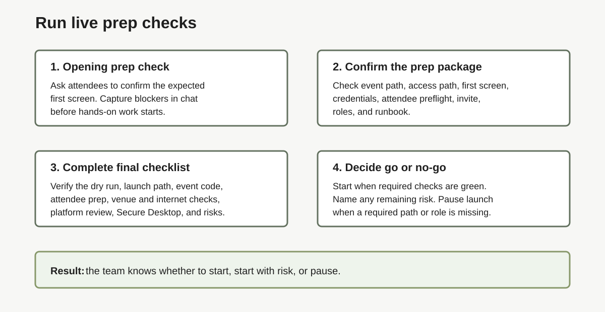

# Lab 5: Run Live Prep Checks

## Introduction

Use this lab immediately before attendees start hands-on work. It is the final live [opening prep check](#legend), not another planning checklist.

Complete Labs 1 through 4 first. Keep the verified event values, delivery roles, support route, fallback, and [runbook](#legend) handy for the opening check.

### Objectives

In this lab, you will:

- Confirm that the verified event details have not changed.
- Run one [opening prep check](#legend) for access and roles.
- Record the final state and decision in the event notes.

Estimated Time: 15 minutes



## Task 1: Review the Verified Event Values

1. Review the latest verified LiveLab URL, event code, selected access path, access-control status, expected first screen, delivery roles, support route, fallback, and [event operations package](#legend).

2. If a material value changed, stop and retest that path before attendees begin. Keep the new result with the event notes.

3. Do not use or offer a personal Oracle account as a fallback.

## Task 2: Run the Opening Check

1. The lead facilitator says:

    ```text
    We will spend the first few minutes confirming access before we start the hands-on work.
    Please confirm in chat when you see [expected first screen].
    If you hit a blocker, tell us which screen you see and which access path you used.
    ```

2. The screen driver opens the verified LiveLab URL, enters the verified event code when required, follows the tested access path, and shows the expected first screen.

3. The chat/support owner records blockers and the number of affected attendees.

4. The lead facilitator confirms whether the group can begin.

5. If the check fails, use [Lab 6](?lab=lab-6-how-to-troubleshoot-common-issues) to diagnose the symptom, capture evidence, and choose the fallback.

## Task 3: Record the Decision

1. Record the final state, decision time, decision owner, remaining risk, and fallback in the event notes.

2. Tell the delivery team the decision and any active fallback.

3. Keep Lab 6 open during the event.

## Legend

| Term | Meaning |
| --- | --- |
| Event operations package | Event path, runbook, roles, support route, and fallback needed for delivery. |
| Opening prep check | First live check that confirms attendees reached the expected screen. |
| Runbook | Event flow, roles, handoffs, support route, and backup plan. |

## Acknowledgements

- **Author:** Oracle LiveLabs Team, July 2026
