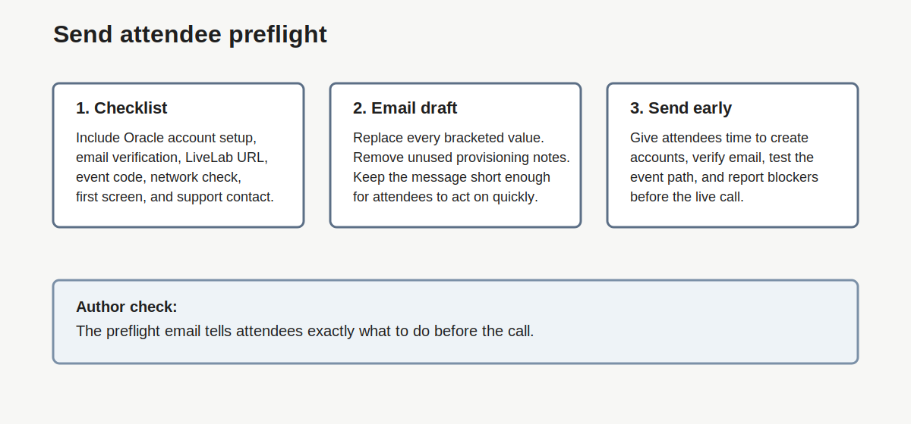
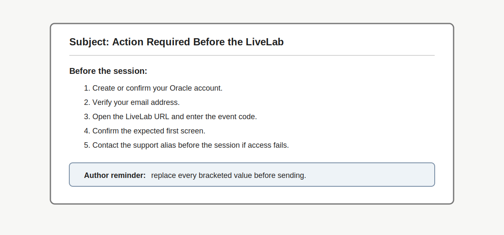

# Lab 5: Send Attendee Preflight Prerequisites

## Introduction

Attendee prep starts before the event. The customer should not discover Oracle account setup, email check, event codes, network checks, or sandbox timing after the call begins.

In this lab, you create the [attendee checklist](#legend) and [preflight email](#legend).

### Objectives

In this lab, you will:

- Build the attendee [prerequisite](#legend) checklist.
- Write a preflight email.
- Add expected screens and support contacts.
- Give authors a clear example of the preflight flow.



## Task 1: Build the Attendee Checklist

1. Start with this [attendee checklist](#legend).

    | Item | Required? | Notes |
    | --- | --- | --- |
    | Create Oracle account | Yes / No | Complete before event day. |
    | Verify email address | Yes / No | Do not wait until the live session. |
    | Sign in to Oracle LiveLabs | Yes / No | Test before event day. |
    | Open LiveLab URL | Yes / No | Confirm correct page loads. |
    | Enter event code | Yes / No | Include code and link. |
    | Run [network check](#legend) | Yes / No | Use when the workshop needs HTTP access or secure desktop. |
    | Use sandbox or own tenancy | Sandbox / Own tenancy | Make the selected path explicit. |
    | Know expected first screen | Yes / No | Include text or screenshot. |
    | Know support contact | Yes / No | Provide a [pre-event contact](#legend). |

2. Remove any item that does not apply.

3. Add workshop-specific prerequisites.

4. Mark any prerequisite that must be complete before event day.

## Task 2: Write the Preflight Email

1. Copy this template into the event message draft.

    ```text
    Subject: Action Required Before the LiveLab: Oracle Account and Access Check

    Hello,

    To make the LiveLab session productive, please complete these access steps before the workshop.

    Before the session:
    1. Create or confirm your Oracle account.
    2. Verify your email address.
    3. Sign in to Oracle LiveLabs.
    4. Open the LiveLab link: [insert LiveLab URL].
    5. Enter the event code: [insert event code].
    6. Confirm that you see this starting screen: [insert expected screen].
    7. If provided, open the connectivity check link and confirm that your network can reach the required workshop resources: [insert check link].

    Provisioning note:
    [Choose one]
    - If lab spaces start live: We will start provisioning first. Provisioning may take [insert expected time]. While lab spaces start, we will cover the overview, architecture, and customer context.
    - If lab spaces start early: The lab space should be ready when you enter the lab. We will use the opening for quick account, access, and network checks.

    Please do not wait until the workshop starts to create or verify your Oracle account. If you have trouble signing in, contact [insert support contact] before the session.

    Thank you.
    ```

2. Replace every bracketed value.

3. Remove the provisioning note that does not apply.

4. Send the message early enough for attendees to create accounts and report blockers.

5. Use this example to check the message flow.

    

## Legend

| Term | Meaning | Why It Matters |
| --- | --- | --- |
| Attendee checklist | List of attendee actions required before the event. | Makes prep visible and trackable. |
| Connectivity check link | URL attendees can use to test network reachability. | Finds blocked network paths before the live session. |
| Network check | Test that confirms the attendee network can reach required resources. | Helps identify firewall or secure desktop issues early. |
| Passkey | Browser or device sign-in method for an Oracle account. | Can confuse attendees if it appears during the live session. |
| Pre-event contact | Person or alias attendees contact before the session starts. | Moves account issues out of live delivery time. |
| Preflight email | Message sent before the event with required access steps. | Gives attendees time to prepare and report blockers. |
| Prerequisite | Required task or condition attendees complete before the event. | Prevents avoidable access problems during the session. |

## Acknowledgements

- **Author:** Oracle LiveLabs Team, July 2026
