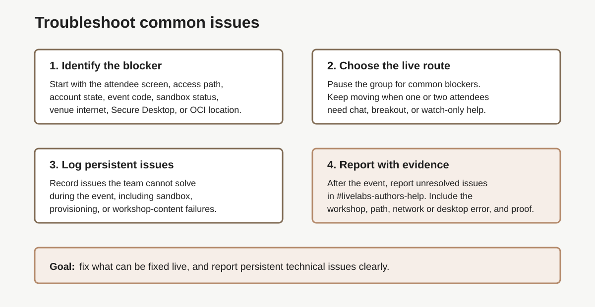

# Lab 6: How to troubleshoot common issues

## Introduction

Use this lab when a dry run or live opening check finds an access or launch problem. Triage the symptom, protect group time, and capture evidence for the right [support route](#legend).

### Objectives

In this lab, you will:

- Diagnose common symptoms.
- Decide whether to pause, support separately, or use a fallback.
- Send useful, redacted evidence to the correct support route.

Estimated Time: 15 minutes



## Task 1: Diagnose the Symptom

1. Ask what the attendee sees, which tested access path they used, and whether others have the same symptom.

2. Apply the matching first response.

    | Symptom | First Response |
    | --- | --- |
    | Account setup, email check, or passkey fails | Check spam and corporate filtering, then retry from a clean browser profile. Move the attendee to individual support; never offer a personal account. |
    | Event code opens the wrong page | Resend the verified LiveLab URL and event code. Show the expected first screen. |
    | Attendee used the wrong access path | Return them to the tested sandbox, own-tenancy, Secure Desktop, or other selected path. |
    | Launch is slow | Confirm the expected wait and use the prepared provisioning-time talk track. |
    | Launch, booking, or provisioning fails | Capture the exact error and check whether the issue affects one attendee or many. |
    | Corporate network blocks a page, noVNC, or Secure Desktop | Use the approved alternate browser, network, or fallback recorded in the event runbook. |
    | OCI screen, region, compartment, or user is unclear | State the tested region, compartment, and user, then show the expected screen. |
    | A step, command, image, link, or page control is broken | Capture the exact lab, task, step, URL, and screenshot, then report it to [LiveLabs Authors Help](#legend). |

3. Choose the response from the impact.

    - **Many attendees blocked by the same issue:** pause, apply one common fix, and reassess readiness.
    - **One or two attendees blocked:** keep the group moving; use chat or [breakout support](#legend).
    - **Individual issue remains unresolved:** use the approved fallback or [watch-only mode](#legend).
    - **The event cannot continue safely:** stop hands-on work and update the final state and decision in the event notes.

## Task 2: Capture Evidence

1. Record:

    - workshop title and WMS ID or LiveLabs ID
    - timestamp and time zone
    - number of affected attendees
    - lab, task, and step number
    - tested access path
    - browser, browser version, and operating system
    - exact URL, event code, or event identifier
    - exact error text or wrong screen
    - screenshot and steps already tried

2. Remove credentials, email addresses, and customer data from text and screenshots.

3. Record whether the issue changes the go/no-go state, which fallback is active, and who owns the follow-up in the event notes.

## Task 3: Route the Issue

1. Use the [LiveLabs Help icon](#legend) on the workshop page for attendee support during the event.

2. Report broken workshop content and persistent technical issues in the [LiveLabs Authors Help Slack channel](#legend): [#livelabs-authors-help](https://oracle.enterprise.slack.com/archives/CTUPZQ5HA). Include sandbox launch or provisioning failures.

3. Include the evidence from Task 2. Report dry-run issues before the live event.

## Task 4: Keep the Event Moving

1. Tell attendees whether the team will pause or provide individual support.

    ```text
    This is affecting several attendees, so we will pause and apply one fix together.
    ```

    ```text
    This looks individual, so we will keep the group moving while support helps in chat.
    ```

2. Use the recorded fallback when a fix will take more than a few minutes.

3. Capture unresolved issues and owners in the event notes for follow-up.

## Legend

| Term | Meaning |
| --- | --- |
| Breakout support | Separate support space for individual attendee issues. |
| LiveLabs Authors Help | Support route for LiveLabs authors and delivery teams. |
| LiveLabs Authors Help Slack channel | [#livelabs-authors-help](https://oracle.enterprise.slack.com/archives/CTUPZQ5HA) Slack channel for LiveLabs authors and delivery teams. |
| LiveLabs Help icon | Help icon on a LiveLabs workshop page. |
| Support route | Chat, bridge, LiveLabs Help, Slack, or other path for blocked attendees and follow-up issues. |
| Watch-only mode | Fallback where blocked attendees follow along without completing the lab live. |
| Workshop-content issue | Problem in the lab instructions, screenshots, links, commands, or steps. |

## Acknowledgements

- **Author:** Oracle LiveLabs Team, July 2026
