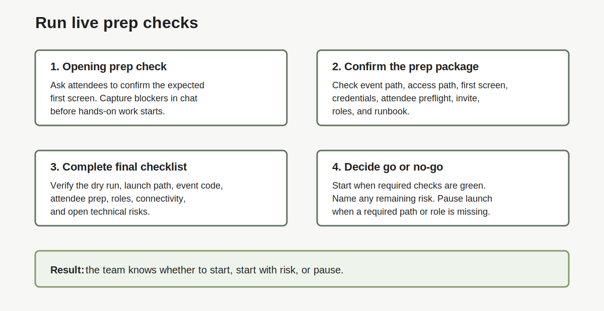

# Lab 6: Run Live Prep Checks

## Introduction

Use this lab before attendees start hands-on work. Confirm the event path, attendee prep, roles, first screen, and remaining risks before the session moves forward.

This lab checks that the workshop is ready. Use the final troubleshooting lab when an access, launch, support, or workshop-content issue appears.

### Objectives

In this lab, you will:

- Run the [opening prep check](#legend).
- Confirm the event path and attendee prep.
- Verify delivery roles and the run of show.
- Complete the final author checklist.
- Name any open risk before the event starts.

<!-- Estimated Time: intentionally not shown in this readiness guide. -->



## Task 1: What It Takes to Run a Successful Workshop

1. Confirm the event is technically ready before attendees begin.

    | Check | Ready? |
    | --- | --- |
    | Speaker completed an end-to-end dry run | Yes / No |
    | Event code, green-button, brown-button, and expected first screen tested as applicable | Yes / No |
    | Oracle-account tutorial and prerequisites sent | Yes / No |
    | Provisioning model, reservation buffer, and presentation talk track agreed | Yes / No |
    | WiFi/network capacity, LiveLabs access, browser, and Secure Desktop requirements checked | Yes / No |
    | Roles, support route, fallback, and workshop-content escalation owner named | Yes / No |

2. Resolve every **No** before the event where possible. For an accepted risk, record the owner, fallback, and decision time in the runbook.
## Task 2: Run the Opening Prep Check

1. The lead facilitator states:

    ```text
    We will spend the first few minutes confirming access before we start the hands-on work.
    Please confirm in chat when you see [expected first screen].
    If you hit a blocker, tell us which screen you see. Also tell us whether you used the event code, sandbox, own tenancy, or another path.
    ```

2. The screen driver shows the expected path.

3. The chat/support owner records blockers.

4. The lead facilitator confirms whether the group can begin.

## Task 3: Confirm the Prep Package

1. Check the prep package before the event starts.

    | Prep Item | Confirm |
    | --- | --- |
    | Event path | Event code, event page, approved link, and QR code work. |
    | Access path | The team supports one path: event code, sandbox, own tenancy, secure desktop, or early-start lab. |
    | First screen | The team knows the exact first screen attendees should see. |
    | Credentials | Attendees know the first account, code, user, or password they need. |
    | Attendee preflight | Attendees received the LiveLab URL, event code, expected screen, and support contact. |
    | Invite or event message | The attendee instructions match the preflight email. |
    | Facilitation runbook | The facilitator, screen driver, chat/support owner, SME, and event coordinator roles are clear. |

2. Update the runbook if any item changed after the dry run.

3. Keep the verified LiveLab URL, event code, and first-screen note visible to the delivery team.

## Task 4: Complete the Final Author Checklist

1. Complete this checklist before saying the team is ready.

    | Area | Ready? |
    | --- | --- |
    | Speaker ran the workshop end to end | Yes / No |
    | Green-button or launch path tested | Yes / No |
    | Workshop issues escalated through the Ack contact | Yes / No |
    | LiveLab URL confirmed | Yes / No |
    | Event code tested | Yes / No |
    | Sandbox or tenancy path tested | Yes / No |
    | Provisioning model decided | Yes / No |
    | Attendee prerequisites identified | Yes / No |
    | Connectivity check link shared, if applicable | Yes / No |
    | Attendee preflight email sent | Yes / No |
    | Oracle account need communicated | Yes / No |
    | Presenter roles assigned | Yes / No |
    | Screen driver completed dry run | Yes / No |
    | Chat/support owner assigned | Yes / No |
    | Personal login fallback removed | Yes / No |
    | Customer context prepared, if needed | Yes / No |
    | Workshop-specific technical explanation prepared | Yes / No |
    | Follow-up person named | Yes / No |

2. Resolve every **No** before the customer session when possible.

3. If a **No** must remain, name the risk and the person who will track it.

## Task 5: Confirm Go or No-Go

1. Confirm the final event state.

    | State | Use When | Next Step |
    | --- | --- | --- |
    | Ready | All required checks are green. | Start the event as planned. |
    | Ready with risk | One non-blocking item remains. | Name the risk and keep the backup path ready. |
    | Not ready | A required event path, account path, or role is missing. | Pause launch and resolve the blocker before attendees begin. |

2. Tell the delivery team which state applies.

3. Keep the final troubleshooting lab open during the event.

## Legend

| Term | Meaning | Why It Matters |
| --- | --- | --- |
| Opening prep check | First live check that confirms attendees reached the expected screen. | Catches access issues before hands-on work starts. |
| Prep package | Event path, preflight message, runbook, and role details needed for delivery. | Gives the team one place to verify readiness. |
| Runbook | Event flow, roles, handoffs, support route, and backup plan. | Keeps the delivery team aligned during the event. |

## Acknowledgements

- **Author:** Oracle LiveLabs Team, July 2026
