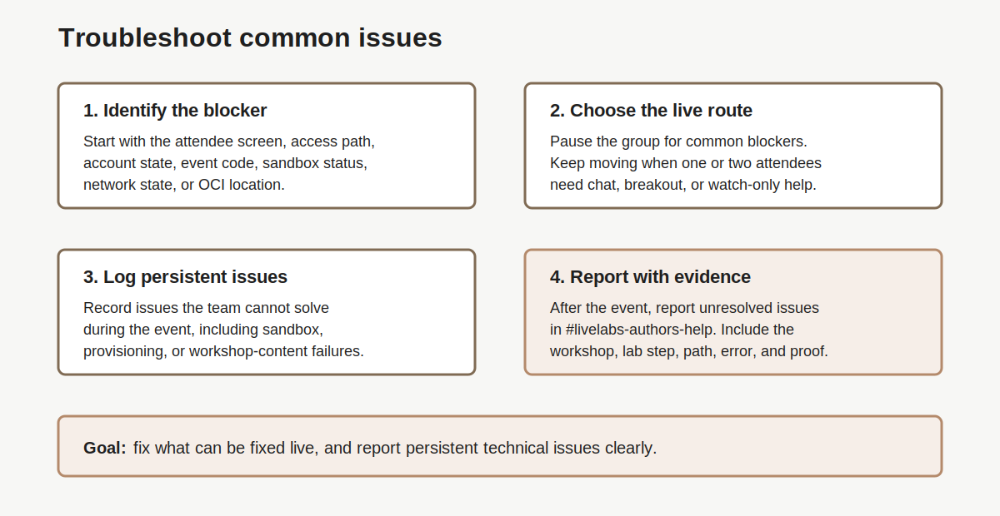

# Lab 7: How to troubleshoot common issues

## Introduction

Use this lab when access, launch, support, or workshop-content issues appear. It helps the team triage problems, use LiveLabs Help, and report broken workshop content.

### Objectives

In this lab, you will:

- Troubleshoot common access issues.
- Decide when to pause the group or keep moving.
- Use LiveLabs Help and author support paths.
- Report broken workshop content with useful evidence.

<!-- Estimated Time: intentionally not shown in this readiness guide. -->



## Task 1: Troubleshoot Access Issues

1. Start with the current attendee screen and access path.

2. Use this table during the dry run and live event.

    | Issue | What You May See | First Action |
    | --- | --- | --- |
    | Oracle account problem | Attendee cannot sign in, verify email, or complete a passkey flow. | Move the attendee to support. Keep the group moving. |
    | Check email not received | Attendee cannot finish account setup. | Ask them to check spam and corporate filtering. |
    | Passkey flow blocks progress | Attendee is stuck in a browser or device sign-in loop. | Ask them to sign out fully. Use a clean browser profile. |
    | Event code opens the wrong page | Attendee lands on the wrong workshop or a generic page. | Resend the verified event-code link. Show the expected first screen. |
    | Wrong access path | Attendee used a catalog page, old link, or own-tenancy path by mistake. | Route the attendee back to the selected path. |
    | Sandbox launch is slow | Lab space says provisioning may take a while. | Confirm the wait. Continue with the planned talk track. |
    | Sandbox launch fails | Booking, launch, or lab space start fails. | Capture the error. Check whether several attendees see it. |
    | Corporate network blocks access | Pages hang, noVNC fails, or secure desktop cannot open. | Try the approved alternate network, browser, or support path. |
    | OCI location confusion | Attendee cannot find the service, compartment, region, or user. | Name the correct region, compartment, and user. Show the expected screen. |
    | Workshop step is broken | Lab command, screenshot, or step no longer matches the product. | Report it in [#livelabs-authors-help](https://oracle.enterprise.slack.com/archives/CTUPZQ5HA) with proof. |
    | Presenter ownership is unclear | The team hesitates over who should answer or drive. | Return to the facilitation runbook and name the role. |

3. Use these triage points for the failures that most often affect the group.

    | Triage point | Check first | Route |
    | --- | --- | --- |
    | Attendee cannot find or enter the event code | Verified event-code URL, sign-in state, and exact code. | Resend the verified link; move account failures to support. |
    | Green-button launch does not open the expected environment | Booking status, selected credentials, browser, and expected first screen. | Capture the error; check whether the issue is widespread before pausing the group. |
    | Reservation, tenancy, or login path differs from the dry run | Attendee path against the documented green or brown button path. | Return the attendee to the chosen path; confirm tenancy and region for brown button. |
    | Workshop content loads but images, links, or lab navigation fail | Exact lab/task URL, browser, and screenshot. | Keep the session moving and report the evidence to LiveLabs Authors Help. |
3. Pause the group when most blocked attendees have the same issue.

4. Continue the group when the issue affects only one or two attendees.

5. Move unresolved individual issues to chat, [breakout support](#legend), or [watch-only mode](#legend).

## Task 2: Use LiveLabs Help and Author Support

1. Use the [LiveLabs Help icon](#legend) when an attendee needs LiveLabs support from the workshop page during the event.

2. Log issues the team cannot solve during the event.

3. Also log persistent technical issues, such as sandbox launch failures or provisioning errors.

4. Report those issues in the LiveLabs Authors Help Slack channel, [#livelabs-authors-help](https://oracle.enterprise.slack.com/archives/CTUPZQ5HA).

5. Include the evidence from Task 3.

## Task 3: Report Issues With Useful Evidence

1. Report workshop issues found during testing in the LiveLabs Authors Help Slack channel, [#livelabs-authors-help](https://oracle.enterprise.slack.com/archives/CTUPZQ5HA).

2. Include the details support needs.

    | Detail | Include This |
    | --- | --- |
    | Workshop | Workshop title, WMS ID, or LiveLabs ID. |
    | Place | Lab number, task number, and step number. |
    | Path | Sandbox, own tenancy, secure desktop, or other tested path. |
    | Error | Exact error text or wrong screen. |
    | Proof | Screenshot and steps already tried. |

3. Do not wait until the live event to report dry-run issues.

## Task 4: Keep the Event Moving

1. Announce the route for each issue.

    ```text
    This looks like a common access issue, so we will fix it once together.
    ```

    ```text
    This looks individual, so we will keep the group moving while support helps in chat.
    ```

2. Keep hands-on work moving when the fix will take more than a few minutes.

3. Capture unresolved issues for follow-up after the event.

## Legend

| Term | Meaning | Why It Matters |
| --- | --- | --- |
| Breakout support | Separate support space for individual attendee issues. | Keeps the main session moving. |
| LiveLabs Authors Help Slack channel | [#livelabs-authors-help](https://oracle.enterprise.slack.com/archives/CTUPZQ5HA) Slack channel for LiveLabs authors and delivery teams. | Use it after the event to report unresolved workshop or technical issues. |
| LiveLabs Help icon | Question mark icon on a LiveLabs workshop page. | Attendees can use it to contact LiveLabs support. |
| Watch-only mode | Fallback where blocked attendees follow along without completing the lab live. | Keeps attendees learning when access cannot work quickly. |

## Acknowledgements

- **Author:** Oracle LiveLabs Team, July 2026
