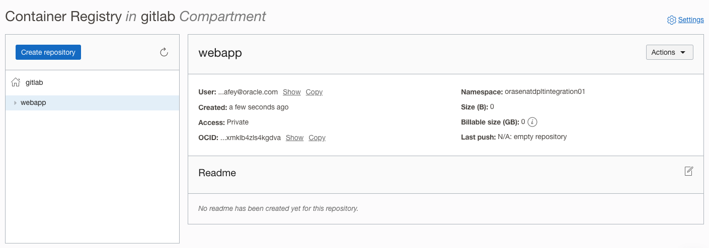

# Implement GitLab CI/CD Pipeline

## Introduction

*Describe the lab in one or two sentences, for example:* This lab walks you through the steps to ...

Estimated Time: -- minutes

### About <Product/Technology> (Optional)
Enter background information here about the technology/feature or product used in this lab - no need to repeat what you covered in the introduction. Keep this section fairly concise. If you find yourself needing more than to sections/paragraphs, please utilize the "Learn More" section.

### Objectives

*List objectives for this lab using the format below*

In this lab, you will:
* Objective 1
* Objective 2
* Objective 3

### Prerequisites (Optional)

*List the prerequisites for this lab using the format below. Fill in whatever knowledge, accounts, etc. is needed to complete the lab. Do NOT list each previous lab as a prerequisite.*

This lab assumes you have:
* An Oracle Cloud account
* All previous labs successfully completed


*This is the "fold" - below items are collapsed by default*


## Task 1: Create an OCIR Repository
1. Create a registry in the compartment with name **webapp**



2. Create an Auth token to access the OCIR

Copy the authentication token, and save it as it won't be shown again

## Task 2: Create project specific CI/CD variables


*description*

## Task 3 Register OKE Cluster


  ```
  helm repo add gitlab https://charts.gitlab.io
  "gitlab" has been added to your repositories
  
  helm repo update
    Hang tight while we grab the latest from your chart repositories...
  ...Successfully got an update from the "gitlab" chart repository
  Update Complete. ⎈Happy Helming!⎈
  
  helm upgrade --install oke-cluster gitlab/gitlab-agent \
  >     --namespace gitlab-agent \
  >     --create-namespace \
  >     --set image.tag=v15.4.0 \
  >     --set config.token=FtSFmc4MLHQu-1r5Vx_iygy8iThXEGr9TNFwLS1JxfX1LxBCxQ \
  >     --set config.kasAddress=wss://gitlab.cloudlab.site/-/kubernetes-agent/
    Release "oke-cluster" does not exist. Installing it now.
  NAME: oke-cluster
  LAST DEPLOYED: Sun Sep 25 22:46:16 2022
  NAMESPACE: gitlab-agent
  STATUS: deployed
  REVISION: 1
  TEST SUITE: None
  ```


## Task 4 Create Project Files

1. Create Dockerfile

    ```
    FROM node:18.9.0-alpine
    ADD app.js /app.js
    ENTRYPOINT ["node", "app.js"]
    ```


2. Create an application file with the name app.js 

    ```
    const http = require('http');
    const os = require('os');
    const dns = require('dns');

    console.log("Web Application starting and listening on 8080...");

    var handler = function(request, response) {
      console.log("Received request from " + request.connection.remoteAddress);
      response.writeHead(200);
      response.end( "Container ID: " + os.hostname() + "\n"
        + "OS Platform is: " + os.platform() +  "\n"
        + "Host Architecture is: " + os.machine() + "\n"
        + "OS Release is: "+ os.release() + "\n"
        + "Load Averages (1, 5, and 15 minute): " + os.loadavg() + "\n"
        + "Host Endianness ('BE' for big endian and 'LE' for little endian): " + os.endianness() + "\n"
        + "Host Total Memory: " + os.totalmem()/1000/1000/1000 + "\n"
        + "Free Memory: " + os.freemem()/1000/1000/1000 + "\n"
        + "Host Uptime in Seconds: "+ os.uptime() + "\n");
    };
    var www = http.createServer(handler);
    www.listen(8080);
    ```

3. Create a Kubernetes deployment file in the template format

    ```
    apiVersion: apps/v1
    kind: Deployment
    metadata:
      name: webapp
      labels:
        app: webapp
    spec:
      selector:
        matchLabels:
          app: webapp
      replicas: 2
      template:
        metadata:
          labels:
            app: webapp
        spec:
          containers:
          - name: webapp
            image: ${OKE_REGISTRY_IMAGE}:${IMAGE_VERSION}
            ports:
            - containerPort: 8080
          imagePullSecrets:
          - name: ocir-cred
    ---
    apiVersion: v1
    kind: Service
    metadata:
      name: webapp-svc
    spec:
      selector:
        app: webapp
      ports:
        - port: 8088
          targetPort: 8080
      type: ClusterIP

    ---

    apiVersion: networking.k8s.io/v1
    kind: Ingress
    metadata:
      name: webapp-ingress
      annotations:
        kubernetes.io/ingress.class: "nginx"
    spec:
      rules:
      - http:
          paths:
            - path: /
              pathType: Prefix
              backend:
                service:
                  name: webapp-svc
                  port:
                    number: 8088

    ```

3. Create a .gitlab-ci.yml file

    ```
  stages:
    - validate
    - build
    - test
    - deploy


    ```

update the file


## Task 5: Check the CI/CD Job Status

Check the Job status 

  


## Learn More

* [Install GitLab Runner](https://docs.gitlab.com/runner/install/linux-repository.html)
* [Register a Runner](https://docs.gitlab.com/runner/register/)
* [Install Docker](https://docs.docker.com/engine/install/centos/)
* [OCI: Container Registry](https://docs.oracle.com/en-us/iaas/Content/Registry/Concepts/registryprerequisites.htm#regional-availability)


## Acknowledgements
* **Author** - Farooq Nafey, Princiapl Cloud Architect
* **Last Updated By/Date** - Farooq Nafey, September 2022
