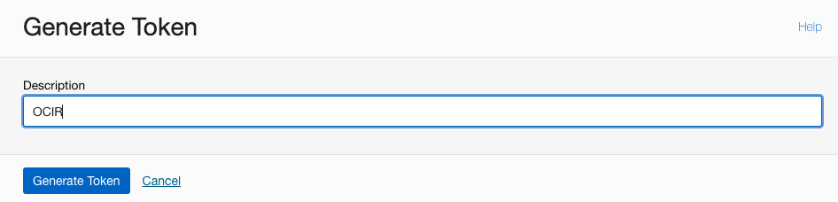
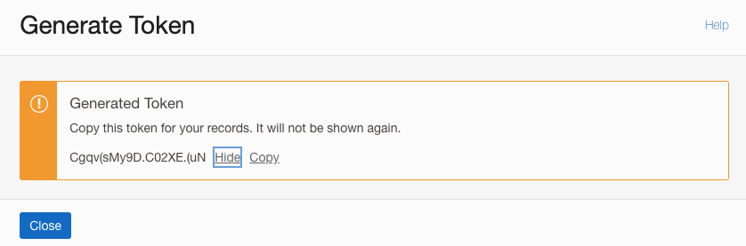
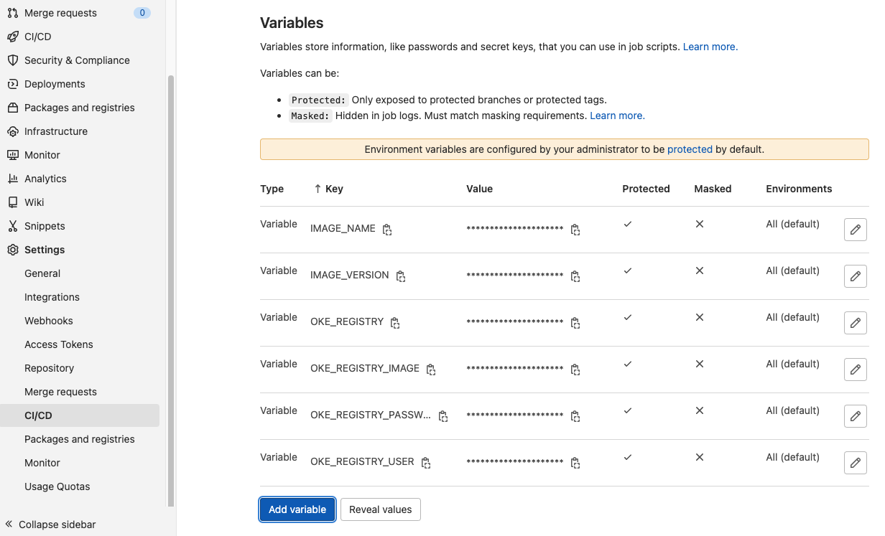

# Implement GitLab CI/CD Pipeline

## Introduction

In this Lab we will deploy the GitLab CI/CD pipeline. The pipeline will use the application source code and build a docker image, and push the image in the Oracle Container Registry. Then a Kubernetes deployment will be created based on the container image. The application deployment will be exposed using the Ingress, and should be visible through the web browser.

Estimated Time: 45 minutes


### Objectives

In this lab, you will:
* Create an OCI Container Registry
* Specify Project specific CI/CD variables
* Register Oracle OKE Cluster with GitLab
* Create Project Files
* Check the CD/CD Job Status

### Prerequisites 


This lab assumes you have:
* Completed all the previous Labs successfully


## Task 1: Create an OCIR Repository
1. To create a repository in Container Registry:
    - In the Console, open the **navigation menu** and click **Developer Services**. Under **Containers and Artifacts**, click **Container Registry**
    - Choose a Compartment you have permission to work in
    - Specify a Name of your choice for the new repository
    - Specify the Access type as Private
    - Click Create Repository


  

2. Container Registry is created with the specified name


  

3. Create an Auth token to access the OCIR

* Before you can push and pull Docker images to and from Oracle Cloud Infrastructure Registry (also known as Container Registry), you must already have an Oracle Cloud Infrastructure username and an auth token. To create a new auth token:

    - In the top-right corner of the Console, open the **Profile** menu (User menu icon) and then click **User Settings** to view the details.
    - On the **Auth Tokens** page, click Generate Token.
    - Enter a friendly description for the auth token. Avoid entering confidential information.
    - Click Generate Token. The new auth token is displayed.


  

    - Copy the auth token immediately to a secure location from where you can retrieve it later, because you won't see the auth token again in the Console.
    - Close the Generate Token dialog.

  


## Task 2 Register OKE Cluster

1. In your GitLab project, navigate to **Repository** > **Files** and create a new file

  

2. The file must be named as: .gitlab/agents/&lt;agent-name&gt;/config.yaml. Ensure the filename ends in .yaml, not .yml. The agent-name chosen witll be used in next setp while creating the CI/CD variables. 
  

  

  

  ```
  helm repo add gitlab https://charts.gitlab.io
  "gitlab" has been added to your repositories
  
  helm repo update
    Hang tight while we grab the latest from your chart repositories...
  ...Successfully got an update from the "gitlab" chart repository
  Update Complete. ⎈Happy Helming!⎈
  
  helm upgrade --install oke-cluster gitlab/gitlab-agent \
  >     --namespace gitlab-agent \
  >     --create-namespace \
  >     --set image.tag=v15.4.0 \
  >     --set config.token=FtSFmc4MLHQu-1r5Vx_iygy8iThXEGr9TNFwLS1JxfX1LxBCxQ \
  >     --set config.kasAddress=wss://gitlab.cloudlab.site/-/kubernetes-agent/
    Release "oke-cluster" does not exist. Installing it now.
  NAME: oke-cluster
  LAST DEPLOYED: Sun Sep 25 22:46:16 2022
  NAMESPACE: gitlab-agent
  STATUS: deployed
  REVISION: 1
  TEST SUITE: None
  ```

  


## Task 3: Create Project specific CI/CD variables

1. Next, we need to add CI/CD variables to a project’s settings. Variables are commonly used to configure third-part services that are repeatedly used throughout the pipeline. 
The variables will be available to all the stages within a Pipeline.


 To add or update variables in the project settings:

    - Go to your project’s **Settings** > **CI/CD** and expand the **Variables** section
    - Select the Add Variable button and fill in the details:
        - Key: Must be one line, with no spaces, using only letters, numbers, or _.
        - Value: No limitations.
        - Type: File or Variable.
        - Environment scope: Optional. All, or specific environments.
        - Protect variable Optional. If selected, the variable is only available in pipelines that run on protected branches or protected tags.
        - Mask variable Optional. If selected, the variable’s Value is masked in job logs. The variable fails to save if the value does not meet the masking requirements.


2. Below is an example of a variable creation.
  

3. In the similar way create the following variables, with appropriate values specific to your tenancy and region

- IMAGE_NAME webserver
- IMAGE_VERSION 1.0
- OKE_AGENT gitlab-instance-c00de01e/LiveLab:oke-cluster
- OKE_REGISTRY_IMAGE fra.ocir.io/orasenatdpltintegration01/webapp
- OKE_REGISTRY_PASSWORD &lt;auth-token&gt;
- OKE_REGISTRY_USER enter your username in the format &lt;tenancy-namespace&gt;/&lt;username&gt;, where &lt;tenancy-namespace&gt; is the auto-generated Object Storage namespace string of your tenancy (as shown on the Tenancy Information page). For example, ansh81vru1zp/jdoe@acme.com. If your tenancy is federated with Oracle Identity Cloud Service, use the format &lt;tenancy-namespace&gt;/oracleidentitycloudservice/&lt;username&gt;.
- OKE_REGISTRY https://fra.ocir.io [Region specific OCIR URL](https://docs.oracle.com/en-us/iaas/Content/Registry/Concepts/registryprerequisites.htm#regional-availability)


4. Once done, we should have the following variables define in the project

  


## Task 4 Create Project Files

1. Create Dockerfile

    ```
    FROM node:18.9.0-alpine
    ADD app.js /app.js
    ENTRYPOINT ["node", "app.js"]
    ```


2. Create an application file with the name app.js 

    ```
    const http = require('http');
    const os = require('os');
    const dns = require('dns');

    console.log("Web Application starting and listening on 8080...");

    var handler = function(request, response) {
      console.log("Received request from " + request.connection.remoteAddress);
      response.writeHead(200);
      response.end( "Container ID: " + os.hostname() + "\n"
        + "OS Platform is: " + os.platform() +  "\n"
        + "Host Architecture is: " + os.machine() + "\n"
        + "OS Release is: "+ os.release() + "\n"
        + "Load Averages (1, 5, and 15 minute): " + os.loadavg() + "\n"
        + "Host Endianness ('BE' for big endian and 'LE' for little endian): " + os.endianness() + "\n"
        + "Host Total Memory: " + os.totalmem()/1000/1000/1000 + "\n"
        + "Free Memory: " + os.freemem()/1000/1000/1000 + "\n"
        + "Host Uptime in Seconds: "+ os.uptime() + "\n");
    };
    var www = http.createServer(handler);
    www.listen(8080);
    ```

3. Create a Kubernetes deployment file in the template format

    ```
    apiVersion: apps/v1
    kind: Deployment
    metadata:
      name: webapp
      labels:
        app: webapp
    spec:
      selector:
        matchLabels:
          app: webapp
      replicas: 2
      template:
        metadata:
          labels:
            app: webapp
        spec:
          containers:
          - name: webapp
            image: ${OKE_REGISTRY_IMAGE}:${IMAGE_VERSION}
            ports:
            - containerPort: 8080
          imagePullSecrets:
          - name: ocir-cred
    ---
    apiVersion: v1
    kind: Service
    metadata:
      name: webapp-svc
    spec:
      selector:
        app: webapp
      ports:
        - port: 8088
          targetPort: 8080
      type: ClusterIP

    ---

    apiVersion: networking.k8s.io/v1
    kind: Ingress
    metadata:
      name: webapp-ingress
      annotations:
        kubernetes.io/ingress.class: "nginx"
    spec:
      rules:
      - http:
          paths:
            - path: /
              pathType: Prefix
              backend:
                service:
                  name: webapp-svc
                  port:
                    number: 8088

    ```

3. Create a .gitlab-ci.yml file

    ```
  stages:
    - validate
    - build
    - test
    - deploy


    ```

update the file


## Task 5: Check the CI/CD Job Status

Check the Job status 
Ingress

  


## Learn More

* [Install GitLab agent for Kubernetes](https://docs.gitlab.com/ee/user/clusters/agent/install/)


## Acknowledgements
* **Author** - Farooq Nafey, Princiapl Cloud Architect
* **Last Updated By/Date** - Farooq Nafey, September 2022
