# Set up Oracle Linux compute Image

## Introduction

This lab will show you how to setup a Oracle Cloud network (VCN) and a compute instance running Oracle Linux.

Estimated Lab Time:  30 minutes


### Objectives


In this lab, you will:
* Create a compartment to group all the resources together 
* Setup a VCN (Virtual Compute Network) using VCN Wizard
* Setup a compute instance
* Login to your compute instance

### Prerequisites (Optional)

*List the prerequisites for this lab using the format below. Fill in whatever knowledge, accounts, etc. is needed to complete the lab. Do NOT list each previous lab as a prerequisite.*

This lab assumes you have:
- An Oracle Free Tier or Paid Cloud account


## Task 1: Create a Compartment

When you first start working with Oracle Cloud Infrastructure, you need to think carefully about how you want to use compartments to organize and isolate your cloud resources. Compartments are fundamental to that process. Most resources can be moved between compartments. However, it's important to think through your compartment design for your organization up front, before implementing anything.

To create a compartment click the **Navigation Menu** in the upper left, navigate to **Identity & Security**, and select **Compartments** under **Identity**.

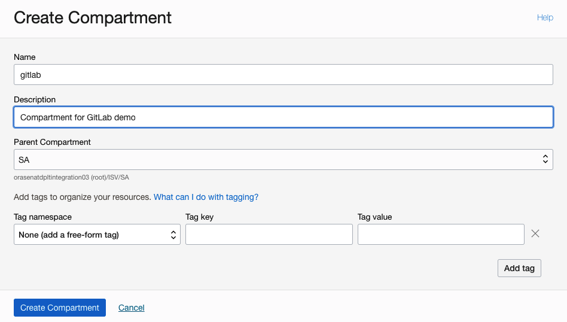

The Console is designed to display your resources by compartment within the current region. When you work with your resources in the Console, you must choose which compartment to work in from a list on the page. 

## Task 2: Setup Virtual Cloud Network

Oracle Cloud Infrastructure (OCI) Virtual Cloud Networks (VCNs) provide customizable and private cloud networks in Oracle Cloud Infrastructure (OCI). Just like a traditional data center network, the VCN provides customers with complete control over their cloud networking environment. This includes assigning private IP address spaces, creating subnets and route tables, and configuring stateful firewalls.

To create a compartment click the **Navigation Menu** in the upper left, navigate to **Networking**, and select **Start VCN Wizard** under **Virtual Cloud Networks**.

1. Select the option **Create VCN with Internet Connectivity**
	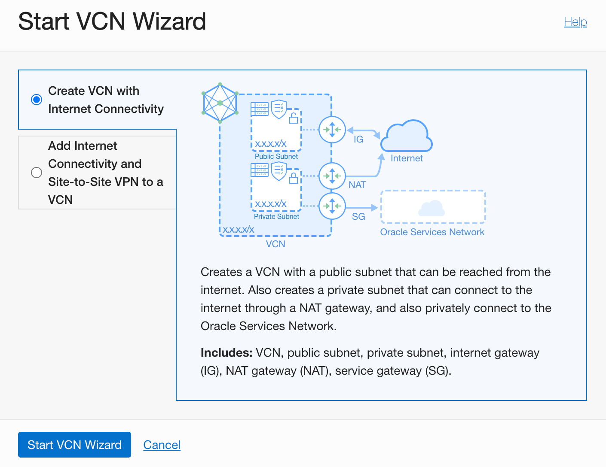
	
2. Specify Basic Information for your VCN
	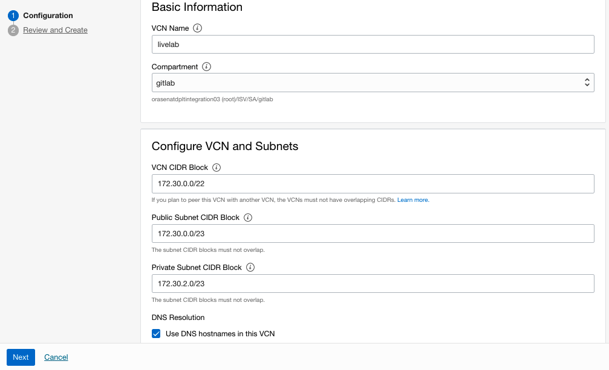

    - Specify the Name of the VCN
    - Select the same Compartment for your VCN creation, that was created in the previous step
    - Specify a VCN CIDR Block big enough to accomodate two subnets
    - Specify the Public Subnet CIDR Block
    - Specify the Private Subnet CIDR Block
    - Ensure to check the DNS Resolution radio button for the naming resolution to be enabled in the VCN
 
    

3. Review and Validate the VCN Information and hit **Create**
	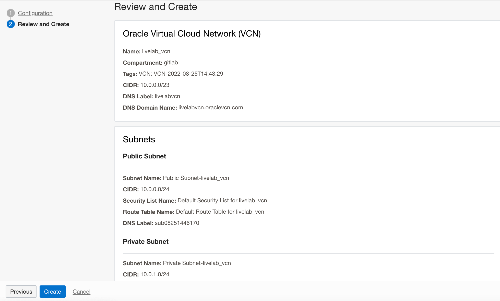

4. VCN Creation is successfully created

	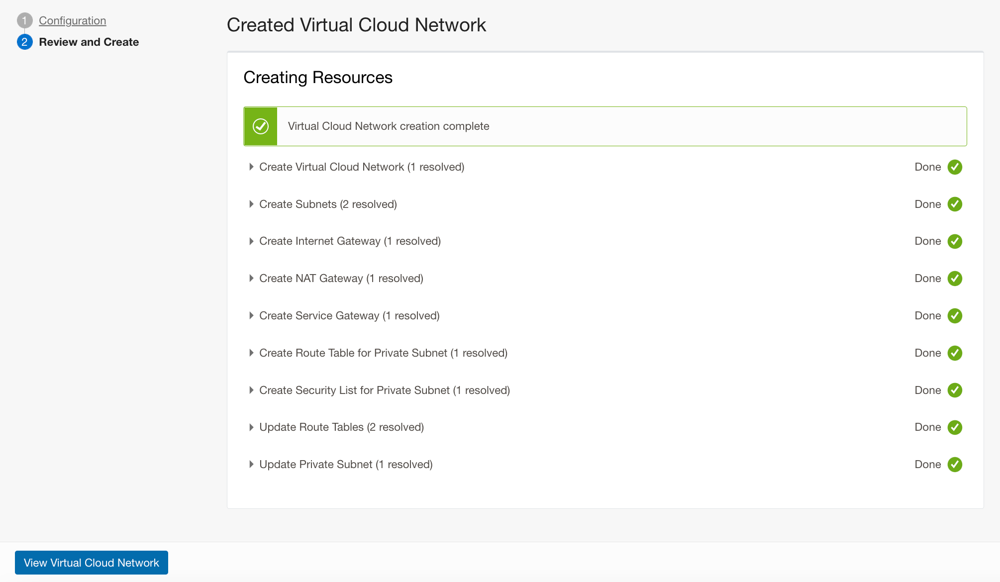


5. After Successful creation of a VCN, the following VCN / Subnets will be provisioned

  | VCN / Subnet | CIDR Block | Total IPs | Total Usable IPs| Subnet Access |
  | --- | --- | --- | --- |
  | livelab |  172.30.0.0/22 | 1024 | |
  | Public Subnet-livelab | 172.30.0.0/23 | 512 | 509 | Public (Regional) |
  | Private Subnet-livelab | 172.30.2.0/23 | 512 | 509 | Private (Regional) |


## Task 3: Create SSH Keys

### Introduction

The SSH (Secure Shell) protocol is a method for secure remote login from one computer to another. SSH enables secure system administration and file transfers over insecure networks using encryption to secure the connections between endpoints. SSH keys are an important part of securely accessing Oracle Cloud Infrastructure compute instances in the cloud.

If you already have an SSH key pair, you may use that to connect to your environment. We recommend you use the *Oracle Cloud Shell* to interface with the OCI compute instance you will create. Oracle Cloud Shell is browser-based, does not require installation or configuration of anything on your laptop, and works independently of your network setup. However, if you prefer to connect via your laptop, please select an option based on your configuration.

*IMPORTANT:  If the SSH key is not created correctly, you will not be able to connect to your environment and will get errors.  Please ensure you create your key properly.*

Estimated Time: 5 minutes

### Objectives
- Generate and access SSH public and private keys

1. **Generate SSH Keys on MacOS**

The ssh keys on MacOS can be created using the **Terminal** application. If you don't already have a shortcut to the terminal application for MacOS, you can find it in the **Applications > Utilities** menu or (Shift+Command+U) on your keyboard.
  ```
  ssh-keygen -t rsa
  Generating public/private rsa key pair.
  Enter file in which to save the key (/Users/fnafey/.ssh/id_rsa):
  Enter passphrase (empty for no passphrase):
  Enter same passphrase again:
  Your identification has been saved in /Users/fnafey/.ssh/id_rsa
  Your public key has been saved in /Users/fnafey/.ssh/id_rsa.pub
  The key fingerprint is:
  SHA256:3UYprkLRvQI/QdKyOoeghc/ow/fx0S2noUBnFvzJeLk fnafey@fnafey-mac
  The key's randomart image is:
  +---[RSA 3072]----+
  |      ...        |
  |      o+..   .   |
  | .    o=o o o    |
  |. o   .+=+o=     |
  | * . +.=S*+ o    |
  |o o =.= o+o.     |
  |o    =...E o     |
  | + .  +.o =      |
  |  o .. o .       |
  +----[SHA256]-----+
```

The command above creates two files under the .ssh folder in the Home directory of the user, a *private key:* ```id_rsa``` and a *public key:* ```id_rsa.pub```. Keep the private key safe and don't share its content with anyone. The public key will be needed for various activities and can be uploaded to certain systems as well as copied and pasted to facilitate secure communications in the cloud.

2. **Generate SSH Keys on Windows**

SSH keys on Windows can either be created using **PowerShell** or **Command Prompt**.

Open a **Powershell** command window on your Windows system by typing 'powershell' in the search field in the Start bar.

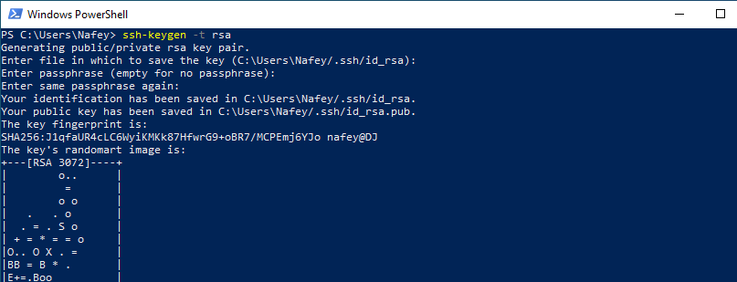


Press Enter at all of the prompts to accept the default location, default file names, and no passphrase.

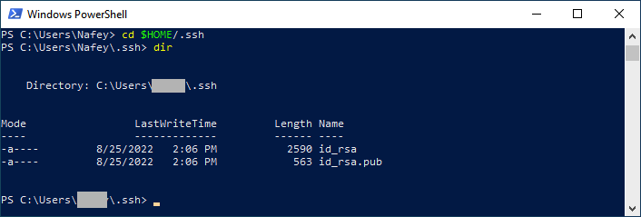

The command above creates two files under the .ssh folder in the Home directory of the user, a *private key:* ```id_rsa``` and a *public key:* ```id_rsa.pub```. Keep the private key safe and don't share its content with anyone. The public key will be needed for various activities and can be uploaded to certain systems as well as copied and pasted to facilitate secure communications in the cloud.

## Task 4: Setup Compute Instance
1. Click the **Navigation Menu** in the upper left, navigate to **Compute**, and select **Instances**.
2. Click on **Create Instance**.
3. Enter the **Name** for your Compute Instance and choose the **compartment**. 
4. Click on edit and choose the Availability Domain, Image, and Shape of your choice. For this lab, use the default Oracle Linux 8.6 image


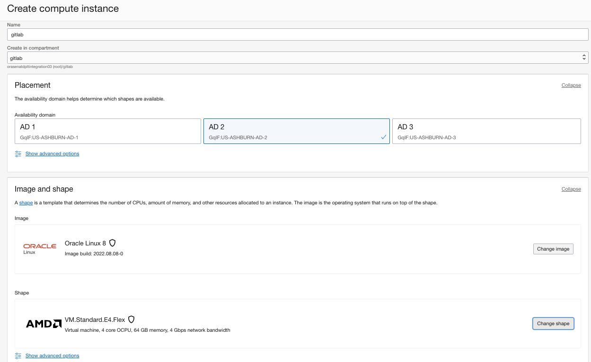

5. Specify the **VCN** and the *public* **Subnet Name**
6. Make sure to **Assign a Public IPV4 address** to the compute instance. We will use this Public IP to login to to the compute instance.
7. In the Add SSH keys, select Upload Public Keys and specify your public ssh key.  


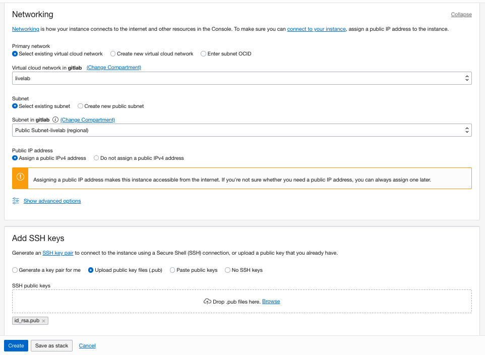
8. Deafult options for **Boot Volume** should suffice for this Lab. No Change is required. Then click create.

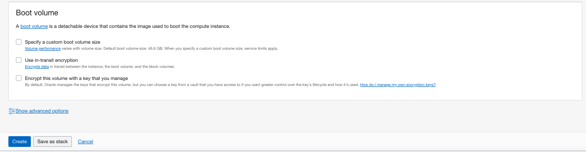
9. The compute instance will be provisioned shortly.


## Task 3: Connect to the Instance

### 1. *Connect from MacOS*

Click the **Navigation Menu** in the upper left, navigate to **Compute**, select **Instances** and click on the instance that was provisioned in the previous steps. This will bring the instance details.

1. Copy the **Public IP** of the Instance, Also, the default user is always *opc* for Oracle Linux images

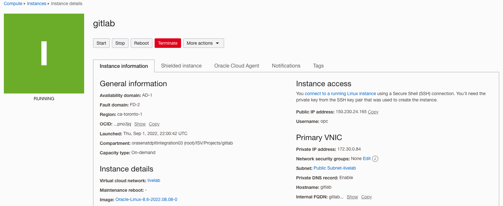


2. Connect to the compute Instance on MacOS

	```
  ssh opc@150.136.95.109
  The authenticity of host '150.136.95.109 (150.136.95.109)' can't be established.
  ED25519 key fingerprint is SHA256:WsFhNLknVX+GIMGf08UH6ifpAhXmGU29VIKLPQCnfkM.
  This key is not known by any other names
  Are you sure you want to continue connecting (yes/no/[fingerprint])? yes
  Warning: Permanently added '150.136.95.109' (ED25519) to the list of known hosts.
  Activate the web console with: systemctl enable --now cockpit.socket

  [opc@gitlab ~]$
  ```


### 2. *Connect from Windows using Putty*

Putty can be used to connect to Linux machines from Windows machines. However, the private ssh key created earlier needs to be converted from a **PEM** format to a **PPK** format before connecting to the instance. Use the steps below to do the conversion of the key before attemting to log in.

1. On the Windows machine, click on **Start Menu**> **All Programs** > **PuTTY** > **PuTTYgen**.


2. Click the **Load** button and select the private key *id_rsa*, generated earlier


3. Click the **Save private key** and save the file with the same name with **ppk** extension
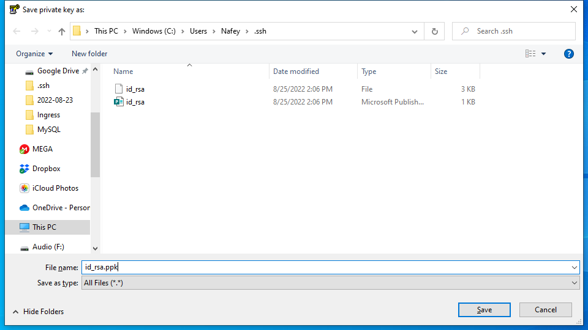

Once the private key is saved in the ppk format, Putty can be used to connect to the compute instance

4. Open Putty, and input the usename and the host IP address
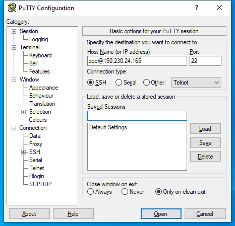

5. Next, in the left hand panel locate the **Connection > SSH > Auth** configuration tab. Specify the location of the Private Key File (converted earlier to ppk format) and hit **Open** button
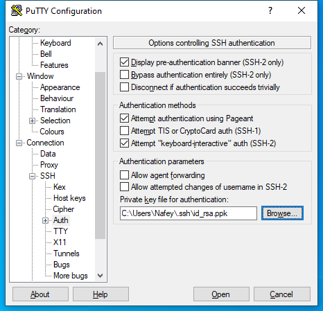

6. *Accept* the **PuTTy Security Alert**
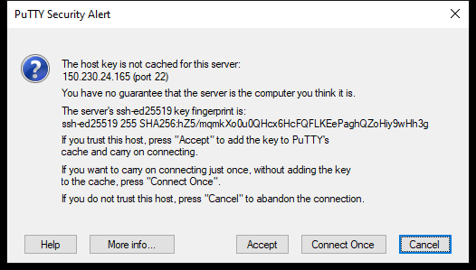

7. Successful connection is established with the instance
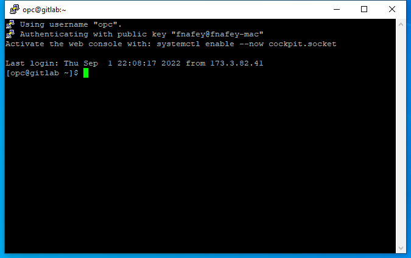

## Learn More


* [Compartments](https://docs.oracle.com/en-us/iaas/Content/Identity/Tasks/managingcompartments.htm)
* [Virtual Cloud Network (VCN)](https://docs.oracle.com/en-us/iaas/Content/Network/Concepts/overview.htm)
* [OCI Compute Service](https://docs.oracle.com/en-us/iaas/Content/Compute/Concepts/computeoverview.htm)
* [Managing Key Pairs on Linux Instances](https://docs.oracle.com/en-us/iaas/Content/Compute/Tasks/managingkeypairs.htm)
* [Connecting to an Instance](https://docs.oracle.com/en-us/iaas/Content/Compute/Tasks/accessinginstance.htm)
* [Download Putty](https://www.chiark.greenend.org.uk/~sgtatham/putty/latest.html)


## Acknowledgements
* **Author** - Farooq Nafey, August 2022
* **Last Updated By/Date** - Farooq Nafey, August 2022