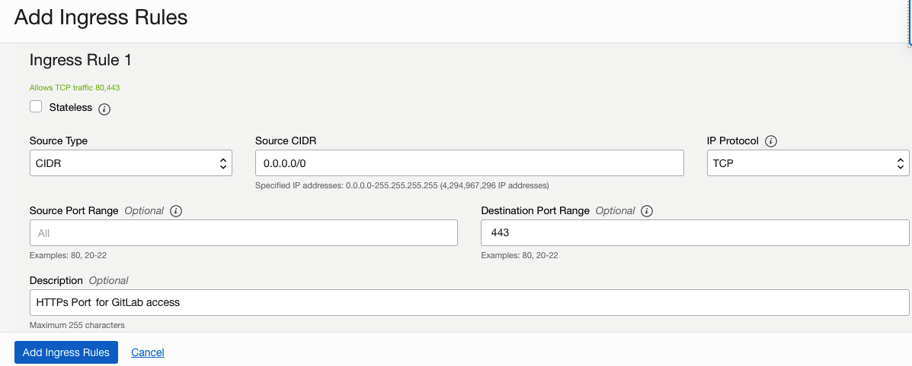
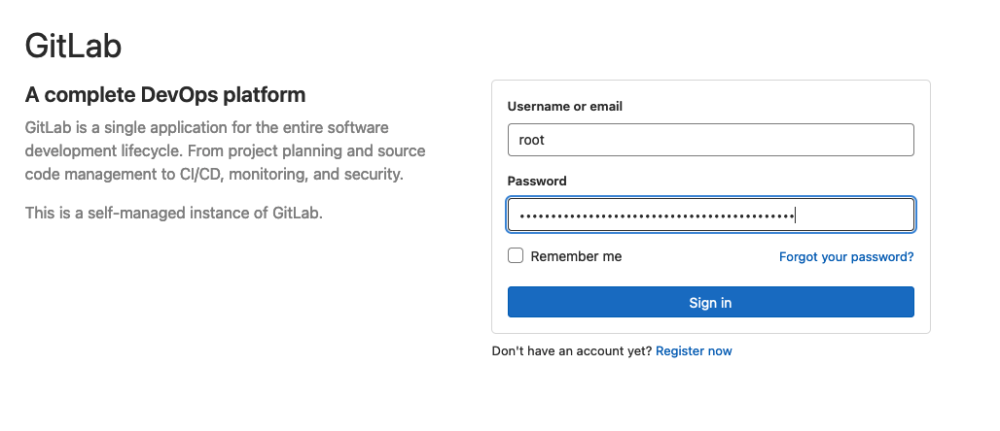

# Install GitLab on on Compute Instance running Oracle Enterprose Linux 8.x

## Introduction

This Lab will walk you through the step by step instructions of installing GitLab via Officail Linux package on virtual machine running Oracle Enterprise Linux 8.x.

Estimated Time: 15 minutes


### Objectives


In this lab, you will:
* Install and configure the necessary dependencies 
* Add the GitLab package repository and install the package
* Login to GitLab Console

### Prerequisites

This lab assumes you have:
* Configured OCI Networking
* Provisioned a Virtual Machine on OCI
* Ability to SSH into to server via a Public IP


## Task 1: Install and configure the necessary dependencies

The dependecy requirements mentioned below are tailored for OEL 8.x. For installation dependecy requirements for OEL 7.x refer to [documentation](https://about.gitlab.com/install/#centos-7) 

1. Install and configure the necessary dependencies


    ```
    <copy>sudo yum install -y curl policycoreutils-python-utils openssh-server perl</copy>   
    ```


2.  Enable OpenSSH server daemon (won't be required for Oracle Cloud provided images)

    ```
    sudo systemctl enable sshd
    sudo systemctl start sshd
    ```


3. Enable the Firewall rules 
    ```
    sudo firewall-cmd --permanent --add-service=http
    sudo firewall-cmd --permanent --add-service=https
    sudo systemctl reload firewalld
    ```

4. Install Postfix to send notification emails
    ```
    sudo yum -y install postfix
    sudo systemctl enable postfix --now
    sudo systemctl status postfix
    ```

> **Note:** During Postfix installation a configuration screen may appear. Select 'Internet Site' and press enter. Use your server's external DNS for 'mail name' and press enter. If additional screens appear, continue to press enter to accept the defaults.


5. Configure OCI Network Security List

Enable port 80 and/or 443 in the security list to allow the GitLab access via application console



## Task 2: Add the GitLab package repository and install the package

1. Add a GitLab package repository to the instance
    ```
    <copy>curl https://packages.gitlab.com/install/repositories/gitlab/gitlab-ee/script.rpm.sh | sudo bash</copy>
    ```

2. Install GitLab Packages
    ```
    <copy>sudo EXTERNAL_URL="https://gitlab" yum install -y gitlab-ee</copy>
    ```


> **Note:** *Make sure to correctly set up the DNS, and change https://gitlab.example.com to the URL at which you want to access your GitLab instance. Installation will automatically configure and start GitLab at that URL.
For https:// URLs, GitLab will automatically request a certificate with Let's Encrypt, which requires inbound HTTP access and a valid hostname. You can also use your own certificate or just use http:// (without the s ).
If you would like to specify a custom password for the initial administrator user ( root ), check the documentation. If a password is not specified, a random password will be automatically generated.*

3. Get the default password for the root user
    ```
    sudo cat /etc/gitlab/initial_root_password
    # WARNING: This value is valid only in the following conditions
    #          1. If provided manually (either via `GITLAB_ROOT_PASSWORD` environment variable or via `gitlab_rails['initial_root_password']` setting in `gitlab.rb`, it was provided before database was seeded for the first time (usually, the first reconfigure run).
    #          2. Password hasn't been changed manually, either via UI or via command line.
    #
    #          If the password shown here doesn't work, you must reset the admin password following https://docs.gitlab.com/ee/security/reset_user_password.html#reset-your-root-password.

    Password: PuEkVc9nxLDIrnW2Lcwo+VhMZfibSKyNCVBRob9m+Vo=

    # NOTE: This file will be automatically deleted in the first reconfigure run after 24 hours.
    ```

## Task 3: Browse to the hostname and login

1. Point the URL to the **https://``<Public IP Address>``** of the compute instance and login, using the *root* username and the *default password* generated by the installation 



2. To change the password of the root user, navigate to the **Menu** in the upper Left, navigate to **Admin** and select **Users**, and click on the user *Administrator* and then **Edit**. Specify the new password and log back in using the new password. 


## Learn More


* [Deploy GitLab to enable CI/CD pipelines on OCI](https://docs.oracle.com/en/solutions/deploy-gitlab-ci-cd-oci/index.html)
* [GitLab with OCI ARM-based compute instances](https://about.gitlab.com/blog/2021/05/25/gitlab-oracle-cloud-arm-based/)
* [Quick Start: Deploy to Oracle Cloud](https://github.com/oracle-quickstart/oci-gitlab-ce)

## Acknowledgements
* **Author** - Farooq Nafey, Princiapl Cloud Architect
* **Last Updated By/Date** - Farooq Nafey, August 2022
