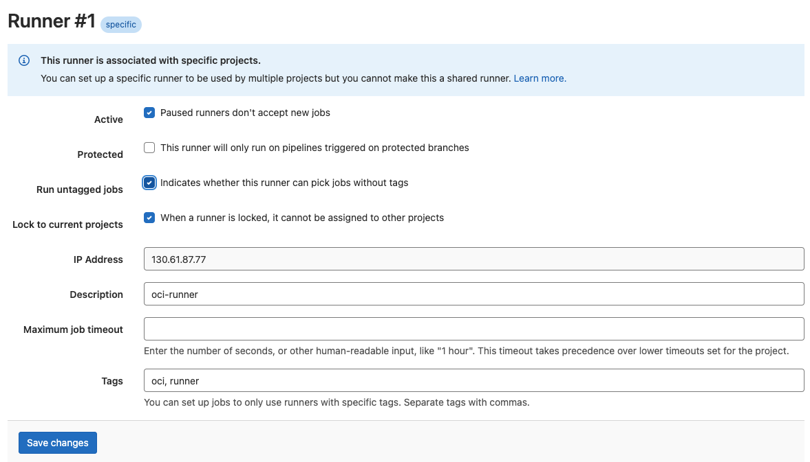

# GitLab Runner Installation and Registration

## Introduction

*Describe the lab in one or two sentences, for example:* This lab walks you through the steps to ...

Estimated Time: -- minutes

### About <Product/Technology> (Optional)
Enter background information here about the technology/feature or product used in this lab - no need to repeat what you covered in the introduction. Keep this section fairly concise. If you find yourself needing more than to sections/paragraphs, please utilize the "Learn More" section.

### Objectives

*List objectives for this lab using the format below*

In this lab, you will:
* Objective 1
* Objective 2
* Objective 3

### Prerequisites (Optional)

*List the prerequisites for this lab using the format below. Fill in whatever knowledge, accounts, etc. is needed to complete the lab. Do NOT list each previous lab as a prerequisite.*

This lab assumes you have:
* An Oracle Cloud account
* All previous labs successfully completed


*This is the "fold" - below items are collapsed by default*


## Task 1: Create a GitLab Project


Create a New project in GitLab


Create a new project from a blank template


Specify the Project slug and the Project name


Project with the specified name is created


## Task 2: Install GitLab Runner

> **Note:** The steps below need to be completed on the *runner* server.

1. Add the official GitLab repository

    ```
  <copy>curl -L "https://packages.gitlab.com/install/repositories/runner/gitlab-runner/script.rpm.sh" | sudo bash</copy>
    ```


2. Install the latest version of GitLab Runner

    ```
	<copy>sudo yum -y install gitlab-runner</copy>
    ```

## Task 3: Register a GitLab Runner

1. Get the Runner registration information


2. Register the GitLab runner with the GitLab instance 

    ```
    <copy>sudo gitlab-runner register</copy>
    Runtime platform                  arch=amd64 os=linux pid=3073 revision=43b2dc3d version=15.4.0
    Running in system-mode.

    Enter the GitLab instance URL (for example, https://gitlab.com/):
    https://gitlab.cloudlab.site/
    Enter the registration token:
    GR13489412vF5MSLMCh6m4oGEqyZ2
    Enter a description for the runner:
    [runner]: oci-runner
    Enter tags for the runner (comma-separated):
    oci,runner
    Enter optional maintenance note for the runner:

    Registering runner... succeeded                     runner=GR13489412vF5MSLM
    Enter an executor: shell, ssh, virtualbox, docker+machine, custom, docker, docker-ssh, parallels, docker-ssh+machine, kubernetes:
    shell
    Runner registered successfully. Feel free to start it, but if it's running already the config should be automatically reloaded!

    Configuration (with the authentication token) was saved in "/etc/gitlab-runner/config.toml"
    ```

3. Once the runner is registered successfully, it should show up under the Available runners


4. Click on the pencil icon next to the runner, and modiy the properties as follows:
Make sure to click the checkbox *Run untagged jobs*


## Task 4: Install Docker

1. Setup Docker Registry

  ```
  <copy>sudo yum install -y yum-utils
  sudo yum-config-manager \
      --add-repo \
      https://download.docker.com/linux/centos/docker-ce.repo</copy>
  ```

2. Install Docker Engine

  ```
  <copy>sudo yum install -y docker-ce docker-ce-cli containerd.io docker-compose-plugin</copy>
  ```


3. Enable and Start Docker
  ```
  <copy>sudo systemctl enable docker --now</copy>
  ```

4. Verify the Docker Status
  ```
    <copy>sudo systemctl status docker</copy>
  ● docker.service - Docker Application Container Engine
    Loaded: loaded (/usr/lib/systemd/system/docker.service; enabled; vendor preset: disabled)
    Active: active (running) since Tue 2022-09-20 21:55:32 GMT; 20s ago
      Docs: https://docs.docker.com
  Main PID: 49263 (dockerd)
      Tasks: 8
    Memory: 30.7M
    CGroup: /system.slice/docker.service
            └─49263 /usr/bin/dockerd -H fd:// --containerd=/run/containerd/containerd.sock
  ```

3. Add the gitlab-runner user to the docker group
  ```
  <copy>sudo usermod -aG docker gitlab-runner</copy>
  # Optionally add opc user to docker group
  <copy>sudo usermod -aG docker opc</copy>
  ```

4. Verify that gitlab-runner has access to Docker
  ```
  <copy>sudo -u gitlab-runner -H docker info</copy>
  ```

## Learn More

* [Install GitLab Runner](https://docs.gitlab.com/runner/install/linux-repository.html)
* [Register a Runner](https://docs.gitlab.com/runner/register/)
* [Install Docker](https://docs.docker.com/engine/install/centos/)


## Acknowledgements
* **Author** - Farooq Nafey, Princiapl Cloud Architect
* **Last Updated By/Date** - Farooq Nafey, September 2022
