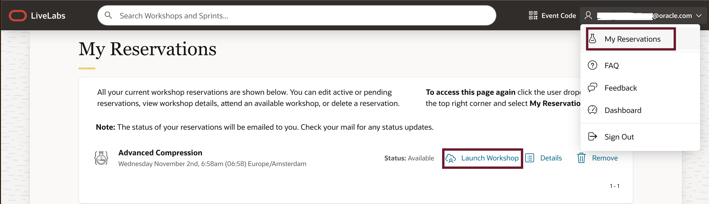
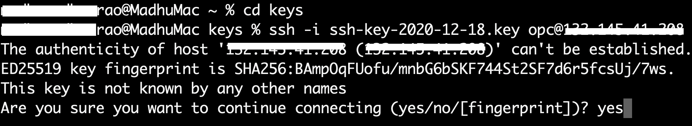
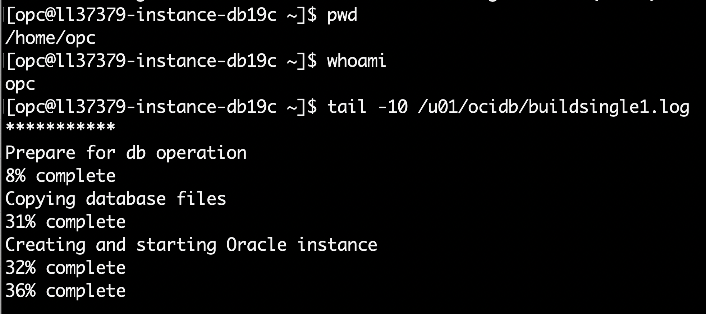

# Get started - LiveLabs login and SSH into Oracle Database 19c (ORCL) compute instance

## Introduction

Welcome to your LiveLabs Sandbox environment.
In order to start your workshop, you need to log in to our LiveLabs Sandbox.

In this lab, we are going to show you where you can find the login information and how to SSH into the Oracle Database 19c (ORCL) Compute Instance running on the LiveLabs Sandbox environment. We will also verify and connect to the Database

Estimated Time: 5 minutes

### Objectives

- View login information to LiveLabs Sandbox
- Log in to LiveLabs Sandbox
- SSH into compute instance
- Verify and connect to the database


## Task 1: View Login Information

1. After creating a reservation for a LiveLab Workshop, you will receive an e-mail indicating that your reservation is being processed, followed by an e-mail indicating that your environment has been created.

  

  >**Note:** You will receive the second created e-mail just before your selected reservation time.

2. Log into LiveLabs. Click your username, and click **My Reservations**. Then click the **Launch Workshop** link for the Workshop environment you'd like to use. Note that you may have several Workshops listed. 

   

  If you need to view your login information anytime, click **View Login Info**. Click **View Login Info**  

  

  Copy the **Public IP** address displayed on the **Reservation Information** screen under **Instance Provisioned** which is required for us to SSH into Oracle Database 19c Compute Instance.

    
  
## Task 2: Connect to Your Instance

There are multiple ways to connect to your cloud instance.  Choose the way to connect to your cloud instance that matches the SSH Key you generated.  *(i.e If you created your SSH Keys in cloud shell, choose cloud shell)*
 
- MAC or Windows CYCGWIN Emulator
- Windows Using Putty
 
### MAC or Windows CYGWIN Emulator

1. SSH into compute instance directly from your Desktop Machine or Laptop. Change the directory to your private key. Please note the public key has to be provided during reservation, and the same key pair needs to be used to access the Database instance. 

      ```    
      ssh -i <private key> opc@<Your Compute Instance Public IP Address> 
      ```

    >**Note:** The angle brackets <> should not appear in your code.
  
   
  
   
 
### Windows using Putty

1.  Open up putty and create a new connection.

    ````
    ssh -i ~/.ssh/<sshkeyname> opc@<Your Compute Instance Public IP Address>
    ````
    

    >**Note:** The angle brackets <> should not appear in your code.

2.  Enter a name for the session and click **Save**.

    

3. Click **Connection** > **Data** in the left navigation pane and set the Auto-login username to root.

4. Click **Connection** > **SSH** > **Auth** in the left navigation pane and configure the SSH private key to use by clicking Browse under Private key file for authentication.

5. Navigate to the location where you saved your SSH private key file, select the file, and click Open.  NOTE:  You cannot connect while on VPN or in the Oracle office on clear-corporate (choose clear-internet).

    

6. The file path for the SSH private key file now displays in the Private key file for the authentication field.

7. Click **Session** in the left navigation pane, then click **Save** in the Load, and save or delete a stored session.

8. Click Open to begin your session with the instance.
 
## Task 3: Verify the ORCL Database is up

Once you deploy your compute instance, tail the log to determine when the database has been configured and is available for use.
1.  From your connected session of choice **tail** the last 10 lines of the **dbsingle.log** file.  This file configures the database.
    ````
    <copy>
    tail -10 /u01/ocidb/buildsingle1.log
    </copy>
    ````
    
 
2. Run the following command to verify the database with the SID **ORCL** is up and running

    ````
    <copy>
    ps -ef | grep ORCL
    </copy>
    ````
    

3. Verify the listener is running
    ````
    <copy>
    ps -ef | grep tns
    </copy>
    ````

    

4. Switch to the **oracle** user.
      ````
    <copy>
    sudo su - oracle
    </copy>
    ````

    

5.  Set the environment variables to point to the Oracle binaries.  When prompted for the SID (Oracle AI Database System Identifier), enter **ORCL**.
    ````
    <copy>
    . oraenv
    </copy>
    ORCL
    ````
    

6.  Login using SQL*Plus as the **oracle** user.  

    ````
    <copy>
    sqlplus system/Ora_DB4U@localhost:1521/orclpdb
    </copy>
    ````
     

7.  Exit the sqlplus session.   

    ````
    SQL> <copy>exit
    </copy>
    ````

     
 

Congratulations!  You now have a fully functional Oracle Database 19c instance (ORCL) running on Oracle Cloud Compute.  

You may now **proceed to the next lab**. 

## Acknowledgements

- **Created By/Date** - Madhusudhan Rao, Principal Product Manager, Oracle Database, Nov 2nd 2022 
- **Contributors** - Arabella Yao, Product Manager, Database Product Management
- **Last Updated By/Date** - Ramona Magadan, Technical Program Manager, Database Product Management, Oct 2025