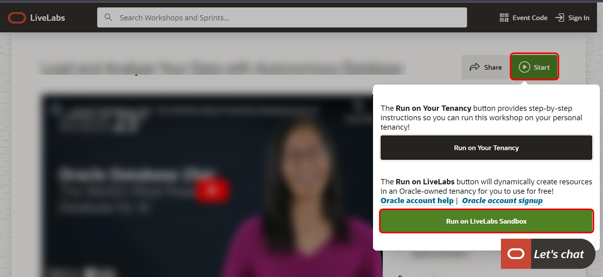
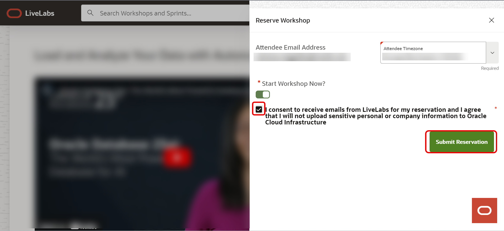
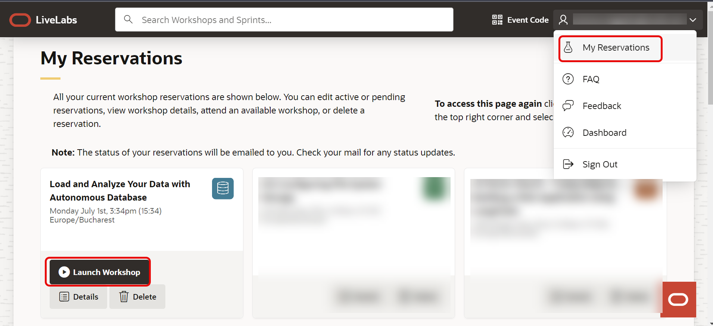
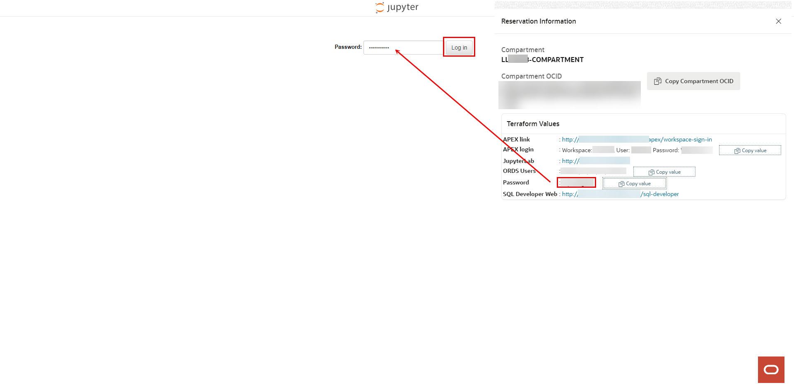
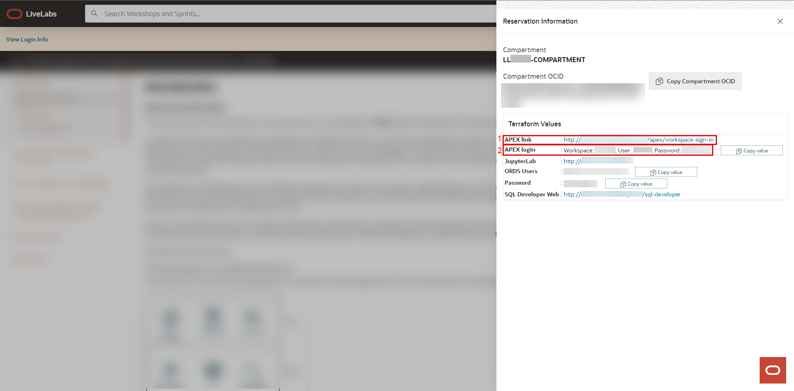
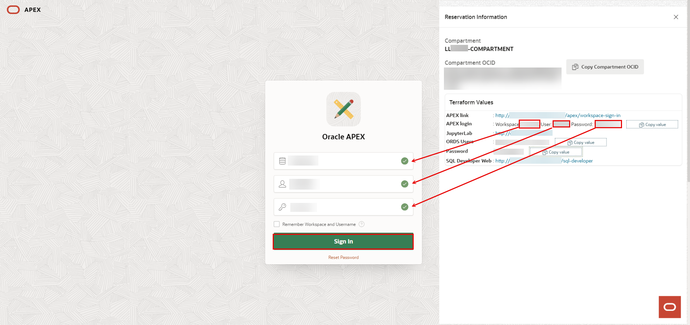
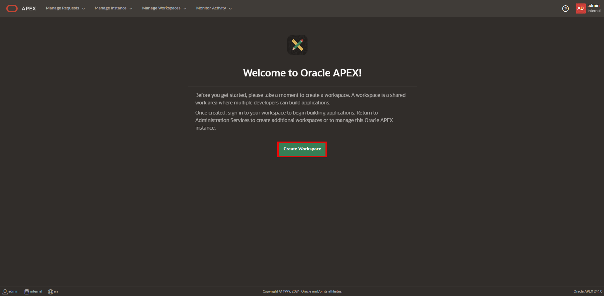
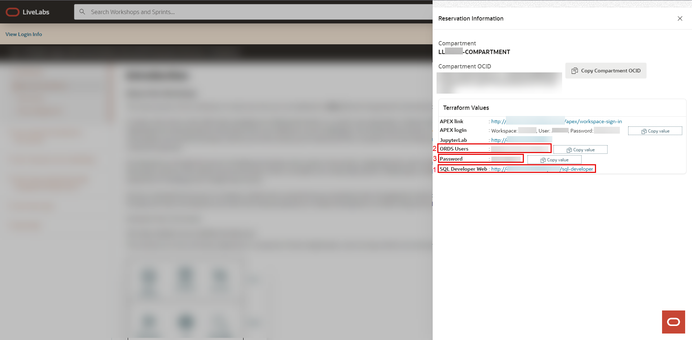
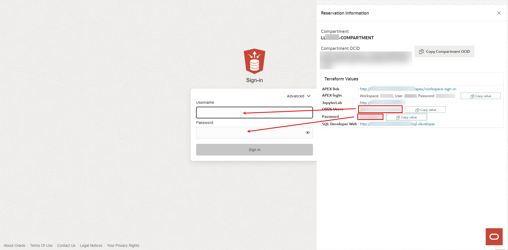
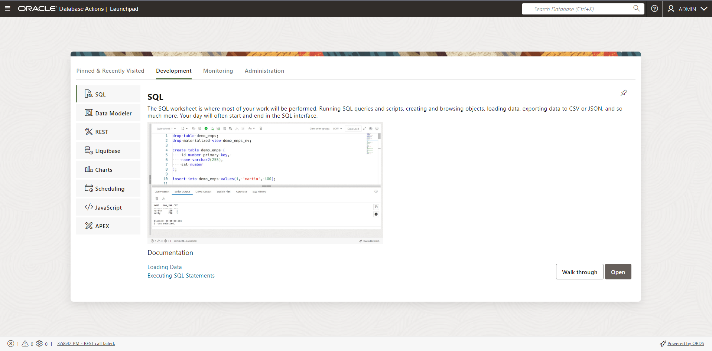

# Get started - LiveLabs login

## Introduction

Welcome to your LiveLabs Sandbox environment. This lab will walk you through how to find and use the login credentials provided for your LiveLabs Sandbox, which has been specially configured for the 23ai Workshops.

You will have access to three different logins, each serving distinct purposes across various applications. Depending on the specific workshop, not all of these logins may be necessary. There are four tasks (*Task 1: Access Login Informations*, *Task 2: Access JupyterLab Environment*, *Task 3: Access APEX Environment*, *Task 4: Access SQL Developer Web Environment*) outlined in this lab, and you can focus on the ones that are relevant to your needs. We will help you locate the login information and access the LiveLabs Sandbox customized for your 23ai Workshop.

### JupyterLab Environment

JupyterLab is an interactive, web-based development environment designed for data science and analysis. It enables users to create and manage notebooks, run and debug code, and visualize data, all within a versatile and customizable interface. Supporting multiple programming languages such as Python and R, JupyterLab provides a powerful platform for conducting complex data analyses and creating detailed reports. Its flexible workspace, with the ability to organize projects into tabs and panels, facilitates an efficient and streamlined workflow, making it an essential tool for data scientists and researchers.

### Oracle APEX Environment

Oracle APEX is a web-based development environment that enables users to rapidly build, deploy, and manage applications with minimal coding. It features a user-friendly interface that supports the creation of interactive applications, leveraging pre-built components and powerful development tools. Oracle APEX streamlines the development process for database-driven applications, allowing developers to quickly transform their ideas into functional applications. Its robust set of features and intuitive design make it an effective solution for developing enterprise-grade applications efficiently.

### SQL Developer Web Environment

SQL Developer Web is a comprehensive, web-based platform for database management and development. It provides tools for executing SQL queries, designing and managing databases, and handling schema objects all within a browser-based interface. This environment simplifies database administration tasks, allowing users to interact with their Oracle databases efficiently. SQL Developer Web’s intuitive interface and integrated features support a wide range of database activities, from query execution to schema design, making it a valuable tool for database developers and administrators.

Estimated Time: 10 minutes

### Objectives

- View login information to LiveLabs Sandbox
- Login to LiveLabs Sandbox configured for the 23ai Workshops

## Task 1: Access Login Informations

1. Create a reservation for a LiveLab Workshop by clicking the **Start** button, then on the green button, **Run on the LiveLabs Sandbox**.

  

2. To confirm the reservation, you must consent to receive emails from LiveLabs. More than that, you can select the time when to start the workshop.

  

3. After creating a reservation for a LiveLab Workshop, you will receive an e-mail indicating that your reservation is being processed, followed by an e-mail indicating that your environment has been created.

  

  >**Note:** You will receive the second created e-mail just before your selected reservation time.

4. Log into LiveLabs. Click your username, and click **My Reservations**. Then click the **Launch Workshop** link for the Workshop environment you'd like to use. Note that you may have several Workshops listed.

  

5. Click **View Login Info** to see the credentials.

    

6. Follow the instructions provided to log in to your Oracle Cloud account, based on the component you need.

## Task 2: Access JupyterLab Environment

1. This link takes you to the **JupyterLab interface**, a web-based interactive development environment for notebooks, code, and data analysis. It enables you to run and analyze data using Python, R, and other programming languages.

    

2. Enter the password from the  **Login Info**, then click **Log In**.

    

## Task 3: Access APEX Environment

1. *Number 1* provides the link to your Oracle APEX application, a web-based interface designed for developing and deploying your applications. Use this URL to access the APEX environment. *Number 2* contains the credentials required to log into the Oracle APEX application, including your **workspace**, **username** and **password**.

    

2. Click on the link from *Number 1* and enter the credentials provided in *Number 2* to access your APEX application. Then, click on **Sign In**.

    

3. In the next step, you’ll need to change your password. The new password must be at least 6 characters long and include at least one numeric character (0-9), one punctuation mark (!"`'#$%&()[]{},.*+-/|:;<=>?_~), one uppercase letter, and must not contain your username.

    

4. Once you've changed the password, you'll be able to access your account and begin creating your workspace.

    

## Task 4: Access SQL Developer Web Environment

1. SQL Developer Web allows you to run queries, design databases, and manage database schemas. At *Number 1*, you'll find the **link for SQL Developer Web environment**; at *Number 2*, you’ll find multiple **usernames** (choose one that suits you); and at *Number 3*, you'll see the corresponding **password**."

    

2. Click the link from *Number 1*, enter one of the usernames from *Number 2* along with the password from *Number 3*, and then click **Sign In**.

    

3. You should now see the Oracle Database Actions Launchpad.

    

You may now **proceed to the next lab**.

## Acknowledgements

- **Created By/Date** -  Ramona Magadan, Technical Product Manager, Database Product Management, August 2024
- **Last Updated By/Date** - Ramona Magadan, Technical Product Manager, Database Product Management, August 2024