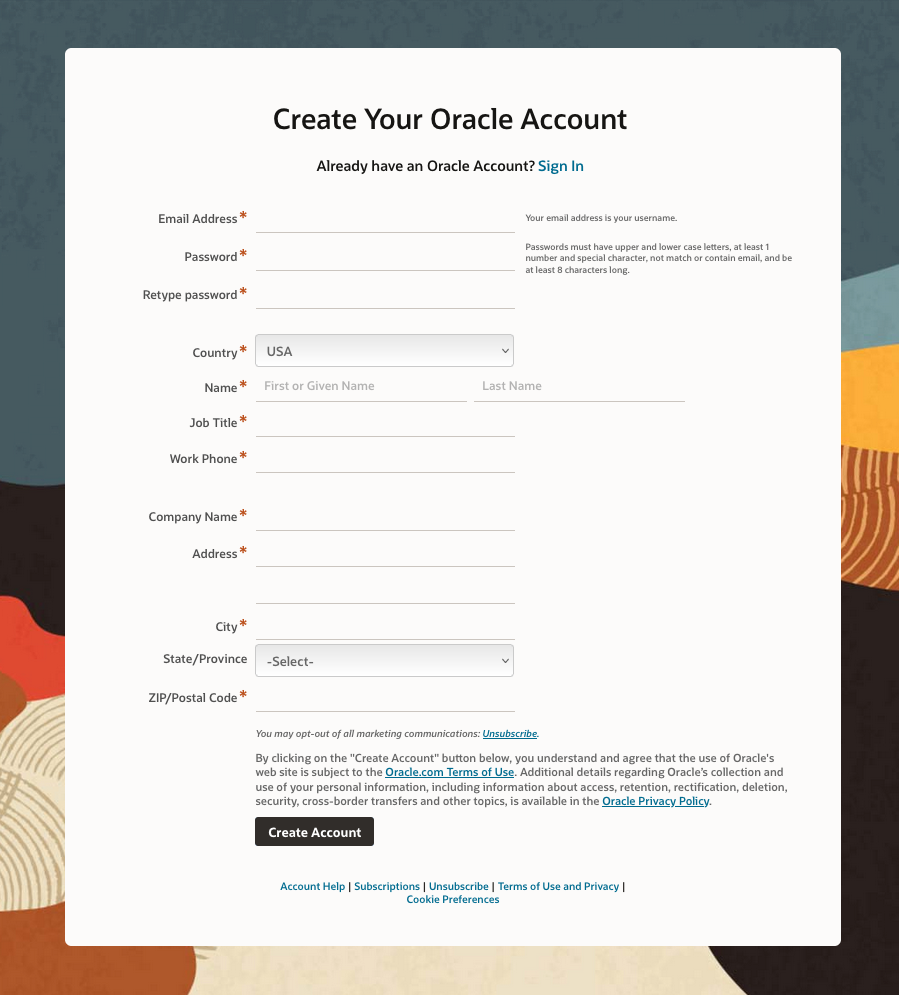
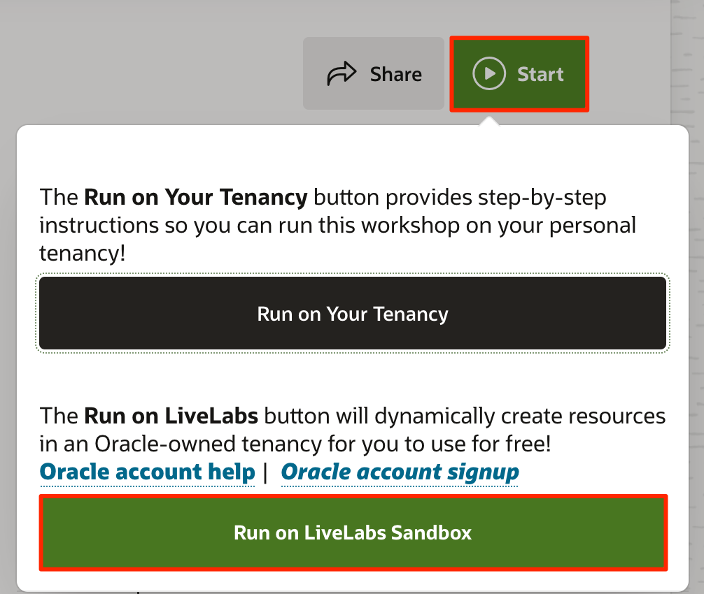
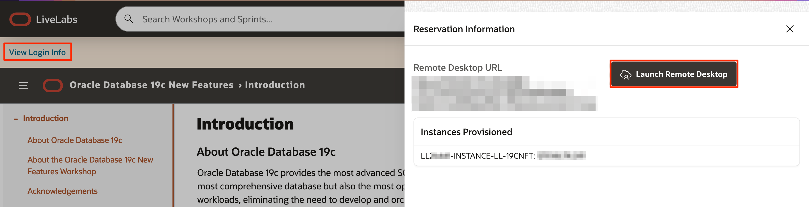

# Get started - LiveLabs login

## Introduction

To get started, you need to have an active Oracle Cloud account and a LiveLabs reservation. An Oracle Cloud account is free and needed to gain access to your LiveLabs reservation, Oracle Support, and other Oracle publicly-accessible content.

If you already have an Oracle Cloud account, you can skip to Task 2.

If you already have a reservation, skip to the next lab to start your workshop!

Estimated Time: 5 minutes

### Objectives

- Create an Oracle cloud account
- Request workshop reservation on LiveLabs
- Launch workshop

### Prerequisites

- A valid email address
- Valid phone number

## Task 1: Create an Oracle Account

Creating an Oracle account can be summarized in the following two simple steps.

1. Navigate to [oracle.com](http://www.oracle.com), Click on *View Accounts*, and Select *Create an Account*

  

2. Fill out the form and click *Create Account*.

  

## Task 2: Request Workshop Reservation

1. Using your *Oracle Account Login* go to [LiveLabs](https://oracle.com/livelabs). Open a workshop, click **Start**, and then **Run on LiveLabs Sandbox** to request a reservation for this workshop.
  

2. Fill out the information on the *Reserve Workshop* page. Check **I consent to receive emails from LiveLabs for my reservation**. Click **Submit Reservation**.
  

3. After creating a reservation for a LiveLab Workshop, you will receive an e-mail indicating that your reservation is being processed, followed by an e-mail indicating that your environment has been created.

  

  >**Note:** You will receive the second created e-mail just before your selected reservation time.

4. Log into LiveLabs. Click your username, and click **My Reservations**. Then click the **Launch Workshop** link for the Workshop environment you'd like to use. Note that you may have several Workshops listed.

  

5. Click **View Login Info** and click **Launch Remote Desktop** to access the VM instance.

  

6. If you need to view your login information anytime, click **View Login Info**.
  

You may now **proceed to the next lab**.

## Acknowledgements

- **Created By/Date** - Kay Malcolm, Database Product Management March 2020
- **Contributors** - Rene Fontcha, Kamryn Vinson, Anoosha Pilli, Arabella Yao
- **Last Updated By/Date** - Arabella Yao, Dec 2022