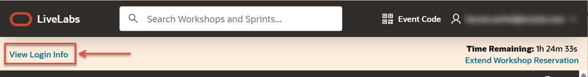
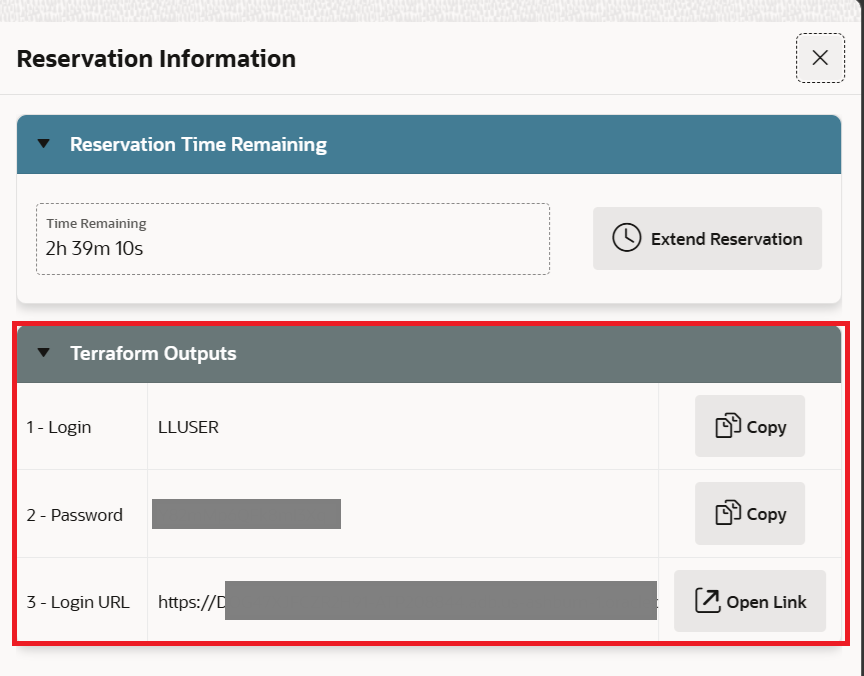
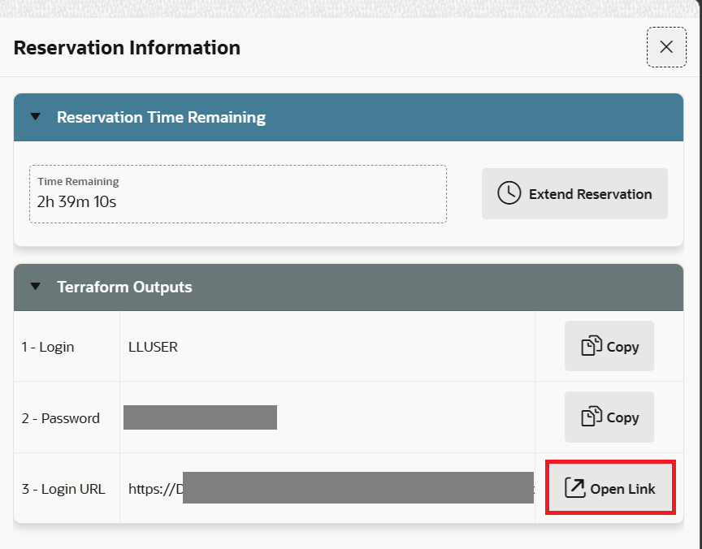
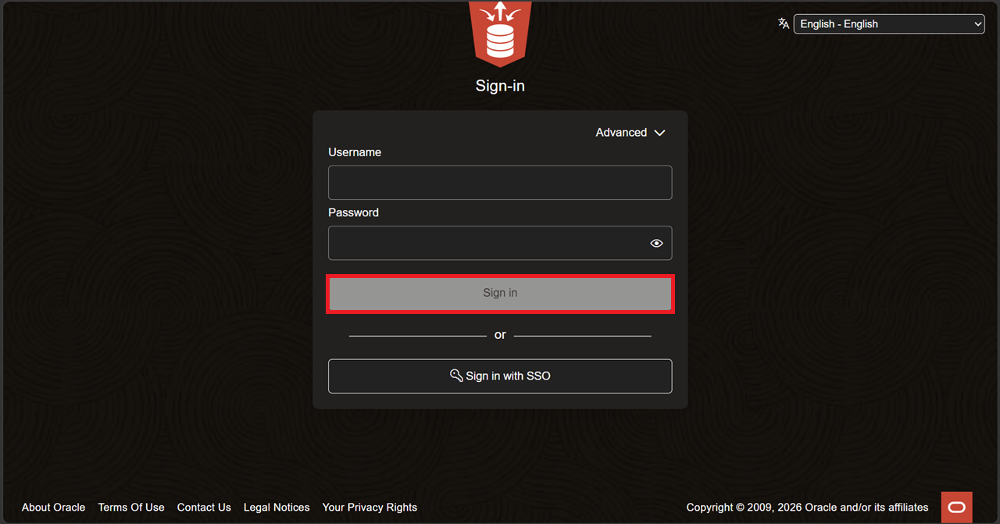
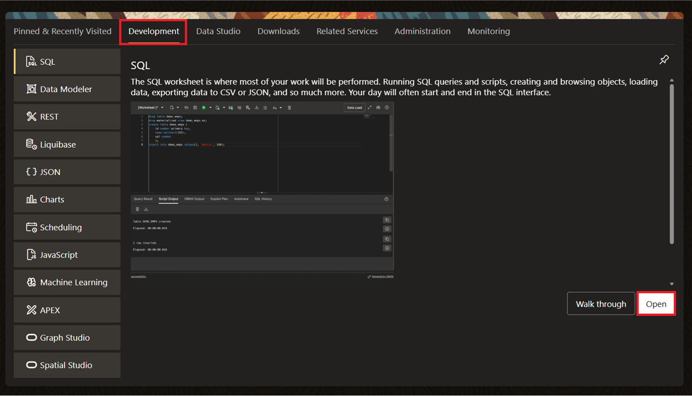
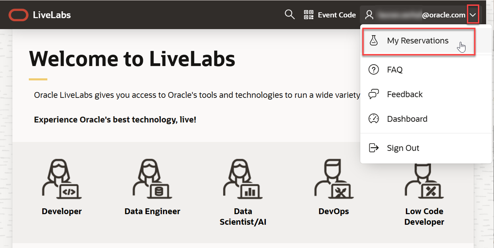
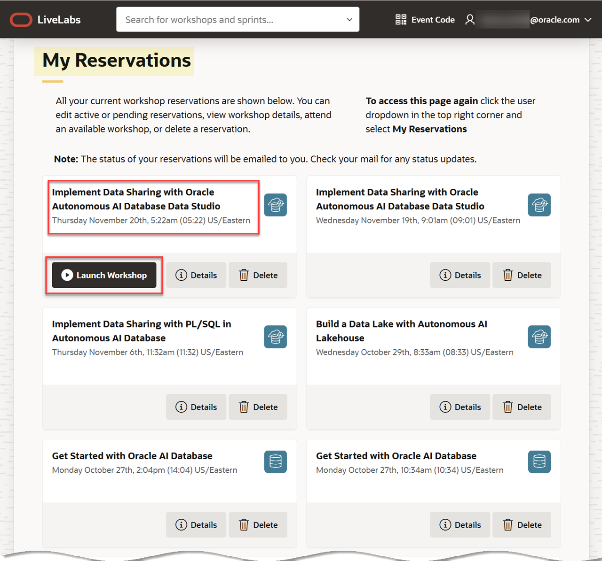

# Get started - Login to the LiveLabs Sandbox Environment

## Introduction

Welcome to LiveLabs.
You have successfully created a LiveLabs Sandbox environment!

In this lab, we will show you where you can find the login information and how to log in to your LiveLabs Sandbox.

Estimated Time: 5 minutes

### Objectives

- Login to your LiveLabs Sandbox
- Find your LiveLabs Sandbox reservations

## Task 1: View the Login Information and Log in to your LiveLabs Sandbox

1. Right above the workshop instructions you can find two pieces of information:

    a. **View Login Info:** Clink this link to find your assigned credentials, resources, and other information to access your LiveLabs Sandbox.

    b. **Time Remaining:** This shows the remaining time before your access to the LiveLabs Sandbox expires. 

    >**Note:** You may be able to extend the reservation time by clicking the **Extend Workshop Reservation** link.

    

2. Click **View Login Info** to see your detailed reservation information such as username, password and link to the SQL Worksheet login page.

    

3. Select **Open Link** to open the SQL Worksheet login page.

    

4. Enter the credentials from the **Reservation Information** menu, and click **Sign In**.

    

5. In the SQL Development page, select the **Development** tab, then click **Open**.

    

6. If you need to view your login information at any time, click the **View Login Info** link in **Run Workshop** browser tab. **Important:** Please be aware of the **Time Remaining** for your sandbox environment. Your environment will be deleted once the remaining time has expired.

## Task 2: Find your LiveLabs Sandbox Reservations

If you close your browser, and you want to launch your workshop again, use the following steps.

1. Go to [livelabs.oracle.com](https://livelabs.oracle.com), and then click **Sign In**.

    

2. Login using your Oracle account. Next, click the drop-down menu next to your account name, and then select **My Reservations**.

    

3. The **My Reservations** page is displayed. You can find here a complete history of all LiveLabs workshops that you had signed up for. Click **Launch Workshop** to start a workshop with an available (current) LiveLabs Sandbox environment.

    

You may now **proceed to the next lab**.

## Acknowledgements

* **Authors:**
    * LiveLabs Team
* **Last Updated By/Date:** Teodor C. Nechita / June 2026
