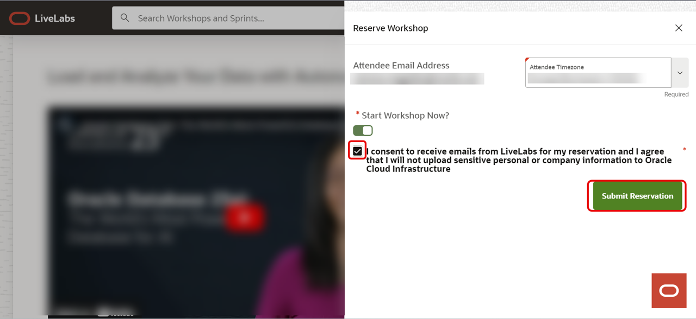
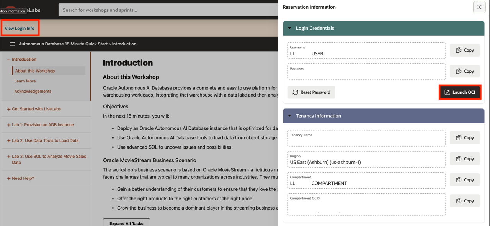
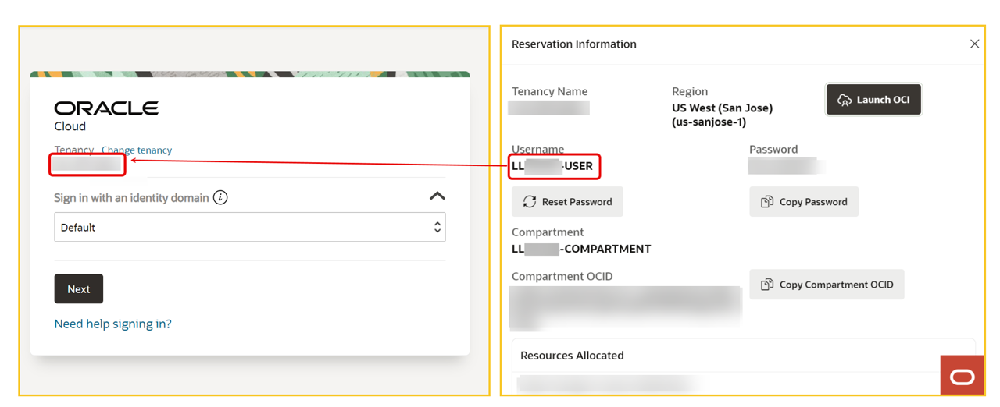
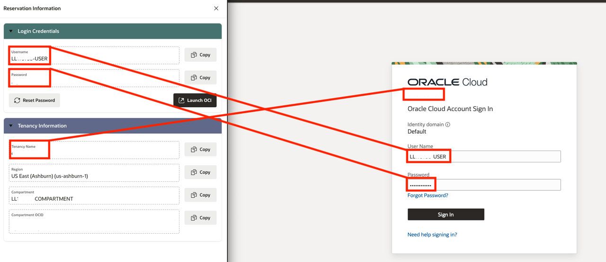
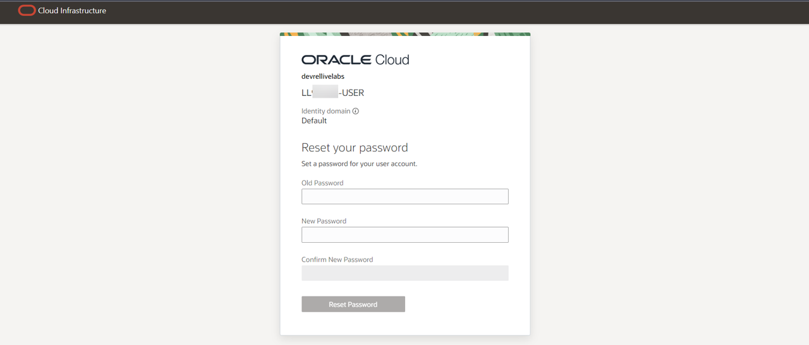

# Get started - LiveLabs login

## Introduction

Welcome to your LiveLabs Sandbox environment.
In order to start your workshop, you need to login to our LiveLabs Sandbox.

In this lab, we are going to show you where you can find the login information and how to log in to the LiveLabs Sandbox.

Estimated Time: 5 minutes

### Objectives

- View login information to LiveLabs Sandbox
- Login to LiveLabs Sandbox

## Task 1: View Login Information

1. Create a reservation for a LiveLab Workshop by clicking the **Start** button, then on the green button, **Run on the LiveLabs Sandbox**.

  

2. To confirm the reservation, you must consent to receive emails from LiveLabs. More than that, you can select the time when to start the workshop.

  

3. After creating a reservation for a LiveLab Workshop, you will receive an e-mail indicating that your reservation is being processed, followed by an e-mail indicating that your environment has been created.

  

  >**Note:** You will receive the second created e-mail just before your selected reservation time.

4. Log into LiveLabs. Click your username, and click **My Reservations**. Then click the **Launch Workshop** link for the Workshop environment you'd like to use. Note that you may have several Workshops listed.

  

5. Click **View Login Info** and click **Launch OCI**.
  

6. Follow the instructions provided to log in to your Oracle Cloud account, change your password, and complete your login to Oracle Cloud.

  a. Check the tenancy. If it is different, click on change tenancy.

  

  b. Add the user name and the password from the reservation information.

  

  c. Change the password then click on Reset Password.

  

7. If you need to view your login information anytime, click **View Login Info**.
  

You may now **proceed to the next lab**.

## Acknowledgements

- **Created By/Date** - Kay Malcolm, Database Product Management, March 2020
- **Contributors** - Rene Fontcha, Kamryn Vinson, Anoosha Pilli, Arabella Yao
- **Last Updated By/Date** - Ramona Magadan, Technical Product Manager, Database Product Management, July 2024