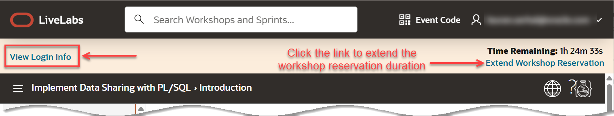

# Get started - Login to the LiveLabs Sandbox Environment

## Introduction

Welcome to LiveLabs.
You have successfully created a LiveLabs Sandbox environment!

In this lab, we will show you where you can find the login information and how to log in to your LiveLabs Sandbox.

Estimated Time: 5 minutes

### Objectives

- Login to your LiveLabs Sandbox
- Find your LiveLabs Sandbox reservations

## Task 1: View the Login Information and Log in to your LiveLabs Sandbox

1. Right above the workshop instructions you can find two information:

    a. **View Login Info:** Clink this link to find your assigned credentials, resources, and other information to access your LiveLabs Sandbox.

    b. **Time Remaining:** This shows the remaining time before your access to the LiveLabs Sandbox expires. 

    >**Note:** You may be able to extend the reservation time by clicking the **Extend Workshop Reservation** link.

      

2. Click **View Login Info** to see your detailed reservation information such as tenancy, username, password, assigned compartment and more. Click **Launch OCI**.

    

3. Follow the provided workshop instructions to log in to your Oracle Cloud account, change your password, and complete your login to Oracle Cloud.

    a. On the **Oracle Cloud** page, check the tenancy. If it is different than your assigned tenancy, click the **Change tenancy** link.

    

    b. On the **Oracle Cloud Account Sign In** page, enter your username and password from the **Reservation Information** page, and then click **Sign In**.

    

    c. On the **Reset your password** page, enter your old and new passwords, and then click **Reset Password**.

    

4. Congratulations! You are now connected to an Oracle Cloud Infrastructure tenancy. You can now execute the different tasks and steps for the selected LiveLabs workshop.

    

5. If you need to view your login information at any time, click the **View Login Info** link in **Run Workshop** browser tab. **Important:** Please be aware of the **Time Remaining** for your sandbox environment. Your environment will be deleted once the remaining time has expired.

    

## Task 2: Find your LiveLabs Sandbox Reservations

If you close your browser, and you want to launch your workshop again, use the following steps.

1. Go to [livelabs.oracle.com](https://livelabs.oracle.com), and then click **Sign In**.

    

2. Login using your Oracle account. Next, click the drop-down menu next to your account name, and then select **My Reservations**.

    

3. The **My Reservations** page is displayed. You can find here a complete history of all LiveLabs workshops that you had signed up for. Click **Launch Workshop** to start a workshop with an available (current) LiveLabs Sandbox environment.

    

You may now **proceed to the next lab**.

## Acknowledgements

* **Authors:**
    * Lauran K. Serhal, Consulting User Assistance Developer
    * Kay Malcolm, Database Product Management
* **Contributors** - Kevin Lazarz, Rene Fontcha, Kamryn Vinson
* **Last Updated By/Date:** Lauran K. Serhal, July 2025