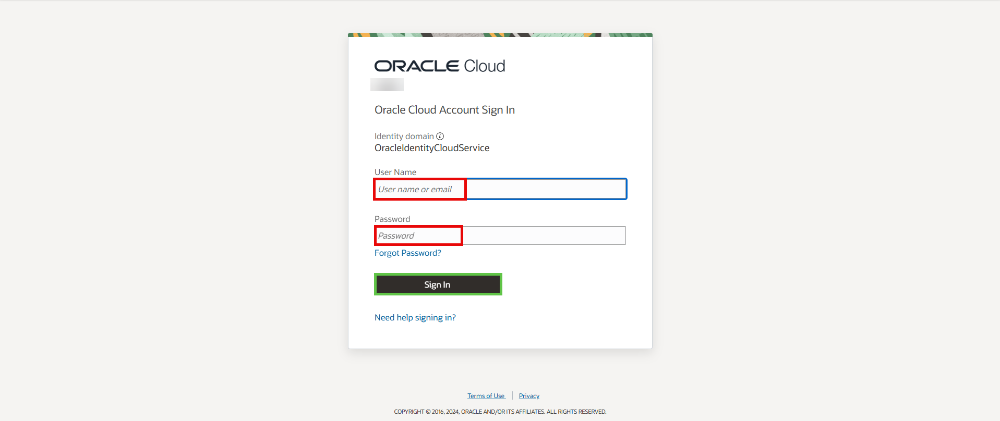

# Get started - register Free Tier account

## Introduction

Before you get started, you will need an Oracle Cloud account. This 5-minute lab walks you through the steps of getting an Oracle Cloud Free Tier account and signing in.

Watch this video to create your free trial account on Oracle cloud.
[Create Free Trial account on Oracle Cloud](youtube:nClCXAfqvzs)

Estimated Time: 5 minutes

### Existing Cloud Accounts

If you already have access to an Oracle Cloud account, including an Oracle Cloud account using [Oracle Universal Credits](https://docs.oracle.com/en/cloud/get-started/subscriptions-cloud/csgsg/universal-credits.html), skip to **STEP 2** to sign in to your cloud tenancy.

### Objectives

- Create an Oracle Cloud Free Tier account
- Sign in to your account

### Prerequisites

* A valid email address
* Ability to receive SMS text verification (only if your email isn't recognized)

## Task 1: Create Your Free Trial Account

If you already have a cloud account, skip to **STEP 2**.

1. Open up a web browser to access the Oracle Cloud account registration form at [oracle.com/cloud/free](https://signup.cloud.oracle.com).

2.  You will be presented with a registration page.
    

3.  Enter the following information to create your Oracle Cloud Free Tier account.
    * Choose your **Country**
    * Enter your **Name** and **Email**.

4. Once you have entered a valid email address, select the **Verify my email** button. You will see the **Special Oracle Offer** dialog box, click on **Select Offer**.

    

5. Enter the following information to create your Oracle Cloud Free Tier account.
       * Choose a **Password**
       * Enter your **Company Name**
       * Your **Cloud Account Name** will generate automatically based on your inputs, you can change that name by entering a new value. Remember what you wrote. You'll need this name later to sign in.
       * Choose a **Home Region**.  Your Home Region cannot be changed once you sign-up. Note: Based on the current design of the workshop and resource availability, it is recommended not to use the London region for this workshop at this time.
       * Click **Continue**

    

6.  Enter your Address information.  Click **Continue**.

    

7.  Choose your country and enter a mobile number.

    

8. Review and accept the agreement by clicking the check box. Click the **Start my free trial** button.

    

9. Your account is provisioning and should be available in a few seconds! When it's ready, you're automatically taken to a sign-in page. You'll also receive two emails from Oracle. One email will be the initial notification that provisioning is underway. The other email will be notification that provisioning is complete. Here is a copy of the final notification:

    

## Task 2: Sign in to Your Account

If you've signed out of the Oracle Cloud, use these steps to sign back in.

1. Go to [cloud.oracle.com](https://cloud.oracle.com) and Enter your Cloud Account Name and click **Next**. This is the name you chose while creating your account in the previous section. It's NOT your email address. If you've forgotten the name, see the confirmation email.

    

2. Expand the arrow after *Oracle Cloud Infrastructure Direct Sign-In* to reveal the login input fields.

    

3. Enter your Cloud Account credentials and click **Sign In**. Your username is your email address. The password is what you chose when you signed up for an account.

    

4. You are now signed in to Oracle Cloud!

    

You may now **proceed to the next lab**.

## **Acknowledgements**

- **Created By/Date** - Anoosha Pilli, Product Manager, February 2021
- **Contributors** - Madhusudhan Rao, Arabella Yao
- **Last Updated By** - Arabella Yao, Database Product Management, May 2022