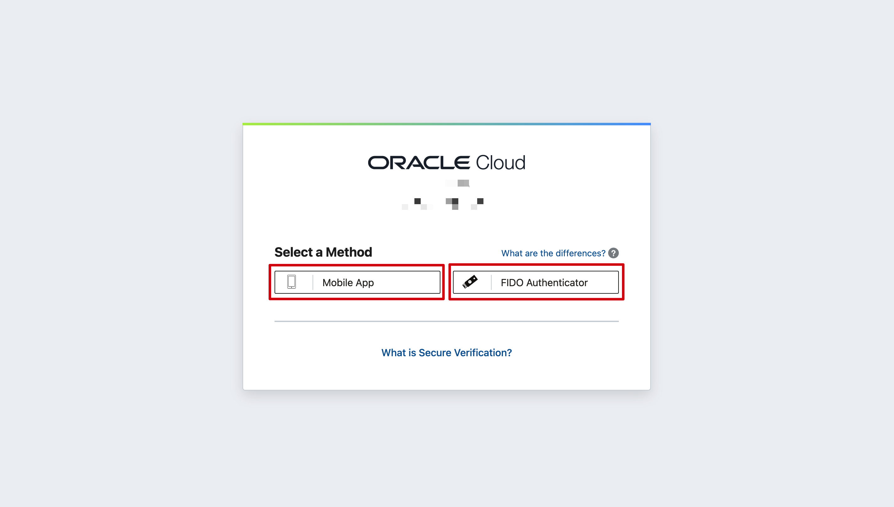

# Get started - register Free Tier account

## Introduction

Before you get started, you will need an Oracle Cloud account. This 5-minute lab walks you through the steps of getting an Oracle Cloud Free Tier account and signing in.

<!--
Watch this video to create your free trial account on Oracle cloud.
[Create Free Trial account on Oracle Cloud](youtube:nClCXAfqvzs)
-->

Estimated Time: 5 minutes

### Existing Cloud Accounts

If you already have access to an Oracle Cloud account, skip to **Task 2** to sign in to your cloud tenancy.

### Objectives

- Create an Oracle Cloud Free Tier account
- Sign in to your account

### Prerequisites

* A valid email address
* Ability to receive SMS text verification (only if your email isn't recognized)

## Task 1: Create Your Free Trial Account

If you already have a cloud account, skip to **Task 2**.

1. Open up a web browser to access the Oracle Cloud account registration form at [oracle.com/cloud/free](https://signup.cloud.oracle.com).

2.  You will be presented with a registration page.
    

3.  Enter the following information to create your Oracle Cloud Free Tier account.
    * Choose your **Country**
    * Enter your **Name** and **Email**.
    * Use hCaptcha to verify your identity

4. Once you have entered a valid email address, select the **Verify my email** button. You will see the **Special Oracle Offer** dialog box, click on **Select Offer**.

5. Enter the following information to create your Oracle Cloud Free Tier account.
       * Choose a **Password**
       * Enter your **Company Name**
       * Your **Cloud Account Name** will generate automatically based on your inputs, you can change that name by entering a new value. Remember what you wrote. You'll need this name later to sign in.
       * Choose a **Home Region**.  Your Home Region cannot be changed once you sign-up.
       >**Note:** Based on the current design of the workshop and resource availability, it is recommended not to use the London region for this workshop at this time.

       * Click **Continue**

    

6.  Enter your address information. Choose your country and enter a phone number. Click **Continue**.

    

7. Review and accept the agreement by clicking the check box. Click the **Start my free trial** button.

    

8. Your account is provisioning and should be available in a few seconds! When it's ready, you're automatically taken to a sign-in page. You'll receive an email from Oracle, notifying you that provisioning is complete, with your cloud account name and username.

## Task 2: Sign in to Your Account

If you've signed out of the Oracle Cloud, use these steps to sign back in.

1. Go to [cloud.oracle.com](https://cloud.oracle.com) and Enter your Cloud Account Name and click **Next**. This is the name you chose while creating your account in the previous section. It's NOT your email address. If you've forgotten the name, see the confirmation email.

    

2. Click **Continue** to reveal the login input fields.

    

3. Enter your Cloud Account credentials and click **Sign In**. Your username is your email address. The password is what you chose when you signed up for an account.

    

4. You will be prompted to enable secure verification. Click **Enable Secure Verification**. For more details, refer the [Managing Multifactor Authentication documentation](https://docs.oracle.com/en-us/iaas/Content/Identity/Tasks/usingmfa.htm)

    

5. Select a method - **Mobile App** or **FIDO Authenticator** to enable secure verification.

    

6. If you have chosen:
    - **Mobile App** - Follow the steps as shown in the screenshot to setup authentication.

        

    -  **FIDO Authenticator** - Click **Setup** and follow the steps to setup authentication.

        

7. Once you have verified authentication, you will now be signed in to Oracle Cloud!

    

You may now **proceed to the next lab**.

## **Acknowledgements**

- **Created By/Date** - Anoosha Pilli, Product Manager, February 2021
- **Contributors** - Madhusudhan Rao, Arabella Yao
- **Last Updated By** - Anoosha Pilli, October 2023