# Get started - Cloud login

## Introduction

Oracle Cloud is the industry's broadest and most integrated cloud provider, with deployment options ranging from the public cloud to your data center. Oracle Cloud offers best-in-class services across Software as a Service (SaaS), Platform as a Service (PaaS), and Infrastructure as a Service (IaaS).

Estimated Time: 5 minutes

### Types of Cloud Accounts

We offer two types of Cloud Accounts:

*Free Tier Accounts*:  After you sign up for the free [Oracle Cloud promotion](https://signup.cloud.oracle.com) or sign up for a paid account, you’ll get a welcome email. The email provides you with your cloud account details and sign in credentials.

*Oracle Cloud Paid Accounts*:  When your tenancy is provisioned, Oracle sends an email to the default administrator at your company with the sign-in credentials and URL. This administrator can then create a user for each person who needs access to the Oracle Cloud. Check your email or contact your administrator for your credentials and account name.

The cloud accounts for the workshop may be provided either by LiveLab or directly by the event organizer:

*Sandbox Cloud Accounts - From LiveLab* : Sandbox accounts are temporary environments used in workshops, training, or Oracle LiveLabs. These accounts allow you to safely explore Oracle Cloud features in a pre-configured environment without affecting production workloads. Login details are usually provided directly by the LiveLab platform.

*Cloud Accounts - Created By Event Organizer*: Sometimes a single Oracle Cloud tenancy is provisioned for an event, and multiple user accounts or identity domains are created under it. Event organizers or instructors share the login credentials with participants. Access, roles, and services are centrally managed but isolated per user to ensure a smooth hands-on experience.

### Objectives

- Learn how to log in to your Oracle Cloud Account

### Prerequisites
- Cloud Account Name - This is the name of your tenancy (supplied by the administrator or in your Oracle Cloud welcome email)
- Username
- Password

## Task 1: First Login to Cloud

When you receive your cloud account email invitation, follow these steps to complete your first login:

1. **Activate Your Account**  
   Open your email and click the **Activate Your Account** button.  
   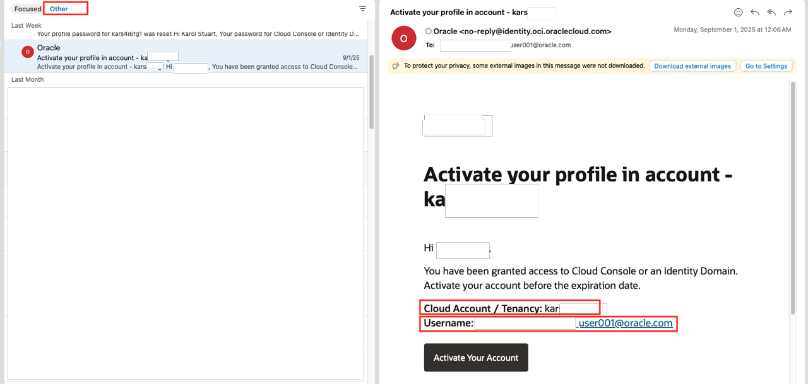

2. **Reset Your Password**  
   Create a strong password that meets the security requirements.  
   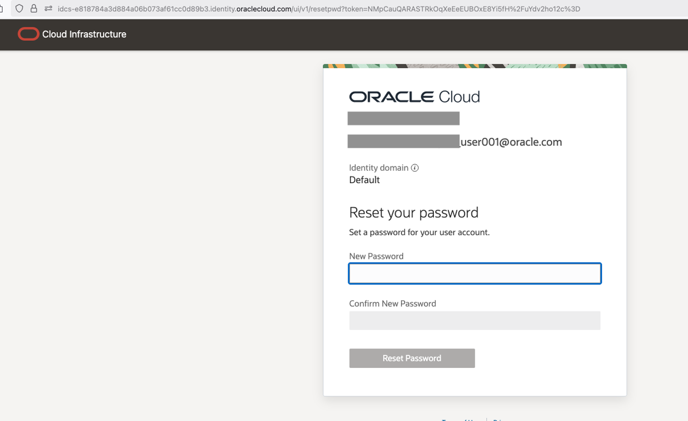

3. **Set Up Secure Verification** *(Mandatory)*  
   To protect your account, you must enable secure verification.  
   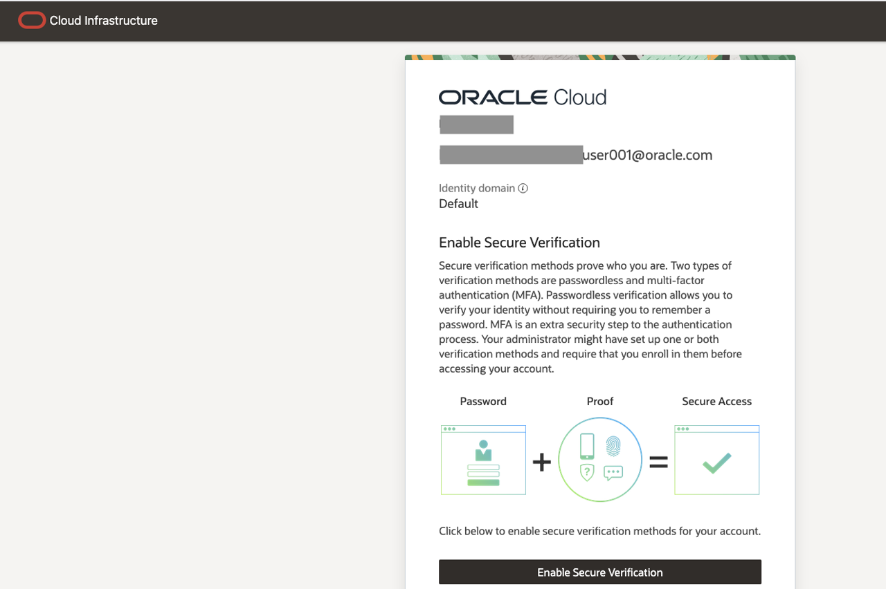

4. **Download and Configure the Oracle Mobile Authenticator App**  
   A QR code will be displayed on your screen. Use your phone’s camera or the authenticator setup option to scan this QR code.

   *Note: If you don’t already have the app installed, download the **Oracle Mobile Authenticator App** from your device’s App Store or Google Play.*  

   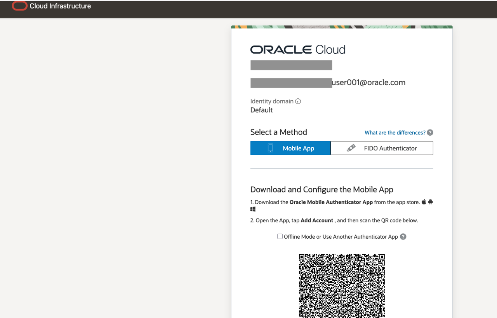  
   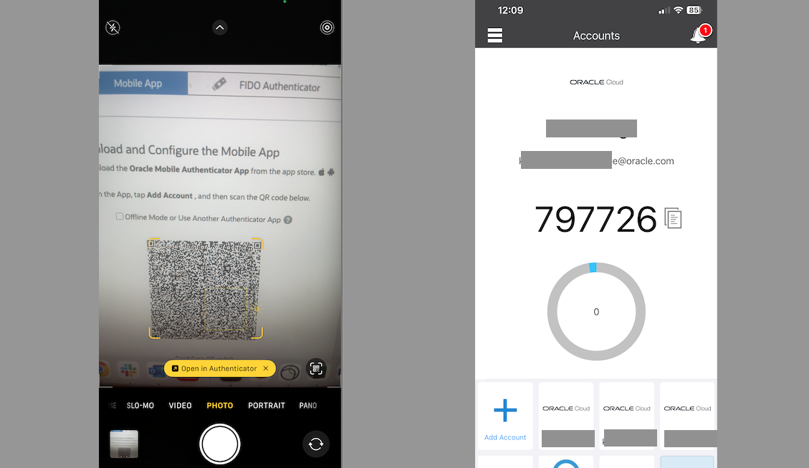

5. **Complete Enrollment**  
   Once enrolled, your setup is complete. You can now use the Oracle Mobile Authenticator App for secure verification each time you log in.  
   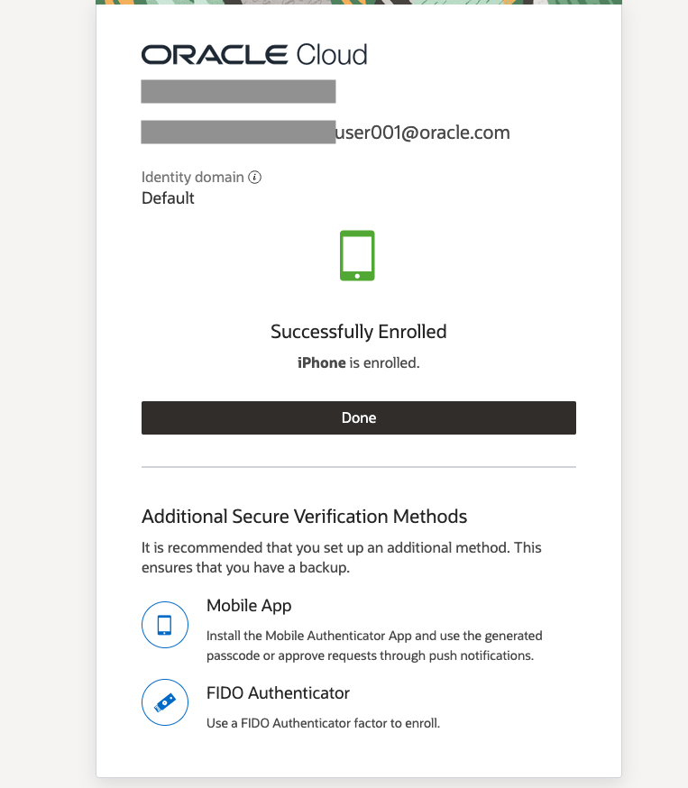

## Task 2:  Regular Log in to Oracle Cloud
If you've signed out of the Oracle Cloud, use these steps to sign back in.

1. Go to [cloud.oracle.com](https://cloud.oracle.com) and enter your **Cloud Account Name** (tenancy name), and then click **Next**. This is the name you chose while creating your account in the previous section. _It's NOT your email address_. If you've forgotten the name, review the confirmation email.

    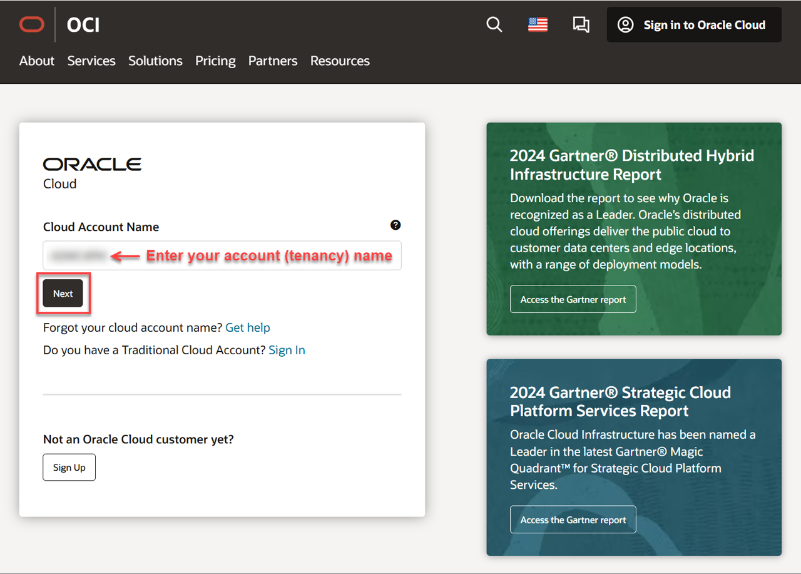

2. Click the **Sign in with an identity domain** drop-down list and select an **Identity Domain** such as **Default**, and then click **Next**.

    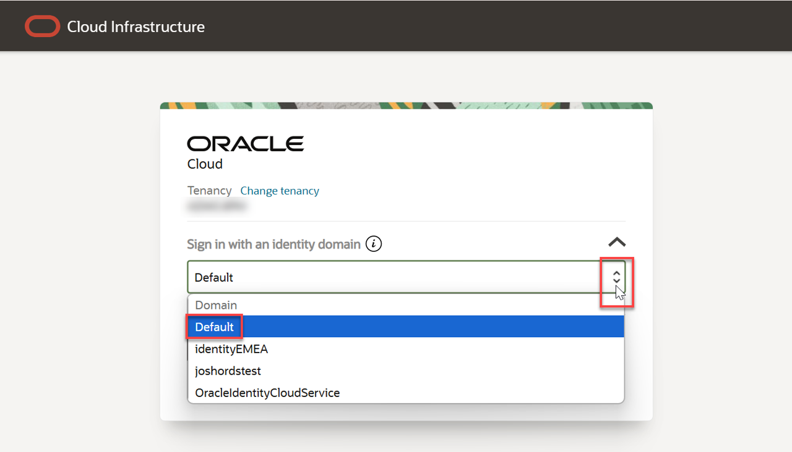

    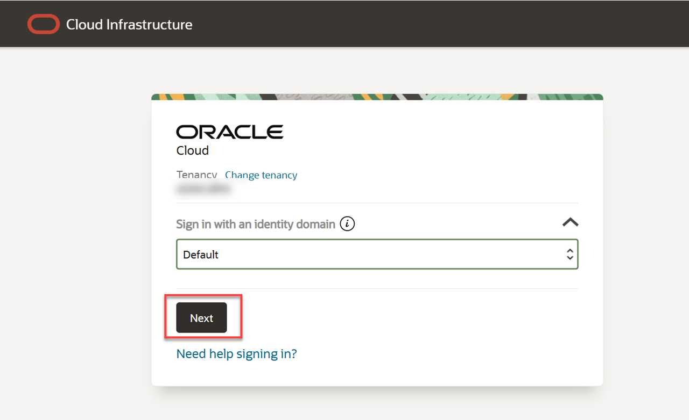

3. On the **Oracle Cloud Account Sign In** page, enter your Cloud Account credentials, and then click **Sign In**. Your username is your email address. The password is what you chose when you signed up for an account.

    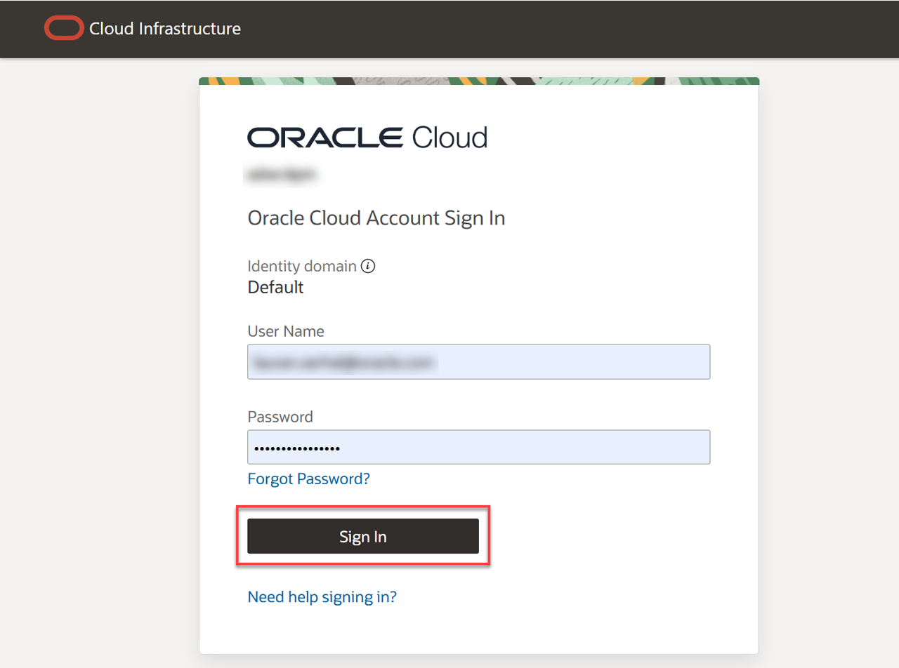

4. Based on the Multi-factor authentication setup for your account, provide authentication to sign into the account. For example, click **Allow** on the app (or enter your **authentication code** and click **Verify**) based on the authentication setup. For more details, refer the [Managing Multifactor Authentication documentation](https://docs.oracle.com/en-us/iaas/Content/Identity/Tasks/usingmfa.htm)

    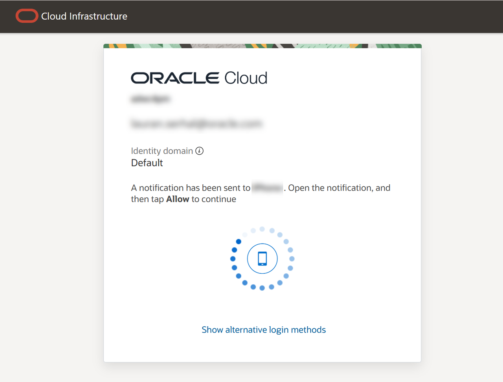

5. The **Oracle Cloud Console** home page is displayed.

    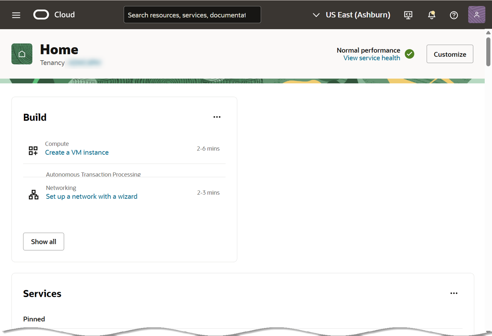

You may now **proceed to the next lab**.

## Acknowledgements
- **Created By/Date** -  Karol Stuart, Oracle Cloud Infrastructure, September 2025
- **Contributors** - None
- **Last Updated By** - Karol Stuart, September 2025
