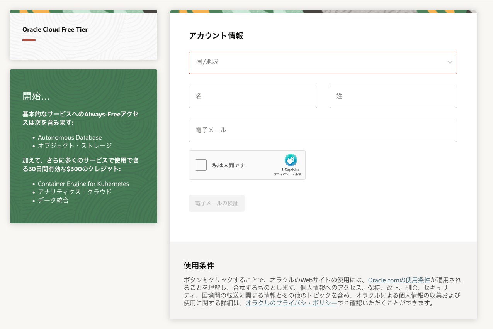
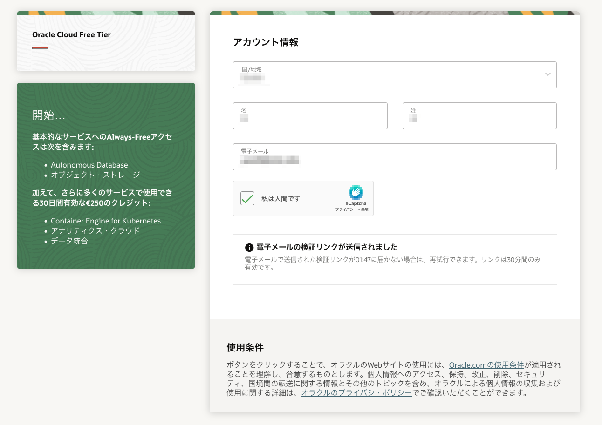

# 前提条件

## はじめに

始める前に、Oracle Cloudアカウントが必要です。この5分間のラボでは、Oracle Cloud Free Tierアカウントの取得とサインインの手順を説明します。

### 既存のクラウドアカウント

 [Oracle Universal Credits](https://docs.oracle.com/en/cloud/get-started/subscriptions-cloud/csgsg/universal-credits.html)を使用したOracle Cloudアカウントなど、すでにOracle Cloudアカウントをお持ちの場合は、**ステップ2**に進んで、お持ちのクラウド・テナントにサインインしてください。

### 必要なもの

* 有効なメールアドレス
* SMSテキスト認証を受信する機能（メールが登録されていない場合のみ）

## Task 1: Free Trialアカウントの作成

すでにクラウドアカウントをお持ちの方は、**STEP2**へお進みください。

1. Webブラウザを開いて、 [oracle.com/cloud/free](https://signup.cloud.oracle.com)のOracle Cloudアカウント登録フォームにアクセスします。
2.  登録ページが表示されます.
       
3.  次の情報を入力して、Oracle Cloud Free Tierアカウントを作成します。
    *  **国**
    * **氏名**と**メールアドレス**

4. 有効なメールアドレスを入力したら、 **電子メールの検証** ボタンを選択します。ボタンを選択すると以下のような画面が表示されます。
    ボタンを選択すると以下のような画面が表示されます:
       

5. 電子メールを確認します。受信トレイにオラクルからのアカウント検証メールが表示されます。メールは以下のような内容になります:
       

6. （可能であれば）リンクを選択するか、リンクをコピーしてブラウザに貼り付けます。

7. 以下の情報を入力してOracle Cloud Free Tierアカウントを作成します
       * **パスワード**
       *  **会社名**
       *  **クラウド・アカウント名** 入力に基づいて自動的に生成されますが、新しい値を入力することで変更できます。入力した内容を覚えておいてください。この名前は後でサインインする際に必要になります。
       * **ホーム・リージョン**  ホーム・リージョンはサインアップ後に変更することはできません。
       * **続行**をクリック
       

8. 住所情報を入力します。**続行**をクリックしてください。
          

9.  国を選択し、確認のために携帯電話番号を入力します。**Text me a code**ボタンをクリックします。

       

10. コードを受け取ったら、コードを入力して **コードの確認**をクリックします。
       

11. **支払い検証方法の追加**ボタンをクリックします。
       

12.  確認方法を選択します。この場合は **Credit Card**ボタンをクリックします。お客様の情報とお支払い内容を入力します。*注：これは無料のクレジットプロモーションアカウントです。アカウントのアップグレードを選択しない限り、課金されることはありません。*
       

13. お支払いの確認が完了したら チェックボックスをクリックして、「同意」の内容を確認し、同意します。**無料トライアルの開始**ボタンをクリックします。
       

14. あなたのアカウントはプロビジョニング中となり、数秒で利用可能になります。準備ができたら、自動的にサインイン・ページに移動します。また、オラクルから2通のメールが届きます。1つは、プロビジョニングが進行中であることを最初に通知するメールです。もう1通は、プロビジョニングが完了したことを通知するメールです。こちらが最終通知のコピーです:
       

## Task 2: アカウントへのサインイン

Oracle Cloudからサインアウトした場合は、以下の手順を使用してサインインし直してください。

1. [cloud.oracle.com](https://cloud.oracle.com)にアクセスして、クラウド・アカウント名を入力し、**Next** をクリックします。これは、前のセクションでアカウントを作成する際に選択した名前です。メールアドレスではありません。名前を忘れてしまった場合は、確認メールを参照してください。

    

2. *"Oracle Cloud Infrastructure Direct Sign-In"* の後の矢印を展開すると、ログイン入力フィールドが表示されます。

    

3. クラウド アカウントの資格情報を入力し、**Sign In** をクリックします。ユーザー名はメールアドレスです。パスワードは、アカウントにサインアップしたときに選択したものです。

    

4. これでOracle Cloudにサインインしました！

    

**次のラボ**に進んでください。

## Acknowledgements

- **作成者・日時** - Kay Malcolm, Database Product Management, March 2020
- **投稿者** - John Peach, Kamryn Vinson, Rene Fontcha, Arabella Yao
- **最終更新日** - Arabella Yao, May 2022