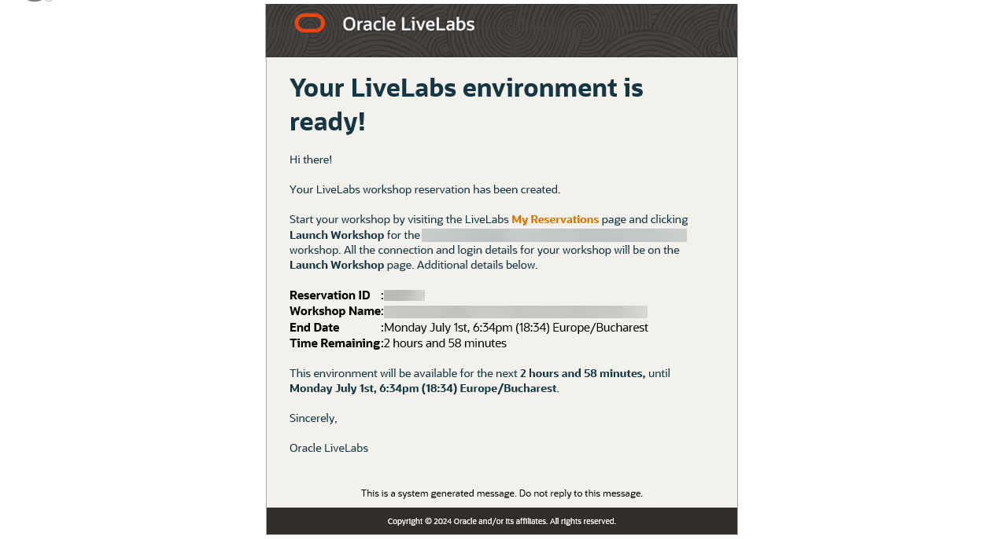

# Getting Started - LiveLabs Login

## Introduction

To get started, you need to have an active Oracle Cloud account and a LiveLabs reservation. An Oracle Cloud account is free and needed to gain access to your LiveLabs reservation, Oracle Support, and other Oracle publicly-accessible content.

If you already have an Oracle Cloud account, you can skip to Step 2.

If you already have a reservation, skip to the next lab to start your workshop!

## Task 1: **Create an Oracle Account**

Creating an Oracle account can be summarized in the following two simple steps.

1. Navigate to [oracle.com](http://www.oracle.com), Click on *View Account*, and Select *Create an Account*

  

2. Fill out the form and click *Create Account*

  

## Task 2: **Request Workshop Reservation**

1. Using your *Oracle Account Login* go to [LiveLabs 2.0](http://bit.ly/golivelabs) and click   to request a reservation for this workshop.

2. After creating a reservation for a LiveLab Workshop, you will receive an e-mail indicating that your reservation is being processed, followed by an e-mail indicating that your environment has been created.

  

  *Note: You will receive the second created e-mail just before your selected reservation time.*

3. Log into LiveLabs and click **My Reservations**, then click the **Launch Workshop** link for the Workshop environment you'd like to use. Note that you may have several Workshops listed.

  

4. Follow the instructions provided to log in to your Oracle Cloud account, change your password, and complete your login to Oracle Cloud.

  

5. Finally, open the lab instructions by choosing one of the two options.

  

You may now proceed to the next lab.

## **Rate this Workshop**

When you are finished don't forget to rate this workshop!  We rely on this feedback to help us improve and refine our LiveLabs catalog.  Follow the steps to submit your rating. 

1.  Go back to your **workshop homepage** in LiveLabs by searching for your workshop and clicking the Launch button.

2.  Click on the **Brown Button** to re-access the workshop  

    

3.  Click **Rate this workshop**

    

If you still have an active reservation, you can also rate by going to My Reservations -> Launch Workshop.

## Acknowledgements

- **Created By/Date** - Kay Malcolm, Database Product Management, March 2020
- **Contributors** - Rene Fontcha, Kamryn Vinson, Anoosha Pilli
- **Last Updated By/Date** - Anoosha Pilli, April 2021

