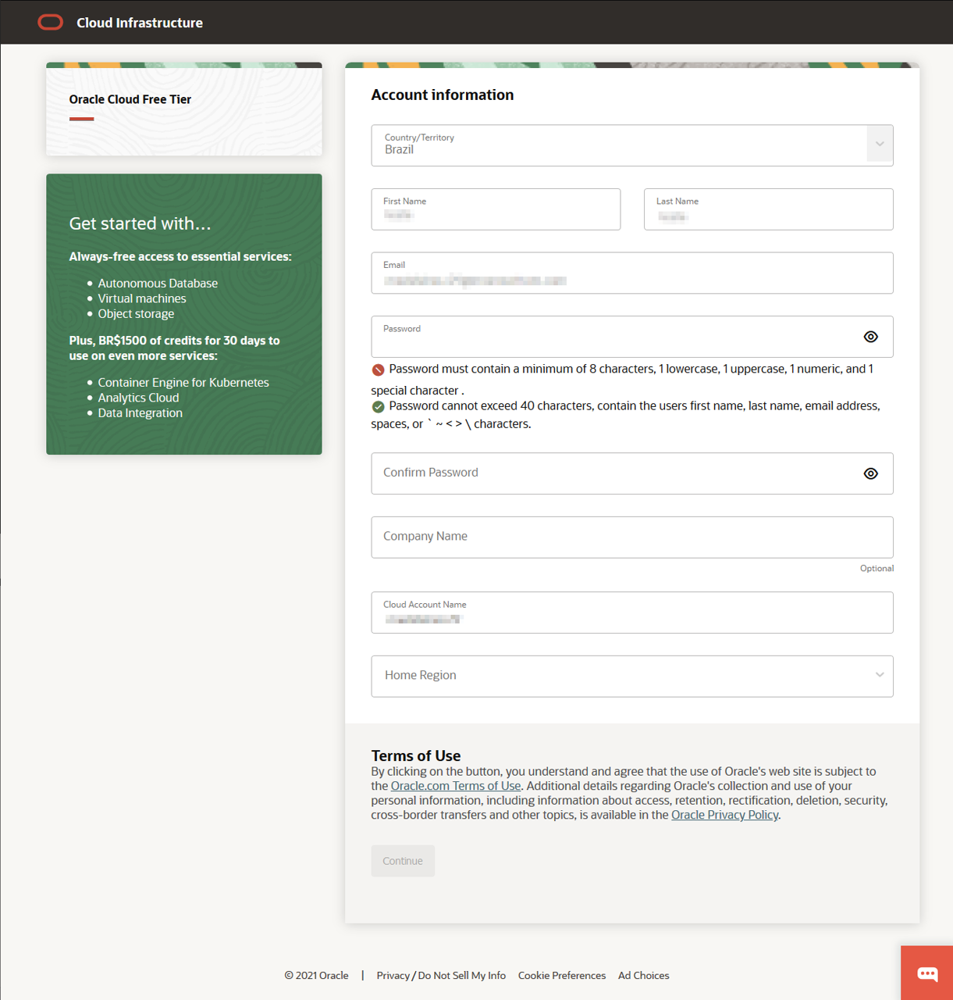
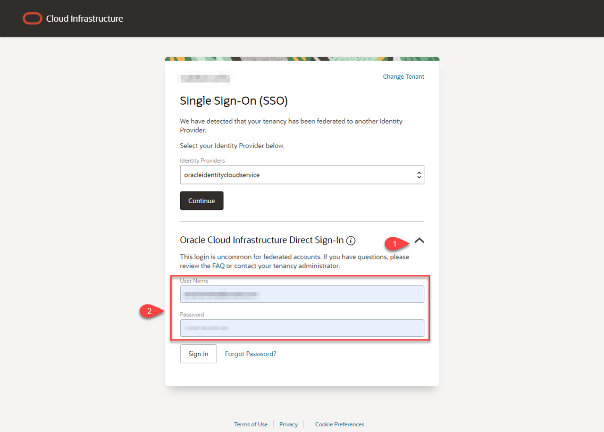

# Vamos Começar

## Introdução

Antes de tudo, você irá precisar de uma conta na Oracle Cloud. Este lab de cinco minutos te guiará nos passos para que possa obter uma conta no Modo Gratuito da Oracle Cloud e como ingressar nela.

Assista a este vídeo para criar sua conta de Avaliação Gratuita de 30 dias na Oracle Cloud.

### Contas Cloud Existentes

Se você já possui acesso a uma conta da Oracle Cloud, incluindo uma conta da Oracle Cloud que usa [Oracle Universal Credits](https://docs.oracle.com/en/cloud/get-started/subscriptions-cloud/csgsg/universal-credits.html), avance para o **PASSO 2** para entrar na sua Cloud Tenancy.

### Duas Ofertas de Cloud em Uma

Oracle Cloud Modo Gratuito permite que você se inscreva em uma conta da Oracle Cloud a qual provê um número de serviços de Uso Livre e uma Avaliação Gratuita com US$300 em crédito grátis para uso em todos os serviços elegíveis da Oracle Cloud por até 30 dias. Os serviços de Uso Livre estão disponíveis por tempo ilimitado. Os serviços de Avaliação Gratuita podem ser usados até que seus US$300 em créditos gratuitos sejam consumidos ou os 30 dias expirem, o que ocorrer primeiro.

### O que você vai precisar

* Um endereço de email válido
* Possibilidade de receber um texto de verificação por SMS (apenas se seu email não for reconhecido)

## **PASSO 1**: Crie Sua Conta de Avaliação Gratuita

Caso você já tem uma conta Cloud, avance para o **PASSO 2**.

1. Abra um navegador web para acessar o formulário de registro da Oracle cloud em [oracle.com/cloud/free](https://myservices.us.oraclecloud.com/mycloud/signup?language=pt_BR).

2.  A página de registro será exibida para você.
    

3.  Digite as seguintes informações para criar a sua conta no Modo Gratuito da Oracle Cloud.
    * Escolha seu **País**
    * Digite seu **Nome** e **Email**.

4. Após você ter digitado um endereço de email válido, selecione o botão **Verificar meu email**. Você irá ver uma caixa de diálogo escrito **Special Oracle Offer** nela; clique em **Select Offer**.

    

5. Insira as informações abaixo para criar sua conta no Modo Gratuito da Oracle Cloud.
       * Escolha sua **Password**
       * Insira sua **Company Name**
       * O **Cloud Account Name** será gerado automaticamente baseado nos dados que foram inseridos, mas você pode alterá-lo. Lembre-se de sua escolha; você irá precisar saber disso para ingressar na conta futuramente.
       * Escolha a **Home Region**. A sua Home Region não pode ser alterada depois do cadastro. Nota: de acordo com o atual desenho do workshop e disponibilidades de recurso, é recomendado que não utilize a região London neste momento.
       * Clique em **Continue**

    

6.  Digite seu endereço. Clique em **Continue**.

    

7.  Escolha seu país e digite o número do celular.

    

8. Revise e aceite o termo clicando na caixa de seleção. Clique no botão **Start my free trial**.

    

9. Sua conta está provisionando e estará disponível em alguns segundos! Assim que finalizado, você será levado automaticamente para a página de sign-in. Você também receberá dois emails da Oracle. Um notificando do provisionamento da conta. O outro notificando a finalização do processo. Aqui está uma cópia da notificação final:

    

## **PASSO 2**: Acesse Sua Conta

Se você se desconectou da Oracle Cloud, siga os passos abaixo para conectar-se de volta.

1. Acesse [cloud.oracle.com](https://cloud.oracle.com) e digite sua Cloud Account Name e clique em **Next**. Este é o nome que você escolheu na criação da sua conta anteriormente. Este NÃO é o seu endereço de email. Se você se esqueceu desse nome, veja o email de confirmação.

    

2. Clique na seta abaixo de *"Oracle Cloud Infrastructure Direct Sign-In"* para expandir e revelar os campos.

    

3. Digite suas credenciais da Conta Cloud e clique em **Sign In**. Seu usuário é o seu endereço de email. A senha é a que escolheu na criação da conta.

    

4. Agora você está conectado na Oracle Cloud!

    

Agora você pode [prosseguir para o próximo lab](#next).

## **Avalie este Workshop**

Assim que finalizar, não se esqueça de avaliar este workshop!  Nós dependemos do seu feedback para nos ajudar a fazer melhorias e refinamento do catálogo de LiveLabs.  Siga os passos abaixo para enviar sua nota.

1.  Volte para a **workshop homepage** no LiveLabs pelo seu workshop e clique no botão Launch.

2.  Clique no **Brown Button** para acessar novamente o workshop

    

3.  Clique em **Rate this workshop**

    

## **Agradecimentos**

- **Created By/Date** - Anoosha Pilli, Product Manager, February 2021
- **pt_BR Translated by** - André Ambrósio, April 2021
- **Last Updated By** - André Ambrósio, May 2021

