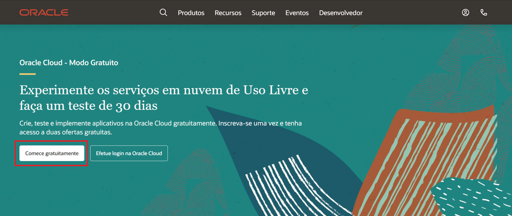
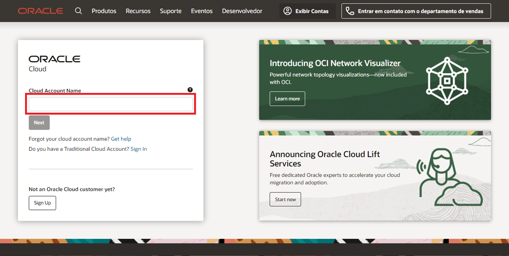
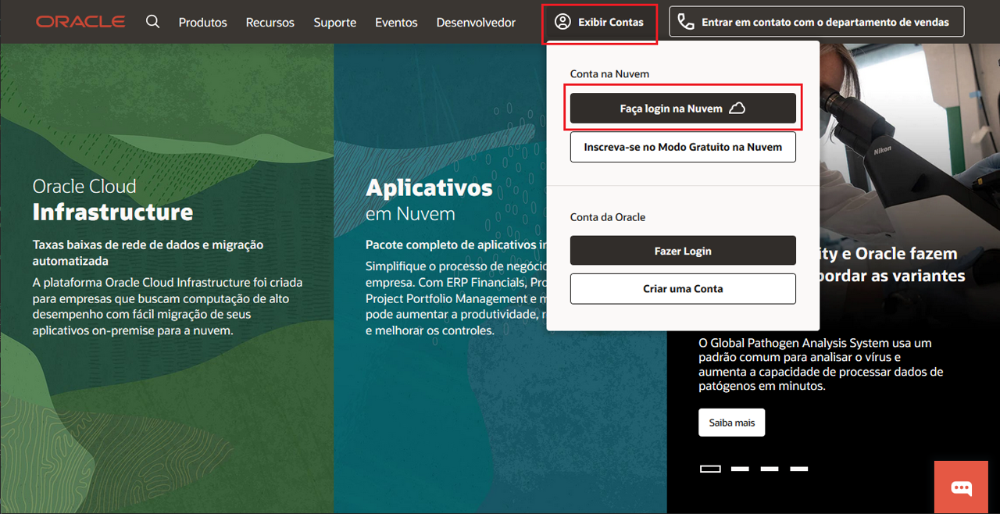
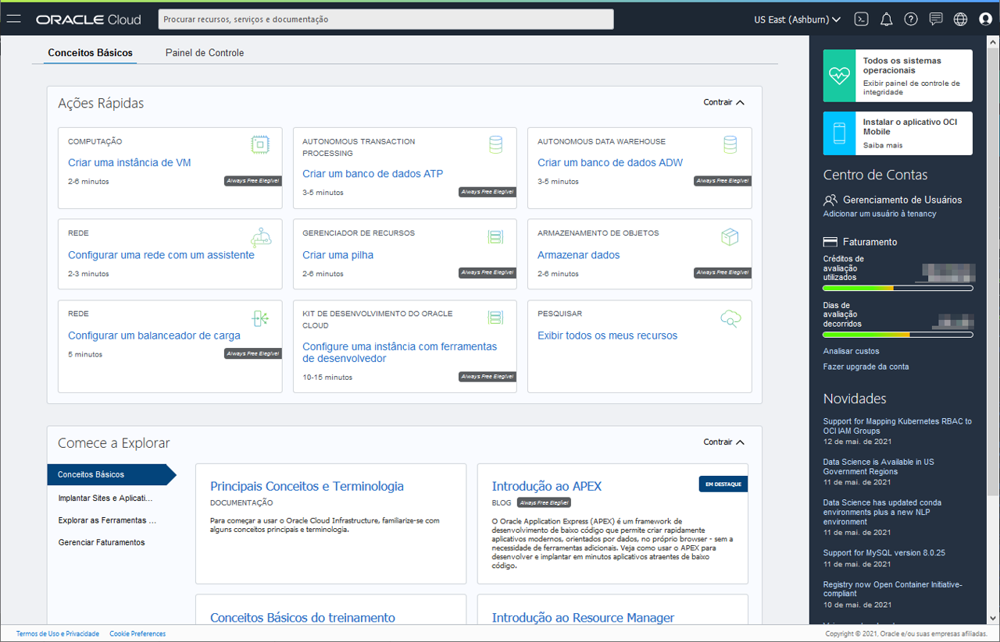

# Cadastre-se para uma Avaliação Gratuita

## Introdução

Este lab de cinco minutos te guiará nos passos para que possa obter uma conta no Modo Gratuito da Oracle Cloud e como ingressar nela.

### Duas Ofertas de Cloud em Uma

Oracle Cloud Modo Gratuito permite que você se inscreva em uma conta da Oracle Cloud a qual provê um número de serviços de Uso Livre e uma Avaliação Gratuita com US$300 em crédito grátis para uso em todos os serviços elegíveis da Oracle Cloud por até 30 dias. Os serviços de Uso Livre estão disponíveis por tempo ilimitado. Os serviços de Avaliação Gratuita podem ser usados até que seus US$300 em créditos gratuitos sejam consumidos ou os 30 dias expirem, o que ocorrer primeiro.

### Pré-requisitos

* Um endereço de email válido
* Possibilidade de receber um texto de verificação por SMS (apenas se seu email não for reconhecido)
* Cartão de crédito (você não será cobrado a não ser que escolha fazer upgrade da conta depois.)

## **Passo 1:** Crie Sua Conta de Teste Gratuito

In this section, you will fill out the registration form at [oracle.com/cloud/free](https://myservices.us.oraclecloud.com/mycloud/signup?language=en).

1.  Click on the "Start for free" button and enter the appropriate information to create your account.
    * Enter the same **email address** you used to register for Oracle Open World / Oracle Code One. A popup should appear recognizing your email. If not, the registration form will ask for additional information later.
    * Select your **country/territory**.
    * Click **Next**.

    

2.  Enter a few details for your new Oracle Cloud account.
    * You can choose almost anything for your Cloud Account Name. Remember what you wrote. You'll need this name later to sign in.
    * Click **Enter Password**.

3.  If your email wasn't recognized or you're using a different email address, you will need to provide additional information.
    * Provide a mobile number and click **Next: Verify Mobile Number**. In a few seconds, you should receive a verification code through SMS-text. Enter this code in the appropriate field and click **Verify**.
    * Click **Add Credit Card Details**. You will NOT be charged unless you elect to upgrade the account later. Enter the billing information, card details, and click **Finish**.

4. Validate your address.

5. Enter a password. Remember this password so you can sign in to the Cloud later.

6. Click **Review Terms and Conditions**. Read and agree to the Terms & Conditions by checking the box and click **Complete Sign-Up**.

7. Your account is provisioning and should be available in a few seconds! When it's ready, you're automatically taken to a sign in page. You'll also receive a confirmation email containing sign in information.

## Task 2: Sign in to Your Account

If you've signed out of the Oracle Cloud, use these steps to sign back in.

1. Go to [cloud.oracle.com](https://cloud.oracle.com).

    

2. Click **View Accounts** to bring up a menu.  Click **Sign in to Cloud**.

    

4. Enter your Cloud Account Name and click **Next**. This is the name you chose while creating your account in the previous section. It's NOT your email address. If you've forgotten the name, see the confirmation email.

    

5. Enter your Cloud Account credentials and click **Sign In**. Your username is your email address. The password is what you chose when you signed up for an account.

    

6. You are now signed in to Oracle Cloud!

  

You may now proceed to the next lab.

## Agradecimentos

- **Created By/Date** - Kay Malcolm, Database Product Management, March 2020
- **Contributors** - LiveLabs Team, John Peach
- **pt_BR Translated by** - André Ambrósio, April 2021
- **Last Updated By** - André Ambrósio, May 2021
