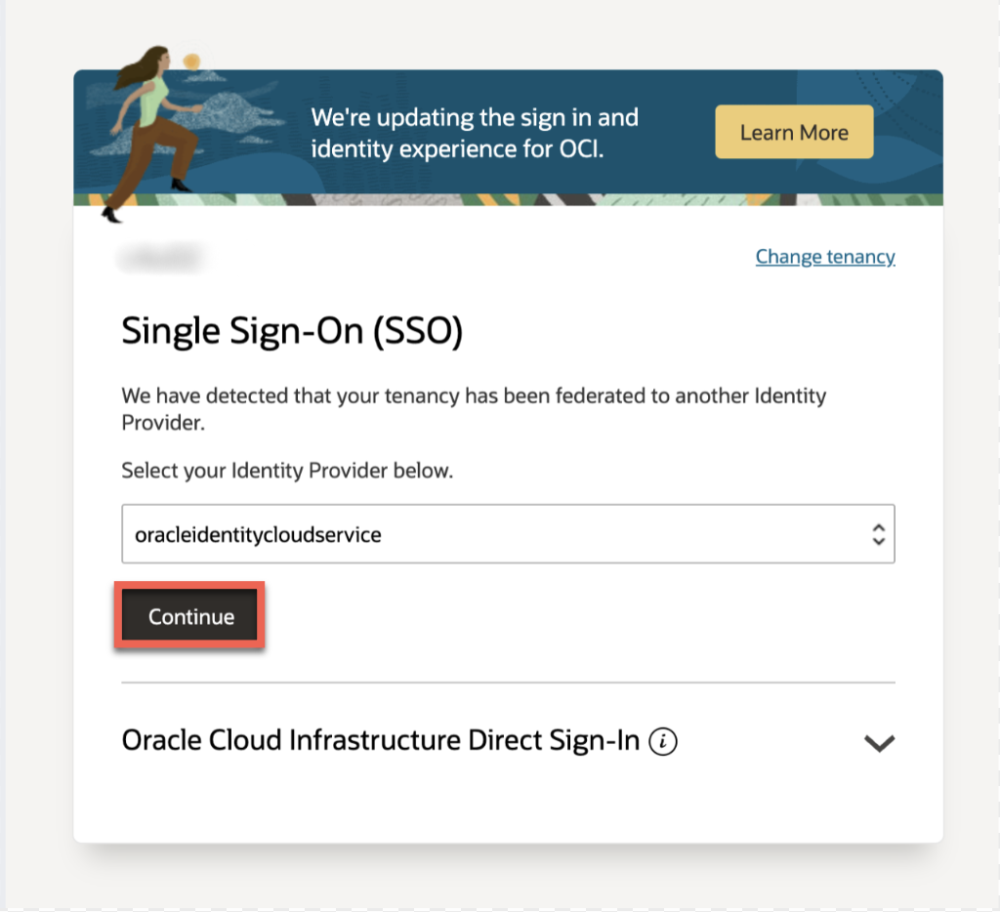

# Get Started - sign up for Free Trial

## Introduction

This lab walks you through the steps of getting an Oracle Cloud Free Tier account and signing in.

Estimated Time: 5 minutes

### Objectives

- Create an Oracle Cloud Free Tier account
- Sign in to your account

### Prerequisites

* A valid email address
* Ability to receive SMS text verification (only if your email isn't recognized)
* Credit card (you will not be charged unless you elect to upgrade the account later.)

## Task 1: Create Your Free Trial Account

In this section, you will fill out the registration form at [oracle.com/cloud/free](https://signup.cloud.oracle.com).

1.  Click on the "Start for free" button and enter the appropriate information to create your account.
    * Enter the same **email address** you used to register for Oracle Open World / Oracle Code One. A popup should appear recognizing your email. If not, the registration form will ask for additional information later.
    * Select your **country/territory**.
    * Click **Next**.

    

2.  Enter a few details for your new Oracle Cloud account.
    * You can choose almost anything for your Cloud Account Name. Remember what you wrote. You'll need this name later to sign in.
    * Click **Enter Password**.

3.  If your email wasn't recognized or you're using a different email address, you will need to provide additional information.
    * Provide a mobile number and click **Next: Verify Mobile Number**. In a few seconds, you should receive a verification code through SMS-text. Enter this code in the appropriate field and click **Verify**.
    * Click **Add Credit Card Details**. You will NOT be charged unless you elect to upgrade the account later. Enter the billing information, card details, and click **Finish**.

4. Validate your address.

5. Enter a password. Remember this password so you can sign in to the Cloud later.

6. Click **Review Terms and Conditions**. Read and agree to the Terms & Conditions by checking the box and click **Complete Sign-Up**.

7. Your account is provisioning and should be available in a few seconds! When it's ready, you're automatically taken to a sign in page. You'll also receive a confirmation email containing sign in information.

## Task 2: Sign in to Your Account

If you've signed out of the Oracle Cloud, use these steps to sign back in.

1. Go to [cloud.oracle.com](https://cloud.oracle.com).

    

2. Click **View Accounts** to bring up a menu.  Click **Sign in to Cloud**.

    

3. Enter your Cloud Account Name and click **Next**. This is the name you chose while creating your account in the previous section. It's NOT your email address. If you've forgotten the name, see the confirmation email.

    

4. Enter your Cloud Account credentials and click **Sign In**. Your username is your email address. The password is what you chose when you signed up for an account.

    

5. You are now signed in to Oracle Cloud!

    

You may now **proceed to the next lab**.

## Acknowledgements

- **Created By/Date** - Kay Malcolm, Database Product Management, March 2020
- **Contributors** - John Peach, Madhusudhan Rao, Arabella Yao
- **Last Updated By/Date** - Arabella Yao, May 2022