# Connect to database via SSH Bastion

## Introduction

This lab walks you through the steps required for a managed SSH session using Bastion. This connection will be used as a prerequisite for many labs that require an SSH.

Estimated Time: 30 minutes

### Objectives

In this lab, you will:
* Create a bastion
* Create your sessions
* Manage your sessions

### Prerequisites

This lab assumes you have:
* An Oracle cloud account with access to a tenancy
* The VCN (virtual cloud network) that the target was created in
* A private subnet in the VCN
* The IPv4 address or addresses from which you plan to connect to sessions hosted by the bastion

## Task 1: Create Bastion

1. Access [cloud.oracle.com](https://cloud.oracle.com) and log into your tenancy

2. Click the hamburger menu on the left-hand side and select "Identity and Security" then "Bastion"

	

3. Under List Scope, in the Compartment list, click the name of the compartment where you want to create a bastion.

	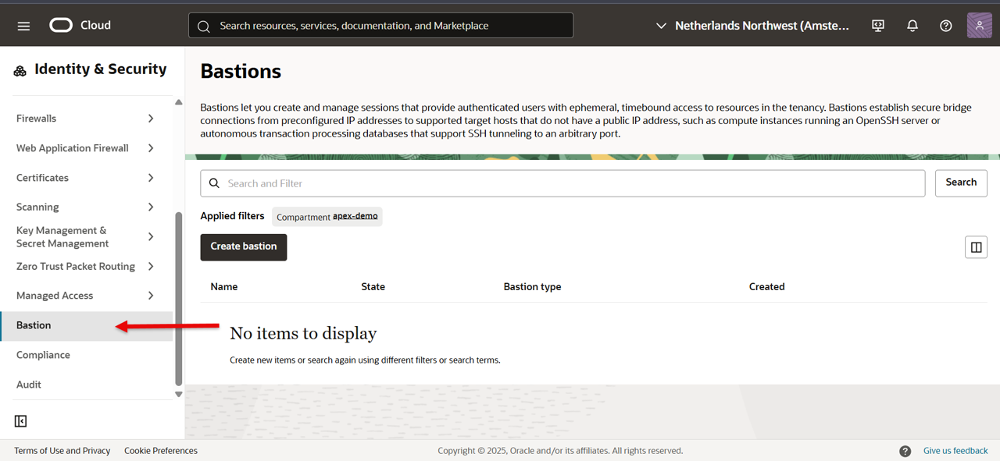

	Change name of Instance to your specification.

4. Click **Create bastion**.

	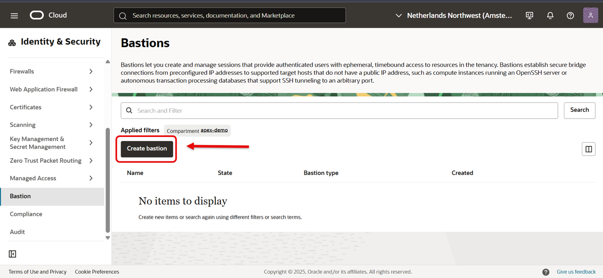

5. Enter a name for the Bastion
	- Avoid entering any confidential information in this field. Only alphanumeric characters are supported.

	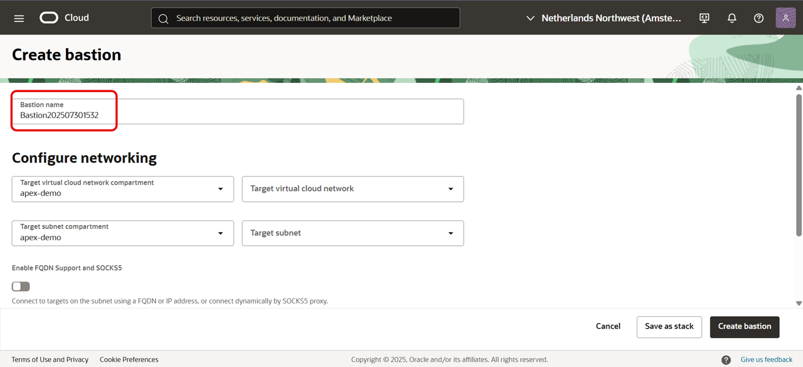

6. Under Configure networking, select the Target virtual cloud network of the target resource that you intend to connect to by using sessions hosted on this bastion.
If needed, change the compartment to find the VCN.

7. Select the Target subnet. The subnet must either be the same as the target resource's subnet or it must be a subnet from which the target resource's subnet accepts network traffic.
If needed, change the compartment to find the subnet.

8. In CIDR block allowlist, add one or more address ranges in CIDR notation that you want to allow to connect to sessions hosted by this bastion.
For example, 203.0.113.0/24 or 0.0.0.0/0 allows all.

	Enter a CIDR block into the input field, and then either click the value or press Enter to add the value to the list. The maximum allowed number of CIDR blocks is 20.

	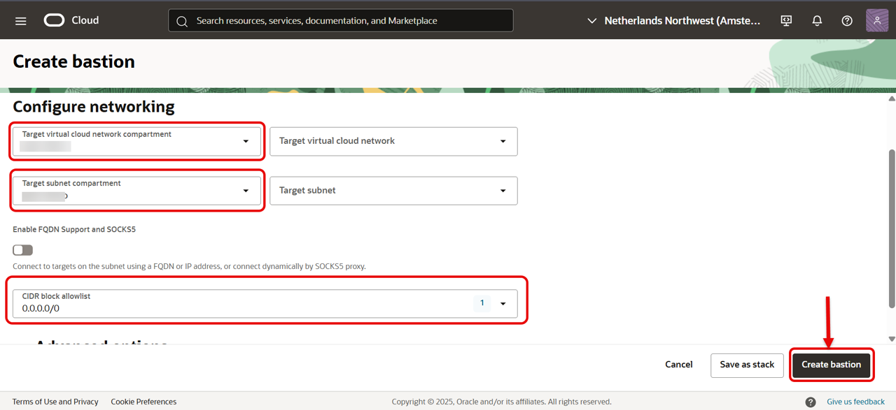

	A more limited address range offers better security.

9. Click **Create bastion**

## Task 2: Create a Managed SSH Session

Before creating a Managed SSH session, verify that:
	- The Bastion plugin is enabled on the target compute instance (if you have not done so, please create a compute instance)
	- The VCN includes a service gateway  and a route rule for the service gateway

1. Open the navigation menu and click Identity & Security. Click Bastion

2.  Under List Scope, in the Compartment list, click the name of the compartment where you want to create a bastion session.

3. Click the name of the session

	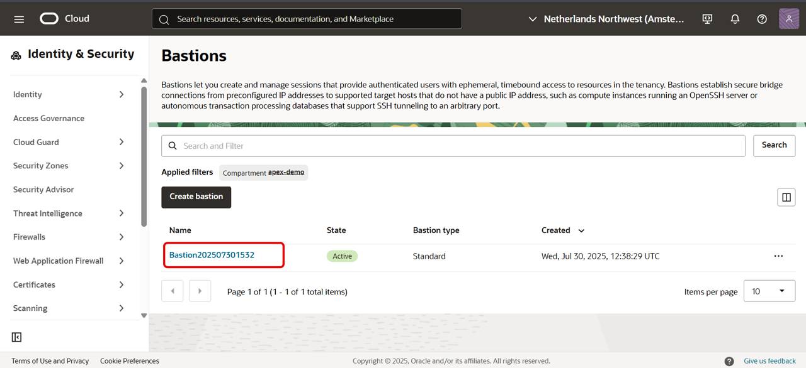

4. Click "Create Session"

	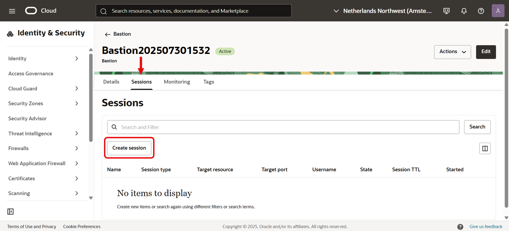

5. Choose a session type by selecting "Managed SSH Session"

6. Enter a display name for the new session

	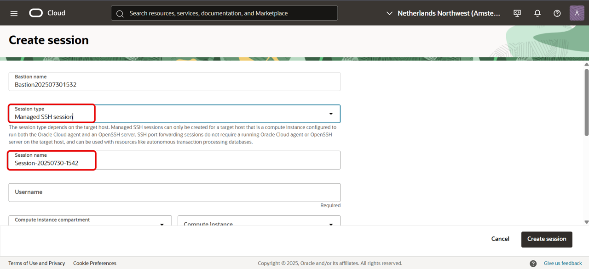

7. Choose Compute instance and under Add SSH Key, provide the public key file of the SSH key pair that you want to use for the session.
Later, when you connect to the session, you must provide the private key of the same SSH key pair.

8. When you are finished, click "Create session"

	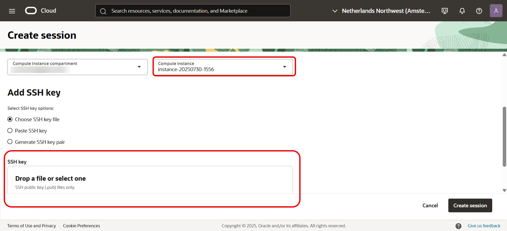

## Task 3: Allow Network Access From the Bastion

1. Open the navigation menu and click Identity & Security. Click Bastion.

2. Under List Scope, in the Compartment list, click the name of the compartment where the bastion was created.

3. Click the name of the bastion.

4. Copy the Private endpoint IP address.

	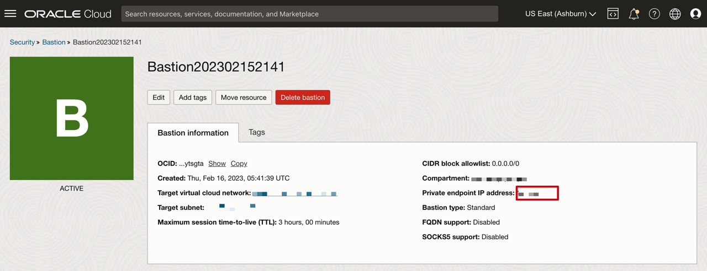

5. Click the Target subnet.
If the target resource is on a different subnet than the one used by the bastion to access this VCN, edit the target resource's subnet.

	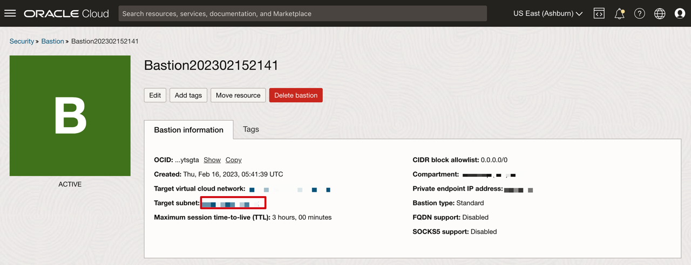

6. From the Subnet Details page, click an existing security list that is assigned to this subnet.
Alternatively, you can create a security list and assign it to this subnet.

	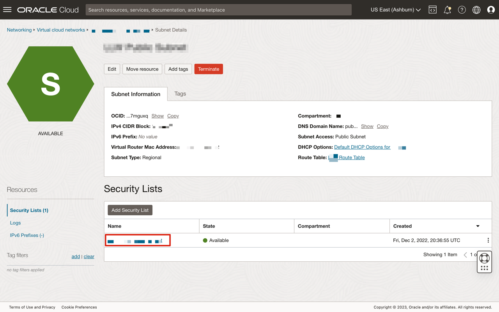

7. Click **Add Ingress Rules**.

	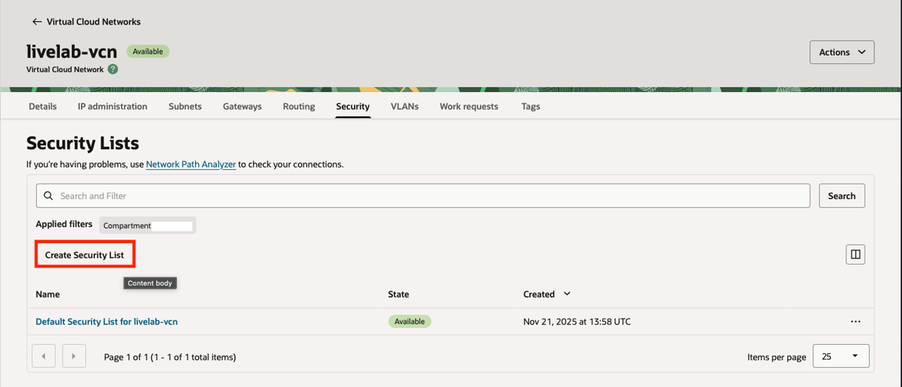

8. For Source CIDR, enter a CIDR block that includes the Private endpoint IP address of the bastion.
For example, the CIDR block &lt;bastion\_private\_IP&gt;/32 includes only the bastion's IP address.
	Example: 10.140.250.22/32

9. For IP Protocol, select **TCP**.

10. For Destination Port Range, enter the port number on the target resource.
For Managed SSH sessions, specify port **22**.

11. Click **Add Ingress Rules**.

	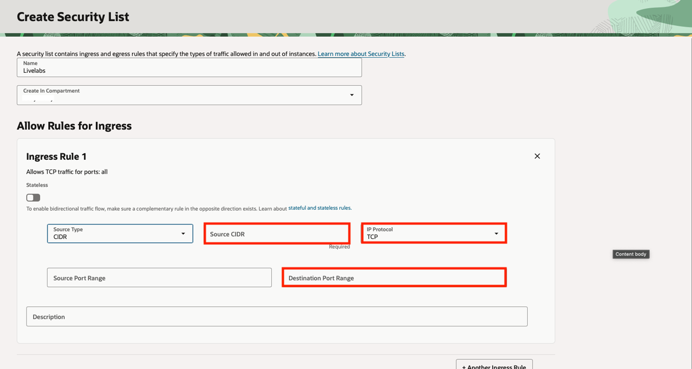

## Task 4: Connect to a Managed SSH Session
Before you begin, you must create a Managed SSH session to the target instance

1. Open the navigation menu and click **Identity & Security**. Click **Bastion**.

2. Under List Scope, in the Compartment list, click the name of the compartment where the bastion was created.

3. Click the name of the bastion, and then, under Sessions, locate the session that you want to use to connect to the intended target resource.

4. In the Actions menu for the session, click **View SSH command**.

	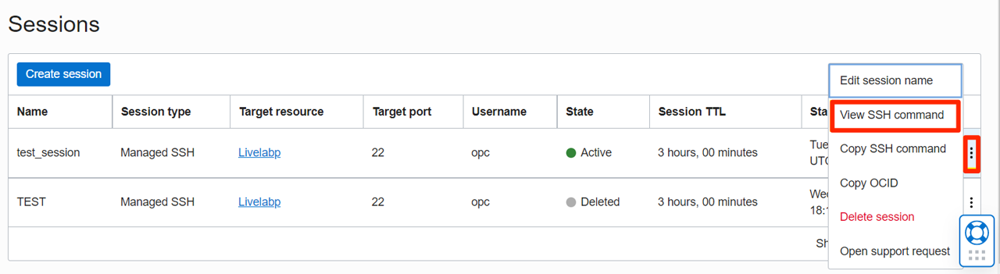

5. To copy the command, next to the SSH command, click **Copy**, and then click **Close**.

	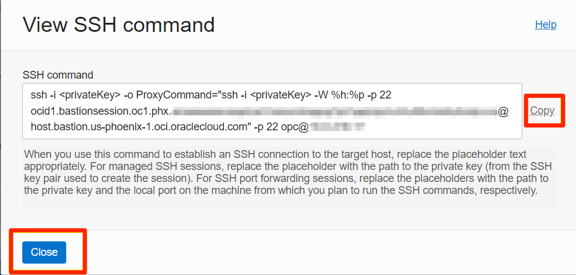

6. Using a text editor, replace &lt;privateKey&gt; with the path to the private key of the SSH key pair that you provided when you created the session.

7. Use a command line to issue the customized SSH command and connect to the bastion session.
If your private key was created with a passphrase, you are prompted to enter it.

You may now **proceed to the next lab**.

## Acknowledgements
* **Author** - Thea Lazarova, Solution Engineer Santa Monica
* **Contributors** -  Andrew Hong, Solution Santa Monica
* **Last Updated By/Date** - Ramona Magadan, Database Product Management, August 2025