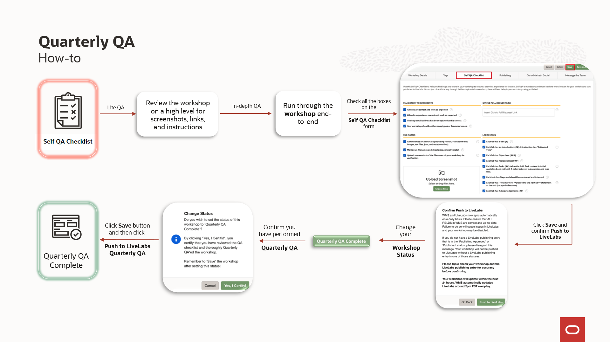
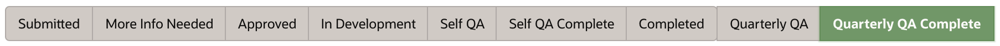
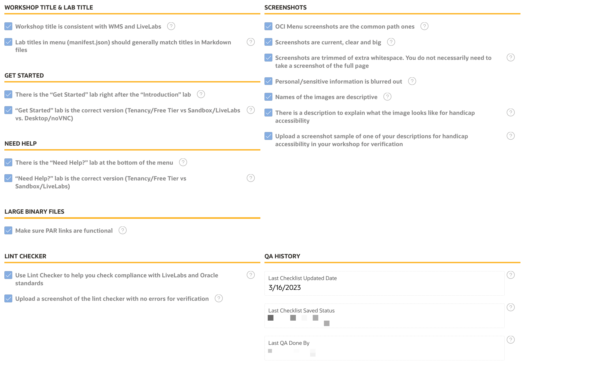

# How to perform Quarterly QA for your workshop

## Introduction

This sprint will help to perform Quarterly QA for your workshop. It will walk you through all of the steps. Quality checks and reviews of your workshop ensure the users enjoy the workshops and provide the best experience with Oracle technologies. Some of the QA steps ensure the LiveLabs standards, and hopefully, most of these checks have been done throughout the workshop's development.

### Duration: 15 min

### Objectives

* Tested and verified workshop content for accuracy and completeness

### What Do You Need?

* Git Environment Setup
* GitHub Desktop client

Check the following schema to see how to self-QA your workshop.

## Perform Quarterly QA

For the workshop in Completed or Quarterly QA Complete status and have Published - Public or Published - Event entries, we want to ensure that customers benefit from workshops that contain up-to-date information. So, the workshop team needs to perform Quarterly QA of the workshop every 90 days.

> **Note:** Maintaining several workshops and running through the QA can be time consuming. We are suggesting a two-phased approach to make sure critical items are addressed regularly.
  - **Lite QA:** Review the workshop on a high level for screenshots, links, and instructions to ensure the workshop is current and is using the latest version. Make any minor changes, if necessary, to keep the content updated.
  - **In-depth QA:** Run through the workshop end-to-end to ensure it is working as expected since it was published. Update workshop if necessary
  - **Example:** If there are ten workshops to QA, in the first quarter, you can perform lite QA reviews for the first 1-5 (or a selection) workshops and in-depth QA for the following 5-10 workshops. Subsequently, in the following quarter, you can perform in-depth QA for the first 1-5 workshops and lite QA for the following 5-10 workshops. This approach will allow you to manage more workshops while ensuring thorough quality assessment efficiently.

1. The workshop status will automatically update to Quarterly QA after 90 days from the time you have last performed QA of your workshop. When the status is updated to Quarterly QA, the workshop team will receive an email with instructions to perform Quarterly QA of the workshop.

    

2. At this point, the workshop team will have 10 days to perform the Quarterly QA of the workshop.

3.  If you have changed your Status to **Self QA** or your workshop status is in **Quarterly QA**, click on the **Self QA Checklist** tab and check your workshop against the form. Update your workshop and create a new pull request if necessary for the workshop to follow LiveLabs standards.

  
  

4. You *MUST* check all the boxes on the Self QA Checklist form, upload the images and update the pull request link if you created one (optional).

5. Click **Save** and confirm **Push to LiveLabs** to save your checklist changes before you update your workshop status to Quarterly QA Complete.

  

  Otherwise, you will get this warning while updating your workshop status to Quarterly QA Complete and you will not be able to save your workshop status to Quarterly QA Complete.

  

6. After saving the checklist changes, then set your **Workshop Status** to **Quarterly QA Complete**.

  

7. Confirm you have performed Quarterly QA by clicking **Yes, I certify**.

  

8. Click **Save** button and then click **Push to LiveLabs**. Now, you have updated your workshop status to Quarter QA Complete and have completed the QA of the workshop.

  

  After saving your workshop status to Quarterly QA Complete, you Self QA Checklist tab will grey out with the QA History section populated in the checklist tab and last QA date and person email updated on the workshop details tab.

  
  
  

9. If the workshop team does not perform the Quarter QA within the given time period, the LiveLabs publishers will disable the workshop in WMS i.e the published entry of the workshop will be pulled off from production. This is a disable, not a delete. So, your workshop will remain in the WMS catalog and you can bring back to production after completing the Quarterly QA of the workshop.

  
  

10. Questions? Go to your workshop and find your stakeholder email address, and contact them. You can also ask in the #workshops-authors-help Slack channel.

  

## Acknowledgements

* **Author:**
   * Michelle Malcher, Director, Oracle Database Product Management
* **Contributors:**
    * Magadan Ramona, Technical Program Manager, Oracle Database Product Management, July 2024

* **Last Updated By/Date:**
    * Magadan Ramona, Technical Program Manager, Oracle Database Product Management, July 2024
