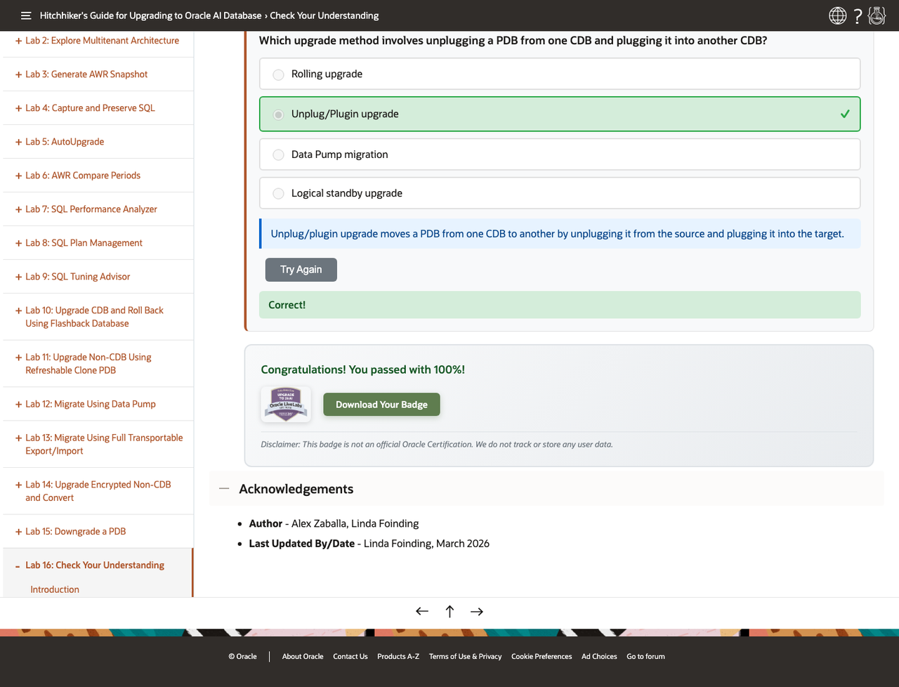
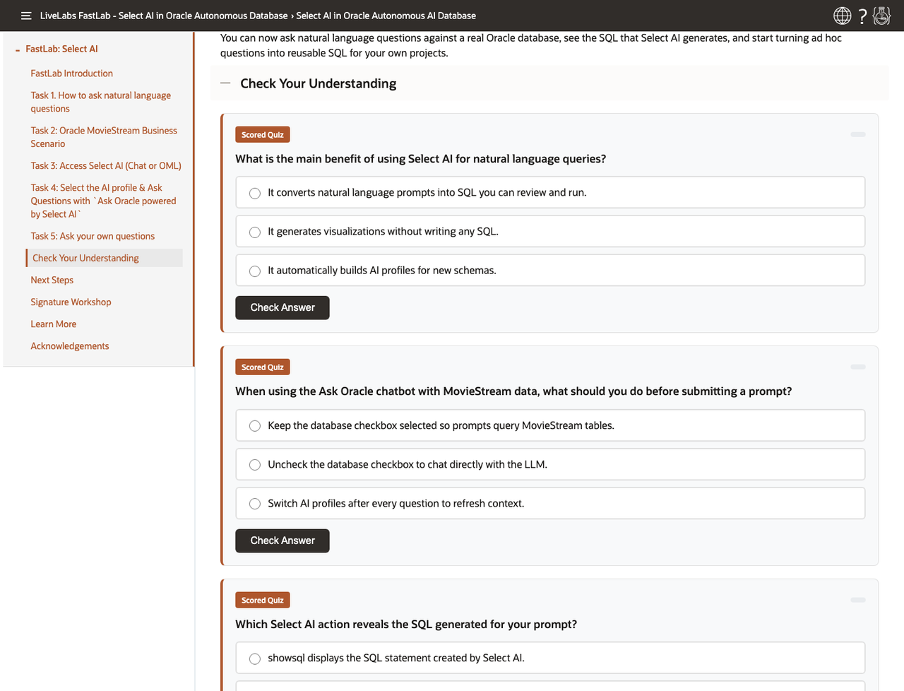
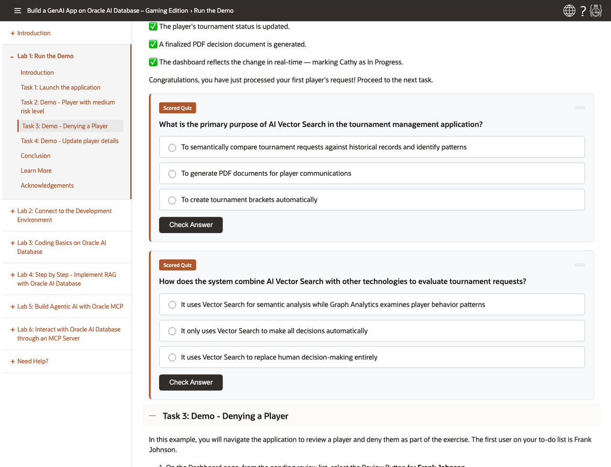

# Add Knowledge Checks in Minutes

## Introduction

This lab shows authors how to use Codex and the `livelabs-gamification` skill to add quiz-based checks to a LiveLabs workshop without rewriting the teaching flow.

You will learn when to add a dedicated quiz lab, when to append a short check in place, and how to keep quiz questions tied to workshop content instead of outside knowledge.

### Objectives

In this lab, you will:

- Choose the right quiz mode for the workshop shape
- Apply the default scoring and badge settings
- Prompt Codex with the correct workshop and manifest paths
- Keep questions conceptual and in scope
- Validate the changed files after quiz generation

**Estimated Time:** 10 minutes

## Task 1: Choose The Right Quiz Mode

Perform the following set of steps to choose the quiz mode that best matches the structure of the target workshop:

1. Use `Option 1` when you want Codex to add a new scored quiz lab at the end of a workshop and update a specific manifest path.

    

    Upgrade workshop example from the local liveserver after completing the quiz and unlocking the badge.

2. Use `Option 2` when you want Codex to append a short scored quiz to a single FastLab markdown file.

    

    Select AI FastLab example from the local liveserver with one end-of-file `Check Your Understanding` section.

3. Use `Option 3` when you want Codex to insert quiz checks at valid section boundaries inside an existing lab.

    

    Gaming workshop example from the local liveserver with distributed quiz checks placed after major concept boundaries.

4. Match the mode to the workshop shape before you prompt Codex. That choice controls question count, placement, and whether a passing score is enforced.

## Task 2: Follow The Core Rules

Perform the following set of steps to apply the core content, scoring, and placement rules before generating quiz material:

1. Generate questions only from the workshop content in scope.

2. Preserve all instructional content verbatim.

3. Add quiz material only at valid boundaries after a lab or section is complete.

4. Use these defaults unless the workshop needs different values:

    - `passing: 75`
    - `badge: images/badge.png`

5. Avoid certification language. Use completion language such as `Completion Badge` instead.

## Task 3: Prompt Codex With The Right Inputs

Perform the following set of steps to give Codex the right workshop paths, mode, and question constraints before quiz generation:

1. Start with the skill name and the target path.

2. Name the quiz mode directly.

3. If you use `Option 1`, include the exact manifest path Codex must update.

4. Add question-count and content-scope limits when you need them.

5. Ask for conceptual questions that test why, when, or consequence instead of memorization.

## Task 4: Use Prompt Patterns That Match The Goal

Perform the following set of steps to choose a prompt pattern that matches the specific quiz outcome you want:

1. Use a prompt like this for `Option 1`:

    ```text
    $livelabs-gamification create a quiz for /path/to/workshop
    Option 1. Use /path/to/workshop/workshops/sandbox/manifest.json.
    Create 5 conceptual questions from the introduction and Labs 1-3 only.
    ```

2. Use a prompt like this for `Option 2`:

    ```text
    $livelabs-gamification add a quiz to /path/to/fastlab/my-lab.md
    Option 2. Keep it to 3 scored conceptual questions.
    ```

3. Use a prompt like this for `Option 3`:

    ```text
    $livelabs-gamification create a quiz for /path/to/workshop/lab.md
    Option 3. Insert quiz blocks under existing sections, not as a new task.
    Use unscored checks.
    ```

## Task 5: Add Useful Constraints Before Generation

Perform the following set of steps to add constraints that keep the quiz in scope and aligned with the workshop content:

1. Tell Codex to use only the workshop content.

2. Tell Codex to keep the questions conceptual, not nitty-gritty.

3. Limit the content scope when only some labs should feed the quiz.

4. Reference a style file when you need Codex to match an existing quiz pattern.

5. Name every manifest that must be updated. Do not assume Codex should edit every manifest in the repo.

## Task 6: Validate The Result And Review The Output

Perform the following set of steps to validate the quiz output and confirm that the generated changes are accurate and usable.

1. Expect Codex to report:

    - Files changed
    - Quiz mode used
    - Badge path
    - Validation status for the changed files
    - The saved validation report path

2. Save the final validation report outside the repo in a dedicated validation-reports folder, such as `/Users/<yourname>/Documents/validation-reports`.

3. Before you finish, confirm:

    - The mode is correct
    - The manifest path is correct for `Option 1`
    - The question count matches the workshop type
    - The quiz renders in the target workshop viewer
    - The report clearly separates new issues from pre-existing issues

## Acknowledgements

* **Author** - Linda Foinding, Principal Product Manager, Outbound Database Product Management
* **Last Updated By/Date** - Teodor C. Nechita, June 2026
