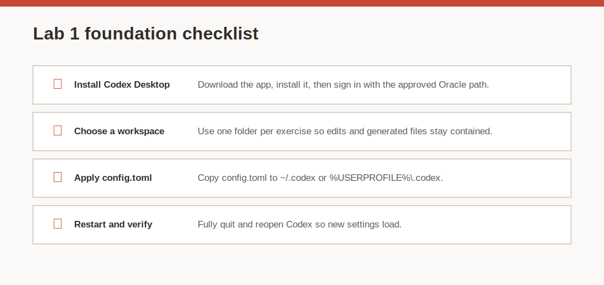
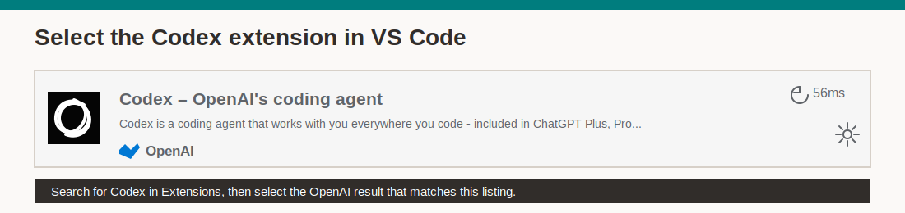
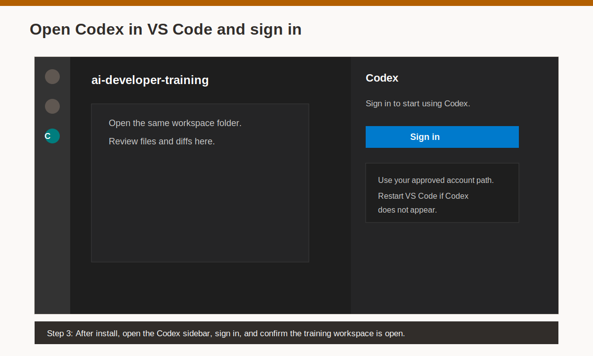

# Lab 1: Install and Configure Codex

## Introduction

Codex is the foundation for the rest of this workshop. In this lab, you install Codex, select a safe workspace folder, copy the training config into the user-level Codex config folder, and restart Codex so the new settings load.



Estimated Time: 25 minutes

### Objectives

In this lab, you will:

- Install Codex Desktop or confirm it is already installed.
- Create a dedicated workspace folder for training work.
- Copy a sample `config.toml` file into the Codex config folder.
- Optionally install VS Code and the Codex IDE extension for reviewing files and diffs.
- Restart Codex and verify that it opens the intended workspace.

## Task 1: Install Codex Desktop

1. Open the Codex Desktop download page:

    [Codex app guide](https://developers.openai.com/codex/app)

2. Download the current installer for your platform.

    - Use the macOS installer on macOS.
    - Use the Windows installer on Windows.
    - If your platform does not have a desktop installer, use the CLI path in Task 5.

3. Run the installer and open Codex.

4. Sign in using the organization-approved Oracle path.

    Do not paste API keys into screenshots, email, shared documents, or this workshop repository. If your workflow requires an API key, follow the internal Oracle instructions supplied for this workshop or by your team.

## Task 2: Create a dedicated workspace folder

1. Create a folder for this training work.

    macOS example:

    ```text
    ~/Documents/Codex/ai-developer-training
    ```

    Windows example:

    ```text
    %USERPROFILE%\Documents\Codex\ai-developer-training
    ```

2. In Codex, open that folder as the workspace.

3. Keep one project or training exercise per folder.

    This keeps approvals, generated files, and Git changes easier to review. Avoid opening your home folder, Downloads folder, or a parent directory that contains many unrelated projects.

## Task 3: Copy the sample Codex config

1. Create the user-level Codex config folder if it does not already exist.

    macOS Terminal:

    ```bash
    mkdir -p ~/.codex
    ```

    Windows PowerShell:

    ```powershell
    New-Item -ItemType Directory -Force -Path "$env:USERPROFILE\.codex"
    ```

2. Open the sample config file for this lab:

    [sample-codex-config.toml](files/sample-codex-config.toml)

3. Copy the sample file to the Codex config location.

    macOS Terminal, from this lab folder:

    ```bash
    cp files/sample-codex-config.toml ~/.codex/config.toml
    ```

    Windows PowerShell, from this lab folder:

    ```powershell
    Copy-Item .\files\sample-codex-config.toml "$env:USERPROFILE\.codex\config.toml"
    ```

4. Confirm that the file name equals `config.toml`.

    The most common mistake is saving the file as `config.toml.txt` or leaving it in Downloads instead of the user-level `.codex` folder.

## Task 4: Restart Codex and verify the workspace

1. Fully quit Codex.

2. Reopen Codex.

3. Confirm that Codex is using the workspace folder you created in Task 2.

4. Ask Codex a safe check prompt:

    ```text
    Summarize the current workspace folder contents. Do not edit files.
    ```

5. Confirm that Codex answers without changing files.

    If Codex reports a different folder than expected, close it and reopen the correct workspace before you continue.

## Task 5: Optionally install VS Code, the Codex IDE extension, or the Codex CLI

1. Install Visual Studio Code if you want a separate editor for file review:

    [Download Visual Studio Code](https://code.visualstudio.com/Download)

2. Install the Codex IDE extension, often called the VS Code plugin.

    You can install it from the Visual Studio Marketplace:

    [Codex IDE extension](https://marketplace.visualstudio.com/items?itemName=openai.chatgpt)

    Or install it inside VS Code:

    - Open the Extensions view.
    - Search for `Codex`.
    - Select the OpenAI result that matches the image below.
    - Select **Install**.

    

3. Open the same workspace folder in VS Code that you opened in Codex.

4. Open the Codex sidebar in VS Code and sign in with the approved account path.

    

5. Confirm that VS Code and Codex are using the same training workspace.

6. Use VS Code for review, search, markdown preview, and diffs. Let Codex make proposed changes first, then inspect them in VS Code.

7. If you need the Codex CLI, install Node.js LTS first, then install the CLI:

    ```bash
    npm install -g @openai/codex
    codex --version
    ```

8. Use the same `config.toml` location for Desktop, CLI, and supported IDE workflows.

## Task 6: Complete the Lab 1 checkpoint

1. Confirm each item is true before continuing:

    - Codex opens successfully.
    - Codex uses sign-in with the approved Oracle path.
    - Your training workspace is open.
    - `config.toml` exists in the user-level `.codex` folder.
    - You restarted Codex after you copied the config.
    - If you use VS Code, you installed the Codex IDE extension and signed in.

2. If anything is missing, fix it before moving to Lab 2.

## Learn More

- [Codex app guide](https://developers.openai.com/codex/app)
- [Codex CLI guide](https://developers.openai.com/codex/cli)
- [Codex config reference](https://developers.openai.com/codex/config-reference)
- [Codex IDE extension guide](https://developers.openai.com/codex/ide)
- [Visual Studio Code downloads](https://code.visualstudio.com/Download)

## Acknowledgements

* **Author** - Oracle LiveLabs AI Developer Team
* **Last Updated By/Date** - Oracle LiveLabs AI Developer Team, May 2026
