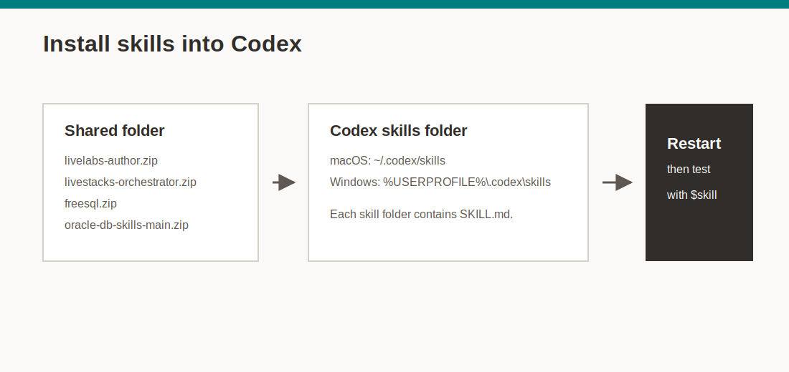

# Lab 2: Install and Test Codex Skills

## Introduction

Codex skills package repeatable workflows as local instructions. In this lab, you download the Oracle skill bundle, install selected skills, restart Codex, and test that the skills load.



Estimated Time: 25 minutes

### Objectives

In this lab, you will:

- Open the shared Oracle skill bundle folder.
- Install skill folders manually or ask Codex to install them from downloaded zip paths.
- Confirm that each installed skill contains a `SKILL.md` file.
- Restart Codex so new skills load.
- Test installed skills from a Codex prompt.

## Task 1: Open the shared skill bundle

1. Open the shared Oracle folder in a browser after you sign in with Oracle SSO:

    [LiveLabs AI Developer skill bundle](https://oracle-my.sharepoint.com/:f:/p/kay_malcolm/IgBlxiOi-InZRbQHn6htgExAAZVgHtxSIwjAyAxRkmXa4ag?e=JUQbzY)

2. If Microsoft asks you to sign in, complete Oracle SSO and return to the shared folder.

3. If you cannot open the folder, confirm that Oracle SSO completed in the same browser session. If access is still denied, use your normal Oracle support or team access process.

4. Download the skills you need for this workshop.

    Required for this workshop:

    - `livestacks-orchestrator.zip`

    Helpful for broader LiveLabs authoring work:

    - `livelabs-author.zip`
    - `freesql.zip`
    - `livelabs-gamification.zip`
    - `oracle-db-skills-main.zip`

## Task 2: Find the Codex skills directory

1. Use the path for your operating system.

    macOS:

    ```text
    ~/.codex/skills
    ```

    Windows:

    ```text
    %USERPROFILE%\.codex\skills
    ```

2. Create the directory if it does not exist.

    macOS Terminal:

    ```bash
    mkdir -p ~/.codex/skills
    ```

    Windows PowerShell:

    ```powershell
    New-Item -ItemType Directory -Force -Path "$env:USERPROFILE\.codex\skills"
    ```

## Task 3: Install the downloaded skill zips

1. Codex loads each skill from a normal folder with a `SKILL.md` file. To install manually, unzip the package. Then copy the extracted skill folder into the appropriate Codex skills folder.

2. You can also ask Codex to install one or all downloaded zip files. Provide the file paths in the prompt.

    Example prompt for files in your macOS `Downloads` directory:

    ```text
    Install these Codex skills from my Downloads folder:
    ~/Downloads/livestacks-orchestrator.zip
    ~/Downloads/livelabs-author.zip
    ~/Downloads/freesql.zip

    Unzip each archive.
    Put each extracted skill folder under ~/.codex/skills.
    Confirm that SKILL.md is directly inside each skill folder.
    Ask me before replacing any older version.
    ```

    On Windows, use paths such as `%USERPROFILE%\Downloads\livestacks-orchestrator.zip`. Use `%USERPROFILE%\.codex\skills` as the target folder.

3. If you install manually, copy each extracted skill folder into the Codex skills directory.

    The final folder structure should look like this on macOS:

    ```text
    ~/.codex/skills/livestacks-orchestrator/SKILL.md
    ~/.codex/skills/livelabs-author/SKILL.md
    ~/.codex/skills/freesql/SKILL.md
    ```

4. Make sure the folder name is the skill name, not an extra wrapper folder.

    Correct:

    ```text
    ~/.codex/skills/livestacks-orchestrator/SKILL.md
    ```

    Incorrect:

    ```text
    ~/.codex/skills/livestacks-orchestrator/livestacks-orchestrator/SKILL.md
    ```

5. Replace older versions only when approved by your workshop instructions, team, or skill owner.

    If you replace a skill, quit Codex first, replace the folder, then reopen Codex.

## Task 4: Verify files before restarting Codex

1. In macOS Terminal, run:

    ```bash
    find ~/.codex/skills -maxdepth 2 -name SKILL.md -print
    ```

2. In Windows PowerShell, run:

    ```powershell
    Get-ChildItem "$env:USERPROFILE\.codex\skills" -Recurse -Filter SKILL.md | Select-Object FullName
    ```

3. Confirm that `livestacks-orchestrator/SKILL.md` appears in the output.

4. Optional macOS test: run the helper script included with this lab.

    ```bash
    bash files/test-skill-install.sh
    ```

## Task 5: Restart Codex and test the skills

1. Fully quit Codex.

2. Reopen Codex in your training workspace.

3. Test LiveStacks Orchestrator with a no-edit prompt:

    ```text
    Use $livestacks-orchestrator and summarize, in one paragraph, what inputs you need before generating a LiveStack. Do not create or edit files.
    ```

4. If you installed `livelabs-author`, test it with a no-edit prompt:

    ```text
    Use $livelabs-author and summarize, in one paragraph, what makes a good LiveLabs workshop outline. Do not create or edit files.
    ```

5. If Codex says it cannot find the skill, check the folder name. Confirm `SKILL.md` is directly inside the skill folder, then restart Codex again.

## Task 6: Complete the Lab 2 checkpoint

1. Confirm each item is true before continuing:

    - The shared folder opened after Oracle SSO.
    - You installed `livestacks-orchestrator` under the Codex skills directory.
    - `SKILL.md` exists directly inside the `livestacks-orchestrator` folder.
    - You can install skills manually or by giving Codex downloaded zip paths.
    - You restarted Codex after install.
    - A prompt that names `$livestacks-orchestrator` returns a skill-aware answer.

2. Keep the downloaded zip files only if your team wants a local backup. Otherwise, the installed folder under `.codex/skills` is the active copy.

## Learn More

- [Codex skills docs](https://developers.openai.com/codex/skills)
- [LiveLabs AI Developer skill bundle](https://oracle-my.sharepoint.com/:f:/p/kay_malcolm/IgBlxiOi-InZRbQHn6htgExAAZVgHtxSIwjAyAxRkmXa4ag?e=JUQbzY)

## Acknowledgements

* **Author** - Oracle LiveLabs AI Developer Team
* **Last Updated By/Date** - Oracle LiveLabs AI Developer Team, May 2026
