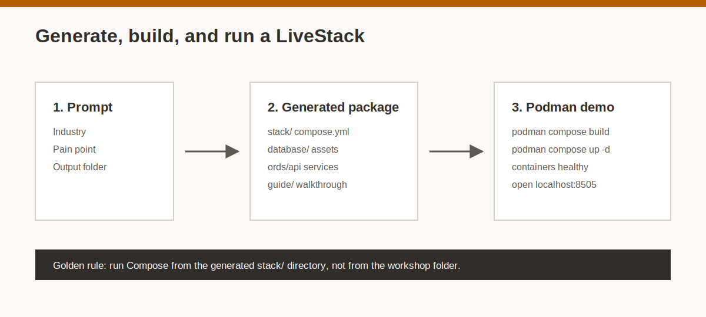
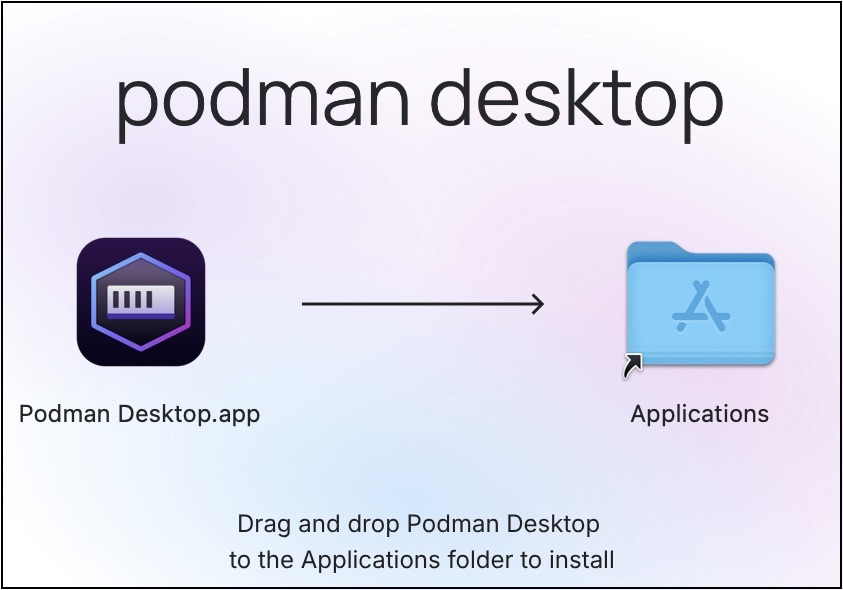
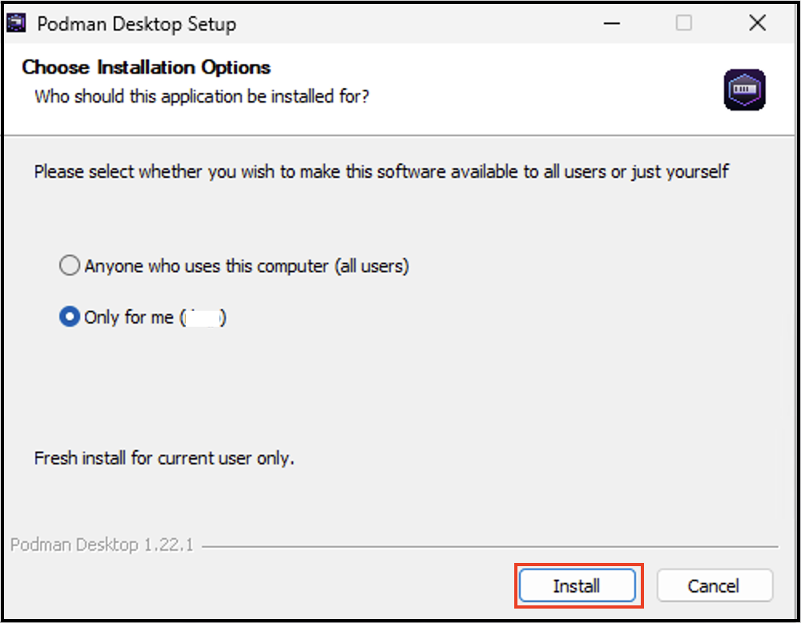
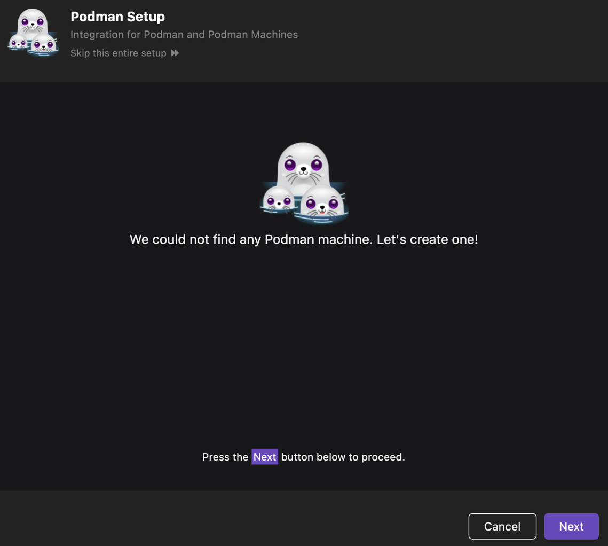
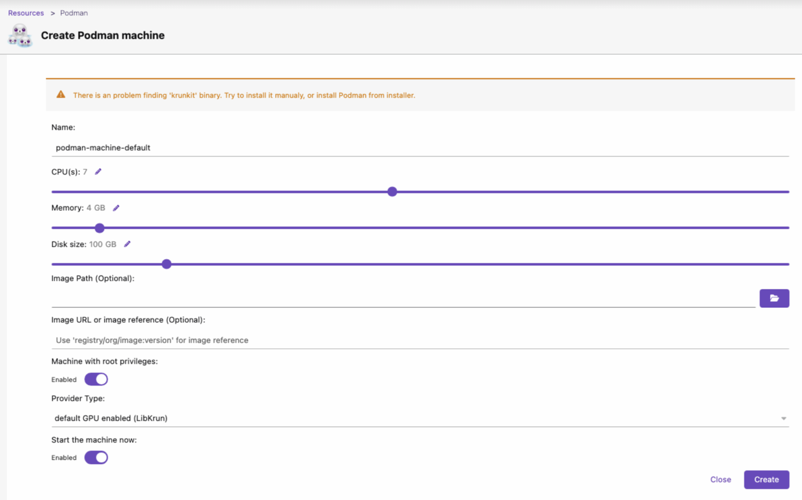
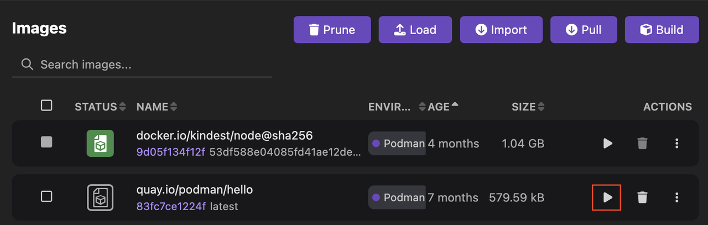
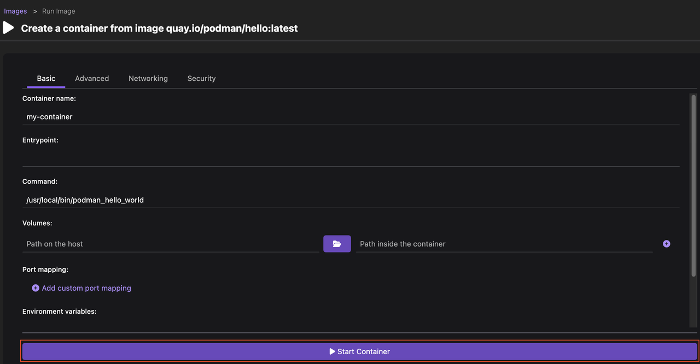
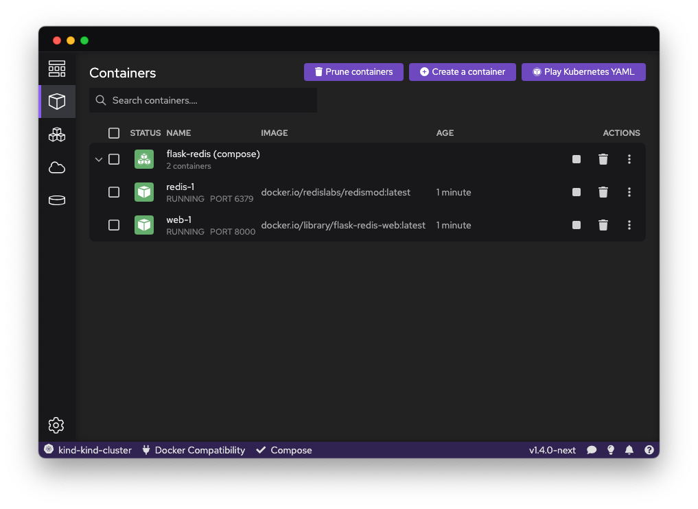
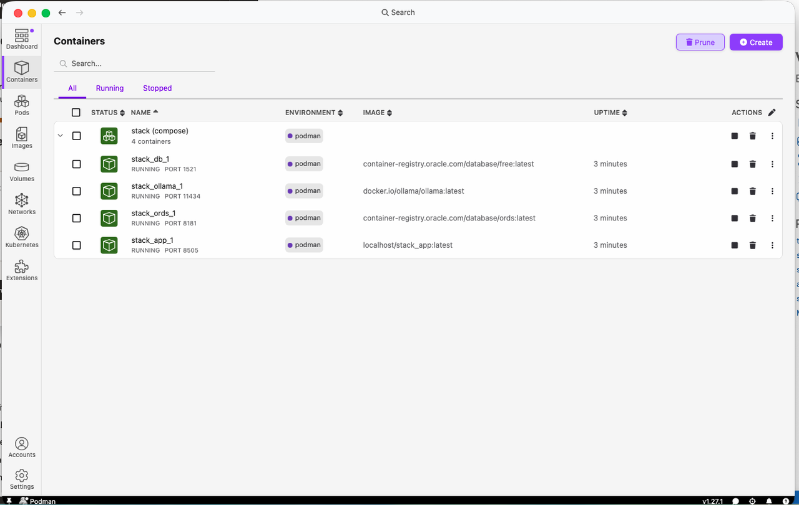

# Optional Lab: Generate and Run a LiveStack Demo

## Introduction

LiveStacks Orchestrator turns a use case into an Oracle-first demo package. In this lab, you use Podman Desktop as the primary local control surface: install Podman Desktop, create the Podman machine, install Compose, create or start the generated stack, and monitor the running containers.

You also learn the server-side path for running a supplied LiveStack zip on an OCI Compute instance. Use that path when a facilitator gives you a prebuilt package instead of asking you to generate one locally.



Estimated Time: 55 minutes

### Objectives

In this lab, you will:

- Install or verify Podman Desktop.
- Create or start the Podman machine from Podman Desktop.
- Install or verify Compose from Podman Desktop settings.
- Use LiveStacks Orchestrator to generate a demo from a use-case prompt.
- Find the generated `stack/` directory and Compose file.
- Create, start, monitor, and troubleshoot the containers primarily in Podman Desktop.
- Optionally install Podman on OCI Compute and run a supplied zip with Compose.

## Task 1: Install or verify Podman Desktop

1. Download Podman Desktop from the official site:

    [Podman Desktop](https://podman-desktop.io/)

2. Install Podman Desktop for your operating system.

    On macOS, use the `.dmg` installer. Drag **Podman Desktop** into the **Applications** folder.

    

    On Windows, run the Windows installer and select **Install**.

    

3. Open Podman Desktop.

4. Start the onboarding flow if Podman Desktop offers one.

    The onboarding flow can install Podman, create the Podman machine, and install supporting CLIs such as Compose. If you skip onboarding, you can complete the same setup later from **Settings > Resources**.

5. Before creating the Podman machine, close unnecessary apps and confirm you have about 35 GB of free disk space.

## Task 2: Set up the Podman machine and Compose in Podman Desktop

1. Open **Podman Desktop**.

2. On the **Dashboard**, look for setup prompts.

    If Podman Desktop asks for a Podman machine, select the setup button and follow the prompts.

    

3. If you do not see a dashboard setup prompt, open **Settings > Resources**.

4. In the **Podman** tile, select **Create new** or **Setup Podman**.

    Use the default machine name unless your team tells you otherwise. For a LiveStack demo, confirm that the disk size is large enough for generated database, ORDS, model, and app images.

    

5. Create or start the Podman machine.

    Wait until the Podman tile shows a running machine before you continue.

6. In **Settings > Resources**, find the **Compose** tile.

7. Select **Setup** in the Compose tile and follow the prompts.

    Podman Desktop can install the Compose engine from this settings page. After setup, stay in Podman Desktop and use the **Containers** view as the main place to monitor generated stacks.

## Task 3: Confirm the desktop setup is ready

1. In Podman Desktop, open **Settings > Resources**.

2. Confirm that the Podman tile shows a running machine.

3. Confirm that the Compose tile shows ready status.

4. Open **Containers** in the left menu.

5. You might see no containers yet. That is fine. The generated LiveStack containers appear after you create or start the stack.

    The Podman Desktop container workflow starts from the **Containers** view.

    

6. Review the desktop create flow.

    For a single container, Podman Desktop shows a **Start Container** screen. Your LiveStack uses a multi-container Compose stack, but status, logs, and ports still appear in **Containers**.

    

## Task 4: Prompt LiveStacks Orchestrator

1. Create a dedicated output folder in your Codex workspace.

    Example folder name:

    ```text
    livestack-output
    ```

2. Open the prompt included with this lab:

    [livestack-build-prompt.txt](files/livestack-build-prompt.txt)

3. Paste the prompt into Codex.

    ```text
    Use $livestacks-orchestrator and create a new folder called healthcare-no-show-risk-livestack to build a LiveStack for Healthcare focused on:

    Care coordinators cannot spot rising patient no-show risk early enough, which leads to wasted time slots, poor provider schedules, and missed opportunities to proactively re-engage high-risk patients.
    ```

4. Wait for Codex to finish.

    The generated package should include a new app folder with a `stack/` directory, a Compose file, database assets, API or ORDS assets, docs, and a guide or workshop package.

5. If Codex asks for approval before writing files or running commands, review the step and approve only if it matches the generated demo output folder.

## Task 5: Find the generated stack directory

1. Open the generated app folder.

    Example:

    ```text
    healthcare-no-show-risk-livestack
    ```

2. Open the `stack/` directory inside that folder.

3. Confirm that one of these files exists:

    ```text
    compose.yml
    compose.yaml
    ```

4. Use the file that exists. If both exist, use the one referenced by the generated README.

## Task 6: Create or start the stack, then monitor it in Podman Desktop

1. Keep **Podman Desktop** open.

2. Open **Containers** in the left menu.

3. Look for a desktop button to create or import from a Compose file.

    The exact label can vary by Podman Desktop release. Look for **Compose**, **Create from Compose**, **Import Compose**, **Create**, or **Deploy**.

4. If your Podman Desktop release offers that button, select the generated Compose file from the `stack/` directory.

    Use `compose.yml` or `compose.yaml`. If both exist, use the file named in the generated README.

5. If your Podman Desktop release does not expose a Compose import path, use the smallest possible command-line step to start the stack.

    Change into the generated `stack/` directory and run the command for the file that exists:

    ```bash
    podman compose -f compose.yml up -d
    ```

    Or:

    ```bash
    podman compose -f compose.yaml up -d
    ```

6. Return to **Podman Desktop > Containers**.

7. Confirm that Podman Desktop displays the containers as a Compose group.

    Podman Desktop groups containers created by Compose with a `(compose)` suffix.

    

8. Expand the new Compose group.

    A healthy LiveStack usually shows database, ORDS, model, and app containers.

    

## Task 7: Use Podman Desktop for logs, ports, and troubleshooting

1. In **Containers**, confirm that the database, ORDS, model, and app containers show **Running**.

2. Select the app container.

3. Open the app container details and look for the mapped app port.

    The example stack maps the app to port `8505`.

4. Open the app in a browser:

    ```text
    http://localhost:8505
    ```

5. If the app does not open, troubleshoot in Podman Desktop first.

    - Open **Containers**.
    - Confirm the app container is running.
    - Open the app container logs.
    - Wait if the database, ORDS, or model container still starts.

6. If the port is already in use, stop the older LiveStack from Podman Desktop before changing ports.

7. Keep command-line checks as a secondary fallback only if the Desktop view does not show enough detail.

    ```bash
    podman compose -f compose.yml ps
    podman compose -f compose.yml logs -f app
    podman compose -f compose.yml down
    ```

## Task 8: Prepare OCI networking and run a supplied zip (optional)

Use this task when the instructor gives you a completed LiveStack zip. Run it on OCI Compute instead of your local computer. Build the network path first so `ssh`, `scp`, `dnf`, `curl`, and the app port work.

1. Confirm the OCI inputs before you create resources.

    You need an OCI compartment and rights to create network and compute resources. You also need an SSH key pair and a trusted source IP range. Use your corporate VPN CIDR or your current public IP as a `/32` CIDR when possible.

2. Create or select a VCN with internet access.

    In the OCI Console, open **Networking > Virtual cloud networks**. If you do not already have a suitable VCN, select **Start VCN Wizard**. Choose **Create VCN with Internet Connectivity**. Create the VCN in the same compartment as the Compute VM.

    Use names that are easy to recognize, such as:

    - VCN name: `ai-dev-hub-vcn`
    - Public subnet: `ai-dev-hub-public-subnet`
    - Private subnet: `ai-dev-hub-private-subnet`

    The wizard creates the VCN, subnets, gateways, route rules, and starter network rules. Use the public subnet for the simple workshop path. The Compute VM needs a public IP address for direct SSH from your local computer.

3. Create an NSG for the demo Compute VM.

    In the VCN, create an NSG named `ai-dev-hub-demo-nsg`. If your tenancy uses subnet security lists, apply the same rules there.

    Add these ingress rules:

    - TCP `22` from your trusted source CIDR. This enables `ssh` and `scp`.
    - TCP `<app-port>` from your trusted source CIDR only when you require direct app access. Start with `8505`. Adjust it if the generated README names a different port.

    Keep egress open to the internet, or confirm that an equivalent egress rule exists. The Compute VM needs outbound HTTPS access for package installs and `curl` downloads.

    Do not expose the app port to `0.0.0.0/0` unless your instructor and approval team approve it for a short-lived demo.

4. Create the OCI Compute VM.

    Open **Compute > Instances**, select **Create instance**, and use these settings as a starting point:

    - Image: Oracle Linux.
    - Shape: at least 4 OCPUs and 32 GB memory for most demo stacks.
    - Boot volume: at least 100 GB.
    - Primary network: the VCN you prepared.
    - Subnet: the public subnet.
    - Public IPv4 address: assign an ephemeral public IP address.
    - NSG: `ai-dev-hub-demo-nsg`, or the equivalent subnet rules.
    - SSH keys: upload your public key or download the generated private key.

    Create the VM, wait until it shows **Running**, and copy the public IP address from the details page.

5. Verify the network path from your local computer.

    Replace the placeholders with your private key path and compute public IP address.

    ```bash
    chmod 400 <private-key-file>
    ssh -i <private-key-file> opc@<compute-public-ip>
    ```

    If SSH fails, check these items before you continue:

    - The VM is in the public subnet.
    - The VM has a public IPv4 address.
    - The public subnet route table sends `0.0.0.0/0` traffic to an internet gateway.
    - The NSG or subnet rules allow TCP `22` from your current source IP or VPN CIDR.
    - The private key file matches the public key attached to the VM.

6. Install Podman, Compose support, and unzip.

    Run these commands on the Compute VM:

    ```bash
    sudo dnf -y update
    sudo dnf -y install podman unzip git
    sudo dnf -y install podman-compose || true
    ```

    If `dnf` cannot reach package repositories, fix outbound internet access first. For a public subnet, check the internet gateway route and egress rules. For a private subnet, use a NAT gateway route.

7. Confirm the container tools are available.

    ```bash
    podman --version
    podman compose version || podman-compose --version
    ```

    If neither Compose command works, install the Python package for your user and add the local bin directory to your path:

    ```bash
    sudo dnf -y install python3-pip
    python3 -m pip install --user podman-compose
    export PATH="$HOME/.local/bin:$PATH"
    podman-compose --version
    ```

8. Copy or download the supplied zip.

    If the zip is on your local computer, upload it from your local terminal:

    ```bash
    scp -i <private-key-file> <demo-zip-file> opc@<compute-public-ip>:~/demo.zip
    ```

    If the instructor gives you a download URL, run this on the Compute VM:

    ```bash
    curl -L -o ~/demo.zip "<demo-zip-url>"
    ```

    If `scp` fails, troubleshoot SSH ingress. If `curl` fails, troubleshoot outbound internet access from the Compute VM.

9. Unpack the supplied zip.

    ```bash
    mkdir -p ~/livestack-demo
    unzip -q ~/demo.zip -d ~/livestack-demo
    ```

10. Find the Compose file.

    ```bash
    find ~/livestack-demo \( -iname 'compose.yml' -o -iname 'compose.yaml' -o -iname 'docker-compose.yml' -o -iname 'docker-compose.yaml' \) -print
    ```

11. Change into the directory that contains the Compose file.

    Most LiveStack packages place it in a `stack/` directory.

    ```bash
    cd ~/livestack-demo/<demo-folder>/stack
    ls
    ```

12. Start the stack.

    Use the Compose file that exists in your package:

    ```bash
    podman compose -f compose.yml up -d
    ```

    If your VM uses the standalone Compose wrapper, run:

    ```bash
    podman-compose -f compose.yml up -d
    ```

13. Check container status and logs.

    ```bash
    podman ps
    podman compose -f compose.yml ps || podman-compose -f compose.yml ps
    podman compose -f compose.yml logs -f app || podman-compose -f compose.yml logs -f app
    ```

14. Open the app safely.

    The safest approach is an SSH tunnel from your local computer. This path requires only TCP `22` inbound to the VM. Keep this command running in a local terminal:

    ```bash
    ssh -i <private-key-file> -L 8505:localhost:8505 opc@<compute-public-ip>
    ```

    Replace `8505` if the generated README names a different app port. Then open the app locally:

    ```text
    http://localhost:8505
    ```

15. If you must expose the app directly, restrict access to your trusted IP address.

    Confirm that the OCI NSG or subnet rules allow the app port from your trusted source CIDR only. Use `8505` unless the README names a different port. If `firewalld` is running, also open the port on the VM:

    ```bash
    sudo firewall-cmd --permanent --add-port=8505/tcp
    sudo firewall-cmd --reload
    ```

    Then open the app with the compute public IP:

    ```text
    http://<compute-public-ip>:8505
    ```

16. Stop the stack when the demo is complete.

    ```bash
    podman compose -f compose.yml down || podman-compose -f compose.yml down
    ```

17. If the stack fails to start, check these common issues before changing the generated files:

    - The Compute VM does not have enough memory or disk.
    - The selected app port is already in use.
    - The OCI NSG or subnet rules do not allow the required port from your source IP.
    - The public subnet route table or egress rules block outbound package downloads.
    - The generated README names a different Compose file or app port.
    - A bind-mounted folder needs the permissions described in the generated README.

## Task 9: Complete the optional demo checkpoint

1. Confirm each item is true:

    - Podman Desktop is open.
    - The Podman machine is running in **Settings > Resources**.
    - The Compose tile shows ready status in **Settings > Resources**.
    - LiveStacks Orchestrator generated a new app folder.
    - The generated `stack/` folder contains `compose.yml` or `compose.yaml`.
    - You created or started the stack and returned to Podman Desktop for monitoring, or you started the supplied zip on OCI Compute.
    - Podman Desktop shows the generated stack or Compose group with running containers, or `podman ps` shows the OCI Compute containers running.
    - The running app opens at `http://localhost:8505`, through an SSH tunnel, or at the generated README file app URL.

2. Keep the generated README open while you demo.

    It should list generated ports, startup notes, check steps, and any customer-data swap help.

## Learn More

- [Podman Desktop](https://podman-desktop.io/)
- [Podman Desktop macOS setup](https://podman-desktop.io/docs/installation/macos-install)
- [Podman Desktop Windows setup](https://podman-desktop.io/docs/installation/windows-install)
- [Create a Podman machine with Podman Desktop](https://podman-desktop.io/docs/podman/creating-a-podman-machine)
- [Set up Compose with Podman Desktop](https://podman-desktop.io/docs/compose/setting-up-compose)
- [Run Compose files with Podman Desktop](https://podman-desktop.io/docs/compose/running-compose)
- [Start a container with Podman Desktop](https://podman-desktop.io/docs/containers/starting-a-container)
- [Oracle Cloud Infrastructure Compute](https://docs.oracle.com/en-us/iaas/Content/Compute/home.htm)
- [OCI Virtual Networking Wizards](https://docs.oracle.com/en-us/iaas/Content/Network/Tasks/quickstartnetworking.htm)
- [OCI network rules](https://docs.oracle.com/en-us/iaas/Content/Network/Concepts/securityrules.htm)

## Acknowledgements

* **Author** - Oracle LiveLabs AI Developer Team
* **Last Updated By/Date** - Oracle LiveLabs AI Developer Team, May 2026
