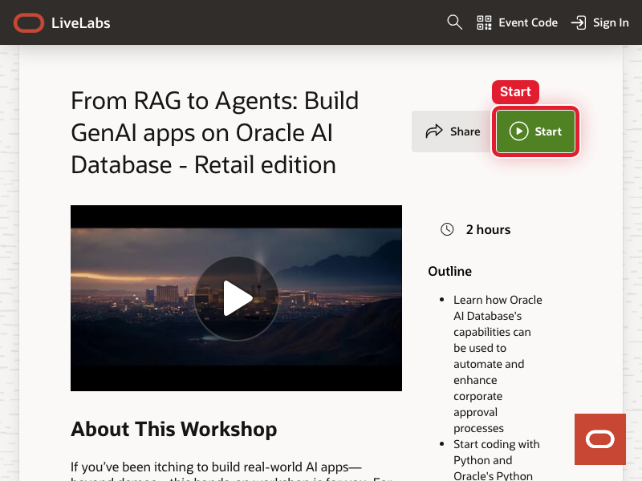
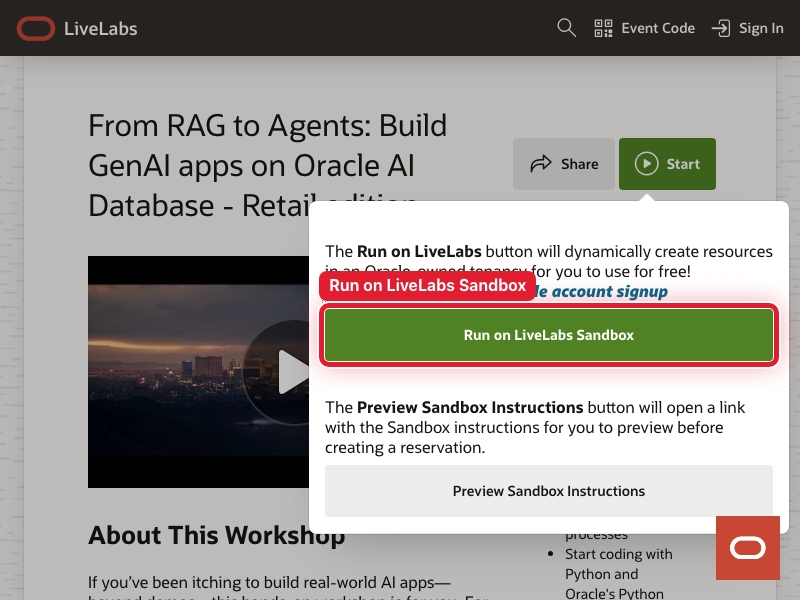
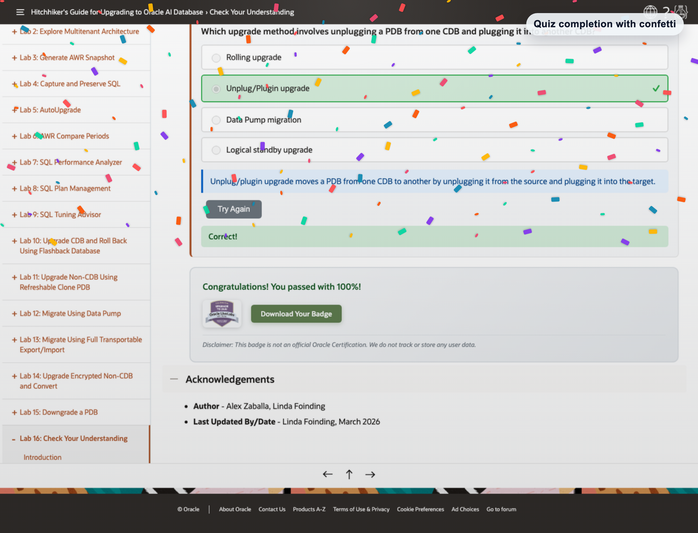

# Capture Workshop Images in Minute

## Introduction

This guide shows workshop authors how to use Codex to capture LiveLabs screenshots in a real browser.

It also shows how to annotate key UI elements, blur sensitive information, and keep the final files aligned with workshop markdown.

### Objectives

In this lab, you will:

- Pick the `webpage-screenshot-pipeline` Codex skill for the screenshot job
- Prepare workshop markdown with placeholder images 
- Prompt Codex to walk a lab and capture the right states
- Request annotations such as red boxes, blur rules, and celebratory overlays
- Handle non-deterministic browser behavior without losing the workflow

Estimated Time: 15 minutes

## Task 1: Pick The Right Skill For The Job

1. Use `webpage-screenshot-pipeline` as the default skill for LiveLabs page captures, button highlights, before-and-after states, and annotated screenshots.

2. Follow these capture rules:

    - Download the skill to your local directory & unzip
    - Point codex to the path of the directory & ask it to upload it as a skill
    - Disconnect from VPN to use the screen capture tool 
    - Use Chrome DevTools MCP tools & Playwright (codex should do it automatically)
    - Prefer PNG and stable file names

## Task 2: Add Placeholder Images Before Capture (optional)

1. Draft the workshop markdown with placeholder image references before you ask Codex to collect final screenshots.

3. Use a pattern like this in the lab markdown:

    ```md
    

    
    ```

## Task 3: Review Example Screenshots

1. Review these sample images from the LiveLabs flow captured for this guide.

2. Use them as a reference for the kind of output you can ask Codex to create.

    

    Start button highlighted.

    

    Run on LiveLabs Sandbox highlighted.

    

    Quiz completion example with confetti added as a celebration overlay.

## Task 4: Prompt Codex To Walk The Lab

1. Give Codex the exact workshop URL, workshop markdown path, and lab or task range whenever you have them.

2. Be explicit about the learner flow Codex should follow:

    - which console to open
    - which page or service to find
    - which fields to fill
    - which clicks matter
    - which states deserve a screenshot

3. Ask Codex to walk the lab step by step instead of capturing random pages.

4. Use this basic prompt template:

    ```text
    $webpage-screenshot-pipeline take <count> screenshots for <exact-url>.
    Use <workshop-path> and follow <lab/task range> step by step if relevant.
    Use <width>x<height>.
    Capture:
    1. <first state>
    2. <second state>
    3. <third state>
    Add red boxes around <button or selector>.
    Blur <IPs, emails, tenancy names, usernames, or other PII>.
    Save files under output/screenshots/<run-name>/.
    ```

5. Use this prompt when you want Codex to replace placeholder images by following a workshop task:

    ```text
    $webpage-screenshot-pipeline use /repo/my-workshop/lab2/lab.md and walk Lab 2 Tasks 1-4 step by step.
    Find the placeholder image references and create the missing screenshots.
    Open the OCI console pages described in each task.
    Fill the fields the learner must fill and capture the states that need visual confirmation.
    Add red boxes around the key controls.
    Blur IPs, tenancy names, user emails, and any visible PII.
    Track all screenshots in output/screenshots/lab2-console-flow/manifest.md.
    ```

6. Use this prompt when you want Codex to adapt if the UI is slightly different from the workshop text:

    ```text
    $webpage-screenshot-pipeline open <console-url> and follow the workshop task intent, not just the raw text.
    If the UI differs slightly from the lab, adapt and continue.
    Take screenshots for the important checkpoints.
    Use 1280x.
    Add red squares around the key parts of each image.
    Blur any PII.
    Save files under output/screenshots/<run-name>/.
    ```

## Task 5: Ask For The Right Image Edits

1. Tell Codex exactly what visual edits you want in the same prompt.

2. Common requests include:

    - add red boxes around important buttons
    - add labels to the key controls
    - blur IP addresses
    - blur emails, usernames, tenancy names, and other PII
    - add celebratory overlays such as confetti when the last image should feel like a success state

3. Use a concrete prompt instead of a vague one.

4. For example:

    ```text
    $webpage-screenshot-pipeline take 3 screenshots for https://livelabs.oracle.com/ords/r/dbpm/livelabs/view-workshop?wid=4195
    Use 800x600.
    Capture:
    1. workshop page with the Start button visible
    2. launch panel with Run on LiveLabs Sandbox visible
    3. page that loads after clicking Run on LiveLabs Sandbox
    Add red boxes around the Start button and the Run on LiveLabs Sandbox button.
    Add confetti to the last screenshot.
    Save files under output/screenshots/livelabs-sandbox-flow/.
    ```

5. If you need a resize-only redo, use a follow-up prompt like this:

    ```text
    $webpage-screenshot-pipeline redo screenshots 1 and 2 for https://livelabs.oracle.com/ords/r/dbpm/livelabs/view-workshop?wid=4195
    Use 800x600.
    Keep the red boxes.
    Save files under output/screenshots/livelabs-sandbox-flow/.
    ```

## Task 6: Handle Non-Deterministic Browser Flows

1. Expect LiveLabs pages, OCI consoles, and sandbox launches to behave differently across runs.

2. Treat that as normal, not as a failed workflow.

3. Ask Codex to stay structured, but not rigid:

    - follow the lab intent, not only exact button text
    - adapt when the UI is slightly different
    - re-snapshot after modals, drawers, sign-in screens, or redirects
    - capture what actually happened if the expected page does not load
    - record deviations in `manifest.md`

4. Remember this rule: step-by-step guidance matters, but creativity matters too.

5. The best screenshot runs happen when Codex has:

    - a clear goal
    - permission to adapt
    - stable file names
    - explicit annotation and blur instructions

## Task 7: Finish With Workshop-Ready Assets

1. After capture, switch to `livelabs-workshop-author` if you want Codex to place the images into workshop content.

2. Before you finish, confirm this checklist:

    - workshop path or lab path
    - exact URL
    - lab and task range
    - exact dimensions
    - exact states
    - exact buttons to highlight
    - blur rules for IPs and PII
    - output folder name
    - whether annotations are needed
    - whether Codex should open the files after capture

## Acknowledgements

* **Authors** - Linda Foinding, Principal Product Manager, Database Outbound Product Management
* **Contributors** - Kevin Lazarz
* **Last Updated By/Date** - Linda Foinding, April 2026
