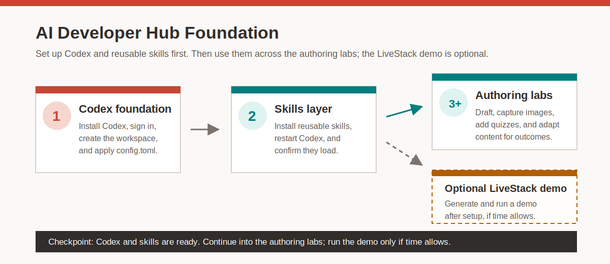

# Get Started with the LiveLabs AI Developer Hub

Estimated Workshop Time: 180 minutes

The LiveLabs AI Developer Hub brings together agentic and automation-first workflows that help authors move faster without lowering quality. Instead of treating workshop development as a long chain of manual tasks, the hub shows how to set up Codex, install reusable skills, generate a LiveStack demo, draft workshops from source material, capture screenshots, add knowledge checks, and adapt content for new audiences with far less repetition.

This matters because the real bottleneck in workshop delivery is rarely markdown alone. It is the surrounding work: planning, refactoring, image collection, QA cleanup, demo generation, and keeping multiple versions aligned. The hub packages those workflows so authors can spend more time shaping outcomes and less time repeating setup steps.

## Introduction

This workshop starts by preparing an AI developer computer for Oracle LiveLabs work. You will install Codex, add reusable Oracle AI Developer skills, and verify that Codex can find those skills. After that foundation is in place, you can optionally use LiveStacks Orchestrator with Podman to generate and run a local Oracle-first demo or run a supplied zip on an OCI Compute instance when the instructor provides a prebuilt package.

After the setup sequence, you will move through focused authoring examples that show how to create workshops from source materials, capture workshop-ready screenshots, add quiz-based knowledge checks, and create industry-specific workshop variants.

The path is intentionally direct: Codex is the foundation, skills add repeatable workflows, and the remaining labs show how those capabilities accelerate common LiveLabs author tasks. The LiveStack demo is optional and appears after setup so you can try a generated application before continuing into the authoring labs.

**Download the latest packaged skills** and view supporting READ ME documents from the [LiveLabs AI Developer Skills Repository](https://oracle-my.sharepoint.com/:f:/p/kay_malcolm/IgBlxiOi-InZRbQHn6htgExAAZVgHtxSIwjAyAxRkmXa4ag?e=OuPt5u).

### Objectives

In this workshop, you will:

- Install and configure Codex for hands-on training work.
- Install Codex skills from the shared Oracle skill bundle.
- Verify that Codex can find and use the installed skills.
- Install or verify Podman Desktop and Compose.
- Optionally use LiveStacks Orchestrator to generate a demo from a business prompt.
- Optionally build and run the generated stack locally.
- Optionally install Podman on OCI Compute and run a supplied zip.
- Convert source material into a first-draft workshop with the authoring skill.
- Capture screenshots that match the learner flow and workshop markdown.
- Add quiz checks at valid boundaries without changing the teaching flow.
- Review industry-converted workshops for fidelity, drift, and duplication.

## Lab outline

- **Lab 1: Install and Configure Codex** - Install Codex Desktop, choose a workspace, apply the training config, and restart Codex.
- **Lab 2: Install and Test Codex Skills** - Download skill zips from the shared Oracle folder, copy them into the Codex skills directory, restart Codex, and confirm the skills load.
- **Optional Lab: Generate and Run a LiveStack Demo** - Optional stretch lab: install or verify Podman Desktop, use LiveStacks Orchestrator to generate a demo, build the stack, open the running app, and optionally run a supplied zip on OCI Compute.
- **Lab 3: From Idea to Publish-Ready in One Flow** - Turn a source article into a draft LiveLabs workshop with a clear lab plan, validator-aligned markdown, and source-faithful learner tasks.
- **Lab 4: Capture Workshop Images in Minutes** - Capture workshop screenshots, annotate key UI states, blur sensitive information, and keep image assets aligned with placeholder references.
- **Lab 5: Add Knowledge Checks in Minutes** - Add quiz-based knowledge checks without rewriting the teaching content and validate the result.
- **Lab 6: Turn Features into Customer Outcomes** - Create an industry-specific workshop variant, preserve source fidelity, and review the output for drift or duplication.

## Prerequisites

- A macOS or Windows computer where you can install apps.
- Optional: access to an OCI tenancy where you can create a VCN, public subnet, security rules, and Oracle Linux Compute VM.
- Oracle network access and Oracle SSO for internal resources.
- Access to the LiveLabs AI Developer skill bundle in the shared Oracle folder.
- Enough free disk space for Podman Desktop, the Podman machine, and generated containers. Plan for about 35 GB free before creating the Podman machine.
- A team-approved OpenAI or Oracle sign-in path for Codex. Do not paste API keys into shared files, screenshots, or workshop artifacts.
- VS Code, Git, Python 3, Node.js, and a cloned LiveLabs repository for authoring and validation work.

> **Note:** AI-generated content should be reviewed carefully for accuracy, completeness, and alignment with Oracle and LiveLabs standards. Codex can significantly accelerate development, but it may produce incomplete or incorrect outputs. Authors are responsible for validating technical content, testing instructions, and ensuring overall quality before publishing.

## Learn More

- [LiveLabs AI Developer Asset Bundle](https://oracle-my.sharepoint.com/:f:/p/kay_malcolm/IgBlxiOi-InZRbQHn6htgExAAZVgHtxSIwjAyAxRkmXa4ag?e=OuPt5u)
- [Oracle LiveLabs How-To](https://livelabs.oracle.com/how-to)

## Acknowledgements

* **Author** - Linda Foinding, Principal Product Manager, Outbound Database Product Management
* **Last Updated By/Date** - Linda Foinding, May 2026
