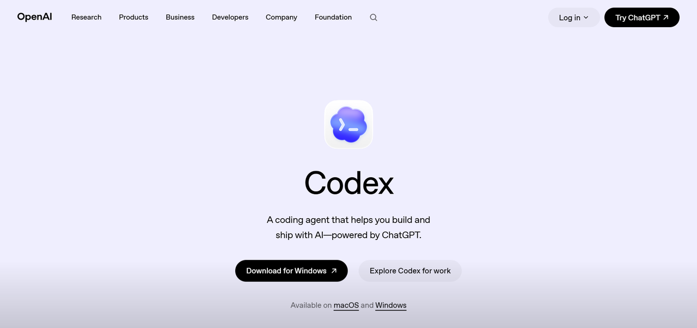

# Install and Configure Codex

## Introduction

This lab shows how to install **Codex Desktop**, choose a practical workspace, apply the training configuration, and restart Codex so the environment is ready for the remaining labs.

The goal is to create a clean starting point before you install skills or begin any authoring work. When Codex is set up correctly at the beginning, the later labs become faster and more predictable.

### Objectives
In this lab, you will:

- Install Codex Desktop on your local machine
- Choose a workspace that is easy to find and maintain
- Apply the training configuration used in this workshop
- Restart Codex and confirm that the configuration is active

Estimated Time: **15 minutes**

## Task 1: Install Codex Desktop

Perform the following set of steps to install Codex Desktop and complete the first launch:

1. Download and install **Codex Desktop** on your macOS or Windows machine using the approved internal distribution path for your team.
2. Complete the sign-in flow with the team-approved OpenAI or Oracle path and allow Codex to finish its first-run setup before you continue.
3. If the installer prompts for system permissions, approve only the permissions needed for normal local authoring work.

## Task 2: Choose A Workspace

Perform the following set of steps to choose a workspace that supports the rest of the training flow:

1. Create or select a workspace folder in a stable location where you can keep workshop drafts, screenshots, cloned repositories, and generated output together.
2. Use a path that is easy to recognize later. Avoid temporary folders, deeply nested paths, or personal locations that make the workspace harder to revisit during review.
3. Open that workspace in Codex and confirm that Codex can read and write inside it before you move on.

## Task 3: Apply The Training Config

Perform the following set of steps to apply the training configuration used for this workshop:

1. Copy the provided training configuration into the location your instructor or enablement guide specifies for Codex settings.
2. Use the training configuration exactly as provided so the workshop environment stays aligned across attendees, screenshots, and later labs.

**Note:** If the configuration includes model, tool, or workspace defaults, review them briefly so you understand what Codex will use during the rest of the workshop.

## Task 4: Restart And Verify Codex

Perform the following set of steps to restart Codex and verify that the training configuration is active:

1. Restart Codex after the configuration is in place so the application reloads its settings cleanly.
2. Reopen the same workspace and confirm that Codex starts normally, shows the expected environment defaults, and is ready for skill installation.

**Important:** If something looks wrong, correct the configuration now instead of carrying setup issues into the skill and authoring labs.

## Learn More

- [Oracle LiveLabs How-To](https://livelabs.oracle.com/how-to)

## Acknowledgements

Author - Teodor C. Nechita, Senior Technical Writer
Last Updated By/Date - Teodor C. Nechita, June 2026
