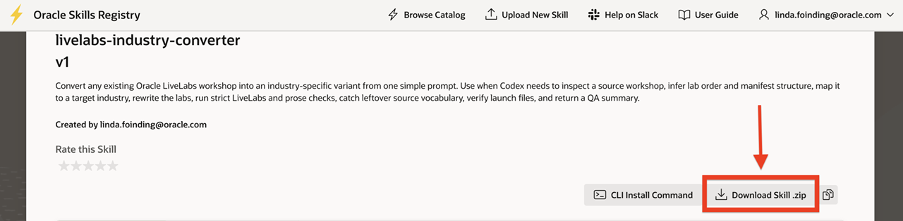

# Install and Test Codex Skills

## Introduction

This lab shows how to download the shared **skill bundles**, copy them into the Codex skills directory, restart Codex, and confirm that the skills load correctly.

The goal is to make reusable Oracle authoring workflows available before you move into the drafting, screenshot, quiz, and industry-conversion labs.

### Objectives

In this lab, you will:
* Download the required skill zip files from the shared Oracle folder
* Copy the skill folders into the Codex skills directory
* Restart Codex after the skills are installed
* Confirm that Codex can discover and use the installed skills

Estimated Time: **15 minutes**

## Task 1: Download The Skill Bundles

Perform the following set of steps to download the skill zip files you will install in Codex:

1. Open the [LiveLabs AI Developer Skills Repository](http://skills.oraclecorp.com/) and download the skill zip files required for the training labs:

    * [Livelabs Industry Converter SKill](https://skills.oraclecorp.com/ords/r/skills/lib/skill-detail?p5_skill_name=livelabs-industry-converter)
    * [Webpage Screenshot Pipeline Skill](https://skills.oraclecorp.com/ords/r/skills/lib/skill-detail?p5_skill_name=webpage-screenshot-pipeline)
    * [Livelabs Gamification Skill](https://skills.oraclecorp.com/ords/r/skills/lib/skill-detail?p5_skill_name=livelabs-gamification)
    * [FreeSQL Skill](https://skills.oraclecorp.com/ords/r/skills/lib/skill-detail?p5_skill_name=freesql)
    * [Livelabs Author Skill](https://skills.oraclecorp.com/ords/r/skills/lib/skill-detail?p5_skill_name=livelabs-author)

    
2. Keep the downloaded files together in a local staging folder so you can unzip and review them before copying them into the Codex skills directory.
3. If the shared folder includes README files, keep them with the downloads because they often explain installation details, dependencies, or intended usage.

## Task 2: Copy The Skills Into The Codex Skills Directory

Perform the following set of steps to unzip the skills and copy them into the Codex skills directory:

1. Unzip each downloaded skill bundle and review the folder names before you copy them into the Codex skills directory used by your local installation.
2. Copy the skill folders, not the original zip files, into the correct Codex skills location so Codex can discover them on restart.
3. Keep the copied folder names clean and stable. Avoid extra nesting from repeated unzip operations because it can prevent skill discovery.

## Task 3: Restart Codex After Installation

Perform the following set of steps to restart Codex after the skill folders are in place:

1. Close and reopen Codex after copying the skill folders so the application reloads the available skills from disk.
2. Return to the same workspace after restart so you can test the skills in the environment you will use for the rest of the workshop.

## Task 4: Confirm That The Skills Load

Perform the following set of steps to confirm that Codex can find and use the installed skills:

1. Use the skill names in a simple prompt or discovery flow and confirm that Codex recognizes them without fallback behavior or missing-skill errors.

**Note:** If a skill does not appear, verify the folder path, the extracted folder structure, and whether Codex was fully restarted after installation.

**Important:** Do not continue into the later labs until the required skills load consistently. The rest of the workshop assumes those workflows are available.

## Learn More

- [Oracle LiveLabs How-To](https://livelabs.oracle.com/how-to)

## Acknowledgements

Author - Teodor C. Nechita, Senior Technical Writer
Last Updated By/Date - Teodor C. Nechita, June 2026
