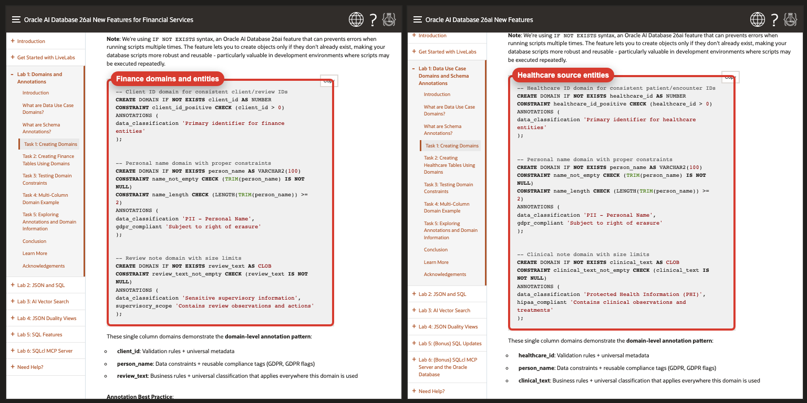

# Turn Features into Customer Outcomes

## Introduction

This lab shows authors how to use Codex and the `livelabs-industry-converter` skill to create an industry-specific version of an existing Oracle LiveLabs workshop without flattening the teaching flow.

You will learn how to give the skill a simple prompt, what the skill handles automatically, and what to review after conversion so the result stays close to the source workshop.

### Objectives

In this lab, you will:

- Use the simplest supported prompt shape for the converter
- Provide the source workshop path, target industry, and optional company and output path
- Understand what the skill does automatically during conversion
- Review the converted workshop for fidelity, screenshots, and leftover source-domain residue
- Review side-by-side live server comparisons of the source and converted workshops
- Avoid common mistakes such as over-specifying the prompt or trusting validator output alone

Estimated Time: 10 minutes

## Task 1: Start With The Simplest Prompt

1. Use `livelabs-industry-converter` when you want Codex to inspect an existing workshop and produce a target-industry version with the same teaching flow.

2. Provide these inputs:

    - source workshop path
    - target industry
    - optional company name
    - optional output path

3. Use a prompt like this:

    ```text
    $livelabs-industry-converter convert this workshop to the finance industry.
    Source: /path/to/source/workshop
    Output: /path/to/output/industries/finance
    Company: Seer Equity
    ```

4. If you omit `Output:`, expect the skill to create a reasonable default under an `industries/<industry-slug>` path beside the source workshop.

5. If you omit `Company:`, expect the skill to use a credible generic company instead of over-branding the workshop.

## Task 2: Let The Skill Handle The Internal Logic

1. Do not pack the prompt with validator rules, grading instructions, prose rules, or conversion mechanics.

2. The skill already handles the internal workflow:

    - inspect the source workshop and treat it as canonical
    - detect lab order, manifest structure, shared assets, and launch flow
    - map source entities into the target industry
    - rewrite labs, manifests, sample data, statuses, IDs, and output artifacts
    - preserve screenshots and image coverage
    - validate LiveLabs structure and launch flow
    - check for leftover source vocabulary
    - compare the converted workshop back to the source for fidelity

## Task 3: Know What The Skill Tries To Preserve

1. The converter is designed to preserve the source workshop before it rewrites anything.

2. Expect it to preserve:

    - lab order
    - section order
    - task count
    - step count
    - explanatory depth
    - generic product setup wording
    - screenshots and visual callouts

3. Expect it to rewrite only the parts that truly need industry conversion, such as:

    - personas
    - business objects
    - table names
    - statuses
    - sample records
    - report labels
    - dashboard labels
    - output examples

4. This means generic labs should remain close to the source, while domain-specific labs should feel native to the target industry.

## Task 4: Review The Output Like An Editor

1. After the conversion, review the updated workshop side by side with the source.

2. Check these items first:

    - no missing labs
    - no missing tasks
    - no missing numbered steps
    - no shortened introductions or conclusions
    - no dropped screenshots or images
    - no leftover source-domain nouns

3. Then check for over-rewrite:

    - generic setup wording should still look close to the source
    - sentence structure should stay close where no domain change was needed
    - SQL and sample code should stay proportionate to the source instead of becoming larger or more custom than necessary

## Task 5: Review Live Server Comparison Screenshots

1. Use the live server screenshots below as a concrete example of what a source-fidelity review looks like.

2. In these comparisons, the finance version is on the left and the original Oracle AI Database 26ai workshop is on the right.

3. Review the introduction pages side by side:

    

    Side-by-side live server comparison of the introduction pages with labels that mark the finance rewrite and the source.

4. Review Lab 1 side by side at the SQL conversion point:

    

    This view highlights how healthcare entities were mapped into finance entities while the task structure and SQL teaching pattern stayed intact.

5. Review Lab 2 side by side at the first JSON task:

    

    This view highlights the domain-specific SQL conversion from patients and appointments to clients and reviews.

## Task 6: Watch For The Common Failure Modes

1. Watch for these specific failure modes:

    - content was shortened between steps
    - generic labs were paraphrased without a need
    - screenshots were referenced but not preserved in the right place
    - validator-driven edits appended new text instead of merging into the restored source section

2. If you see drift, ask Codex to do a strict side-by-side pass on the affected labs instead of asking for a generic polish pass.

## Task 7: Use Follow-Up Prompts That Fix The Right Thing

1. If the conversion is too loose, ask for a fidelity pass instead of a rewrite.

2. Use a prompt like this when the output was shortened:

    ```text
    Recheck this conversion line by line against the source workshop.
    Restore any skipped steps, shortened explanations, and missing screenshots.
    Keep generic wording close to the source and rewrite only what the industry change requires.
    ```

3. Use a prompt like this when a repair pass introduced duplication:

    ```text
    Recheck your work for duplicated content introduced during the repair pass.
    Remove repeated intro blocks, repeated objective sections, repeated notes, and repeated task text without cutting the restored content.
    ```

4. Use a prompt like this when only certain labs drifted:

    ```text
    Recheck Labs 3 and 4 side by side against the source workshop.
    Keep the source structure, screenshots, and sentence flow wherever the content is generic.
    ```

## Task 8: Expect A Useful Delivery Summary

1. Expect Codex to report:

    - converted workshop path
    - files created or updated
    - domain mapping summary
    - source-fidelity summary
    - QA summary
    - unresolved SME gaps if any remain

2. Before you finish, confirm:

    - the source path was correct
    - the target industry was correct
    - the output path was correct
    - the workshop still launches through the intended manifest
    - the converted labs preserve the source flow
    - no duplicate content was introduced during repair

## Acknowledgements

* **Author** - Linda Foinding, Principal Product Manager, Database Outbound Product Management
* **Last Updated By/Date** - Linda Foinding, April 2026
