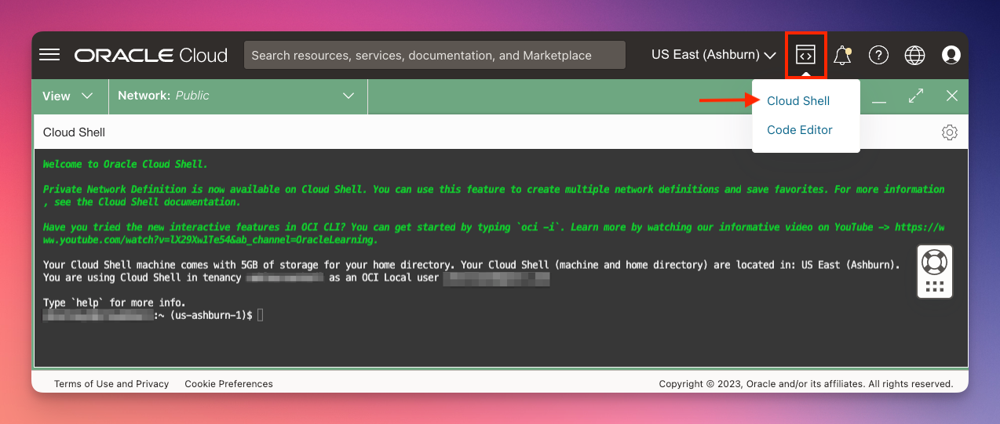
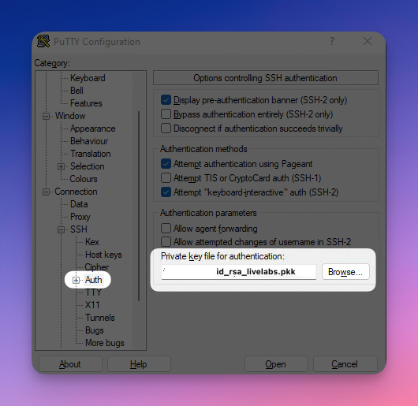
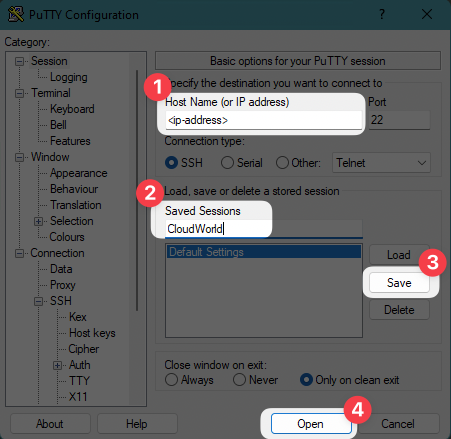

# SSH Keys provided LiveLabs

## Introduction

Some hands-on labs will utilize pre-provisioned environments that may necessitate logging in via SSH to a specific server.
We employ a LiveLabs-generic SSH key pair to streamline the environment provisioning process, saving you valuable time.
This approach allows you to commence the hands-on exercises promptly without the need to worry about initial configurations.

Estimated Time: 5 Minutes


### Objectives

- Learn how to use the LiveLabs-generic SSH keys to connect to pre-provisioned environments

### Prerequisites
- A LiveLabs workshop environment that was pre-provisioned
- Some familiarity with SSH keys
- Some familiarity with Linux/MacOS Terminal commands OR Putty in case you are using Microsoft Windows


In the following sections, we provide instructions on using the provided LiveLabs-generic SSH keys.

## Task 1 (**recommended**): Oracle Cloud Shell

Oracle Cloud Infrastructure comes out-of-the-box with a handy utility: Oracle Cloud Shell.
You can use Oracle Cloud Shell to connect to your remote server using SSH.

1. After you log in to OCI, open Oracle Cloud Shell. If it is the first time using Cloud Shell, it may take a minute or so to start up.

  

2. Download the SSH keys using wget

    ```bash
    <copy>
    wget https://objectstorage.us-ashburn-1.oraclecloud.com/p/75QkYvgn8zNo7vSaI8M4k5GGvs62bRQzeHPQFCxoQQZD1nwD5sl8oDyWjkBvAScE/n/c4u04/b/OCW2024/o/id_rsa_livelabs.zip 
    </copy>
    ```
3. Unzip the archive

    ```bash
    <copy>
    unzip id_rsa_livelabs.zip
    </copy>
    ```

   You will find the following files:

      * id\_rsa\_livelabs (private key)
      * id\_rsa\_livelabs.pub (public key)
      * id\_rsa\_livelabs.ppk (private key in Putty format - for Windows only)

4. Modify file permissions

    ```bash
    <copy>
    chmod 600 id_rsa_livelabs
    </copy>
    ```

5. Connect to the remote server using SSH

    ```bash
    <copy>
    ssh -i id_rsa_livelabs <user>@<ip-adress>
    </copy>
    ```


## Task 2: Connect using MacOS/Linux/Windows (via Subsystem for Linux) 

If you are using macOS/Linux, you can connect using a terminal application, such as the default terminal application.
The instructions below also apply if you are using Microsoft Windows Subsystem for Linux (WSL).

1. Open the terminal application of your choice:

   * Terminal (MacOs default)
   * GNOME Terminal (Linux)
   * ...

2. Download the SSH keys using wget

    ```bash
    <copy>
    wget https://objectstorage.us-ashburn-1.oraclecloud.com/p/75QkYvgn8zNo7vSaI8M4k5GGvs62bRQzeHPQFCxoQQZD1nwD5sl8oDyWjkBvAScE/n/c4u04/b/OCW2024/o/id_rsa_livelabs.zip 
    </copy>
    ```
3. Unzip the archive

    ```bash
    <copy>
    unzip id_rsa_livelabs.zip
    </copy>
    ```

   You will find the following files:

      * id\_rsa\_livelabs (private key)
      * id\_rsa\_livelabs.pub (public key)
      * id\_rsa\_livelabs.ppk (private key in Putty format - for Windows only)

4. Modify file permissions

    ```bash
    <copy>
    chmod 600 id_rsa_livelabs
    </copy>
    ```

5. Connect to the remote server using SSH

    ```bash
    <copy>
    ssh -i id_rsa_livelabs <user>@<ip-adress>
    </copy>
    ```


## Task 3: Connect using Windows by using Putty 

You can also use Putty to connect to the remote server.
You must have Putty installed. [Download Putty](https://www.putty.org/)

1. Download the id_rsa_livelabs.zip using a browser of your choice from the following URL or click [here]([id_rsa_livelabs.zip](https://objectstorage.us-ashburn-1.oraclecloud.com/p/75QkYvgn8zNo7vSaI8M4k5GGvs62bRQzeHPQFCxoQQZD1nwD5sl8oDyWjkBvAScE/n/c4u04/b/OCW2024/o/id_rsa_livelabs.zip )):

    ```bash
    <copy>
    https://objectstorage.us-ashburn-1.oraclecloud.com/p/75QkYvgn8zNo7vSaI8M4k5GGvs62bRQzeHPQFCxoQQZD1nwD5sl8oDyWjkBvAScE/n/c4u04/b/OCW2024/o/id_rsa_livelabs.zip 
    </copy>
    ```

2. Unzip the file and copy the file id\_rsa\_livelabs.ppk to a folder of your choice, for example to your Windows Desktop.

3. Open Putty and add id\_rsa\_livelabs.ppk to configuration settings

    

4. Provide connection details (optional step 2 and 3: save the settings for later use)

    

You will be prompted for the username once you click 'Open'

## Learn More

* Click [here](https://docs.oracle.com/en-us/iaas/Content/GSG/Tasks/signingin.htm#supported_browsers) to know more about the requirements for signing into Oracle Cloud Infrastructure.
* Click [here](https://github.com/novnc/noVNC#browser-requirements) to know more about the requirements for using noVNC.

## Acknowledgements

* **Author** - Kevin Lazarz, Oracle Database Product Management, Senior Manager, Database Product Management
* **Last Updated By/Date** - Ana Coman, September 2024
