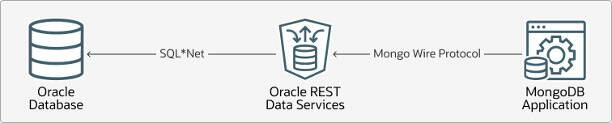

# Install MongoDB Shell

## Introduction

This lab walks you through the steps to install the MongoDB Shell that can interact with Oracle Autonomous AI JSON Database collections through the Oracle Database API for MongoDB.

**NOTE**: Mongo Shell is provided by MongoDB Inc. Oracle is not associated with MongoDB Inc, and has no control over the software. These instructions are provided simply to help you learn about Oracle Database API for MongodDB. Links may change without notice.

Estimated Time: 15 minutes

### About Oracle Database API for MongoDB
Oracle Database API for MongoDB makes it possible to connect to Oracle Autonomous AI Database using MongoDB language drivers and tools.  Oracle Database API for MongoDB leverages the converged database capabilities of an Autonomous AI Database to manage multiple data types, including JSON data, within a single database.



### Objectives

In this lab, you will:
* Install MongoDB Shell on your local machine
* Alternatively, you can install MongoDB Compass (GUI)
* Set up your PATH to point to the MongoDB Shell executable

### Prerequisites

This lab assumes you have:
* A Mac OS/X machine (Intel or Apple hardware) or a Windows PC.
* Access to the command prompt / terminal

## Task 1: Open a terminal and determine the type of hardware (Mac only) or open  command prompt (Windows only)

1. (Mac only) Open the **Terminal** utility, type the following and press enter:

    ```bash
    <copy>
    uname -m
    </copy>
    ```

An output of `x86_64` indicates your Mac has an Intel processor; an output of `arm64` indicates your Mac has an Apple silicon processor (M1, M2, etc).  You will use this to determine which version of Mongosh and MongoDB command line database tools to download.

2. (Windows only) Open the **Command Prompt** utility.

## Task 2: Download MongoDB shell

1. First, create and enter a suitable directory. Under the default home directory, create a directory called 'mongosh'. For **Mac or Windows**, enter the following commands:

    ```bash
    <copy>
    mkdir mongo
    cd mongo
    </copy>
    ```

2. On both Mac and Windows, you can use the built-in 'curl' command to access a URL and download a file from it. The URL to use will vary according to the machine involved.

3. Copy **ONE** of the following *curl* commands and paste it to the command or terminal window:

    * For **Mac with Intel processor** (Terminal output  `x86_64`):

        Download MongoDB Shell:

        ```bash
        <copy>
        curl https://downloads.mongodb.com/compass/mongosh-2.5.9-darwin-x64.zip -o mongosh.zip
        </copy>
        ```

    * For **Mac with Apple chip** (Terminal output `arm64`):

        Download MongoDB Shell:

        ```bash
        <copy>
        curl https://downloads.mongodb.com/compass/mongosh-2.5.9-darwin-arm64.zip -o mongosh.zip
        </copy>
        ```

    * For **Windows**:

        Download MongoDB Shell:

        ```bash
        <copy>
        curl https://downloads.mongodb.com/compass/mongosh-2.5.9-win32-x64.zip -o mongosh.zip
        </copy>
        ```

4. The previous step will have downloaded a zip files called mongosh.zip, which we need to expand.

    On **Mac or Windows**, run the following command:

    ```bash
    <copy>
    mkdir -p mongosh | tar -xvf mongosh.zip -C mongosh --strip-components=1
    </copy>
    ```

    **Note**: If you encounter any issues with the download or the version listed here, then please visit:
    * [MongoDB Download Shell Instructions](https://www.mongodb.com/try/download/shell)
    * [Mongodb Download Database Tools Instructions](https://www.mongodb.com/try/download/database-tools)

    All subsequent instructions continue to be the same.

    **Note**: tar is a built-in command in Windows 11 and recent Windows 10 builds. If for any reason it is not available, you will need to expand the zip file using Windows Explorer. On Mac, you could use the command 'unzip mongosh.zip' to the same effect.

## Task 3: Set the PATH to include the mongosh executable

1. On **Mac** (Intel or Apple silicon) run the following command to set your path variable to include the location of the **mongosh** executable.

    ```bash
    <copy>
    export PATH=$(dirname `find \`pwd\` -name mongosh -type f`):$PATH
    </copy>
    ```

2. On **Windows** run the following command to set your path variable to include the location of the **mongosh** executable.

    ```
    <copy>
    for /f "delims=" %G in ('where /r "%cd%" mongosh.exe') do @set "PATH=%~dpG;%PATH%" & goto :eof
    </copy>
    ```

3. Test whether you can reach the mongosh executable file:

    * in a Mac terminal:
    ```
    <copy>
    cd $HOME/mongo
    </copy>
    ```
    * in a Windows command prompt:
    ```
    <copy>
    cd %USERPROFILE%/mongo
    </copy>
    ```
    * in Mac or Windows:
    ```
    <copy>
    mongosh --version
    </copy>
    ```

    Should output the version downloaded from mongodb in Task 2.

    **NOTE**: If that fails, you'll have to set your path manually to include the 'bin' directories from the zip files you just downloaded. If you close and reopen your terminal window, you will need to re-run this command. Alternatively, you can always navigate to the directory where you have extracted the software and run the shell with the relative path.

4. Keep the command or terminal window open for later use. If you close it and need to reopen it, you will need to set the PATH again according to the instructions above.

Mongo Shell is now set up on your PC or Mac.

## Task 4 (optional): Install MongoDB Compass, the GUI for MongoDB

1. Identify the appropriate MongoDB Compass download for your local machine at:
* [MongoDB Download and Install Compass](https://www.mongodb.com/docs/compass/install/?operating-system=linux&package-type=.deb#std-label-download-install)

    MongoDB Compass offers you both a graphical user interface, as well as a built-in MongoDB shell. This step is optional, so it is not described in more detail here, although the installation itself is intuitive and self-describing.

## Learn More

* [Using Oracle Database API for MongoDB](https://docs.oracle.com/en/cloud/paas/autonomous-database/serverless/adbsb/mongo-using-oracle-database-api-mongodb.html#GUID-8321D7A6-9DBD-44F8-8C16-1B1FBE66AC56)
* [Oracle AI Database API for MongoDB](https://blogs.oracle.com/database/post/mongodb-api)

## Acknowledgements

* **Authors** - Hermann Baer
* **Contributors** -  Beda Hammerschmidt
- **Last Updated By/Date** - Eileen Beck, November 2025