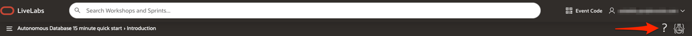
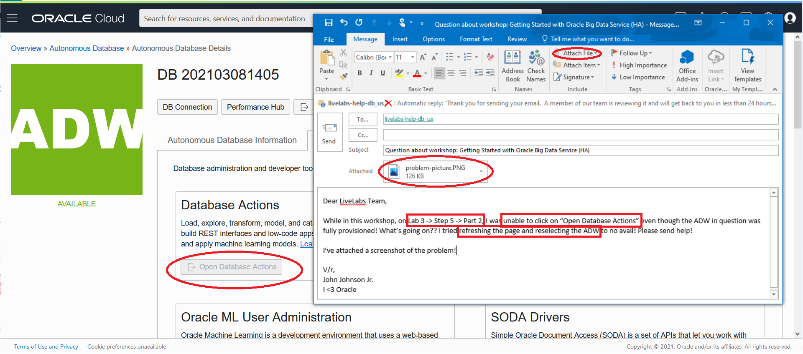
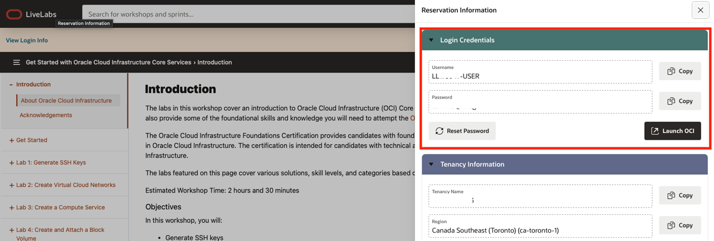
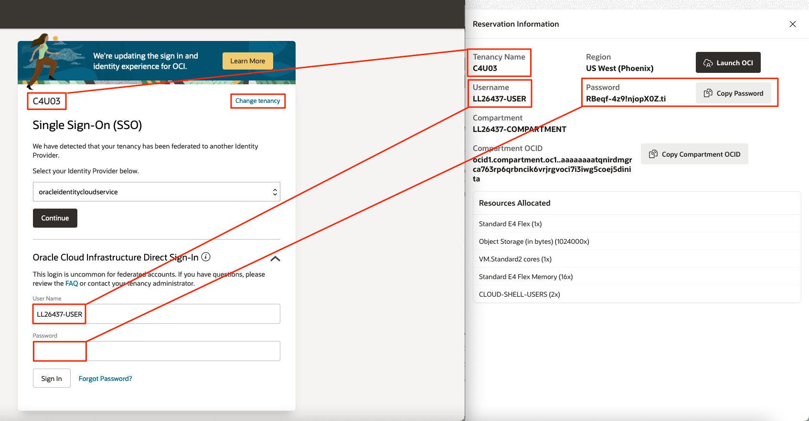
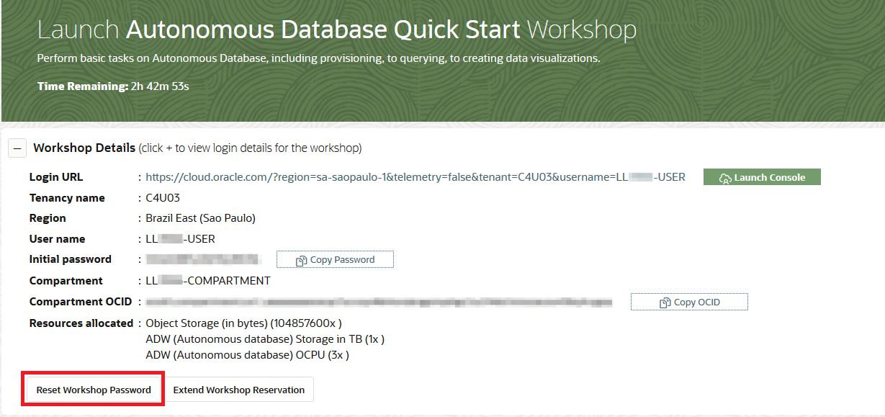
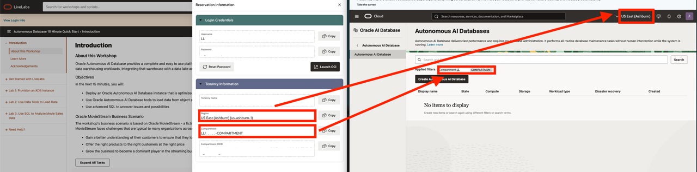

# Need help?

## Introduction
This page is designed to help you solve some common problems users face in this LiveLab.

If you still find yourself stuck or would like to report an issue with the workshop, click the question mark icon in the upper left corner to contact the LiveLabs team directly via email.  

For more about getting support using our email, click [here](#HowtoFormatYourSupportEmailRequest).

### Common Issues Table of Contents
  - [Can't Login to Oracle Cloud](#CantLogintoOracleCloud)
  - [Can't Create An Oracle Database? Nothing In Your Compartment?](#CantCreateanOracleDatabase?NothinginYourCompartment?)
  - [Connectivity Issues? Unable To Upload Data or Connect To The database?](#ConnectivityIssues?UnabletoUploadDataorConnecttotheDatabase?)

## How to Format Your Support Email Request
This will construct an email in your default mail application that is auto populated to address our LiveLabs support inbox and will also include your current workshop in the subject line. Follow the steps below to contact us and get a quick resolution to your issue.

1. Do not change the subject line.
2. Include the description of your issue and any pertinent information in the contents on your email.

    

3. Include the **Lab Number**, **Step Number**, and **Sub-Step Number** where you've encounter the issue. 
4. Attach a **Screenshot** and **Any Troubleshooting Steps** you've tried so we can recreate the issue and provide a timely and accurate solution.

    

## Can't Login to Oracle Cloud
1. Double check that you are using the information and credentials provided to you in the lab banner. 

    

2. Make sure you are using the tenancy, username, and password provided to you in the lab banner.

    

3. If you've forgotten your password, you can reset it to the default lab password provided in the lab banner.

    

## Can't Create an Oracle Database? Nothing in Your Compartment?
1. Ensure that under "List Scope", you are selecting the compartment provided to you in the lab banner. 

2. If you can't find your compartment in the drop-down box, make sure you *set your region* to the one provided in the lab banner.

    

## Connectivity Issues? Unable to Upload Data or Connect to the Database?
Are you connected to a **VPN**, **Corporate Network**, or behind a strict **Firewall**?

If any of these three conditions are true, some ports in your network may be closed to traffic. Uploading data through Database Actions in your web browser and applications like the Oracle Analytics Tool could be restricted and may appear to "Hang" or freeze. 

1. Please disconnect from your VPN and try again if applicable.

2. If you are connected to a corporate network, try switching to a public or a "clear" network if allowed.

3. Alternatively, contact your IT Administrator to see if adding exceptions to your network or firewall would be viable.

## Cannot Create Password for Database Users?

1. Make sure the password you enter only contains upper case letters, lower case letters, numbers, and underscores as special characters.