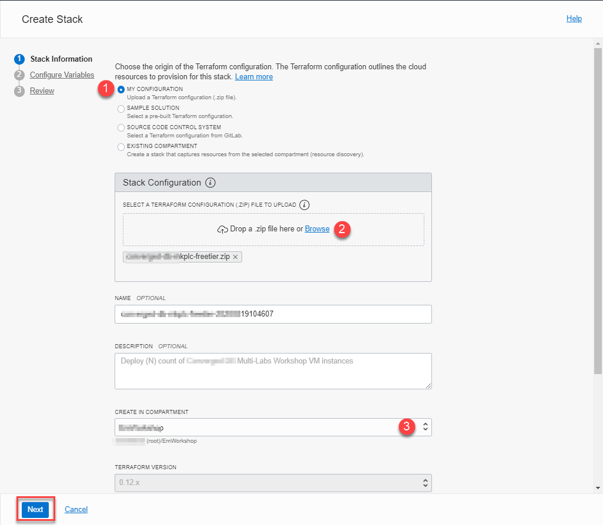
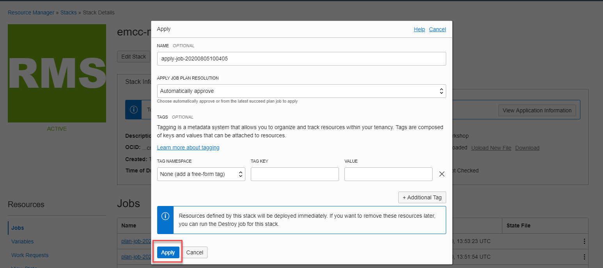
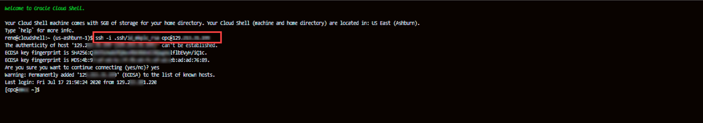
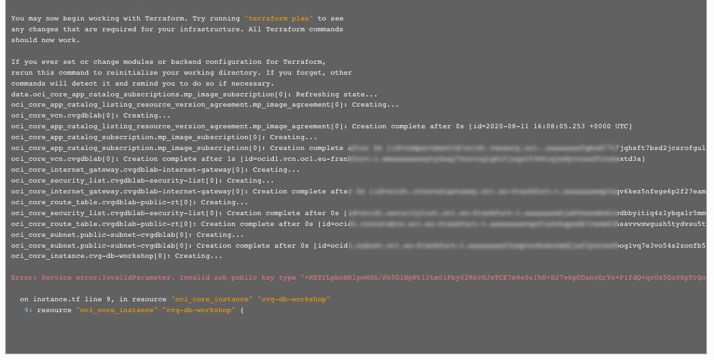

# Set up compute instance

## Introduction
This lab will show you how to set up a Resource Manager stack that will generate the Oracle Cloud objects needed to run your workshop.

Estimated Time: 15 minutes

### About Terraform and Oracle Cloud Resource Manager
For more information about Terraform and Resource Manager, please see the appendix below.

### Objectives
In this lab, you will:
-   Create Compute + Networking Resource Manager Stack
-   Connect to compute instance

### Prerequisites
This lab assumes you have:
- An Oracle Cloud account
- SSH Keys
- Performed *Lab: Prepare Setup*

Watch the video below for a quick walk-through of the lab.

[Lab walk-through](youtube:4KdA855RwIo)

## Task 1A: Create Stack:  Compute + Networking
1.  Identify the ORM stack zip file downloaded in *Lab: Prepare Setup*
2.  Log in to Oracle Cloud
3.  Open up the hamburger menu in the top left corner. Under the **Developer Services** submenu, choose **Resource Manager** > **Stacks**.  Choose the compartment in which you would like to install the stack. Click **Create Stack**.

  

  

4.  Select **My Configuration**, choose the **.Zip file** button, click the **Browse** link, and select the zip file that you downloaded. Click **Select**.

  

5. Enter the following information:

      - **Name**:  Enter a name or keep the prefilled default (*DO NOT ENTER ANY SPECIAL CHARACTERS HERE*, including periods, underscores, exclamation, etc, it will mess up the configuration and you will get an error during the apply process)
      - **Description**:  Same as above
      - **Create in compartment**:  Select the correct compartment if not already selected

     >**Note:** If this is a newly provisioned tenant such as freetier with no *user-created compartment*, stop here and first create a compartment before proceeding.
6.  Click **Next**.

7. Enter or select the following:
   

    - **Instance Count:** Keep the default to **1** to create only one instance. You may also choose a higher number if you need more than one instance created.
    - **Select an Availability Domain:** Select an availability domain from the dropdown list.
    - **SSH Public Key**:  Paste the public key you created in the earlier lab

    >**Note:** If you used the Oracle Cloud Shell to create your key, make sure you paste the pub file in a notepad, and remove any hard returns. The file should be one line or you will not be able to login to your compute instance.

8. Depending on the quota you have in your tenancy, you can choose from standard Compute shapes or Flex shapes.  We recommend *standard shapes* unless not available or you have run out of quota (Please visit the Appendix: Troubleshooting Tips for instructions on checking your quota)
    - **Use Flexible Instance Shape with Adjustable OCPU Count?:** Keep the default as checked (unless you plan on using a fixed shape)
    - **Instance Shape:** Keep the default or select from the list of Flex shapes in the dropdown menu (e.g *VM.Standard.E4.Flex*).
    - **Instance OCPUS:** Accept the default shown. e.g. (**4**) will provision 4 OCPUs and 64GB of memory. You may also elect to reduce or increase the count by selecting from the dropdown. e.g. `[2-24]`. Please ensure you have the capacity available before increasing.

9.  If don't have quota for Flex Shapes or you prefer to use fixed shapes, follow the instructions below.  Otherwise, skip to the next step.
    - **Use Flexible Instance Shape with Adjustable OCPU Count?:** Unchecked
    - **Instance Shape:** Accept the default shown or select from the dropdown. e.g. VM.Standard2.4

  

10. For this section we will provision a new VCN with all the appropriate ingress and egress rules needed to run this workshop.  If you already have a VCN, make sure it has all of the correct ingress and egress rules and skip to the next section.
    - **Use Existing VCN?:** Accept the default by leaving this unchecked. This will create a **new VCN**.

11. Click **Next**.
12. Review and click **Create**.

  

13. Your stack has now been created!

  

You may now proceed to Task 2 (skip Task 1B).

## Task 1B: Create Stack:  Compute only
If you just completed Task 1A, please proceed to Task 2.  If you have an *existing VCN* and are comfortable updating VCN configurations, please ensure your VCN meets the minimum requirements. Refer to *Lab: Prepare Setup*

>**Note:** We recommend letting our stack create the VCN to reduce the potential for error, as shown in Task 1A.

1.  Identify the ORM stack zip file downloaded in *Lab: Prepare Setup*
2.  Log in to Oracle Cloud
3.   Open up the hamburger menu in the top left corner. Under the **Developer Services** submenu, choose **Resource Manager** > **Stacks**.  Choose the compartment in which you would like to install the stack. Click **Create Stack**.

  

  

4. Select **My Configuration**, choose the **.Zip file** button, click the **Browse** link and select the zip file (dbsec-lab-mkplc-freetier.zip) that you downloaded. Click **Select**.

  

  Enter the following information:
    - **Name**:  Enter a name  or keep the prefilled default (*DO NOT ENTER ANY SPECIAL CHARACTERS HERE*, including periods, underscores, exclamation, etc, it will mess up the configuration and you will get an error during the apply process)
    - **Description**:  Same as above
    - **Create in compartment**:  Select the correct compartment if not already selected

    >**Note:** If this is a newly provisioned tenant such as freetier with no *user-created compartment*, stop here and first create a compartment before proceeding.

5. Click **Next**.

    

    Enter or select the following:
    - **Instance Count:** Keep the default to **1** to create only one instance. You may also choose a higher number if you need more than one instance created.
    - **Select an Availability Domain:** Select an availability domain from the dropdown list. This availability domain should match the availability domain of your existing VCN's public subnet.
    - **SSH Public Key**:  Paste the public key you created in the earlier lab

    >**Note:** If you used the Oracle Cloud Shell to create your key, make sure you paste the pub file in a notepad, and remove any hard returns. The file should be in one line or you will not be able to login to your compute instance

    - **Use Flexible Instance Shape with Adjustable OCPU Count?:** Keep the default as checked (unless you plan on using a fixed shape)
    - **Instance Shape:** Keep the default or select from the list of Flex shapes in the dropdown menu (e.g *VM.Standard.E4.Flex*).
    - **Instance OCPUS:** Accept the default shown. e.g. (**4**) will provision 4 OCPUs and 64GB of memory. You may also elect to reduce or increase the count by selecting from the dropdown. e.g. `[2-24]`. Please ensure you have the capacity available before increasing.
    - **Use Existing VCN?:** Check to select.

    

    - **Select Existing VCN?:** Select existing VCN with regional public subnet and required security list.
    - **Select Public Subnet:** Select the existing public subnet from the above VCN.

    

    For an existing VCN Option to be used successfully, review the *Appendix 2* at the bottom of this lab.

6. If you prefer to use fixed shapes, follow the instructions below.  Otherwise, skip to the next step.
    - **Use Flexible Instance Shape with Adjustable OCPU Count?:** Unchecked
    - **Instance Shape:** Accept the default shown or select from the dropdown. e.g. VM.Standard.E2.4

  

7. Review and click **Create**.

  

8. Your stack has now been created!

  

## Task 2: Terraform Plan (OPTIONAL)
When using Resource Manager to deploy an environment, execute a terraform **plan** to verify the configuration. This is optional. *You may skip directly to Task 3*.

1.  **[OPTIONAL]** Click **Terraform Actions** -> **Plan** to validate your configuration.  This takes about a minute, please be patient.

  

  

  

  

  

  

## Task 3: Terraform Apply
When using Resource Manager to deploy an environment, execute a terraform **apply** to actually create the configuration.  Let's do that now.

1.  At the top of your page, click **Stack Details**. Click **Terraform Actions** -> **Apply**.  This will create your network (unless you opted to use an existing VCN) and the compute instance.

  

  

  

2.  Once this job succeeds, you will get an apply complete notification from Terraform.  Examine it closely, 8 resources have been added (3 only if using an existing VCN).

    >**Note:** If you encounter any issues running the terraform stack, visit the *Appendix: Troubleshooting Tips* section below.

    

    

    

    

3.  Congratulations, your environment is created!  Click the **Application Information** tab to get additional information about what you have just done.

  

4.  Your public IP address and instance name will be displayed.  Note the public IP address, you will need it for the next step.

## Task 4: How to Establish a Terminal Connection to Your Instance
Depending on your workshop, you may need to connect to the instance via a secure shell client (SSH). If you're instructed in the next labs to execute tasks via an SSH terminal, review the options below and select the one that best meets your needs.

Choose the environment where you created your SSH keys in the previous lab (Generate SSH Keys)

>**Note:** If you are not using Cloud Shell and are using your laptop to connect, your corporate VPN may prevent you from logging in.

### **Option 1:** Upload Key to Cloud Shell and Connect

1.  Go to the compartment assigned to you. To start the Oracle Cloud Shell, go to your Cloud console and click **Cloud Shell** at the top right of the page.

	  

	  

    >**Note:** If you get a *Policy Missing* error, make sure you are in the compartment assigned to you.

2.  Click the Setting icon and select **Upload** to upload your private key.

    

3.  To connect to the compute instance that was created for you, you will need to load your private key.  This is the key that does *not* have a .pub file at the end.  Locate that file on your machine and click **Upload** to process it.

    

4. Be patient while the key file uploads to your Cloud Shell directory
    

    

5. Once finished, run the command below to check to see if your SSH key was uploaded.  Change the permissions to 600 and move it into your .ssh directory

    ````
    <copy>
    ls
    </copy>
    ````

    ````text
    chmod 600 <<keyname>>
    mv <<keyname>> .ssh
    ls .ssh
    cd ~
    ````

    

6.  If you didn't jot down your compute instance public IP address, go to *Compute* -> *Instance* and select the instance you created (make sure you choose the correct compartment). Alternatively, if you are using the LiveLabs Sandbox environment, you can navigate to **My Reservations** in LiveLabs, click **Launch Workshop**, then **View Login Info** to get your public IP.

7.  Secure Shell into the compute instance using your uploaded key name

    ````text
    ssh -i ~/.ssh/<sshkeyname> opc@<Your Compute Instance Public IP Address>
    ````
    

    >**Note:** Make sure you are in the region and compartment you were assigned. If you are unable to SSH in, check out the troubleshooting tips below.

8.  When prompted, answer **yes** to continue connecting.

You may now **proceed to the next lab**.

### **Option 2:** MAC or Windows CYGWIN Emulator
1.  Go to **Compute** -> **Instance** and select the instance you created (make sure you choose the correct compartment).
2.  On the instance homepage, find the *Public IP address* for your instance.
3.  Open up a terminal (MAC) or cygwin emulator as the opc user.  Enter yes when prompted.

    ````text
    ssh -i ~/.ssh/<sshkeyname> opc@<Your Compute Instance Public IP Address>
    ````
    

4.  After successfully logging in, you may now **proceed to the next lab**.

### **Option 3:** Windows using Putty

On Windows, you can use PuTTY as an SSH client. PuTTY enables Windows users to connect to remote systems over the internet using SSH and Telnet. SSH is supported in PuTTY, provides for a secure shell, and encrypts information before it's transferred.

1.  Download and install PuTTY. [http://www.putty.org](http://www.putty.org)
2.  Run the PuTTY program. On your computer, go to **All Programs > PuTTY > PuTTY**
3.  Select or enter the following information:
    - Category: _Session_
    - IP address: _Your service instance’s public IP address_
    - Port: _22_
    - Connection type: _SSH_

  

#### **Configure Automatic Login**

4.  In the category section, click **Connection** and then select **Data**.

5.  Enter your auto-login username. Enter **opc**.

  

#### **Add Your Private Key**

6.  In the Category section, click **Auth**.
7.  Click **Browse** and find the private key file that matches your VM’s public key. This private key should have a .ppk extension for PuTTy to work.

  

To save all your settings:

8.  In the Category section, click **Session**.
9.  In the saved sessions section, name your session, for example ( EM13C-ABC ), and click **Save**.

You may now **proceed to the next lab**.

## Appendix 1:  Terraform and Resource Manager
Terraform is a tool for building, changing, and versioning infrastructure safely and efficiently.  Configuration files describe to Terraform the components needed to run a single application or your entire datacenter.  In this lab, a configuration file has been created for you to build a network and compute components.  The compute component you will build creates an image out of Oracle's Cloud Marketplace.  This image is running Oracle Linux 7.

Resource Manager is an Oracle Cloud Infrastructure service that allows you to automate the process of provisioning your Oracle Cloud Infrastructure resources. Using Terraform, Resource Manager helps you install, configure, and manage resources through the "infrastructure-as-code" model. To learn more about OCI Resource Manager, watch the video below.

[Oracle Cloud Infrastructure Resource Manager](youtube:udJdVCz5HYs)

### Oracle Cloud Marketplace
The Oracle Cloud Marketplace is a catalog of solutions that extends Oracle Cloud services.  It offers multiple consumption modes and deployment modes.  In this lab, we will be deploying the free Oracle Enterprise Manager 13c Workshop marketplace image.

[Link to OCI Marketplace](https://www.oracle.com/cloud/marketplace/)

You may now **proceed to the next lab**.

## Appendix 2: Troubleshooting Tips
If you encountered any issues during the lab, follow the steps below to resolve them.  If you are unable to resolve them, please go to the **Need Help** lab on the left menu to submit your issue via our support emailbox.
- Availability Domain Mismatch
- Invalid public key
- Limits Exceeded
- Flex Shape Not Found
- Instance shape selection grayed out

### **Issue #1:** Availability Domain Mismatch


#### Issue #1 Description
When creating a stack and using an existing VCN, the availability domain and the subnet must match otherwise the stack errors.

#### Fix for Issue #1
1.  Click on **Stack**-> **Edit Stack** -> **Configure Variables**.
2.  Scroll down to the network definition.
3.  Make sure the Availability Domain number matches the subnet number.  E.g. If you choose AD-1, you must also choose subnet #1.
4.  Click **Next**
5.  Click **Save Changes**
6.  Click **Terraform Actions** -> **Apply**

### **Issue #2:** Invalid public key


#### Issue #2 Description
When creating your SSH Key, if the key is invalid the compute instance stack creation will throw an error.

#### Tips for fixing Issue #2
- Go back to the instructions and ensure you create and **copy/paste** your key into the stack correctly.
- Copying keys from Cloud Shell may put the key string on two lines.  Make sure you remove the hard return and ensure the key is all in one line.
- Ensure you pasted the *.pub file into the window.
1.  Click on **Stack**-> **Edit Stack** -> **Configure Variables**.
2.  Repaste the correctly formatted key
3.  Click **Next**
4.  Click **Save Changes**
5.  Click **Terraform Actions** -> **Apply**

### **Issue #3:** Flex Shape Not Found


#### Issue #3 Description
When creating a stack your ability to create an instance is based on the capacity you have available for your tenancy.

#### Fix for Issue #3
If you have other compute instances you are not using, you can go to those instances and delete them.  If you are using them, follow the instructions to check your available usage and adjust your variables.
1. Click on the Hamburger menu, go to **Governance** -> **Limits, Quotas and Usage**
2. Select **Compute**
3. These labs use the following compute types.  Check your limit, your usage, and the amount you have available in each availability domain (click Scope to change Availability Domain)
4. Look for Standard.E2, Standard.E3.Flex and Standard2
4.  Click on the hamburger menu -> **Resource Manager** -> **Stacks**
5.  Click on the stack you created previously
6.  Click **Edit Stack** -> **Configure Variables**.
7.  Scroll down to Options
8.  Change the shape based on the availability you have in your system
9.  Click **Next**
10. Click **Save Changes**
11. Click **Terraform Actions** -> **Apply**

### **Issue #4:** Limits Exceeded


#### Issue #4 Description
When creating a stack your ability to create an instance is based on the capacity you have available for your tenancy.

*Please ensure that you have available cloud credits.  Go to **Governance** -> **Limits, Quotas and Usage,** select **compute**, and ensure that you have **more than** the micro tier available.  If you have only 2 micro computes, this workshop will NOT run.*

#### Fix for Issue #4
If you have other compute instances you are not using, you can go to those instances and delete them.  If you are using them, follow the instructions to check your available usage and adjust your variables.

1. Click on the Hamburger menu, go to **Governance** -> **Limits, Quotas and Usage**
2. Select **Compute**
3. These labs use the following compute types.  Check your limit, your usage, and the amount you have available in each availability domain (click **Scope** to change Availability Domain)
4. Look for Standard.E2, Standard.E3.Flex and Standard2
5. This workshop requires at least 4 OCPU and a minimum of 30GB of memory.  If you do not have that available you may request a service limit increase at the top of this screen.  If you have located capacity, please continue to the next step.
6.  Click on the Hamburger menu -> **Resource Manager** -> **Stacks**
7.  Click on the stack you created previously
8.  Click **Edit Stack** -> **Configure Variables**.
9.  Scroll down to Options
10. Change the shape based on the availability you have in your system
11. Click **Next**
12. Click **Save Changes**
13. Click **Terraform Actions** -> **Apply**

### **Issue #5:** Instance Shape LOV Selection Grayed Out


#### Issue #5 Description
When creating a stack, select the option *"Use Flexible Instance Shape with Adjustable OCPU Count"*, but the *"Instance Shape"* LOV selection is grayed out, and the following error message is displayed:***"Specify a value that satisfies the following regular expression: ^VM\.(Standard\.E3\.Flex)$"***

This issue is an indication that your tenant is not currently configured to use flexible shapes (e3flex)

#### Fix for Issue #5
Modify your stack to use fixed shapes instead.

1. Uncheck the option *"Use Flexible Instance Shape with Adjustable OCPU Count"* to use a fixed shape instead.


## Acknowledgements

* **Author** - Rene Fontcha, Master Principal Solutions Architect, NA Technology
* **Contributors** - LiveLabs Team
* **Last Updated By/Date** - Arabella Yao, Product Manager, Database Product Management, Jan 2023