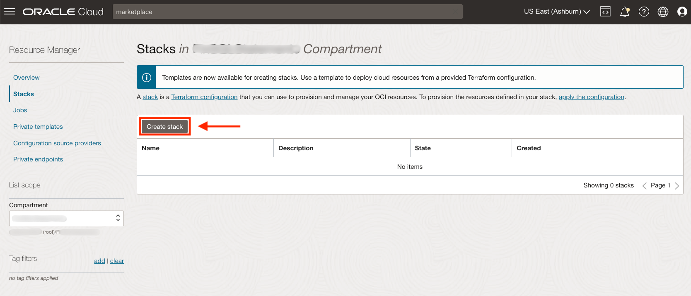
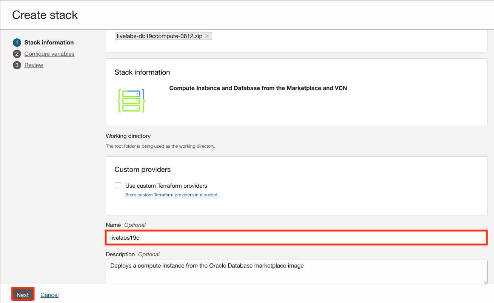
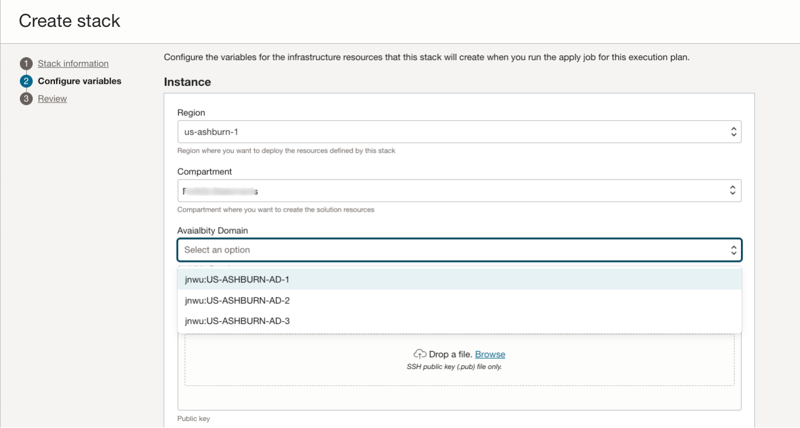
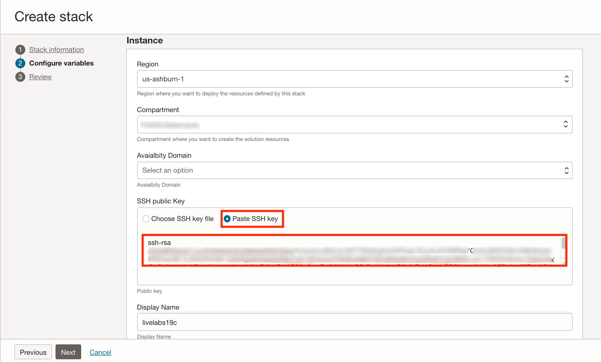

# Set up compute instance

## Introduction

This lab will show you how to set up a compute instance running a pre-configured Compute and the corresponding Virtual Cloud Network (VCN).

Estimated Time:  25 minutes

Quick walk-through on how to set up your compute instance.

[](youtube:O79UmNZwrWE)

>**Note:** The OCI Cloud Service Console navigation may look different than what you see in the video as it is subject to change.

### About Terraform and Oracle Cloud Resource Manager
For more information about Terraform and Resource Manager, please see the appendix below.

### Objectives
In this lab, you will:
* Use Resource Manager to quickly setup a compute instance and VCN
* Log in to your compute instance
* Confirm your Oracle Database 19c is up and running

### Prerequisites

This lab assumes you have:
- An Oracle Free Tier or Paid Cloud account
- SSH Keys

## Task 1: Set up Stack

1.  Click on the link below to download the Resource Manager zip file you need to build your environment.
    - [livelabs-db19ccompute-0812.zip](https://c4u04.objectstorage.us-ashburn-1.oci.customer-oci.com/p/EcTjWk2IuZPZeNnD_fYMcgUhdNDIDA6rt9gaFj_WZMiL7VvxPBNMY60837hu5hga/n/c4u04/b/livelabsfiles/o/labfiles/livelabs-db19ccompute-0812.zip) - Packaged terraform instance creation script for creating instance running the 19c Oracle Database

2.  Save it in your downloads folder.

3.  Log in to your Oracle Cloud account.

4.  Click the **Navigation Menu** in the upper left, navigate to **Developer Services**, and select **Stacks**.

	

5. Click **Create Stack**.
    

6.  Select **My Configuration**, choose the **.zip file** button, click the **Browse** link and select the zip file (livelabs-db19ccompute-0812.zip) that you downloaded. Click **Select**.

   

7. Enter the name of your choice.  We suggest livelabs19c.  Click **Next**.
   

8. Accept the region and select your compartment.  Select an **availability domain** from the drop-down.
   

9. Paste the SSH key you created in the previous lab.
   

10. Scroll down and select the **VMStandard.E2.4**.

    >**Note:** Make sure you select the 2.4 version.  It has enough memory to run the database 19c binaries.

    

11. Accept the network and click **Next**.
    

12. Review the details and click **Create**.
    

## Task 2: Run Stack Apply Job

1. Select **Apply**
    

2. Select **Apply**
    

3. Resource Manager will begin creating the components needed for this workshop.
    

4. Inspect the log, you will notice that 8 resources were created including the compute instance.
   
   

>**Note:** If you encounter any errors with this step, please see the Troubleshooting Tips in the appendix.

## Task 3: Gather Compute Instance Details
1. Click the **Navigation Menu** in the upper left, navigate to **Compute**, and select **Instances**.

	

2. Look for the instance you just created and jot down the public IP address.

    <if type="freetier">
    If you are running the workshop on your own tenancy, the instance you just created is *Workshop*.
    

    Otherwise, you will see the screen as below:
    </if>

    

## Task 4: Connect to Your Instance

There are multiple ways to connect to your cloud instance.  Choose the way to connect to your cloud instance that matches the SSH Key you generated.  *(i.e If you created your SSH Keys in cloud shell, choose cloud shell)*

- Oracle Cloud Shell
- MAC or Windows CYCGWIN Emulator
- Windows Using PuTTY

### Oracle Cloud Shell

1. To re-start the Oracle Cloud shell, go to your Cloud console and click **Cloud Shell** at the top right of the page.
    >**Note:** Make sure you are in the region you were assigned

    

    

    

2.  Enter the command below to login into to your instance.

     ````
    <copy>
    ssh -i ~/.ssh/<sshkeyname> opc@<Your Compute Instance Public IP Address>
    </copy>
    ````

    >**Note:** The angle brackets <> should not appear in your code.

3.  When prompted, answer **yes** to continue connecting.

    

4.  Continue to the *next Task* on the left-hand menu.

>**Note:**  If you encounter any errors with this task, please see the Troubleshooting Tips in the appendix.

### MAC or Windows CYGWIN Emulator

1.  Open up a terminal (MAC) or cygwin emulator. Enter the command below to log in to your instance. Enter yes when prompted.

    ````
    <copy>
    ssh -i ~/.ssh/<sshkeyname> opc@<Your Compute Instance Public IP Address>
    </copy>
    ````

    

    >**Note:** The angle brackets <> should not appear in your code.

2.  After successfully logging in, proceed to the *next Task* on the left hand menu.

>**Note:** If you encounter any errors with this task, please see the Troubleshooting Tips in the appendix.

### Windows using PuTTY

1.  Open up PuTTY and create a new connection.

2.  Enter a name for the session and click **Save**.

    

3. Click **Connection** > **Data** in the left navigation pane and set the Auto-login username to **root**.

4. Click **Connection** > **SSH** > **Auth** in the left navigation pane and configure the SSH private key to use by clicking **Browse** under Private key file for authentication.

5. Navigate to the location where you saved your SSH private key file, select the file, and click **Open**.
    >**Note:**  You cannot connect while on VPN or in the Oracle office on clear-corporate (choose clear-internet).

    

6. The file path for the SSH private key file now displays in the Private key file for the authentication field.

7. Click **Session** in the left navigation pane, then click **Save** in the Load.

8. Click **Open** to begin your session with the instance.

>**Note:** If you encounter any errors with this task, please see the Troubleshooting Tips in the appendix.

## Task 5: Verify the ORCL Database is up

Once you deploy your compute instance, tail the log to determine when the database has been configured and is available for use.
1.  From your connected session of choice **tail** the last 10 lines of the **dbsingle.log** file.  This file configures the database.
    ````text
    <copy>
    tail -10 /u01/ocidb/buildsingle1.log
    </copy>
    ````
    

    >**Note:** If you encounter any errors with this step, please see the Troubleshooting Tips in the appendix.

2. Run the following command to verify the database with the SID **ORCL** is up and running

    ````text
    <copy>
    ps -ef | grep ORCL
    </copy>
    ````
    

3. Verify the listener is running
    ````text
    <copy>
    ps -ef | grep tns
    </copy>
    ````

    

4. Switch to the oracle user.
    ````text
    <copy>
    sudo su - oracle
    </copy>
    ````

    

5.  Set the environment variables to point to the Oracle binaries.  When prompted for the SID (Oracle Database System Identifier), enter **ORCL**.
    ````
    <copy>
    . oraenv
    </copy>
    ORCL
    ````
    

6.  Login using SQL*Plus as the **oracle** user.

    ````text
    <copy>
    sqlplus system/Ora_DB4U@localhost:1521/orclpdb
    </copy>
    ````
    
    >**Note:** If you encounter any errors with this step, please see the Troubleshooting Tips in the appendix.

7.  Exit the sqlplus session and switch back to the opc user.  Verify that you are now the opc user.

    ````
    SQL> <copy>exit
    </copy>
    ````

    ````text
    [oracle@workshop ~]$ <copy>exit
    whoami
    </copy>
    ````
    

Congratulations!  You now have a fully functional Oracle Database 19c instance (ORCL) running on Oracle Cloud Compute.

You may now **proceed to the next lab**.

## Appendix:  Terraform and Resource Manager
Terraform is a tool for building, changing, and versioning infrastructure safely and efficiently.  Configuration files describe to Terraform the components needed to run a single application or your entire data center. In this lab, a configuration file has been created for you to build a network and compute components.  The compute component you will build creates an image out of Oracle's Cloud Marketplace.  This image is running Oracle Linux 7.

Resource Manager is an Oracle Cloud Infrastructure service that allows you to automate the process of provisioning your Oracle Cloud Infrastructure resources. Using Terraform, Resource Manager helps you install, configure, and manage resources through the "infrastructure-as-code" model. To learn more about OCI Resource Manager, watch the video below.

[](youtube:udJdVCz5HYs)

### Oracle Cloud Marketplace
The Oracle Cloud Marketplace is a catalog of solutions that extends Oracle Cloud services. It offers multiple consumption modes and deployment modes. In this lab, we will be deploying the free Oracle Enterprise Manager 13c Workshop marketplace image.

[Link to OCI Marketplace](https://www.oracle.com/cloud/marketplace/)

## Appendix: Troubleshooting Tips

If you encountered any issues during the lab, follow the steps below to resolve them.  If you are unable to resolve them, please skip to the **Need Help** lab to submit your issue to our support emailbox.
1. Can't log in to the instance
2. Invalid public key
3. Limits Exceeded
4. Database Creation stuck at 3x %
5. Apply job is stuck in the provisioning state

### Issue 1: Can't log in to the instance
The participant is unable to log in to instance

#### Tips for fixing Issue #1
There may be several reasons why you can't log in to the instance.  Here are some common ones we've seen from workshop participants
- Incorrectly formatted ssh key
- The user chose to log in from MAC Terminal, PuTTY, etc and the instance is being blocked by the company VPN (shut down VPNs and try to access or use Cloud Shell)
- Incorrect name supplied for ssh key (Do not use sshkeyname, use the key name you provided)
- @ placed before opc user (Remove @ sign and log in using the format above)
- Make sure you are the oracle user (type the command *whoami* to check, if not, type *sudo su - oracle* to switch to the oracle user)
- Make sure the instance is running (type the command *ps -ef | grep oracle* to see if the oracle processes are running)
- Not enough memory for instance (see Issue #4)


### Issue 2: Invalid public key


#### Issue #2 Description
When creating your SSH Key, if the key is invalid the compute instance stack creation will throw an error.

#### Tips for fixing Issue #2
- Go back to the instructions and ensure you create and **copy/paste** your key into the stack correctly.
- Copying keys from Cloud Shell may put the key string on two lines.  Make sure you remove the hard return and ensure the key is all in one line.
- Ensure you pasted the *.pub file into the window.
1.  Click on **Stack**-> **Edit Stack** -> **Configure Variables**.
2.  Repaste the correctly formatted key
3.  Click **Next**
4.  Click **Save Changes**
5.  Click **Terraform Actions** -> **Apply**

### Issue 3: Limits Exceeded


#### Issue #3 Description
When creating a stack your ability to create an instance is based on the capacity you have available for your tenancy.

#### Fix for Issue #3
If you have other compute instances you are not using, you can go to those instances and delete them.  If you are using them, follow the instructions to check your available usage and adjust your variables.

*Please ensure that you have available cloud credits.  Go to **Governance** -> **Limits, Quotas and Usage,** select **compute**, and ensure that you have **more than** the micro tier available.  If you have only 2 micro computes, this workshop will NOT run.*

1. Click on the Hamburger menu, go to **Governance** -> **Limits, Quotas and Usage**
2. Select **Compute**
3. These labs use the following compute types.  Check your limit, your usage and the amount you have available in each availability domain (click Scope to change Availability Domain)
4. Look for Standard.E2, Standard.E3.Flex and Standard2
5. This workshop requires at least 4 OCPU and a minimum of 30GB of memory.  If you do not have that available you may request a service limit increase at the top of this screen.  If you have located capacity, please continue to the next step.
6.  Click on the Hamburger menu -> **Resource Manager** -> **Stacks**
7.  Click on the stack you created previously
8.  Click **Edit Stack** -> **Configure Variables**.
9.  Scroll down to Options
10. Change the shape based on the availability you have in your system
11. Click **Next**
12. Click **Save Changes**
13. Click **Terraform Actions** -> **Apply**

### Issue 4: Database Creation stuck at 3x%
When tailing the log, the database creation seems stuck.

#### Issue #4 Description
Database creation requires at least 30GB of memory.

#### Fix for Issue #4
1.  Click on Compute -> Instance and verify that your instance created was VMStandard.E2.4 and higher.  If you chose 2.2 or a smaller shape, the instance creation will fail, you will need to rerun your stack and recreate your instance.  The instance has run out of memory and won't be able to create
2.  A known issue has been identified that creation script may take longer, if it has been over 2 hours, please submit an issue.

### Issue 5: Apply job is stuck in the provisioning state
When the apply job is running certain browsers may not reflect the correct state

#### Fix for Issue #5
Reload your browser

## Acknowledgements
- **Author** - LiveLabs Team
- **Contributors** - Sanjay Narvekar, Troy Anthony, Anoosha Pilli, Arabella Yao, Kamryn Vinson, Jeffrey Malcolm Jr.
- **Last Updated By/Date** - Carmen Berdant, Mar 2024