# Set up Oracle Linux compute image

## Introduction
This lab will show you how to setup a Oracle Cloud network (VCN) and a compute instance running Oracle Linux.

Estimated Lab Time:  15 minutes

### About Terraform and Oracle Cloud Resource Manager
Terraform is a tool for building, changing, and versioning infrastructure safely and efficiently.  Oracle offers sample solutions to help you quickly create common Oracle cloud components.

Resource Manager is an Oracle Cloud Infrastructure service that allows you to automate the process of provisioning your Oracle Cloud Infrastructure resources. Using Terraform, Resource Manager helps you install, configure, and manage resources through the "infrastructure-as-code" model. To learn more about OCI Resource Manager, preview the video below.

[](youtube:udJdVCz5HYs)

### Objectives
In this lab, you will:
* Setup a VCN (Virtual Compute Network) using Resource Manager
* Setup a compute instance
* Login to your compute instance

### Prerequisites

This lab assumes you have:
- An Oracle Free Tier or Paid Cloud account
- Lab:  Generate SSH Keys

## Task 1: Setup VCN Stack
If you already have a VCN created, skip this step and proceed to *STEP 3*.

1.  Login to your Oracle Cloud account
2.  Click the **Create a Stack** tile on the homepage.  Or, click the **Navigation Menu** in the upper left, navigate to **Developer Services**, and select **Stacks**.

	
3.  In the Browse Solutions window, select **Default VCN**.
    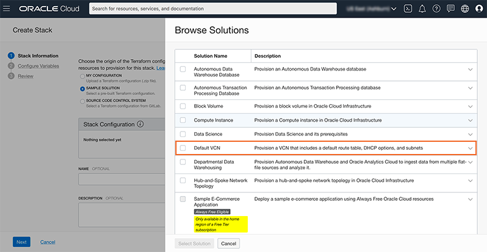

4. Click the **Select Solution** button.
   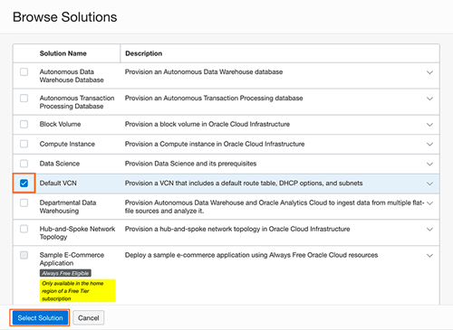
5.  Enter the name for your VCN:  **livelabsvcn**.  Click **next**.
   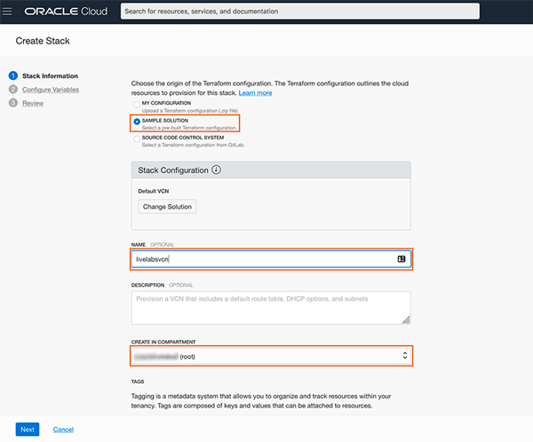
6. Inspect and then accept all default values in the Configure Variables screen and click **Next**.
   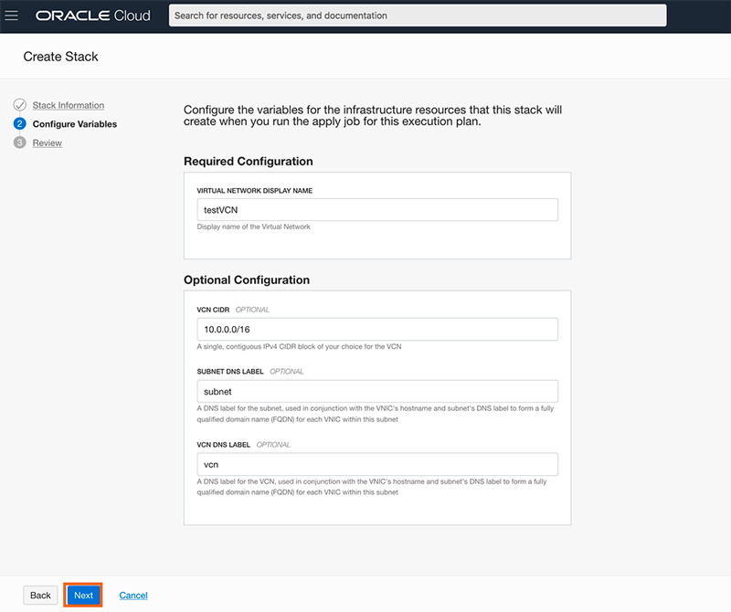
7.  Review your selections and click **Next**
   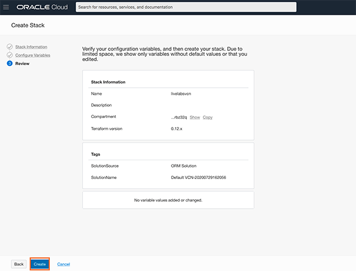

## Task 2: Run VCN Stack Apply Job
Now that your stack has been created, you will run an *apply* job to create the actual VCN
1. Click on **Terraform Actions** to expose the drop down menu
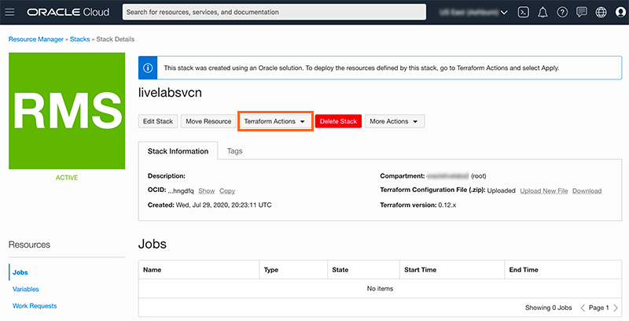
2. Select **Apply**
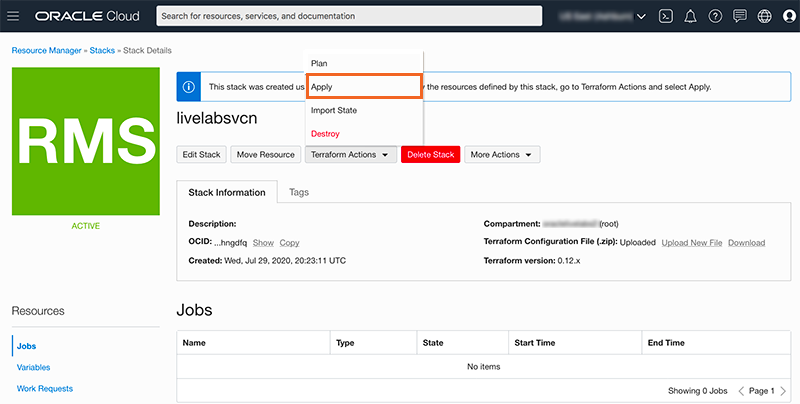
3. Inspect the apply job, accept all defaults and click **Apply**
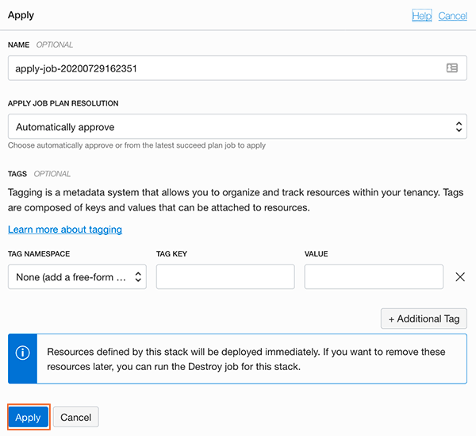
4. The VCN will immediately begin creation.
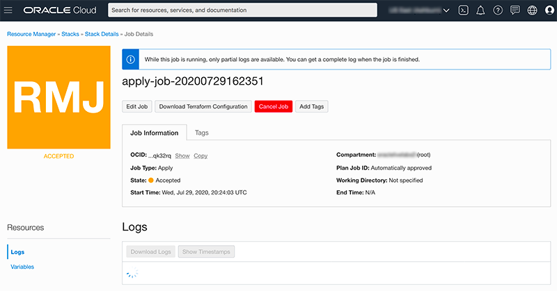
5. Once the apply job is complete, inspect the results.  
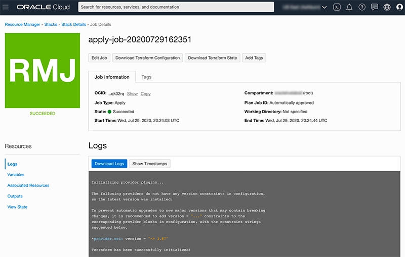
6. Scroll down the log.  You will notice that 6 objects were created:  A VCN, subnet, internet gateway, default security list, route table and dhcp options, each with their own Oracle Cloud ID (ocid).  We will focus on the subnet.  You will need this subnet information to create your compute instance
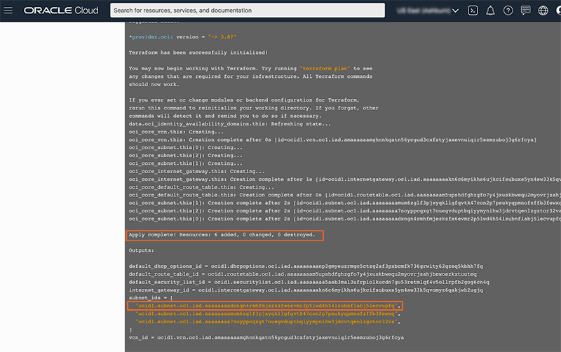
7. Copy the first subnet id to a notepad and save for the next step.  If you would like to further inspect the VCN, complete #s 8-12.  Otherwise skip to the next section.
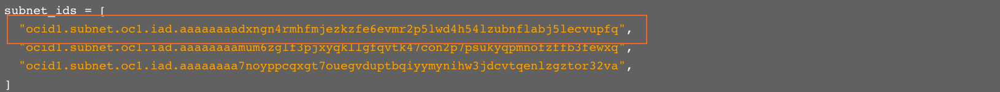
8.  Click the **Navigation Menu** in the upper left, navigate to **Networking**, and select **Virtual Cloud Networks**.

9.  The VCN you created should be listed.  Click on the VCN you just created.
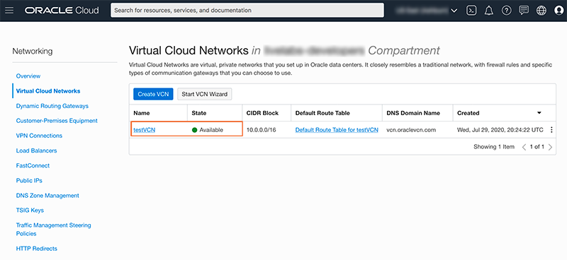  
10.  On the VCN homepage notice the 3 subnets that were created.  Each subnet is tied to an Availability Domain.  Click on the first subnet that matches AD-1.
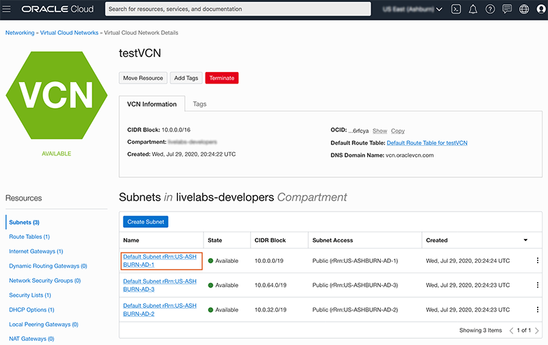  
11.  Inspect the subnet homepage, find the OCID (Oracle Cloud ID).  Click **Copy**
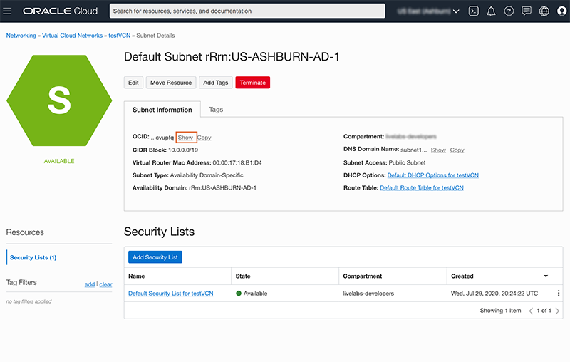  
12. Copy the subnet ID to a notepad.
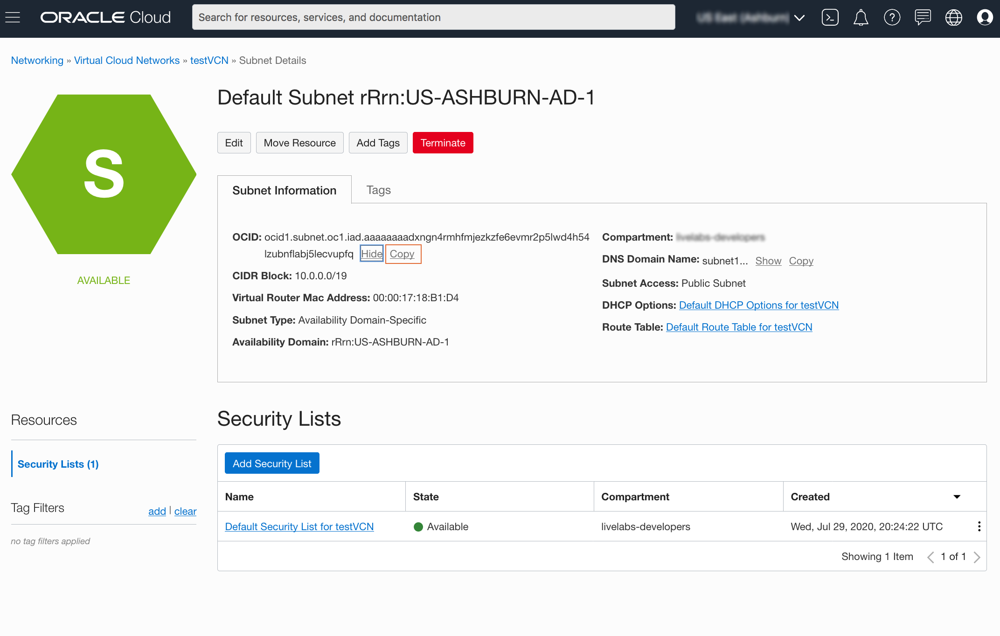        

## Task 3: Setup Compute Instance

1. Click the **Navigation Menu** in the upper left, navigate to **Compute**, and select **Instances**.
    
2. Click on **Create Instance**. 
    
3. Enter the **Name** for your Compute Instance and choose the **compartment**. 
    
4. Click on edit and choose the Availability Domain, Image, and Shape of your choice. For this lab, use the default Oracle Linux 7.8 image.
    
    
5. In the Add SSH keys, select **Paste Public Keys** and paste your public ssh key. Then click create. 
    
6. The instance will immediately begin provisioning.
    
7. Once it is provisioned, inspect the instance information and copy the public IP address to notepad.
    

## Task 4: Connect to your instance

There are multiple ways to connect to your cloud instance.  Choose the way to connect to your cloud instance that matches the SSH Key you generated.  *(i.e If you created your SSH Keys in cloud shell, choose cloud shell)*

- Oracle Cloud Shell
- MAC or Windows CYCGWIN Emulator
- Windows Using Putty

### Oracle Cloud Shell

1. To re-start the Oracle Cloud shell, go to your Cloud console and click the cloud shell icon to the right of the region.  *Note: Make sure you are in the region you were assigned*

    

2.  Go to **Compute** -> **Instance** and select the instance you created (make sure you choose the correct compartment)
3.  On the instance homepage, find the Public IP addresss for your instance.

    
4.  Enter the command below to login to your instance.    
    ````
    ssh -i ~/.ssh/<sshkeyname> opc@<Your Compute Instance Public IP Address>
    ````

    *Note: The angle brackets <> should not appear in your code.*
    
5.  When prompted, answer **yes** to continue connecting.
6.  Continue to STEP 5 on the left hand menu.

### MAC or Windows CYGWIN Emulator
1.  Go to **Compute** -> **Instance** and select the instance you created (make sure you choose the correct compartment)
2.  On the instance homepage, find the Public IP addresss for your instance.

3.  Open up a terminal (MAC) or cygwin emulator as the opc user.  Enter yes when prompted.

    ````
    ssh -i ~/.ssh/<sshkeyname> opc@<Your Compute Instance Public IP Address>
    ````
    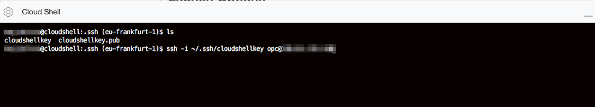

    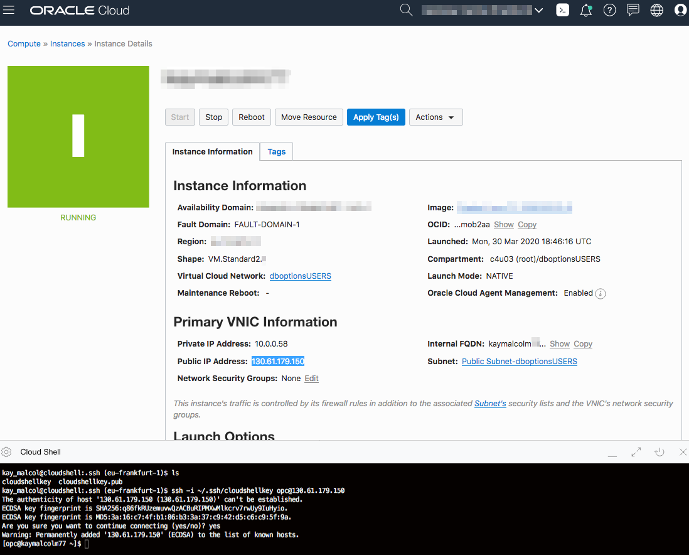

    *Note: The angle brackets <> should not appear in your code.*

4.  After successfully logging in, proceed to STEP 5.

### Windows using Putty

1.  Open up putty and create a new connection.

    ````
    ssh -i ~/.ssh/<sshkeyname> opc@<Your Compute Instance Public IP Address>
    ````
    

    *Note: The angle brackets <> should not appear in your code.*

2.  Enter a name for the session and click **Save**.

    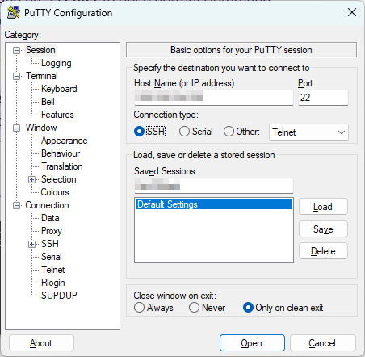

3. Click **Connection** > **Data** in the left navigation pane and set the Auto-login username to root.

4. Click **Connection** > **SSH** > **Auth** in the left navigation pane and configure the SSH private key to use by clicking Browse under Private key file for authentication.

5. Navigate to the location where you saved your SSH private key file, select the file, and click Open.  NOTE:  You cannot connect while on VPN or in the Oracle office on clear-corporate (choose clear-internet).

    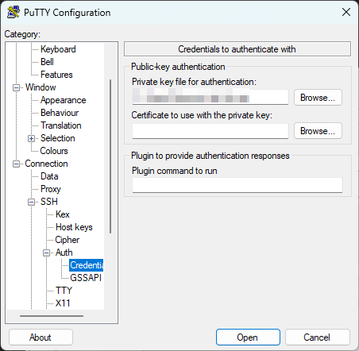

6. The file path for the SSH private key file now displays in the Private key file for authentication field.

7. Click Session in the left navigation pane, then click Save in the Load, save or delete a stored session STEP.

8. Click Open to begin your session with the instance.

Congratulations!  You now have a fully functional Linux instance running on Oracle Cloud Compute.  

You may now proceed to the next lab.

## Acknowledgements
- **Author** - LiveLabs Team, DB Product Management
- **Contributors** - Jaden McElvey, Anoosha Pilli, Sanjay Narvekar, David Start, Arabella Yao
- **Last Updated By/Date** - Anoosha Pilli, October 2020

