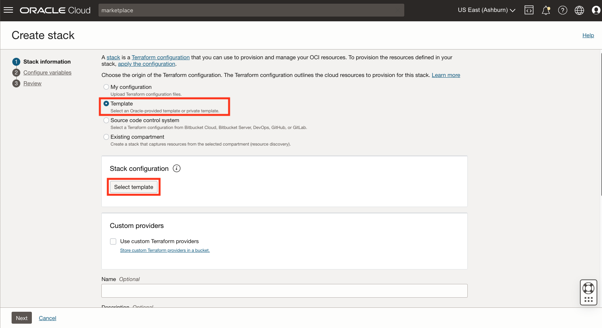
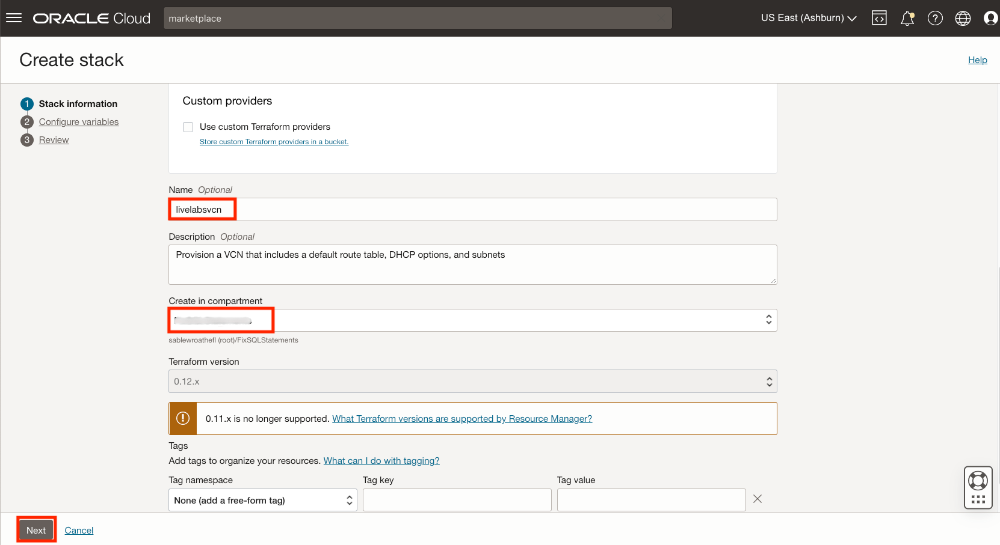
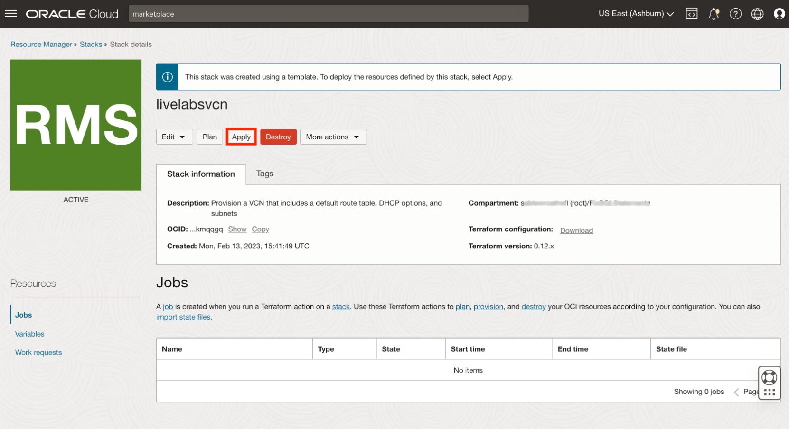

# Set up Oracle Linux compute image

## Introduction
This lab will show you how to set up an Oracle Virtual Cloud Network (VCN) and a compute instance running Oracle Linux using Oracle Resource Manager.

Estimated Time:  15 minutes

### About Terraform and Oracle Cloud Resource Manager
Terraform is a tool for building, changing, and versioning infrastructure safely and efficiently.  Oracle offers sample solutions to help you quickly create common Oracle cloud components.

Resource Manager is an Oracle Cloud Infrastructure service that allows you to automate the process of provisioning your Oracle Cloud Infrastructure resources. Using Terraform, Resource Manager helps you install, configure, and manage resources through the "infrastructure-as-code" model. To learn more about OCI Resource Manager, watch the video below.

[](youtube:udJdVCz5HYs)

### Objectives
In this lab, you will:
* Set up a VCN (Virtual Compute Network) using Resource Manager
* Set up a compute instance using Resource Manager
* Log in to your compute instance

### Prerequisites

This lab assumes you have:
- An Oracle Free Tier or Paid Cloud account
- Completed Lab:  Generate SSH Keys

## Task 1: Set up VCN Stack
If you already have a VCN created, skip this task and proceed to *Task 3*.

1.  Log in to your Oracle Cloud account

2.  Click the **Navigation Menu** in the upper left, navigate to **Developer Services**, and select **Stacks**.

	
    Click **Create Stack**.
    

3.  Choose **Template** and click **Select Template**.

    

4. In the Browse Templates window, select **Default VCN** and click the **Select Template** button.
   

5.  Enter the name of your VCN:  **livelabsvcn**. Choose your compartment and click **Next**.
   

6. Inspect and then accept all default values in the Configure Variables screen and click **Next**.

7.  Review your selections and click **Create**.

## Task 2: Run VCN Stack Apply Job
Now that your stack has been created, you will run an *apply* job to create the actual VCN

1. Click **Apply** on the Stack Details page


2. Inspect the apply job, accept all defaults and click **Apply**


3. The VCN will immediately begin creation.

4. Once the apply job is complete, inspect the results.

5. Scroll down the log.  You will notice that 6 objects were created:  A VCN, subnet, internet gateway, default security list, route table, and dhcp options, each with their own Oracle Cloud ID (ocid).  We will focus on the subnet. You will need this subnet information to create your compute instance.

6. Copy the first subnet id to a notepad and save it for the next step.  If you would like to further inspect the VCN, complete steps #7-11.  Otherwise, skip to the next Task.

7.  Click the **Navigation Menu** in the upper left, navigate to **Networking**, and select **Virtual Cloud Networks**.
    

8.  The VCN you created should be listed.  Click the VCN you just created.

9.  On the VCN homepage notice the 3 subnets that were created.  Each subnet is tied to an Availability Domain.  Click on the subnet that matches AD-1.

10.  Inspect the subnet homepage, and find the OCID (Oracle Cloud ID).  Click **Copy**.

11. Copy the subnet ID to a notepad.

## Task 3: Setup Compute Instance

1. Click the **Navigation Menu** in the upper left, navigate to **Compute**, and select **Instances**.
    

2. Click **Create Instance**.

3. Enter the **Name** for your Compute Instance and choose the **compartment**.

4. Click **Edit** and choose the Availability Domain, Image, and Shape of your choice. For this lab, use the default **Oracle Linux 7.8 image**.

5. In the Add SSH keys, select **Paste Public Keys** and paste your public ssh key. Then click **Create**.

6. The instance will immediately begin provisioning.

7. Once it is provisioned, inspect the instance information and copy the **public IP address** to your notepad.

## Task 4: Connect to your instance

There are multiple ways to connect to your cloud instance.  Choose the way to connect to your cloud instance that matches the SSH Key you generated.  *(i.e If you created your SSH Keys in cloud shell, choose cloud shell)*

- Oracle Cloud Shell
- MAC or Windows CYCGWIN Emulator
- Windows Using Putty

### Oracle Cloud Shell

1. To re-start the Oracle Cloud shell, go to your Cloud console and click **Cloud Shell** at the top right of the page.
    >**Note:** Make sure you are in the region you were assigned

    
    

2.  Enter the command below to login into your instance.
    ````text
    ssh -i ~/.ssh/<sshkeyname> opc@<Your Compute Instance Public IP Address>
    ````

    >**Note:** The angle brackets <> should not appear in your code.

3.  When prompted, answer **yes** to continue connecting.

    

### MAC or Windows CYGWIN Emulator
1.  Open up a terminal (MAC) or cygwin emulator. Enter the command below to log in to your instance. Enter yes when prompted.

    ```text
    ssh -i ~/.ssh/<sshkeyname> opc@<Your Compute Instance Public IP Address>
    ```

    

    >**Note:** The angle brackets <> should not appear in your code.

### Windows using PuTTY

1.  Open up PuTTY and create a new connection.

2.  Enter a name for the session and click **Save**.

    

3. Click **Connection** > **Data** in the left navigation pane and set the Auto-login username to **root**.

4. Click **Connection** > **SSH** > **Auth** in the left navigation pane and configure the SSH private key to use by clicking **Browse** under the Private key file for authentication.

5. Navigate to the location where you saved your SSH private key file, select the file, and click **Open**.
    >**Note:**  You cannot connect while on VPN or in the Oracle office on clear-corporate (choose clear-internet).

    

6. The file path for the SSH private key file now displays in the Private key file for the authentication field.

7. Click **Session** in the left navigation pane, then click **Save** in the Load.

8. Click **Open** to begin your session with the instance.

Congratulations!  You now have a fully functional Linux instance running on Oracle Cloud Compute.

You may now **proceed to the next lab**.

## Appendix: Troubleshooting Tips

If you encountered any issues during the lab, follow the steps below to resolve them.  If you are unable to resolve them, please skip to the **Need Help** lab to submit your issue to our support emailbox.
1. Can't log in to the instance
2. Invalid public key
3. Limits Exceeded
4. Apply job is stuck in the provisioning state

### Issue 1: Can't log in to the instance
The participant is unable to log in to instance

#### Tips for fixing Issue #1
There may be several reasons why you can't log in to the instance.  Here are some common ones we've seen from workshop participants
- Incorrectly formatted ssh key
- The user chose to log in from MAC Terminal, PuTTY, etc and the instance is being blocked by the company VPN (shut down VPNs and try to access or use Cloud Shell)
- Incorrect name supplied for ssh key (Do not use sshkeyname, use the key name you provided)
- @ placed before opc user (Remove @ sign and log in using the format above)
- Make sure you are the oracle user (type the command *whoami* to check, if not, type *sudo su - oracle* to switch to the oracle user)
- Make sure the instance is running (type the command *ps -ef | grep oracle* to see if the oracle processes are running)
- Not enough memory for instance (see Issue #4)


### Issue 2: Invalid public key


#### Issue #2 Description
When creating your SSH Key, if the key is invalid the compute instance stack creation will throw an error.

#### Tips for fixing Issue #2
- Go back to the instructions and ensure you create and **copy/paste** your key into the stack correctly.
- Copying keys from Cloud Shell may put the key string on two lines.  Make sure you remove the hard return and ensure the key is all in one line.
- Ensure you pasted the *.pub file into the window.
1.  Click on **Stack**-> **Edit Stack** -> **Configure Variables**.
2.  Repaste the correctly formatted key
3.  Click **Next**
4.  Click **Save Changes**
5.  Click **Terraform Actions** -> **Apply**

### Issue 3: Limits Exceeded


#### Issue #3 Description
When creating a stack your ability to create an instance is based on the capacity you have available for your tenancy.

#### Fix for Issue #3
If you have other compute instances you are not using, you can go to those instances and delete them.  If you are using them, follow the instructions to check your available usage and adjust your variables.

*Please ensure that you have available cloud credits.  Go to **Governance** -> **Limits, Quotas and Usage,** select **compute**, and ensure that you have **more than** the micro tier available.  If you have only 2 micro computes, this workshop will NOT run.*

1. Click on the Hamburger menu, go to **Governance** -> **Limits, Quotas and Usage**
2. Select **Compute**
3. These labs use the following compute types.  Check your limit, your usage and the amount you have available in each availability domain (click Scope to change Availability Domain)
4. Look for Standard.E2, Standard.E3.Flex and Standard2
5. This workshop requires at least 4 OCPU and a minimum of 30GB of memory.  If you do not have that available you may request a service limit increase at the top of this screen.  If you have located capacity, please continue to the next step.
6.  Click on the Hamburger menu -> **Resource Manager** -> **Stacks**
7.  Click on the stack you created previously
8.  Click **Edit Stack** -> **Configure Variables**.
9.  Scroll down to Options
10. Change the shape based on the availability you have in your system
11. Click **Next**
12. Click **Save Changes**
13. Click **Terraform Actions** -> **Apply**

### Issue 4: Apply job is stuck in the provisioning state
When the apply job is running certain browsers may not reflect the correct state

#### Fix for Issue #4
Reload your browser

## Acknowledgements
- **Author** - LiveLabs Team, DB Product Management
- **Contributors** - Jaden McElvey, Anoosha Pilli, Sanjay Narvekar, David Start, Arabella Yao
- **Last Updated By/Date** - Carmen Berdant, Mar 2024