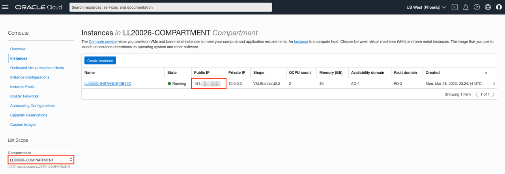
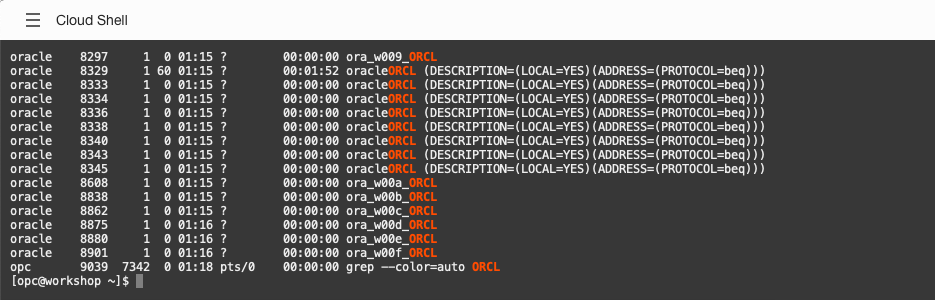
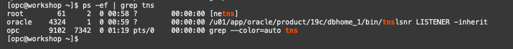
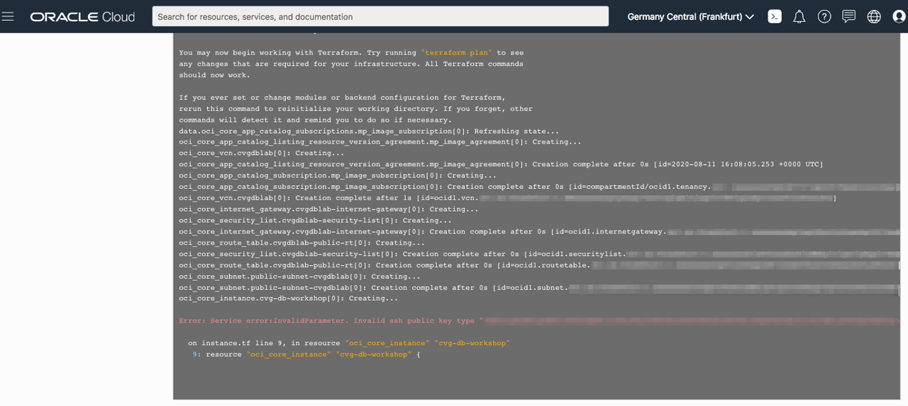

# Set up compute instance

## Introduction

This lab will show you how to verify your compute instance has been setup.

Estimated Time: 10 minutes

Quick walk through on how to verify your compute instance setup.

[](youtube:R0J7CPVYmI4)

>**Note:** The OCI Cloud Service Console navigation may look different then what you see in the video as it is subject to change.*

### About Terraform and Oracle Cloud Resource Manager
For more information about Terraform and Resource Manager, please see the appendix below.

### Objectives
In this lab, you will:
* Log in to your compute instance
* Confirm your Oracle Database 19c is up and running

### Prerequisites

This lab assumes you have:
- A LiveLabs Cloud account and assigned compartment
- The IP address and instance name for your DB19c Compute instance
- Successfully logged into your LiveLabs account
- A valid SSH Key pair

## Task 1: Gather Compute Instance Details
1. Click the **Navigation Menu** in the upper left, navigate to **Compute**, and select **Instances**.
    
2. Select the compartment that was assigned (the compartment assigned begins with the prefix *LL* followed by your user ID)
3. Look for the instance that was created for you. Jot down the public IP address.
    


## Task 2: Connect to Your Instance

There are multiple ways to connect to your cloud instance.  Choose the way to connect to your cloud instance that matches the SSH Key you provided during registration.

- Using Oracle Cloud Shell (recommended)
- MAC or Windows CYCGWIN Emulator
- Windows Using Putty

### Upload Key to Cloud Shell and Connect

1.  To start the Oracle Cloud Shell, go to your Cloud console and click the Cloud Shell icon at the top right of the page.

	

    

    

2.  Click on the Cloud Shell hamburger icon and select **Upload** to upload your private key. Note the private key does not have a `.pub` extension.

    

3.  To connect to the compute instance that was created for you, you will need to load your private key.  This is the half of the key pair that does *not* have a `.pub` extension.  Locate that file on your machine and click **Upload** to process it.

    

4. Be patient while the key file uploads to your Cloud Shell directory.
    

    


5. Once finished run the command below to check to see if your ssh key was uploaded.  Move it into your .ssh directory and change the permissions.

    ```nohighlight
    <copy>
    ls
    </copy>
    ```
    ```nohighlight
    mkdir ~/.ssh
    mv <<keyname>> ~/.ssh
    chmod 600 ~/.ssh/<privatekeyname>
    ls ~/.ssh
    ```

    

6.  Secure Shell into the compute instance using your uploaded key name (the private key).

    ```
    ssh -i ~/.ssh/<sshkeyname> opc@<Your Compute Instance Public IP Address>
    ```
    


### MAC or Windows CYGWIN Emulator
1.  Go to **Compute** -> **Instances** and select the instance you created (make sure you choose the correct compartment)
2.  On the instance homepage, find the Public IP address for your instance.

3.  Open up a terminal (MAC) or cygwin emulator as the opc user.  Enter yes when prompted.

    ```
    ssh -i ~/.ssh/<sshkeyname> opc@<Your Compute Instance Public IP Address>
    ```
    

    >**Note:** The angle brackets <> should not appear in your code.

4.  After successfully logging in, proceed to the *next Task* on the left hand menu.

>**Note:** If you encounter any errors with this step, please see the Troubleshooting Tips in the appendix.

### Windows using Putty

1.  Open up putty and create a new connection.

2.  Enter a name for the session and click **Save**.

    

3. Click **Connection** > **Data** in the left navigation pane and set the Auto-login username to root or the user specified in your workshop.

4. Click **Connection** > **SSH** > **Auth** in the left navigation pane and configure the SSH private key to use by clicking **Browse** under Private key file for authentication.

5. Navigate to the location where you saved your SSH private key file, select the file, and click **Open**.
    >**Note:**  You cannot connect while on VPN or in the Oracle office on clear-corporate (choose clear-internet).

    

6. The file path for the SSH private key file now displays in the Private key file for authentication field.

7. Click Session in the left navigation pane, then click Save in the Load, save or delete a stored session STEP.

8. Click Open to begin your session with the instance.

>**Note:**  If you encounter any errors with this step, please see the Troubleshooting Tips in the appendix.

## Task 3: Verify the ORCL Database is up

Once you deploy your compute instance, tail the log to determine when the database has been configured and is available for use.
1. Run the following command to verify the database with the SID **ORCL** is up and running.

    ```
    <copy>
    ps -ef | grep ORCL
    </copy>
    ```
    

2. Verify the listener is running
    ```
    <copy>
    ps -ef | grep tns
    </copy>
    ```

    

3. Switch to the oracle user.
    ```
    <copy>
    sudo su - oracle
    </copy>
    ```

    

4.  Set the environment variables to point to the Oracle binaries.  When prompted for the SID (Oracle Database System Identifier), enter **ORCL**.
    ```
    <copy>
    . oraenv
    </copy>
    ORCL
    ```
    

5.  Log in using SQL*Plus as the **oracle** user.

    ```
    <copy>
    sqlplus system/Ora_DB4U@localhost:1521/orclpdb
    </copy>
    ```
    

>**Note:** If you encounter any errors with this step, please see the Troubleshooting Tips in the appendix.

## Task 4: Exit SQLPLUS
1.  Exit the sqlplus session.

    ```
    SQL> <copy>exit</copy>
    ```
2. Type exit again to *switch back to the opc user*.

    ```
    <copy>exit</copy>
    ```

3. Verify that you are now the **opc** user using the *whoami* command.

    ```
    <copy>
    whoami
    </copy>
    ```

    

You may now **proceed to the next lab**.

## Appendix: Troubleshooting Tips

If you encountered any issues during the lab, follow the steps below to resolve them.  If you are unable to resolve, please skip to the **Need Help** section to submit your issue via our  support forum.

1. Can't login to instance
2. Invalid public key

### Issue 1: Can't login to instance
Participant is unable to login to instance

#### Tips for fixing Issue #1
There may be several reasons why you can't login to the instance.  Here are some common ones we've seen from workshop participants
- Incorrectly formatted ssh key (see above for fix)
- User chose to login from MAC Terminal, Putty, etc and the instance is being blocked by company VPN (shut down VPNs and try to access or use Cloud Shell)
- Incorrect name supplied for ssh key (Do not use "sshkeyname", use the key name you provided)
- @ placed before opc user (Remove @ sign and login using the format above)
- Make sure you are the oracle user (type the command *whoami* to check, if not type *sudo su - oracle* to switch to the oracle user)
- Make sure the instance is running (type the command *ps -ef | grep oracle* to see if the oracle processes are running)


### Issue 2: Invalid public key


#### Issue #2 Description
When creating your SSH Key, if the key is invalid the compute instance stack creation will throw an error.

#### Tips for fixing for Issue #2
- Go back to the registration page, delete your registration and recreate it ensuring you create and **copy/paste** your *.pub key into the registration page correctly.
- Ensure you pasted the *.pub file into the window.


## Acknowledgements
- **Author** - LiveLabs Team, Senior Director, DB Product Management
- **Contributors** - Robert Pastijn, DB Product Management, PTS; Didi Han, DB Product Management; Arabella Yao, DB Product Management
- **Last Updated By/Date** - Arabella Yao, Product Manager, Database Product Management, June 2022