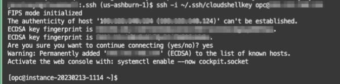

# Set up compute instance

## Introduction

This lab will show you how to verify your compute instance that has been set up.

Estimated Time: 10 minutes

<!--
Quick walk through on how to verify your compute instance setup.

[](youtube:R0J7CPVYmI4)

>**Note:** The OCI Cloud Service Console navigation may look different then what you see in the video as it is subject to change.*
-->

### About Terraform and Oracle Cloud Resource Manager
Terraform is a tool for building, changing, and versioning infrastructure safely and efficiently.  Oracle offers sample solutions to help you quickly create common Oracle cloud components.

Resource Manager is an Oracle Cloud Infrastructure service that allows you to automate the process of provisioning your Oracle Cloud Infrastructure resources. Using Terraform, Resource Manager helps you install, configure, and manage resources through the "infrastructure-as-code" model. To learn more about OCI Resource Manager, watch the video below.

[](youtube:udJdVCz5HYs)

### Objectives
In this lab, you will:
* Log in to your compute instance
* Confirm your Oracle Database 19c is up and running

### Prerequisites

This lab assumes you have:
- A LiveLabs Cloud account and assigned compartment
- The IP address and instance name for your DB19c Compute instance
- Successfully logged into your LiveLabs account
- A valid SSH key pair

## Task 1: Gather Compute Instance Details
1. Click the **Navigation Menu** in the upper left, navigate to **Compute**, and select **Instances**.
    

2. Select the compartment that was assigned (the compartment assigned begins with the prefix *LL* followed by your user ID)

3. Look for the instance that was created for you. Jot down the **public IP address**.
    

## Task 2: Connect to Your Instance

There are multiple ways to connect to your cloud instance.  Choose the way to connect to your cloud instance that matches the SSH key you provided during registration.

- Using Oracle Cloud Shell (recommended)
- MAC or Windows CYCGWIN Emulator
- Windows Using Putty

### Upload Key to Cloud Shell and Connect

1. To re-start the Oracle Cloud shell, go to your Cloud console and click **Cloud Shell** at the top right of the page.
    >**Note:** Make sure you are in the region you were assigned

    
    

2.  Click the Cloud Shell hamburger icon and select **Upload** to upload your private key. Note the private key does not have a `.pub` extension.

    

3.  To connect to the compute instance that was created for you, you will need to load your private key.  This is the half of the key pair that does *not* have a `.pub` extension.  Locate that file on your machine and click **Upload** to process it.

    

4. Be patient while the key file uploads to your Cloud Shell directory.
    

    

5. Once finished, run the command below to check to see if your ssh key was uploaded.  Move it into your .ssh directory and change the permissions.

    ```nohighlight
    <copy>
    ls
    </copy>
    ```
    ```nohighlight
    mkdir ~/.ssh
    mv <<keyname>> ~/.ssh
    chmod 600 ~/.ssh/<privatekeyname>
    ls ~/.ssh
    ```

    

6.  SSH into the compute instance using your uploaded key name (the private key).

    ```text
    ssh -i ~/.ssh/<sshkeyname> opc@<Your Compute Instance Public IP Address>
    ```
    >**Note:** The angle brackets <> should not appear in your code.

7.  When prompted, answer **yes** to continue connecting.

    

### MAC or Windows CYGWIN Emulator
1.  Open up a terminal (MAC) or cygwin emulator. Enter the command below to log in to your instance. Enter yes when prompted.

    ```text
    ssh -i ~/.ssh/<sshkeyname> opc@<Your Compute Instance Public IP Address>
    ```

    

    >**Note:** The angle brackets <> should not appear in your code.

>**Note:** If you encounter any errors with this step, please see the Troubleshooting Tips in the appendix.

### Windows using Putty

1.  Open up putty and create a new connection.

2.  Enter a name for the session and click **Save**.

    

3. Click **Connection** > **Data** in the left navigation pane and set the Auto-login username to **root** or the user specified in your workshop.

4. Click **Connection** > **SSH** > **Auth** in the left navigation pane and configure the SSH private key to use by clicking **Browse** under the Private key file for authentication.

5. Navigate to the location where you saved your SSH private key file, select the file, and click **Open**.
    >**Note:**  You cannot connect while on VPN or in the Oracle office on clear-corporate (choose clear-internet).

    

6. The file path for the SSH private key file now displays in the Private key file for the authentication field.

7. Click **Session** in the left navigation pane, then click **Save** in the Load.

8. Click **Open** to begin your session with the instance.

>**Note:**  If you encounter any errors with this task, please see the Troubleshooting Tips in the appendix.

## Task 3: Verify the ORCL Database is up

Once you deploy your compute instance, tail the log to determine when the database has been configured and is available for use.
1. Run the following command to verify the database with the SID **ORCL** is up and running.

    ```text
    <copy>
    ps -ef | grep ORCL
    </copy>
    ```
    

2. Verify the listener is running
    ```text
    <copy>
    ps -ef | grep tns
    </copy>
    ```

    

3. Switch to the oracle user.
    ```text
    <copy>
    sudo su - oracle
    </copy>
    ```

    

4.  Set the environment variables to point to the Oracle binaries.  When prompted for the SID (Oracle AI Database System Identifier), enter **ORCL**.
    ```
    <copy>
    . oraenv
    </copy>
    ORCL
    ```
    

5.  Log in using SQL*Plus as the **oracle** user.

    ```text
    <copy>
    sqlplus system/Ora_DB4U@localhost:1521/orclpdb
    </copy>
    ```
    

## Task 4: Exit SQLPLUS
1.  Exit the sqlplus session.

    ```
    SQL> <copy>exit</copy>
    ```
2. Type exit again to *switch back to the opc user*.

    ```
    <copy>exit</copy>
    ```

3. Verify that you are now the **opc** user using the *whoami* command.

    ```
    <copy>
    whoami
    </copy>
    ```

    

You may now **proceed to the next lab**.

## Appendix: Troubleshooting Tips

If you encountered any issues during the lab, follow the steps below to resolve them.  If you are unable to resolve them, please skip to the **Need Help** lab to submit your issue to our support emailbox.

1. Can't log in to instance

### Issue 1: Can't log in to the instance
The participant is unable to log in to instance

#### Tips for fixing Issue #1
There may be several reasons why you can't log in to the instance.  Here are some common ones we've seen from workshop participants
- Incorrectly formatted ssh key
- The user chose to log in from MAC Terminal, Putty, etc and the instance is being blocked by the company VPN (shut down VPNs and try to access or use Cloud Shell)
- Incorrect name supplied for ssh key (Do not use sshkeyname, use the key name you provided)
- @ placed before opc user (Remove @ sign and log in using the format above)
- Make sure you are the oracle user (type the command *whoami* to check, if not, type *sudo su - oracle* to switch to the oracle user)
- Make sure the instance is running (type the command *ps -ef | grep oracle* to see if the oracle processes are running)

## Acknowledgements
- **Author** - LiveLabs Team, Senior Director, DB Product Management
- **Contributors** - Robert Pastijn, DB Product Management, PTS; Didi Han, DB Product Management; Arabella Yao, DB Product Management
- **Last Updated By/Date** - Arabella Yao, Product Manager, Database Product Management, Dec 2022