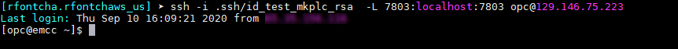
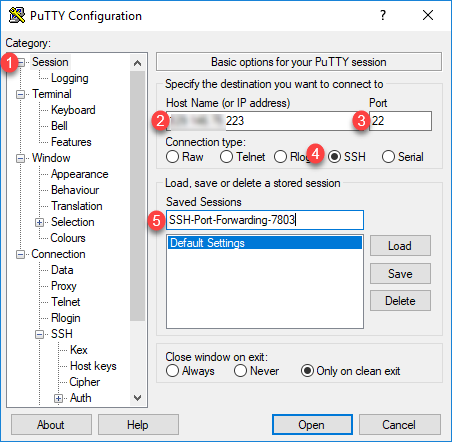
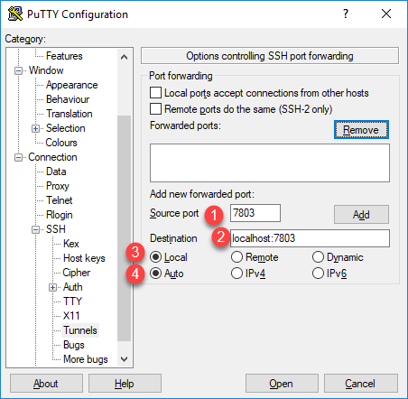
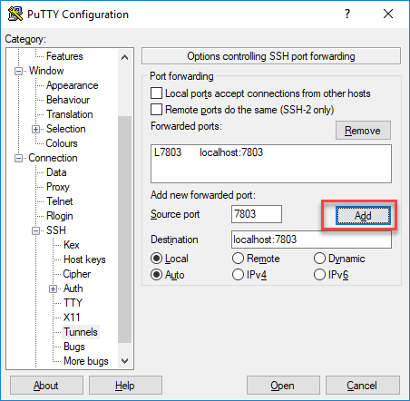
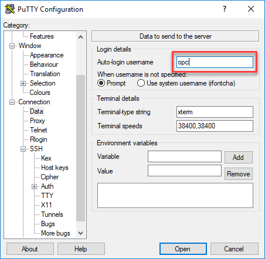
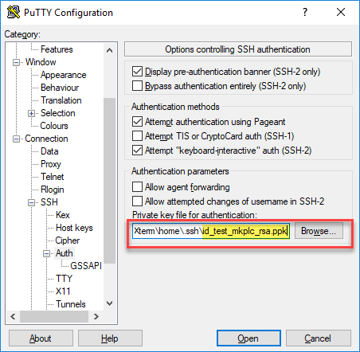
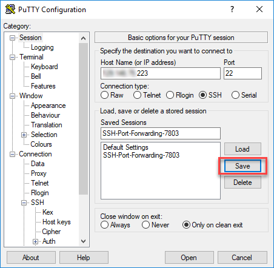
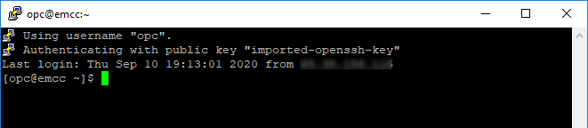
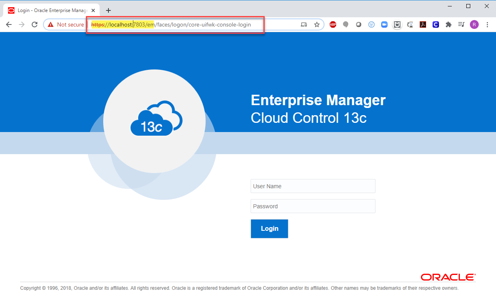

# Setup SSH Tunnel

## Introduction
As per security policies all external connections to this workshop instance are to be done over SSH. This lab will show you how to setup SSH tunnels to enable remote access to your workshop instance for client running on any port than 22.

*Estimated Lab Time*: 15 minutes

### Objectives
In this lab, you will:
* Setup SSH tunnel/port forwarding
* Validate client connection via SSH tunnel

### Prerequisites
This lab assumes you have:
- A LiveLabs Cloud account and assigned compartment
- The IP address and instance name for your compute instance
- Successfully logged into your LiveLabs account
- The valid SSH private key from the key pair used during workshop request

The example below using port 7803 is for illustration only and validation (*Step 2*) will fail unless your instance is running EM13c on that port. As a results, using the actual port(s) and client type from your lab, follow this example to setup SSH tunnel for each application entry.

| Application              | Client                             | Local port | Remote Port|
|--------------------------|------------------------------------|------------|------------|
| EM13c OMS Console        | Browser                            | 7803       | 7803       |

Depending on your local computer platform and SSH client, select the appropriate *Step 1* below to proceed.

## Task 1 (A): Running your workshop from MacOS or Windows with Unix/Linux emulators
The following steps are meant for anyone running this workshop on MacOS, Unix/Linux, or Windows with Unix/Linux emulators such as Cygwin, MobaXterm, Exceed, and other similar utilities. If you are on Windows and use *PuTTY* utility as your SSH client, please skip to the next step.

### **Setup**
1.  Open up a terminal
2.  As the opc user, establish an SSH session with port forwarding option between the local port and the destination/remote port.

    ````
    ssh -i ~/.ssh/<ssh-private-file> -L <local-port>:localhost:<remote-port> opc@<destination public IP address>
    ````

    ````
    e.g
    <copy>ssh -i .ssh/id_test_mkplc_rsa  -L 7803:localhost:7803 opc@188.111.88.222</copy>
    ````

  

  ***Note:***
   - For simplicity keep the local and destination ports identical, unless already used or unavailable on your local computer (e.g. 7803/7803)
   - This SSH session must remain alive throughout your connectivity to above remote port.
   - Steps (1)-(2) must be performed for each remote port needed

## Task 1 (B): Running your workshop from Windows with PuTTY
The following steps are meant for anyone running this workshop on Windows and use *PuTTY* utility as your SSH Client. If you are on MacOS, Unix/Linux, or Windows with Unix/Linux emulators such as Cygwin, MobaXterm, Exceed, and other similar utilities, please go back to the prior step.

### **Setup**
1. Launch Putty and Select or enter the following information:
    - Category: _Session_
    - IP address: _Your service instance’s public IP address_
    - Port: _22_
    - Connection type: _SSH_
    - Saved Sessions: "_Friendly Name to save your config_". e.g _SSH-Port-Forwarding-remote-port_

  

2. Navigate to "***Connection >> SSH >> Auth >> Tunnels***" and fill in the details as shown below and click **Add**
    - Source Port: Your application port. e.g _7803_
    - Destination: "_localhost:remote application port_" e.g. _localhost:7803_

  

3. Click **Add**

  

4. Navigate to "***Connection >> Data >> Auth >> Tunnels***" and add *opc* as auto-login username  

  

5. Navigate to "***Connection >> SSH >> Auth***", click ***Browse***, and select your Private SSH key in *.ppk* format

  

6. Save your configuration

  

7. Click ***Open*** to start your session

  

 ***Note:***
   - For simplicity keep the local and destination ports identical, unless already used or unavailable on your local computer (e.g. 7803/7803)
   - This SSH session must remain alive throughout your connectivity to above remote port.
   - Steps (1)-(2) must be performed for each remote port needed

## Task 2: Validate
Using the corresponding utility indicated in the table above, open a connection to the remote destination by addressing your local computer. While we are using a browser client for this illustration, the same applies to other clients as well. e.g. Using SQL Developer on port 1521 to access the database.  

1. **EM13c OMS Console**
Launch your browser and open a connection to [https://localhost:7803/em](https://localhost:7803/em)

  

You may see an error on the browser while accessing the Web Console - “*Your connection is not secure*”. Ignore and add the exception to proceed. Access this URL and ensure that you are able to access Enterprise Manager Web Console.

Now you are ready to run the workshop. You may now proceed to the next lab.

## Acknowledgements
- **Author** - Rene Fontcha, Master Principal Solutions Architect, NA Technology
- **Contributors** - LiveLabs Team
- **Last Updated By/Date** - Rene Fontcha, Master Principal Solutions Architect, NA Technology, September 2020

