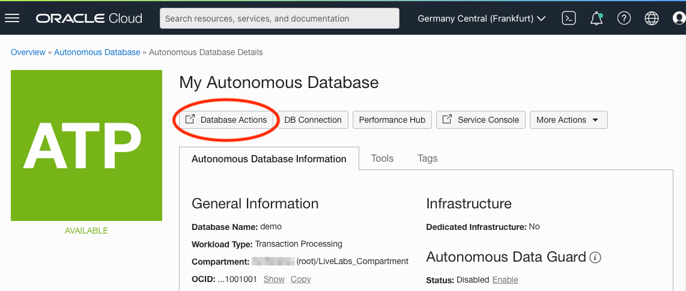
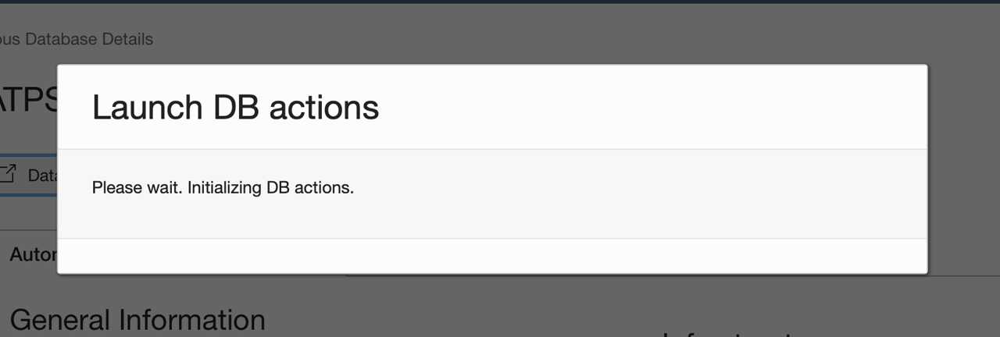
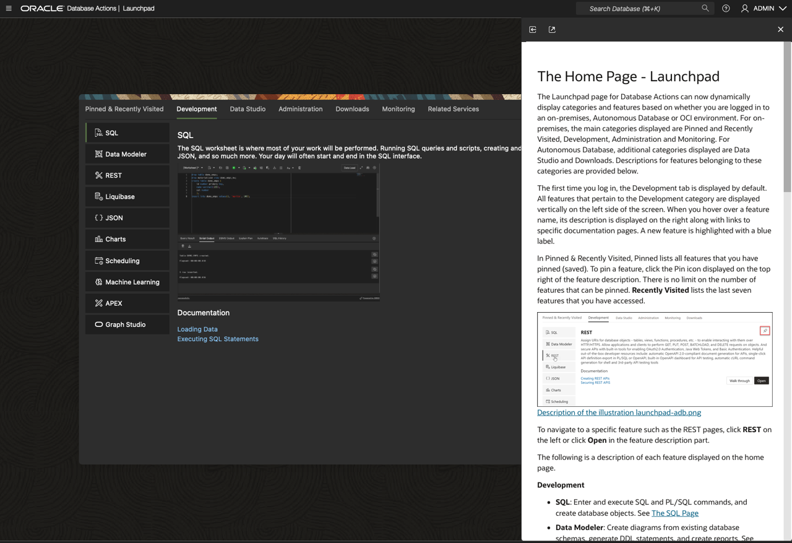
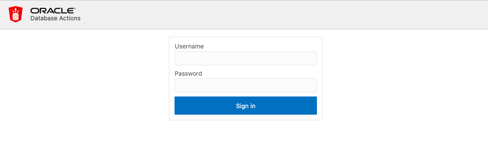
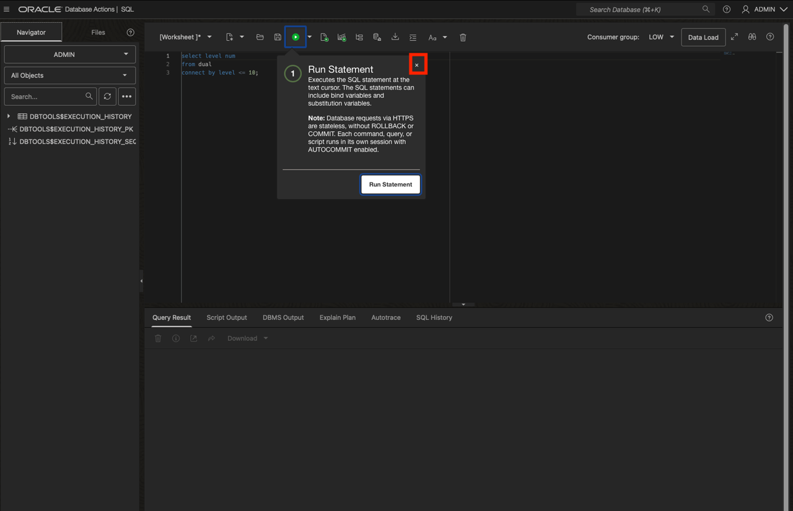

# Connect to ADB

## Introduction

This lab walks you through the steps to access the Oracle Autonomous Database instance on Oracle Cloud and connect to your Autonomous database using SQL Developer web as Admin user.

Included with Oracle REST Data Services, *Oracle SQL Developer Web* is the web-based version of Oracle SQL Developer that enables you to execute queries and scripts, create database objects, build data models, and monitor database activity.

Oracle SQL Developer Web runs in Oracle REST Data Services, and access to it is provided through schema-based authentication. To use Oracle SQL Developer Web, you must sign in as a database user whose schema has been enabled for SQL Developer Web.

In Oracle Autonomous Database, the ADMIN user is pre-enabled for SQL Developer Web.

Estimated time: 5 minutes

## Task 1: Connect to your Autonomous Database using SQL Developer Web

1. Once you log in to your Oracle Cloud account, the cloud services dashboard shows all the services available to you. Click the navigation menu in the upper left to show top level navigation choices.

    > **Note:** You can also directly access your Autonomous Data Warehouse or Autonomous Transaction Processing service in the **Launch Resources** section of the dashboard.

    

2. Navigate to your Autonomous Database, so click **Oracle Database**, then **Autonomous Database**.

    

3. Make sure your Workload Type is __Data Warehouse__ or __All__ to see your Autonomous Data Warehouse instances. Use the __List Scope__ drop-down menu to select a compartment. <if type="livelabs">Enter the first part of your user name, for example `LL185` in the Search Compartments field to quickly locate your compartment.

    
    </if>
    <if type="freetier">
    

4. From the databases displayed, click on the name of your database to navigate to your ABD details page.

5. From the ADB Details page, click the Database Actions button 

    

6. The **Launch DB actions modal** window will appear.

    

    This will open another browser tab/window. If you have popup blockers on, you may need to allow cloud.oracle.com access to open popup windows or open the popup window manually.

7. The popup window will take you directly to the **Database Actions** start page logged in as the **Admin** user.

    

    If it does not, you will be directed to a login page.

    

8. Sign in with the database instance's default administrator account, **Username - ADMIN** with the admin password you specified when creating the database. Click **Sign in**.

    

9. From the Database Action menu, select the **SQL** tile.

    

10. SQL Developer Web opens on a worksheet tab. The first time you open SQL Developer Web, a series of pop-up informational boxes introduce the main features.

    

Congratulations! You are now connected to your Autonomous Database using SQL Developer Web.

You may now **proceed to the next lab**.

## Acknowledgements

- **Author** - Troy Anthony, Database Product Management, May 2020
- **Contributors** - Anoosha Pilli, Product Manager; Brian Spendolini
- **Last Updated By/Date** - Anoosha Pilli, Product Manager, Database Product Management, April 2022
