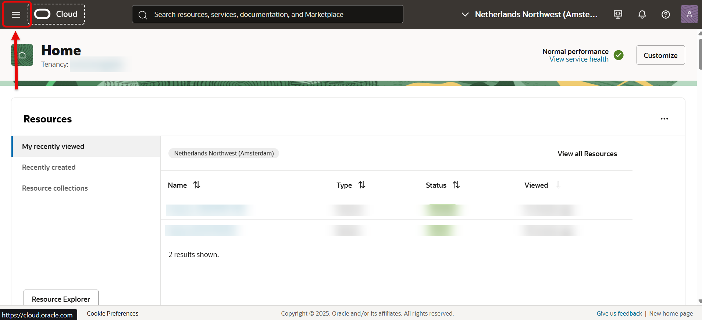
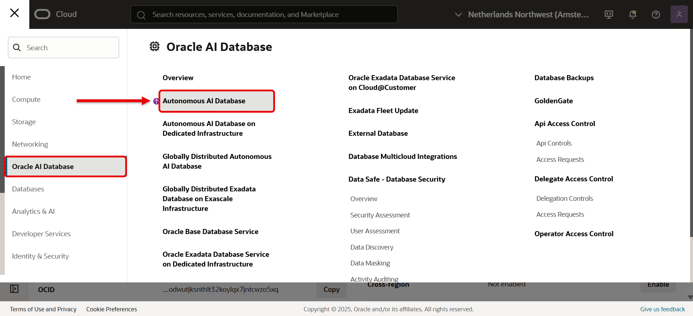
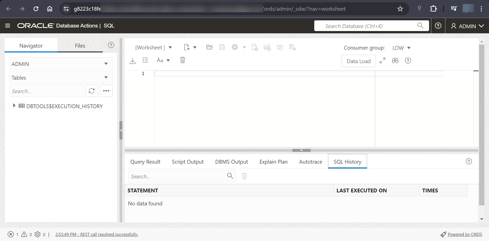

# Connect to Oracle Autonomous Database

## Introduction

This lab guides you through accessing the Oracle Autonomous Database instance on Oracle Cloud and connecting to your Autonomous Database using Database Actions as the *built-in* `ADMIN` Administrator account.

Database Actions is included with Oracle REST Data Services. It is the web-based version of Oracle SQL Developer. Database Actions enables users to perform actions like:

- execute queries and scripts
- create database objects
- build data models
- monitor database activity

Oracle REST Data Services powers and makes Database Actions accessible through schema-based authentication. Once a user's database schema has been REST-enabled, that user can sign into Database Actions.

The ADMIN user is pre-enabled for Database Actions in the Oracle Autonomous Database.

Estimated time: 5 minutes

### Objectives
In this lab, you will:
- Connect to your Autonomous Database using Database Actions

### Prerequisites
This lab assumes you have:
- An Oracle Free Tier account, Paid Cloud account, or access to the LiveLabs Sandbox environment
- Access to an available Autonomous Database

## Task 1: Connect to Your Autonomous Database Using Database Actions

1. After logging into your Oracle Cloud account, click the hamburger icon to open your Cloud Services navigation menu. This will reveal your top-level menu options.

    

2. From the available options, click `Oracle Database`.

3. The Oracle Database sub-menu will appear. Select `Autonomous Database`.

    

4. A screen with your available databases will appear. Ensure `root` has been selected under the `Compartment` in your `List scope`. Additionally, ensure you've selected `All` for your `Workload type` (found under your `Filters`). <if type="livelabs">Check your login credentials to find the **compartment** assigned to you. Enter your compartment number, for example, `LL185`, in the Search Compartments field to quickly locate your compartment.</if>

    

5. From the databases displayed, click the name of your database to navigate to your Autonomous Database's Details page.

6. Your selected Autonomous Database's Details page will appear. Click `Database Actions` then `SQL` to launch in a new window.

    

7. After this, you'll be automatically redirected to Database Actions SQL screen.

   > Note: You are logged with the ADMIN username and password selected when you first created your Autonomous Database.

   

8. You can see the `Database Actions Launchpad` by clicking on the Oracle logo:

    

9. From the Database Actions Launchpad, select the **SQL** tile to open a new SQL Worksheet or you can select any other option you need. 

    

10. A new SQL Worksheet will appear. If this is your first time opening a SQL Worksheet, you will be presented with a quick tour of the most commonly performed actions. You may advance through the tour, or click the `X` in any box, to exit the tour.

    

Congratulations! You are now connected to your Autonomous Database using Database Actions.

You may now **proceed to the next lab**.

## Acknowledgements

- **Author** - Troy Anthony, Database Product Management, May 2020
- **Last Updated By/Date** - Ramona Magadan, Database Product Management, August 2025
