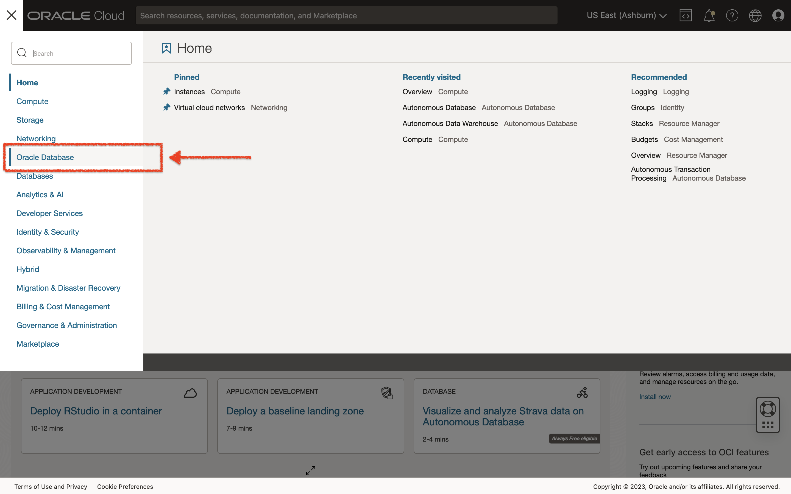
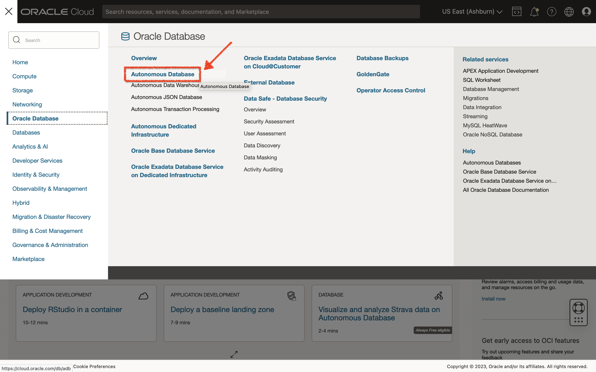
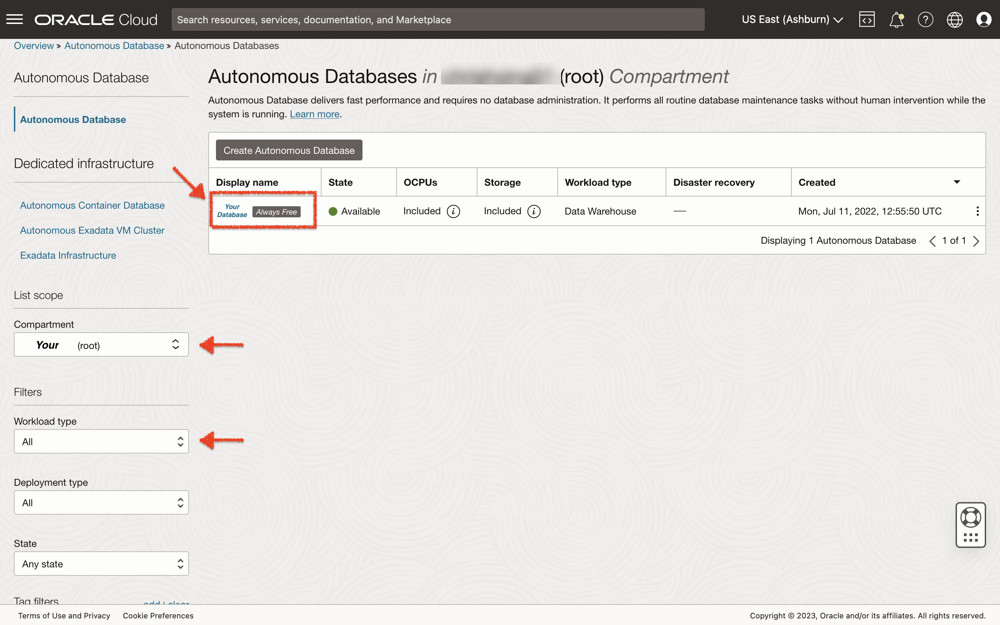
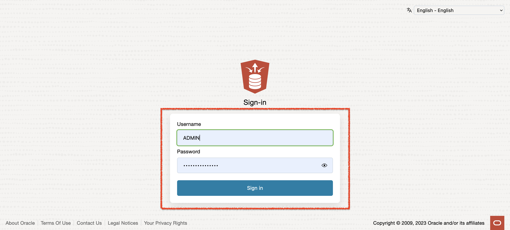
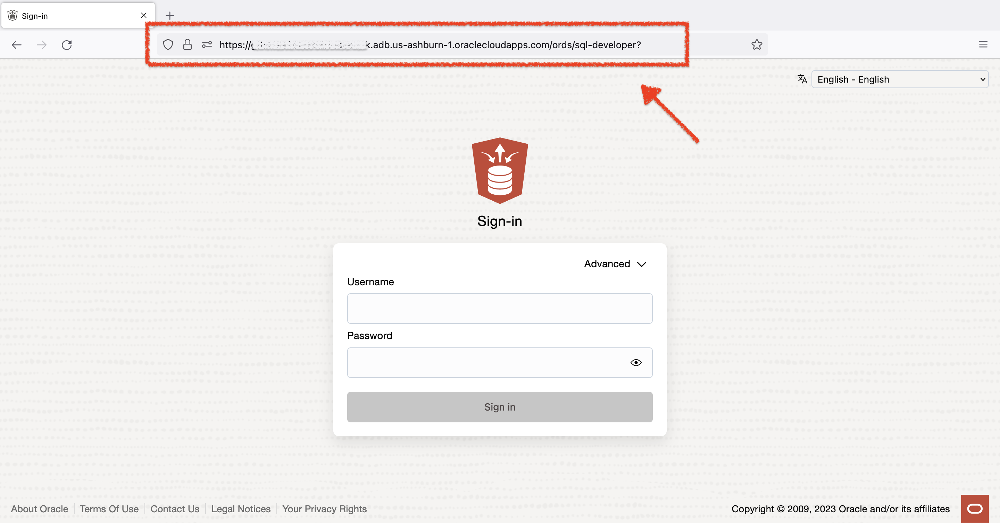
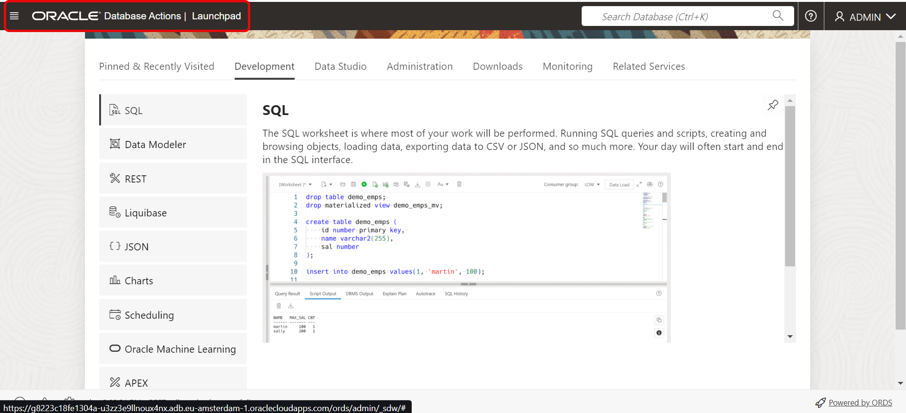

# Connect to Oracle Autonomous Database

## Introduction

This lab guides you through accessing the Oracle Autonomous Database instance on Oracle Cloud and connecting to your Autonomous Database using Database Actions (also known as SQL Developer Web) as the *built-in* `ADMIN` Administrator account.

Database Actions is included with Oracle REST Data Services. It is the web-based version of Oracle SQL Developer. Database Actions enables users to perform actions like:

- execute queries and scripts
- create database objects
- build data models
- monitor database activity

Oracle REST Data Services powers and makes Database Actions accessible through schema-based authentication. Once a user's database schema has been REST-enabled, that user can sign into Database Actions.

The ADMIN user is pre-enabled for Database Actions in the Oracle Autonomous Database.

Estimated time: 5 minutes

### Objectives
In this lab, you will:
- Connect to your Autonomous Database using Database Actions

### Prerequisites
This lab assumes you have:
- An Oracle Free Tier account, Paid Cloud account, or access to the LiveLabs Sandbox environment
- Access to an available Autonomous Database

## Task 1: Connect to Your Autonomous Database Using Database Actions

1. After logging into your Oracle Cloud account, click the hamburger icon to open your Cloud Services navigation menu. This will reveal your top-level menu options.

    

2. From the available options, click `Oracle Database`.

    

3. The Oracle Database sub-menu will appear. Select `Autonomous Database`.

    

4. A screen with your available databases will appear. Ensure `root` has been selected under the `Compartment` in your `List scope`. Additionally, ensure you've selected `All` for your `Workload type` (found under your `Filters`). <if type="livelabs">Check your login credentials to find the **compartment** assigned to you. Enter your compartment number, for example, `LL185`, in the Search Compartments field to quickly locate your compartment.</if>

    

5. From the databases displayed, click the name of your database to navigate to your Autonomous Database's Details page.

6. Your selected Autonomous Database's Details page will appear. Click `Database Actions` to launch in a new window.

    

7. The **Launch DB actions modal** window will appear. If you have pop-up blockers on, you may need to open this pop-up window manually and/or allow your browser to display pop-up windows from [cloud.oracle.com](https://cloud.oracle.com).  

    

8. Database Actions will attempt to log-in for you, using your ADMIN credentials (or whichever REST-enabled user you are attempting to sign-in as). In certain cases you may need to login manually; if so, make sure you have your ADMIN credentials accessible.

   > Note: These will be the ADMIN username and password selected when you first created your Autonomous Database.

    

    > Note: You will enter `ADMIN` as the Username, along with the ADMIN password you specified when you first created your Autonomous Database.

9. Alternatively, you may bookmark your Database Actions URL for quicker access. This will allow you to proceed directly to the login screen. Once there, you may login as any user that has a schema that is REST-enabled.

      

10. After signing in as the `ADMIN`, the Database Actions Launchpad will appear.

    

11. From the Database Actions Launchpad, select the **SQL** tile to open a new SQL Worksheet.

    

12. A new SQL Worksheet will appear. If this is your first time opening a SQL Worksheet, you will be presented with a quick tour of the most commonly performed actions. You may advance through the tour, or click the `X` in any box, to exit the tour.

    

Congratulations! You are now connected to your Autonomous Database using Database Actions.

You may now **proceed to the next lab**.

## Acknowledgements

- **Author** - Troy Anthony, Database Product Management, May 2020
- **Contributors** - Anoosha Pilli, Product Manager; Brian Spendolini; Arabella Yao, Product Manager
- **Last Updated By/Date** - Chris Hoina, Senior Product Manager, Database Product Management, July 2023
