# Connect a Virtual DB System and SQL Developer Using SSH Tunneling

## Introduction

This lab walks you through the steps to connect a virtual DB System and SQL Developer using SSH tunneling.

This lab demonstrates connecting to a 21c DB System instance. However, this should work with the 19c DB System instance and DB's running in DBCS as well.

Estimated Lab Time: 15 minutes

### Objectives

In this workshop, you will:

* Gather DB system details
* Create a New SSH Host in SQL Developer
* Create a New Database Connection in SQL Developer
* Verify the Database connection

### Prerequisites

* Must have provisioned a Virtual DB system.
* Created SSH keys in your local machine

## Task 1: Gather DB System Details

1. On the Oracle home page, click on the hamburger menu and click on  **Bare Metal, VM and Exadata**.

    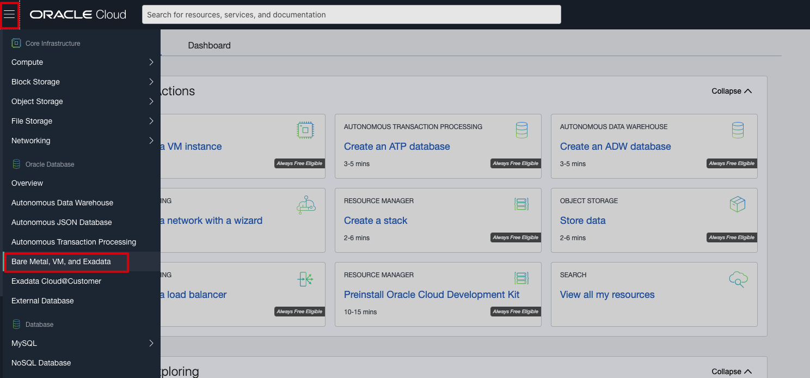

2. Choose your compartment and click on your DB system.

    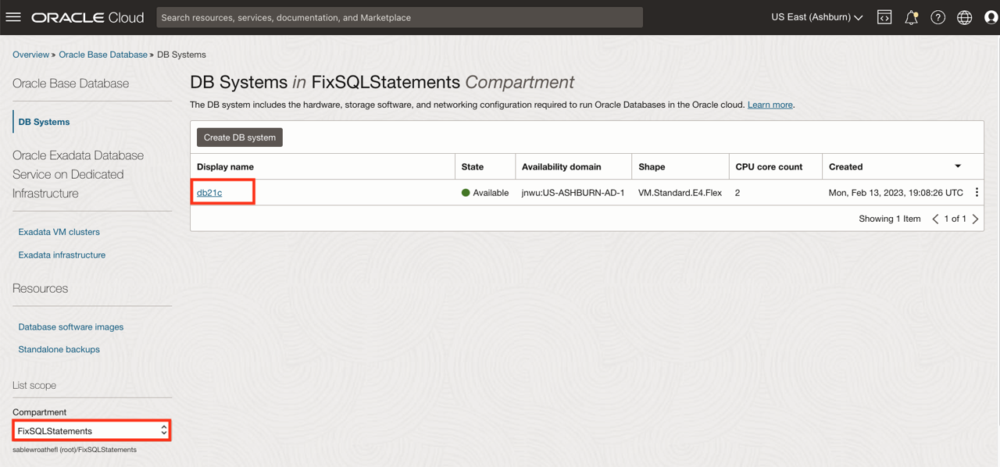

3. On the DB System Information of your DB VM instance, make note of the **Host Domain Name**.

    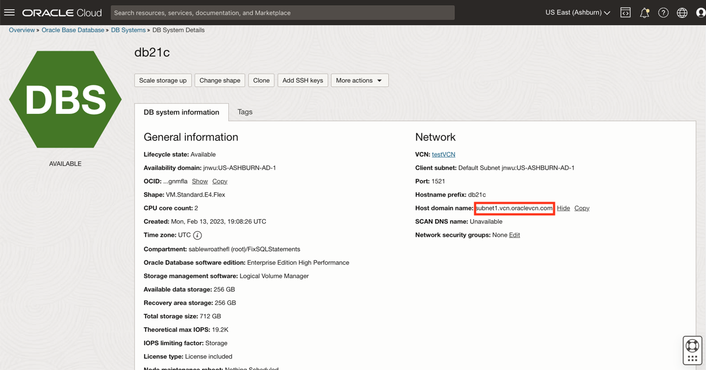

4. Click on **Databases** under Resources and copy the **Database Unique Name** of your database.

    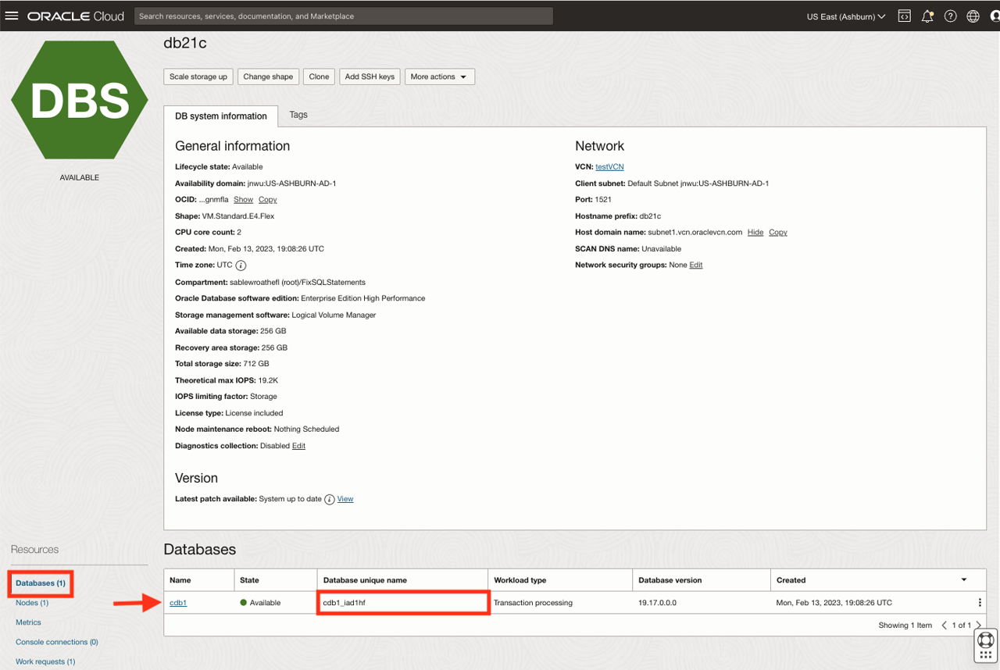

5. The concatenated string of your Database Unique Name followed by Host Domain Name is the **Service Name**.

    In this example, *`cdb1_iad1f8.sub01150008100.utilitiesvcn.oraclevcn.com`* is the service name.

6. Click on **Nodes** under Resources and make note of the **Public IP Address** and **Private IP** of your DB system.

    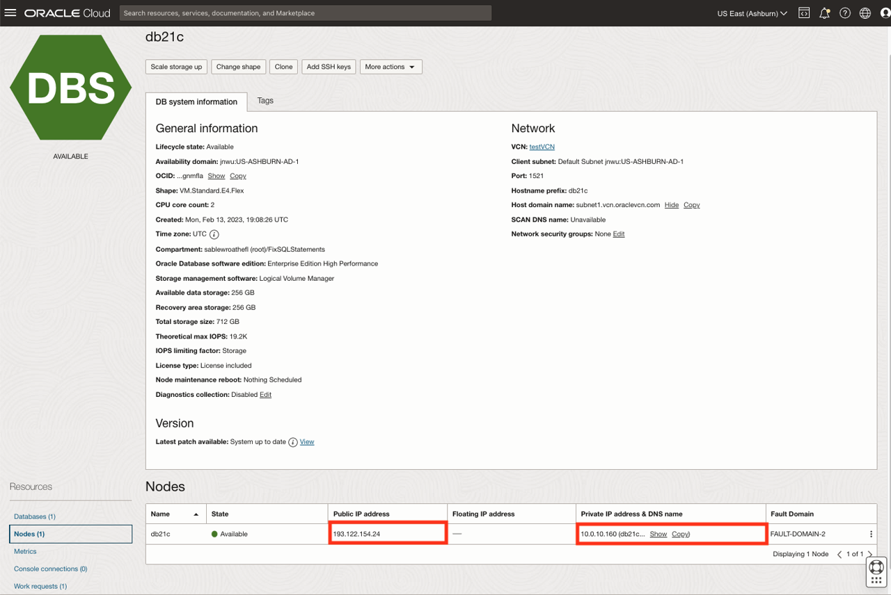

## Task 2: Create a New SSH Host in SQL Developer

1. Open SQL Developer, click on **View**, and select **SSH** from the drop-down list.

    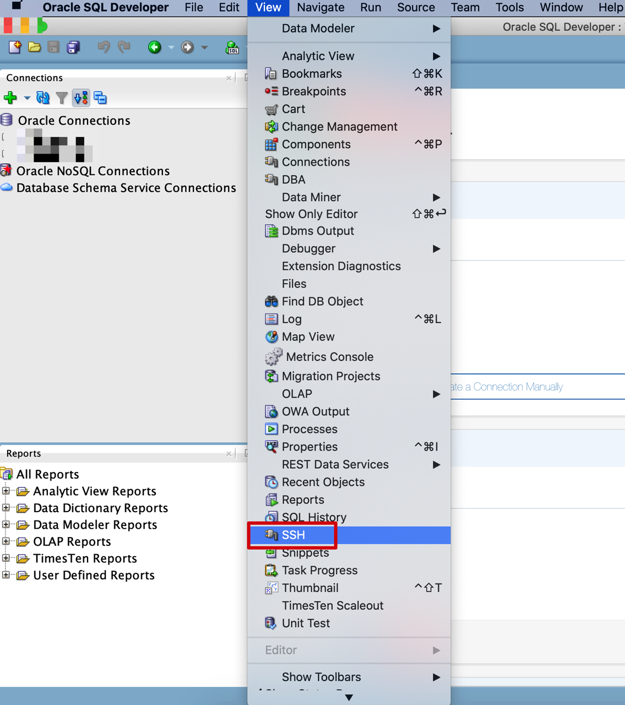

2. Now you can see the SSH Hosts on the left pane. Right-click on **SSH Hosts** and click on **New SSH Host**.

    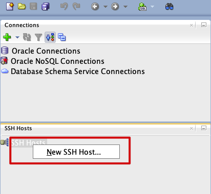

3. On the New SSH Host dialog box, provide the below details and click **OK**.

    * **Name:** Give your SSH host a name. In this example, it is **db21c**.
    * **Host:** Provide the **Public IP address** of the DB system noted earlier in step 1.
    * **Port:** Leave the value default to **22**.
    * **Username:** **opc**
    * **Use key file:** Select the use key file checkbox and browse the Private key of your local machine. If you don't have ssh keys created in your machine, click [here](https://raw.githubusercontent.com/oracle/learning-library/master/common/labs/generate-ssh-key/generate-ssh-keys.md) for instructions to create SSH keys.
    * **Add a Local Port Forward:** Select the Add a Local Port Forward checkbox.
    * **Name:** Give a name to the local port forwarding of your SSH Host. In this example, it is db21c.
    * **Port:** Leave the value default to **1521**.
    * **Host:** Provide the **Private IP address** of the DB system noted earlier in step 1.
    * **Automatically assign local port:** To assign the local port automatically, select this default radio button. In this example, we are using the default.
    * **Use specific local port:** Select this radio button if you want to use a specific local port and specify the port number.

    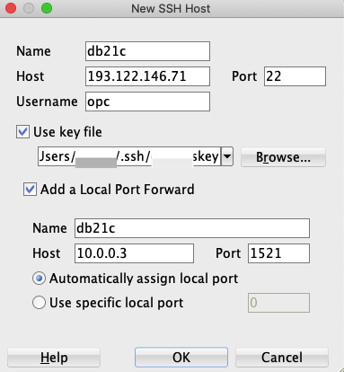

4. Now you can see that `db21c ssh host` is created in the SSH hosts pane. Click on the `+` symbol of the db21c ssh host to drill down and notice that `db21c local port forward` is also created.

    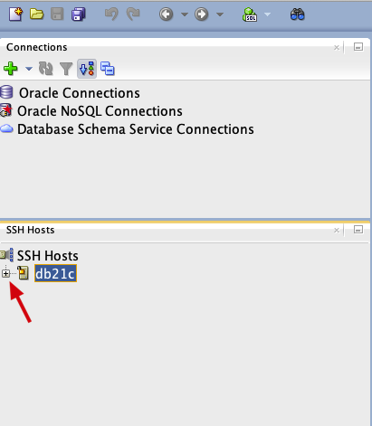
    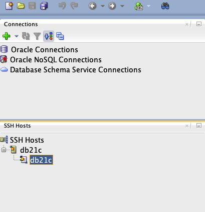

5. To connect to ssh host, right-click on `db21c ssh host` and click **connect**.

    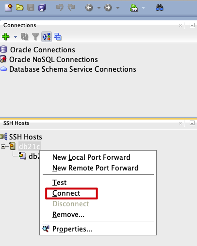

6. To check if `db21c ssh host` is connected, right-click on it and notice that `connect` is disabled i.e., the db21c ssh host is connected.

    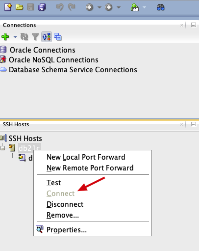

7. To establish local port forwarding, right-click on `db21c local port forward` and click **connect**.

    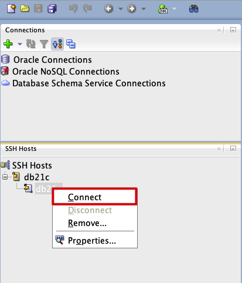

8. To check if `db21c local port forward` is connected, right-click on it and notice that `connect` is disabled i.e., db21c local port forward is connected.

    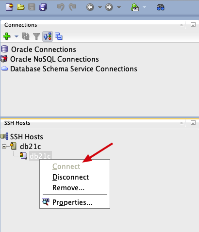

## Task 3: Create a New Database Connection in SQL Developer

1. Once you have successfully created the new SSH host connection, click on the green `+` on the top left corner of the window to create a new database connection.

    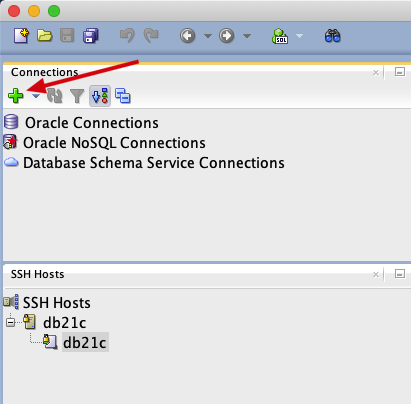

2. On the New Database Connection dialog box, click on **Connection Type** drop-down and choose **SSH**.

    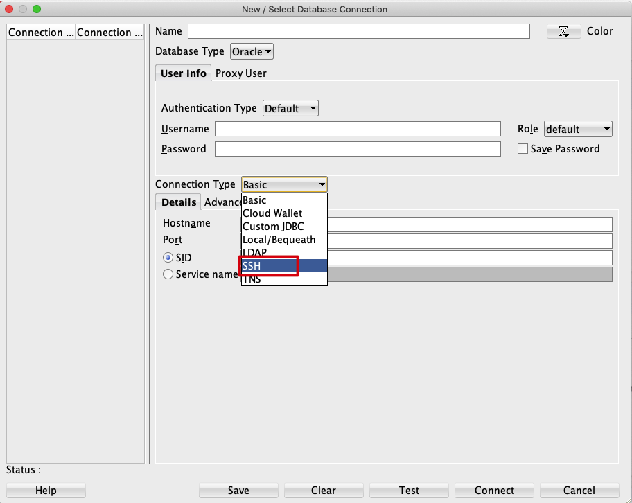

3. Now create a new database connection using SSH tunneling by providing the below details and click **Test**.

    * **Name:** Give your database connection a name. In this example, **db21c** is the database connection name.
    * **Username:** **sys**
    * **Password:** Give the password that was used to create the DB system. In this example, use the password **WElcome123##** which was used to create the DB system for the sys user.
    * **Role:** Click on the Role drop-down and select **SYSDBA** as the role for the sys user.
    * **Port Forward:** If there are multiple ssh hosts, choose the ssh host and local port forward you created earlier in step 2. In this example, db21c SSH host and db21c local port forward - **db21c(db21c)** is chosen.
    * **Service Name:** Choose the service name radio button and provide the **Service Name** i.e., the concatenated string of database unique name and host domain name that was noted earlier in step 1.

    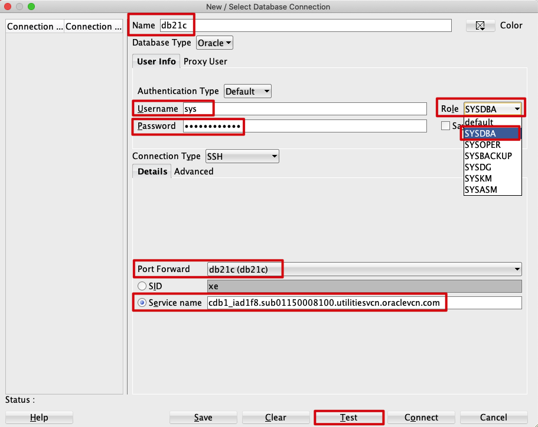

4. If the connection is successful, the status will be updated as "Status: Success". Then click **connect** to create the new database connection.

    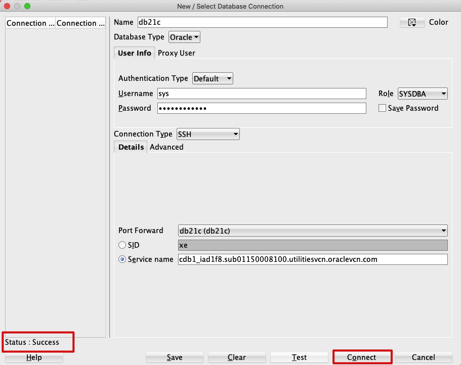

5. Once the database is connected, you can see your database under Oracle connections. In this example, the db21c database is created under Oracle connections.

    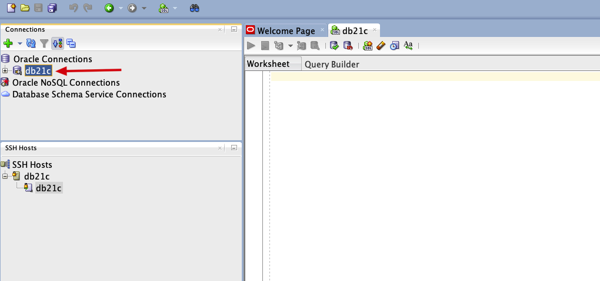

## Task 4: Verify the Database Connection

1. To verify the new database connection, click on your database - db21c `+` symbol to drill-down and click on the `+` symbol before Tables to view the tables in the database.

    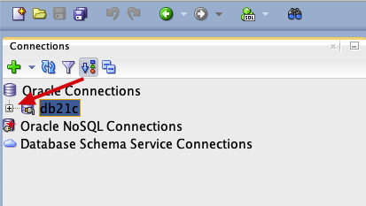

    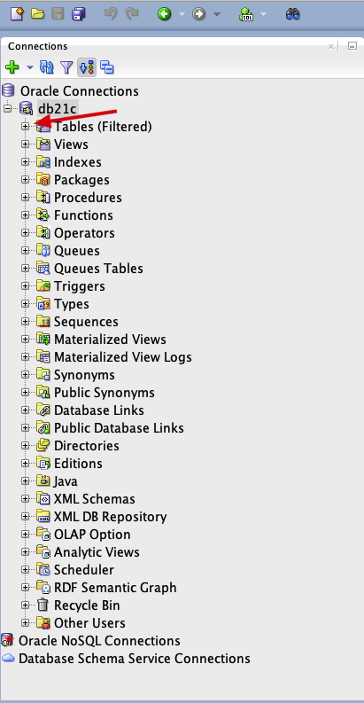

    

2. To know your database name, copy and paste the query in the worksheet and click run statement button to run the query.

    ```
    <copy>select ora_database_name from dual;</copy>
    ```

    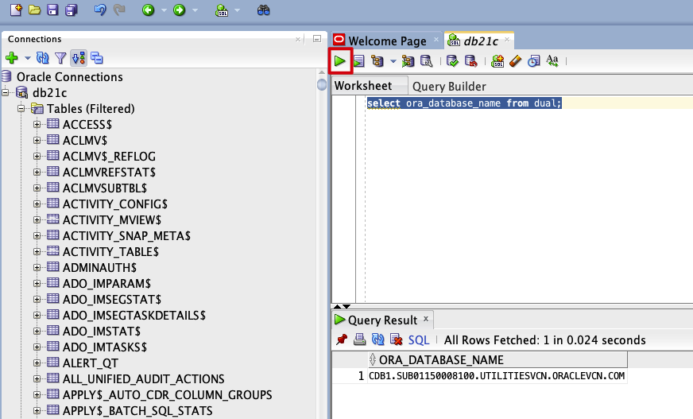

## Acknowledgements

* **Author** - Anoosha Pilli, Product Manager, Database Product Management
* **Last Updated By/Date** - Anoosha Pilli, February 2021
