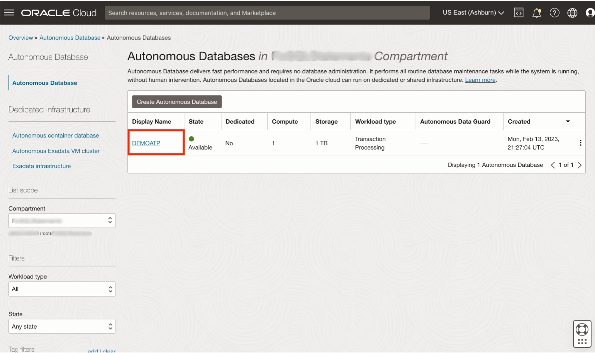
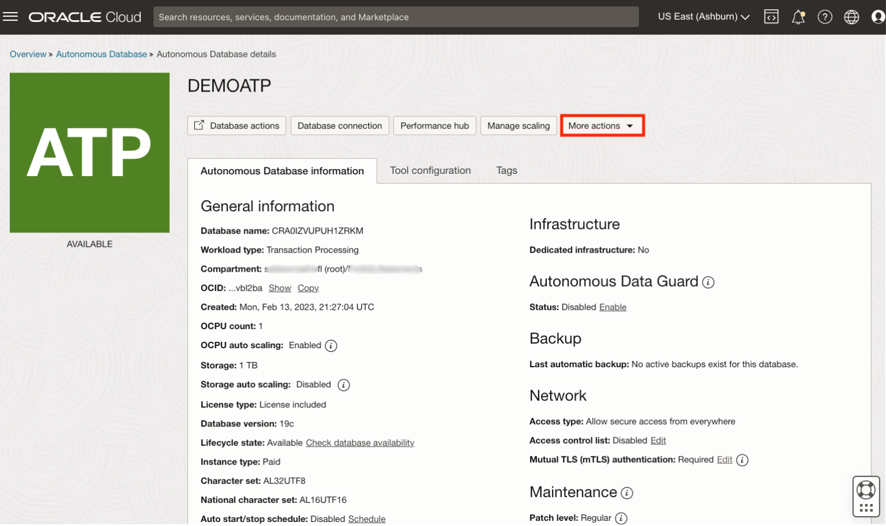
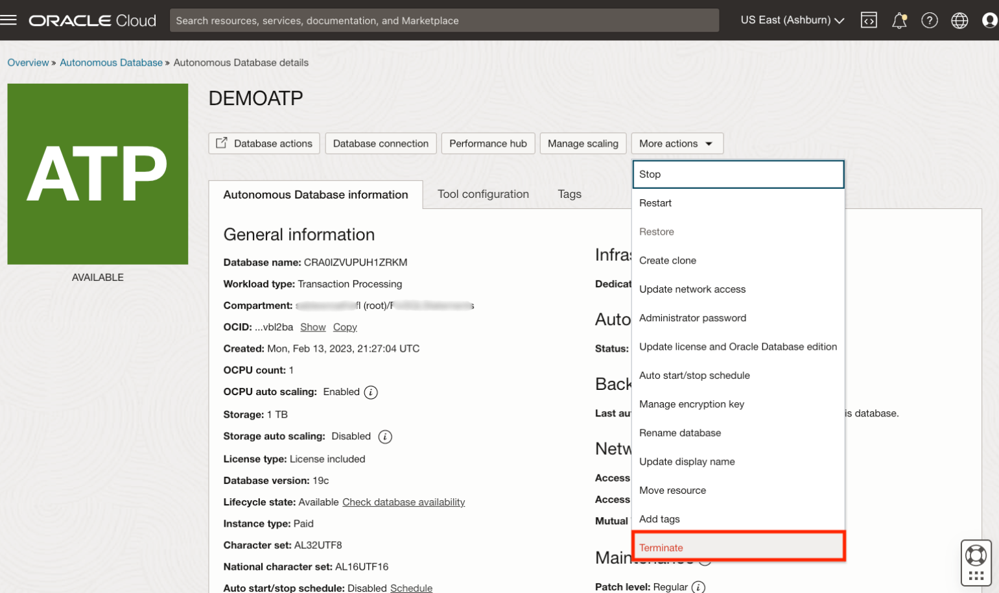
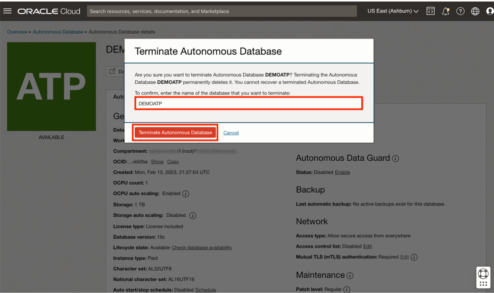
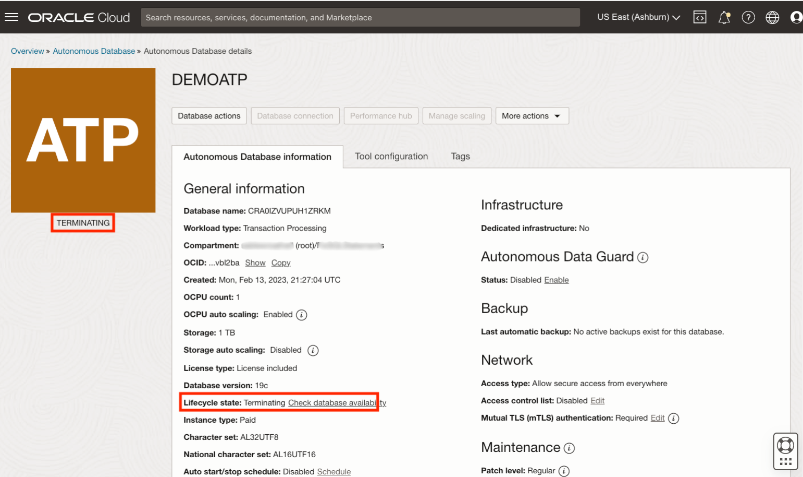
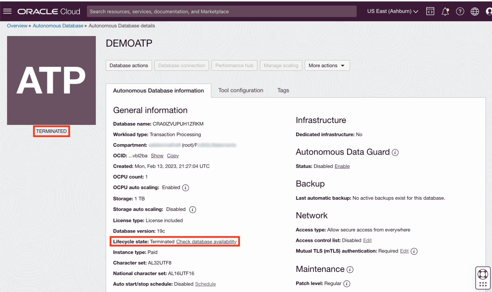

# Terminate Oracle Autonomous Database

## Introduction

You can permanently delete (terminate) instances that you no longer need. Terminating an Oracle Autonomous Database permanently deletes the database data. However, automatic backups are not deleted if you have chosen Recovery Appliance or NFS as a backup destination. You can delete automatic backups directly from the Recovery Appliance or NFS.

This lab walks you through the steps to terminate an available or stopped Oracle Autonomous Database instance. For the purpose of this lab, an Always Free demo Oracle Autonomous Transaction Processing database instance named DEMOATP is provisioned in a compartment.
>**Note:** While this lab terminates an Oracle Autonomous Transaction Processing database, the steps are the same for terminating an Oracle Autonomous Data Warehouse database.

Estimated Time: 5 minutes

Watch the video below for a quick walk-through of the lab.
[Terminate Oracle Autonomous Database](videohub:1_kxh3trkp)

### Objectives

- Terminate an available or stopped Oracle Autonomous Database instance.

### Prerequisites

- Should have an Oracle Autonomous Database instance provisioned with Lifecycle Status - Available or Stopped.
- To provision an Oracle Autonomous Database, there are detailed instructions in Lab 1 of [Autonomous Database 15 minute quick start](https://livelabs.oracle.com/pls/apex/dbpm/r/livelabs/view-workshop?wid=928) workshop.

## Task 1: Terminate a Provisioned Oracle Autonomous Database Instance

1. If you are using an Oracle Cloud trial account, in the Oracle Cloud console, you need to be in the region where your Oracle Autonomous Database resources are provisioned. You can see your current default **Region** in the top right-hand corner of the page. To change the default region, click the **Region** drop-down and choose the region where your Oracle Autonomous Database resource is provisioned.

    

2. Click the navigation menu, select **Oracle Database** and choose **Autonomous Transaction Processing** (ATP). While this lab terminates an Oracle Autonomous Transaction Processing database, the steps are the same for terminating an Oracle Autonomous Data Warehouse database.

    >**Note:** You can also directly access your Oracle Autonomous Transaction Processing service in the **Quick Actions** section of the dashboard.

    

3. From the compartment drop-down menu select the **Compartment** where your Oracle Autonomous Database resource is provisioned. If there were a long list of databases, you could filter the list by the **State** of the databases (Available, Stopped, Terminated, etc) to view the database you wish to terminate. You can also sort by **Workload Type**.

    In this lab, as **DEMOATP** is an Oracle Autonomous Transaction Processing database that is already provisioned, we selected the **Transaction Processing** workload type to filter the database.

    
    

4. From the databases displayed, click **Display Name** of the database you wish to terminate.

    In this lab, we are terminating the available **DEMOATP** Oracle Autonomous Transaction Processing database instance. Click **DEMOATP**.

    

5. Click **More Actions**.

    

6. From the more actions drop-down, scroll down and click **Terminate**.

    

7. Confirm that you wish to terminate your Oracle Autonomous Database in the confirmation dialog. Type the database name in the input field and click **Terminate Autonomous Database**.

    In this lab, type **DEMOATP** and click **Terminate Autonomous Database**.

    

8.  Your instance will begin to terminate. The Lifecycle State will turn from Available to Terminating.

    

9. After a few minutes, once the instance is terminated, the Lifecycle state will change from Terminating to Terminated.

    

    You have successfully terminated an Oracle Autonomous Database instance.

## Learn More

* Click [here](https://docs.oracle.com/en-us/iaas/exadata/doc/eccmanagingadbs.html#GUID-A00BC3BB-3AE6-4FBF-AEAF-2D9C14CD1D9A) to know more about Managing Oracle Autonomous Databases.

## Acknowledgements

* **Author** - Anoosha Pilli, Oracle Database Product Management, Product Manager
* **Contributor** - Arabella Yao, Product Manager, Database Product Management
* **Last Updated By/Date** - Carmen Berdant, Mar 2024